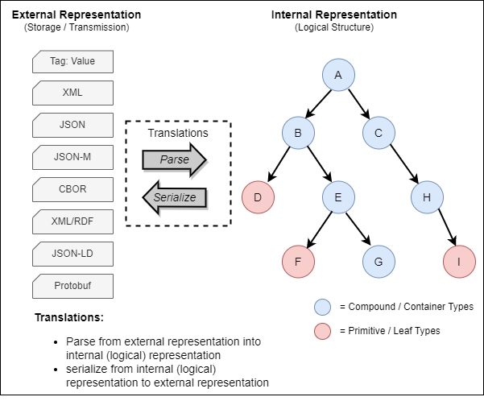
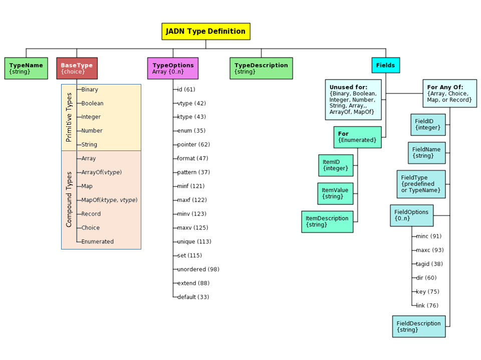
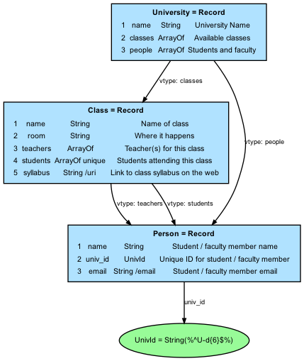
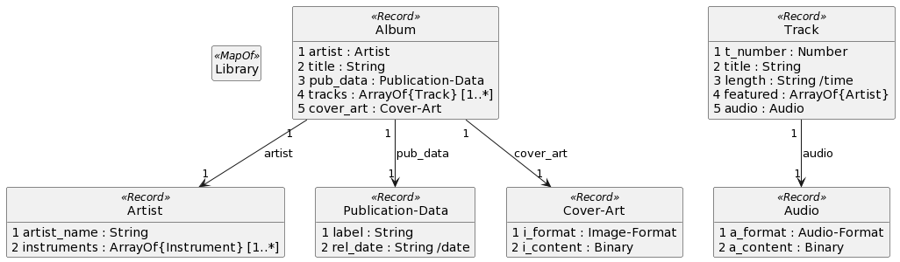

# OASIS Committee Note
-------

# Information Modeling with JADN Version 1.0

## Committee Note Draft 01

## 18 January 2023

&nbsp;

<!-- URI list start (commented out except during publication by OASIS TC Admin)

#### This stage:
https://docs.oasis-open.org/openc2/imjadn/v1.0/cn01/imjadn-v1.0-cn01.md (Authoritative) \
https://docs.oasis-open.org/openc2/imjadn/v1.0/cn01/imjadn-v1.0-cn01.html \
https://docs.oasis-open.org/openc2/imjadn/v1.0/cn01/imjadn-v1.0-cn01.pdf

#### Previous stage of Version 1.0:
N/A

#### Latest stage of Version 1.0:
https://docs.oasis-open.org/openc2/imjadn/v1.0/imjadn-v1.0.md (Authoritative) \
https://docs.oasis-open.org/openc2/imjadn/v1.0/imjadn-v1.0.html \
https://docs.oasis-open.org/openc2/imjadn/v1.0/imjadn-v1.0.pdf

URI list end (commented out except during publication by OASIS TC Admin) -->

#### Technical Committee:
[OASIS Open Command and Control (OpenC2) TC](https://www.oasis-open.org/committees/openc2/)

#### Chair:
Duncan Sparrell (duncan@sfractal.com), [sFractal Consulting LLC](http://www.sfractal.com/) \
Michael Rosa (mjrosa@nsa.gov), [National Security Agency](https://www.nsa.gov)

#### Editors:
David Kemp (d.kemp@cyber.nsa.gov), [National Security Agency](https://www.nsa.gov/)

#### Additional artifacts:
This prose document is one component of a Work Product that also includes:
* XML schemas: (list file names or directory name)
* Other items (list titles and/or file names)

#### Related work:
This document is related to:
* _JSON Abstract Data Notation Version 1.0_. Edited by David Kemp.
Latest stage: https://docs.oasis-open.org/openc2/jadn/v1.0/jadn-v1.0.html.

#### Abstract:
Information models (IMs) are used to define and generate physical data models, validate information instances, and enable lossless translation across data formats. JSON Abstract Data Notation (JADN) is a UML-based information modeling language that defines data structure independently of data format. This Committee Note describes the use of IMs, explains how to construct IMs using JADN, and contrasts IMs with other modeling approaches, such as Entity-Relationship models for databases, and knowledge models / ontologies.

#### Status:
This is a Non-Standards Track Work Product. The patent provisions of the OASIS IPR Policy do not apply.

This document was last revised or approved by the OASIS Open Command and Control (OpenC2) TC on the above date. The level of approval is also listed above. Check the "Latest stage" location noted above for possible later revisions of this document. Any other numbered Versions and other technical work produced by the Technical Committee (TC) are listed at https://www.oasis-open.org/committees/tc_home.php?wg_abbrev=openc2#technical.

TC members should send comments on this document to the TC's email list. Others should send comments to the TC's public comment list, after subscribing to it by following the instructions at the "Send A Comment" button on the TC's web page at https://www.oasis-open.org/committees/openc2/.

#### Citation format:
When referencing this document the following citation format should be used:

**[IM-JADN-v1.0]**

_Information Modeling with JADN Version 1.0_. Edited by David Kemp. 13 October 2021. OASIS Committee Note 01. https://docs.oasis-open.org/openc2/imjadn/v1.0/cn01/imjadn-v1.0-cn01.html. Latest stage: https://docs.oasis-open.org/openc2/imjadn/v1.0/imjadn-v1.0.html.

#### Notices
Copyright &copy; OASIS Open 2021. All Rights Reserved.

Distributed under the terms of the OASIS [IPR Policy](https://www.oasis-open.org/policies-guidelines/ipr).

The name "OASIS" is a trademark of [OASIS](https://www.oasis-open.org/), the owner and developer of this specification, and should be used only to refer to the organization and its official outputs.

For complete copyright information please see the full Notices section in an Appendix below.

-------

# Table of Contents

- [1 Introduction](#1-introduction)
  - [1.1 Terminology](#11-terminology)
- [2 Information Modeling Overview](#2-information-modeling-overview)
  - [2.1 Information Models And Data Models](#21-information-models-and-data-models)
  - [2.2 Benefits of Information Models](#22-benefits-of-information-models)
  - [2.3 Information Modeling Languages](#23-information-modeling-languages)
  - [2.4 Information Modeling Tools](#24-information-modeling-tools)
  - [2.5 Applying an Information Model](#25-applying-an-information-model)
- [3 Creating Information Models with JADN](#3-creating-information-models-with-jadn)
  - [3.1 JADN Overview](#31-jadn-overview)
          - [Table 3-1 -- Multiplicity Types](#table-3-1----multiplicity-types)
    - [3.1.1 Type Definitions](#311-type-definitions)
    - [3.1.2 TypeOptions](#312-typeoptions)
    - [3.1.3 Item Or Field Definitions](#313-item-or-field-definitions)
    - [3.1.4  Field Options](#314--field-options)
    - [3.1.5 JADN Representations](#315-jadn-representations)
      - [3.1.5.1 Native JSON Representation](#3151-native-json-representation)
      - [3.1.5.2 Alternative JADN Representations](#3152-alternative-jadn-representations)
      - [3.1.5.3 Multiple Representation Example](#3153-multiple-representation-example)
    - [3.1.6 Base Type Examples](#316-base-type-examples)
      - [3.1.6.1 Binary](#3161-binary)
      - [3.1.6.2 Boolean](#3162-boolean)
      - [3.1.6.3 Integer](#3163-integer)
      - [3.1.6.4 Number](#3164-number)
      - [3.1.6.5 String](#3165-string)
      - [3.1.6.6 Enumerated](#3166-enumerated)
      - [3.1.6.7 Choice](#3167-choice)
      - [3.1.6.8 Array](#3168-array)
      - [3.1.6.9 ArrayOf(_vtype_)](#3169-arrayofvtype)
      - [3.1.6.10 Map](#31610-map)
      - [3.1.6.11 MapOf(_ktype_,_vtype_)](#31611-mapofktypevtype)
      - [3.1.6.12 Record](#31612-record)
  - [3.2 Information Modeling Process](#32-information-modeling-process)
  - [3.3 Information Modeling Example](#33-information-modeling-example)
    - [3.3.1 Example 1: A Digital Music Library](#331-example-1-a-digital-music-library)
- [4 Advanced Techniques](#4-advanced-techniques)
  - [4.1 Namespaces, Packages, and Referencing](#41-namespaces-packages-and-referencing)
    - [4.1.1 Packages](#411-packages)
    - [4.1.2 Namespaces](#412-namespaces)
    - [4.1.3 Referencing](#413-referencing)
    - [4.1.4 Linking Between Projects](#414-linking-between-projects)
  - [4.2 From Logical Models to IMs](#42-from-logical-models-to-ims)
- [Appendix A. Informative References](#appendix-a-informative-references)
- [Appendix B. Acknowledgments](#appendix-b-acknowledgments)
- [Appendix C. Revision History](#appendix-c-revision-history)
- [Appendix D. Frequently Asked Questions (FAQ)](#appendix-d-frequently-asked-questions-faq)
  - [D.1 JADN vs. UML Primitive Data Types](#d1-jadn-vs-uml-primitive-data-types)
  - [D.2 Why JADN and not RDF?](#d2-why-jadn-and-not-rdf)
  - [D.3 Why JADN and not OWL?](#d3-why-jadn-and-not-owl)
- [Appendix E. Example Information Model Source](#appendix-e-example-information-model-source)
  - [E.1 Music Library](#e1-music-library)
- [Appendix F. Notices](#appendix-f-notices)

**List of Figures**
- [Figure 2-1 -- Parsing and Serializing With An IM](#figure-2-1----parsing-and-serializing-with-an-im)
- [Figure 3-1 -- JADN Type Definition Structure](#figure-3-1----jadn-type-definition-structure)
- [Figure 3-2 -- JADN for Primitive, ArrayOf, MapOf Types](#figure-3-2----jadn-for-primitive-arrayof-mapof-types)
- [Figure 3-3 -- JADN for Enumerated Types](#figure-3-3----jadn-for-enumerated-types)
- [Figure 3-4 -- JADN for Types with Fields](#figure-3-4----jadn-for-types-with-fields)
- [Figure 3-5 -- Simple University Example ERD](#figure-3-5----simple-university-example-erd)
- [Figure 3-6 -- Simple University Example JADN (JSON format)](#figure-3-6----simple-university-example-jadn-json-format)
- [Figure 3-7 -- Simple University Example JADN (JIDL format)](#figure-3-7----simple-university-example-jadn-jidl-format)
- [Figure 3-8 -- Simple University Example JADN (table format)](#figure-3-8----simple-university-example-jadn-table-format)
- [Figure 3-9 -- Simple University Example ERD Source Code (GraphViz)](#figure-3-9----simple-university-example-erd-source-code-graphviz)
- [Figure 3-10 -- Music Library Example ERD](#figure-3-10----music-library-example-erd)

-------

<!-- Insert a "line rule" (three or more hyphens alone on a new line, following a blank line) before each major section. This is used to generate a page break in the PDF format. -->

# 1 Introduction

An Information Model (IM) defines the essential content of
entities used in computing, independently of how those entities
are represented (i.e., serialized) for communication or storage.
This Committee Note (CN) describes the nature of an IM, and the
application of the [JSON Abstract Data Notation
(JADN)](#jadn-v10) information modeling language in the creation
and use of IMs.

As an IM language, JADN is a syntax-independent, or abstract,
schema language. Abstract schema languages separate structure
definitions from encoding rules. JADN is oriented to work well
with common Internet data formats, such as

 - JSON (Javascript Object Notation)
 - XML (eXtensible Markup Language)
 - CBOR (Concise Binary Object Representation)

JADN is based rigorously on information theory, and an IM
composed in JADN formally defines equivalence (information
content) between data in different formats.

Information modeling, generally, and JADN, specifically can be
applied to a broad variety of situations, such as:

 - Abstract languages, such as the Open Command and Control
   (OpenC2) language
 - Complex information structures such software bills of
   materials (SBOMs); examples would be the SPDX and CycloneDX
   SBOM formats
 - Formal definition of structured information exchanges, such as
   are defined using the NIEM approach.

This CN discusses:

1) What is information modeling?
2) The value of an information model.
3) The distinction between an IM and other modeling approaches.
4) The creation and use of an IM using JADN and associated
    automated tools.

## 1.1 Terminology

This CN uses the definitions contained in the [[JADN
Specification](#jadn-v10)], section 1.2.1. The following
additional terms are defined for this document:

> TBD; this is a preliminary list; eliminate any terms not needed
> as document matures.

 - **Directed Acyclic Graph:** a directed acyclic graph (DAG) is
   a directed graph with no directed cycles. That is, it consists
   of vertices and edges (also called arcs), with each edge
   directed from one vertex to another, such that following those
   directions will never form a closed loop. A directed graph is
   a DAG if and only if it can be topologically ordered, by
   arranging the vertices as a linear ordering that is consistent
   with all edge directions (Wikipedia)

 - **Entity Relationship Model:** An entity–relationship model
   (or ER model) describes interrelated things of interest in a
   specific domain of knowledge. A basic ER model is composed of
   entity types (which classify the things of interest) and
   specifies relationships that can exist between entities
   (instances of those entity types). (Wikipedia)

 - **Schema:**  *(markup languages)* A formal description of
   data, data types, and data file structures, such as XML
   schemas for XML files. (Wiktionary)

 - **Ontology:** (information science) A representation, formal
   naming, and definition of the categories, properties, and
   relations between the concepts, data, and entities that
   substantiate one, many, or all domains of discourse. More
   simply, an ontology is a way of showing the properties of a
   subject area and how they are related, by defining a set of
   concepts and categories that represent the subject.
   (Wikipedia)

-------

# 2 Information Modeling Overview

This section discusses the nature and benefits of IMs, types of
available modeling languages, and the tools that can be used in
information modeling.

## 2.1 Information Models And Data Models

 > discussion based on RFC 3444

As described in the introduction, IMs are a means to understand
and document the essential information content relevant to a
system, application, or protocol exchange without regard to how
that information is represented in actual implementations.
Having a clear view of the information required provides clarity
regarding the goals that the eventual implementation must
satisfy.

A small example may help clarify the concept of information. The
information content of an instance can be no greater than the
smallest data instance for which lossless round-trip conversion
is possible. For example, an IPv4 address presented in dotted
quad format is 17 bytes of JSON string data ("192.168.101.213"),
but can be converted to 4 byte RFC 791 format and back without
loss. The information content of an IPv4 address can therefore be
no greater than 4 bytes (32 bits), and an information model would
define the IPv4 address type as a byte sequence of length 4.

 [[RFC 3444](#rfc3444)] describes the purpose of an IM as:

 > "to model managed objects at a conceptual level, independent
 > of any specific implementations or protocols used to transport
 > the data. ... Another important characteristic of an IM is
 > that it defines relationships between managed objects."

In a 2008 paper on information modeling, [[YTLee](#ytlee)]
describes the concept of a "conceptual schema", a "logically
neutral" view of the information in a system:

> "The conceptual view is a single, integrated definition of the
> data within an enterprise that is unbiased toward any single
> application of data and independent of how the data is
> physically stored or accessed."

and an IM:

> "An information model is a representation of concepts,
> relationships, constraints, rules, and operations to specify
> data semantics for a chosen domain of discourse."

[[RFC3444](#rfc3444)] contrasts IMs with data models (DMs):

> "Compared to IMs, DMs define managed objects at a lower level
> of abstraction.  They include implementation- and
> protocol-specific details, e.g. rules that explain how to map
> managed objects onto lower-level protocol constructs."

and states DMs are "intended for implementors and include
protocol-specific constructs".

The following key principles apply to IMs:

 - An information model classifies the validity of serialized
   data with zero false positives and zero false negatives. That
   is, an information model is the authoritative definition of
   essential content, and any serialized data is unambiguously
   one of: a) consistent with, b) inconsistent with, or c)
   insignificant with respect to, the model.

 - Information instances are values that can be compared for
   equality. An application compares instances in accordance with
   the UML properties defined by their datatype. Two instances
   are equal if they have the same datatype and the same value.

 - If an instance can be losslessly converted among multiple
   serializations, then its information content is no greater
   than the smallest of those serializations.

## 2.2 Benefits of Information Models

A key point in all the IM definitions and descriptions in the
previous section is the ability for the model to represent
information with a focus on its _meaning_, and without concern
for how that information will be represented. Focusing on meaning
encourages interoperability between applications by capturing
agreement about what the information conveys and how it can be
used, deferring decisions on storage and transmission matters
until a clear understanding of purpose has been reached.
Referring back to the example of the IPv4 address, regardless of
representation the address identifies the label applied to a
network interface within an available address space of 2^32.

[[YTLee](#ytlee)] identifies the key benefit of an IM:

> "The advantage of using an information model is that it can
> provide sharable, stable, and organized structure of
> information requirements for the domain context."

and describes a "quality" IM as being:

 - complete,
 - sharable,
 - stable,
 - extensible,
 - well-structured,
 - precise, and
 - unambiguous.

In [DThaler's](#dthaler) paper on _IoT Bridge Taxonomy_, which
addresses the challenges created when "many organizations develop
and implement different schemas for the same kind of things", the
concluding Recommendations section includes the following:

> To ... increase semantic interoperability, it is desirable that
> different data models for the same type of thing (e.g., light
> bulbs) are as similar as possible for basic functionality. In
> an ideal world, data models used by different protocols and
> organizations would express exactly the same information in
> ways that are algorithmically translatable by a dynamic schema
> bridge with no domain-specific knowledge. Sharing data models
> more widely, and having agreements in principle of at least
> using the same abstract information model, would be very
> beneficial.

The notion of "express[ing] exactly the same information in ways
that are algorithmically translatable" is a fundamental purpose
of information modeling.

## 2.3 Information Modeling Languages

[[YTLee](#ytlee)] describes an IM language as follows:

> "An information modeling language is a formal syntax that
> allows users to capture data semantics and constraints."

and defines their importance:

> "Formal information modeling languages that describe
> information requirements unambiguously is an enabling
> technology that facilitates the development of a large scale,
> networked, computer environment that behaves consistently and
> correctly."

[RFC 8477](#rfc8477), _Report from IoT Semantic Interoperability Workshop
2016_, describes a lack of consistency across Standards
Developing Organizations (SDOs) in defining application layer data,
attributing it to the lack of an encoding-independent
standardization of the information represented by that data. The
JADN information modeling language is intended to address that
gap. Abstract Syntax Notation One (ASN.1) is another example of
an abstract schema language.

> JADN and other IM languages

 - JADN
 - ASN.1

> Piecing together a description of JADN

JADN is a syntax-independent schema language, based on UML
datatypes. JADN is designed to work with common Internet data
formats (JSON, XML, CBOR), providing a  schema to support them.
JADN is also graph oriented to align with the web and database
design practices - the concept of primary and foreign keys (URLs)
is fundamental.

JADN's native format is structured JSON, and a broad variety of
tools exist for creating and manipulating information in JSON
format.

 - a JADN schema is structured data that can be generated and
   transformed programmatically
 - JADN schemas employ a simple, regular structure (every type
   definition has the same five fields)

> ASN.1 description from ITU-T Introduction, excerpted from
> https://www.itu.int/en/ITU-T/asn1/Pages/introduction.aspx

​ASN.1 is a formal notation used for describing data transmitted
by telecommunications protocols, regardless of language
implementation and physical representation of these data,
whatever the application, whether complex or very simple. The
notation provides a certain number of pre-defined basic types,
and makes it possible to define constructed types. Subtyping
constraints can be also applied on any ASN.1 type in order to
restrict its set of values. Data described in ASN.1 is serialized
and deserialized based on set of encoding rules, which are
defined for a broad variety of formats including the Basic
Encoding Rules (BER) and similar, which are closely associated
with ASN.1, as well as less closely tied standards such as XML
and JSON.

> What languages aren't really IM languages

Other languages have been used for information modeling, although
that is not their primary purposes.  Some examples are

 - UML
 - IDEF1X

## 2.4 Information Modeling Tools

> benefits of combining IMs with automated tooling for
> validation, translation

The value of an IM language multiplies when automated tooling
support creation, maintenance, and use of models created in that
language. The need for tools is discussed in [[RFC
8477](#rfc8477)], citing particularly the need for code
generation and debugging tools. A tool set to support an IM
language should provide

 - Model creation capabilities
 - Model validation capabilities
 - Translation among alternative representations of the IM (e.g.,
   textual, graphical)
 - Generation of language-specific schemas from an IM
 - Model translation to language- or protocol-specific
   serialization / deserialization capabilities

## 2.5 Applying an Information Model

A primary application of an IM is in the translation of data into
and out of in-memory representation and serialized formats for
storage and transmission. The IM defines the types, organization,
and validation requirements for the information manipulated by an
application or protocol. Within an application the IM is
instantiated through the data structures and types supported by
the chosen programming language. The IM also guides the creation
of routines to parse and validate data being input from storage
or through communications, and to serialize data being output to
storage or transmission. Deriving the processing capabilities
from the IM ensures consistency as the data is manipulated.
Figure 2-1 illustrates the concept of applying an IM to manage
the associated data.

###### Figure 2-1 -- Parsing and Serializing With An IM



The internal representation, illustrated in Figure 2-1 as a tree,
is guided by rules associated with applying the IM:

 - the internal representation conforms to the IM
 - each node in the internal representation has an abstract core
   type from the IM
 - each core type has associated serialization rules for each
   external representation format

The [JADN Specification](#jadn-v10) defines 12 core types, which
are described in [Section 3.1.6](#316-base-type-examples) of this
CN. The JADN Specification also defines serialization rules for
JSON (with three levels of verbosity) and CBOR
[[RFC7409](#rfc7049)]. Supporting a new data format ("external
representation") requires defining serialization rules to
translate each core type to that data format.

As an example, consider an information element defined as a
boolean type, which is the simplest core type. The essential
nature of a boolean is that it is limited to only two values,
usually identified as "true" and "false". However, the *data*
representing a Boolean value is determined by serialization
rules, and could be any of "false" and "true", 0 and 1, "n" and
"y", etc. In a programming language, many variable types and
values may evaluate as "true":

 - Non-zero integers
 - Non-empty strings
 - Non-empty arrays

An abstract representation of an IM does not capture data types
and values for a Boolean node, e.g. integer 0 or 37 or string
"yes". It has only the characteristics of the node type: false or
true. A JSON representation can use  a Boolean type with values
'false' and 'true', but for efficient serialization might also
use the JSON number type with values 0 and 1.

-------

# 3 Creating Information Models with JADN

This section provides a brief overview of JADN, and describes the
use of JADN in information modeling.

## 3.1 JADN Overview

The JADN information modeling language was developed against specific objectives:

 1) Core types represent application-relevant "information", not "data"
 2) Single specification unambiguously defines multiple data formats
 3) Specification uses named type definitions equivalent to property tables
 4) Specification is data that can be serialized
 5) Specification has a fixed structure designed for extensibility

As described in the JADN specification introduction:

> JADN is a formal description technique that combines type
> constraints from the Unified Modeling Language (UML) with data
> abstraction based on information theory and structural
> organization using results from graph theory.

> EDITOR'S NOTE: consider whether the following adds clarity or
> confusion; it might need to be re-written to guide the reader
> through the concepts a bit more.

From UML JADN takes the concept of modeling information/data
using Simple Classifiers (see [UML](#uml), 10.2 Datatypes) as
opposed to the common practice of using Structured Classifiers
([UML](#uml), 11.4 Classes) which do not define data in a unique
way that can be validated and signed.  The JADN use of the UML
primitive types defined in [UML](#uml), Table 21.1, can be found
in [Appendix D.1](#d1-jadn-vs-uml-primitive-data-types).

The [[JADN Specification](#jadn-v10)] defines twelve base types:

**Primitive:**
 - Binary
 - Boolean
 - Integer
 - Number
 - String

**Compound:**
 - Array
 - ArrayOf
 - Map
 - MapOf
 - Record

**Selection / Union:**
 - Enumerated
 - Choice

Each of the compound types is a *container*, a named group of related items
such as the latitude and longitude of a geographic coordinate, or the set of
properties of an object. In addition to its individual items, every container
has *multiplicity* attributes, including limits on the number of items,
whether the items have a sequential ordering, and whether duplicate items
are allowed.

The JADN compound type and its options are chosen for an IM based on the
information characteristics to be modeled:

* Array and ArrayOf contain a group of values.
* Map, MapOf and Record contain a group of keys and corresponding values (a mapping)
* All items in ArrayOf and MapOf groups have the same value (and key) type
* Each item in Array, Map, and Record groups has an individual value (and key) type

and the decision tree for which compound type to use is:

| Value / Mapping | Same / Individual | JADN Type                |
|:---------------:|:-----------------:|--------------------------|
|      Value      |       Same        | ArrayOf(ValueType)       |
|      Value      |    Individual     | Array                    |
|    Key:Value    |       Same        | MapOf(KeyType, ValueType |
|    Key:Value    |    Individual     | Map or Record            |

For the last information type - containers of individually-defined key:value pairs -
JADN provides two types: Map and Record. The difference is that Record keys have a
sequential ordering while Map keys do not. Map instances are always serialized as
key:value pairs, while Record instances may be serialized as either key:value pairs
or table rows with values in column position, depending on data format.

For example if Location is a Record type with name, state, latitude and longitude
keys, its instances are serialized using *verbose* JSON data format as:
```json
[
  {
    "name": "St. Louis",
    "state": "Missouri",
    "latitude": "38.627003",
    "longitude": "-90.199402"
  },
  {
    "name": "Seattle",
    "state": "Washington",
    "latitude": "47.60621",
    "longitude": "-122.33207"
  }
]
```
The same Record values are serialized using *compact* JSON data format (where the columns
are 1: name, 2: state, 3: latitude, 4: longitude) as:
```json
[
  ["St. Louis", "Missouri", "38.627003", "-90.199402"],
  ["Seattle", "Washington", "47.60621", "-122.33207"]
]
```
If Location is a Map type, its instances are always serialized as key:value pairs
regardless of data format.

**

Another significant UML concept is that JADN distinguishes
among all four multiplicity types ([UML](#uml), Table 7.1), while
logical models typically support only sets.  JADN's
interpretation of this is summarized in the Table 3-1.

###### Table 3-1 -- Multiplicity Types
|                |                  **Ordered**                  |             **Unordered**              |
|:--------------:|:---------------------------------------------:|:--------------------------------------:|
|   **Unique**   | Ordered Set, Record<br>JADN: ArrayOf+_unique_ | Set, Map<br>JADN: ArrayOf+_set_, MapOf |
| **Non-Unique** |        Sequence, List<br>JADN: ArrayOf        |    Bag<br>JADN: ArrayOf+*unordered*    |

JADN accepts the UML philosophy that schemas are classifiers that
take a unit of data and determine whether it is an instance of a
datatype, and recognizes the idea of generalization ([UML](#uml),
9.9.7) through use of the Choice type.

Beyond these UML concepts, JADN recognizes that information
models are directed graphs with a small predefined set of base
datatypes and only two kinds of relationship: "contain" and
"reference".

### 3.1.1 Type Definitions

Figure 3-1 summarizes the structure of a JADN Type Definition,
and identifies values for each of the five elements in the
definition. The five elements are:

 1. A **TypeName**, which is simply a string used to refer to
that type.
 2. The **BaseType** of the type, which is one of either the
five "Primitive" (or, alternatively, "scalar") types or
the seven "Compound" types, as shown in Figure 3-1.
 3. Zero or more of the available JADN **TypeOptions** that
    refine the base types to fit particular needs.
 4. An optional **TypeDescription** string that provides
    additional information about the type.
 5. For any of the Compound types, a set of **Item** or **Field**
    options that define the items that comprise the compound
    type.

###### Figure 3-1 -- JADN Type Definition Structure


A firm requirement of JADN is that a TypeName must not be a JADN
predefined type. There are also conventions intended to improve
the consistency and readability of JADN specifications. These
conventions are defined in JADN but can be overridden within a
JADN schema if desired (see section 3.1.2 of the
[[JADN](#jadn-v10) Specification]):

 - **TypeNames** are written in PascalCase or Train-Case (using
   hyphens) with an initial upper case letter, and are limited to
   64 upper case, lower case or numeric characters, or the
   "system" character (used for tool-generated type definitions).

 - **FieldNames** are written in camelCase or snake_case (using
   underscores) with an initial lower case letter, and are
   limited to 64 upper case, lower case or numeric characters.

 - **Name space identifiers** (nsids) are limited to 8 upper
   case, lower case or numeric characters and must begin with a
   letter.

 - The **"system character"** (which defaults to `$`) is used by
   JADN processing tools when generating derived types while
   processing a JADN model; it is not normally used by JADN
   schema authors.


### 3.1.2 TypeOptions

The third element of a JADN type definition is zero or more of
the TypeOptions defined in section 3.2.1 of the [[JADN](#jadn-v10)
Specification]. TypeOptions are classifiers that, along with the
base type, determine whether data values are instances of the
defined type. For example, the *pattern* TypeOption is used with
the String BaseType to define valid instances of that string type
using a regular expression conforming to
[[ECMAScript](#ecmascript)] grammar.

The following is the complete set of type options:

| **Option** | **Type** | **Description**                                                   |
|:----------:|:--------:|:------------------------------------------------------------------|
|     id     | Boolean  | Items and Fields are denoted by FieldID rather than FieldName     |
|   vtype    |  String  | Value type for ArrayOf and MapOf                                  |
|   ktype    |  String  | Key type for MapOf                                                |
|    enum    |  String  | Extension: Enumerated type derived from a specified type          |
|  pointer   |  String  | Extension: Enumerated type pointers derived from a specified type |
|   format   |  String  | Semantic validation keyword                                       |
|  pattern   |  String  | Regular expression used to validate a String type                 |
|    minf    |  Number  | Minimum real number value                                         |
|    maxf    |  Number  | Maximum real number value                                         |
|    minv    | Integer  | Minimum integer value, octet or character count, or element count |
|    maxv    | Integer  | Maximum integer value, octet or character count, or element count |
|   unique   | Boolean  | ArrayOf instance must not contain duplicate values                |
|    set     | Boolean  | ArrayOf instance is unordered and unique                          |
| unordered  | Boolean  | ArrayOf instance is unordered                                     |
|   extend   | Boolean  | Type is extensible; new Items or Fields may be appended           |
|  default   |  String  | Default value                                                     |

Detailed explanations of each type option can be found in
Sections 3.2.1.1-12 of the [[JADN Specification](#jadn-v10)].

The following table summarizes the applicability of type options
to JADN base types.

|           | Binary | Boolean | Integer | Number | String | Array | ArrayOf | Map | MapOf | Record | Choice | Enumerated |
|----------:|:------:|:-------:|:-------:|:------:|:------:|:-----:|:-------:|:---:|:-----:|:------:|:------:|:----------:|
|        id |        |         |         |        |        |       |         |  X  |       |        |   X    |     X      |
|     vtype |        |         |         |        |        |       |    X    |     |   X   |        |        |            |
|     ktype |        |         |         |        |        |       |         |     |   X   |        |        |            |
|      enum |        |         |         |        |        |       |         |     |       |        |        |     X      |
|   pointer |        |         |         |        |        |       |         |     |       |        |        |     X      |
|    format |   X    |         |    X    |   X    |   X    |   X   |         |     |       |        |        |            |
|   pattern |        |         |         |        |   X    |       |         |     |       |        |        |            |
|      minf |        |         |         |   X    |        |       |         |     |       |        |        |            |
|      maxf |        |         |         |   X    |        |       |         |     |       |        |        |            |
|      minv |   X    |         |    X    |        |   X    |   X   |    X    |  X  |   X   |   X    |        |            |
|      maxv |   X    |         |    X    |        |   X    |   X   |    X    |  X  |   X   |   X    |        |            |
|    unique |        |         |         |        |        |       |    X    |     |       |        |        |            |
|       set |        |         |         |        |        |       |    X    |     |       |        |        |            |
| unordered |        |         |         |        |        |       |    X    |     |       |        |        |            |
|    extend |        |         |         |        |        |   X   |         |  X  |       |   X    |   X    |     X      |
|   default |        |         |         |        |        |       |         |     |       |        |        |            |

### 3.1.3 Item Or Field Definitions

The use of the **Fields** element to convey Item or Field
Definitions is dependent on the **BaseType** selected, as
illustrated in [Figure
3-1](#figure-3-1----jadn-type-definition-structure). The rules
pertaining to the **Fields** array are as follows:

* If the **BaseType** is a Primitive type, ArrayOf, or MapOf, the
  **Fields** array MUST be empty:


* If the **BaseType** is Enumerated, each item definition in the
  **Fields** array MUST have three elements:

    1. **ItemID:** the integer identifier of the item
    2. **ItemValue:** the string value of the item
    3. **ItemDescription:** a non-normative comment


* If the **BaseType** is Array, Choice, Map, or Record, each
  field definition in the **Fields** array MUST have five
  elements:
    1. **FieldID:** the integer identifier of the field
    2. **FieldName:** the name or label of the field
    3. **FieldType:** the type of the field, a predefined type or
       a TypeName with optional Namespace ID prefix
       **NSID:TypeName**
    4. **FieldOptions:** an array of zero or more **FieldOption**
       or **TypeOption** ([[JADN Specification](#jadn-v10)]
       sections 3.2.2, or 3.2.1, respectively) applicable to the
       field
    5. **FieldDescription:** a non-normative comment

### 3.1.4  Field Options

Compound types containing Items or Fields support field options
in addition to the type options describe in [Section
3.1.2](#312-typeoptions). JADN defines six field options.

| **Option** |  **Type**  | **Description**                                               | **JADN Specification Section** |
|:----------:|:----------:|:--------------------------------------------------------------|:------------------------------:|
|    minc    |  Integer   | Minimum cardinality, default = 1, 0 = optional                |            3.2.2.1             |
|    maxc    |  Integer   | Maximum cardinality, default = 1, 0 = default max, >1 = array |            3.2.2.1             |
|   tagid    | Enumerated | Field containing an explicit tag for this Choice type         |            3.2.2.2             |
|    dir     |  Boolean   | Pointer enumeration treats field as a group of items          |             3.3.5              |
|    key     |  Boolean   | Field is a primary key for this type                          |             3.3.6              |
|    link    |  Boolean   | Field is a foreign key reference to a type instance           |             3.3.6              |

Type options can also apply to fields, with the constraint that the
type option must be applicable to the field's type, as described
in the base type examples in [Section 3.1.6](#316-base-type-examples).

### 3.1.5 JADN Representations

The native format of JADN is JSON, but JADN content can be
represented in others ways that are often more useful for
documentation. This section describes the JSON content used for
each of the JADN basic types, and then illustrates the other
representations using a simple example.

#### 3.1.5.1 Native JSON Representation

This section illustrates the JSON representations of the Base
Type described in [Section 3.1](#31-jadn-overview). Depictions
are provided for each of three ways that the **Fields** array is
used, depending on the base type used in a particular type
definition.

Figure 3-2 illustrates the structure of JADN for defining any
Primitive **BaseType**, or ArrayOf or MapOf type; for all of these
the **Fields** array is empty:

###### Figure 3-2 -- JADN for Primitive, ArrayOf, MapOf Types


Figure 3-3 illustrates the structure of JADN for defining an
Enumerated **BaseType**; for enumerations each item definition in the
**Fields** array has three elements:

###### Figure 3-3 -- JADN for Enumerated Types


Figure 3-4 illustrates the structure of JADN for defining a
**BaseType** of Array, Choice, Map, or Record; for these types each
field definition in the **Fields** array has five elements:

###### Figure 3-4 -- JADN for Types with Fields


#### 3.1.5.2 Alternative JADN Representations

The [[JADN Specification](#jadn-v10)] identifies three formats
(Section 5) in addition to the native format:

 - JADN Interface Definition Language (JIDL)
 - Table Style
 - Entity Relationship Diagrams (ERDs)

The formal definitions of each of these types are found in
sections 5.1, 5.2, and 5.3, respectively, of the [[JADN
Specification](#jadn-v10)].

Automated tooling makes it straightforward to translate among all
four of these formats in a lossless manner, and each format has
its advantages:

 - JADN in native JSON format can be readily processed by common
   JSON tooling.
 - JADN in table style presentation is often used in
specifications (e.g., as property tables such as are commonly
found in specifications).
 - JADN presented in entity relationship diagrams aids with
visualization of an information model.
 - JADN in JIDL format, a simple text structure, is easy to edit,
making it a good format for both the initial creation and the
documentation of a JADN model. JIDL is also more compact than
table style presentation.


When defining elements of type Array or Enum.ID in JIDL, no field
names are used. These types are defined using a field ID and a
TypeName. For documentation and debugging purposes a FieldName
can be included in the JIDL comment field, immediately following
the `//` and followed by a double colon delimiter (i.e., `::`).
For more information see the [[JADN](#jadn-v10) Specification]
descriptions of Field Identifiers (section 3.2.1.1) and JADN-IDL
format (section 5.1). Here is a brief JIDL example of this format:

```
Publication-Data = Array         // who and when of publication
    1 String          // label:: name of record label 
    2 String /date    // rel_date:: and when did they let this drop
```


#### 3.1.5.3 Multiple Representation Example

This section uses a slightly extended version of an example IM
based on the University ERD shown in Section 5.3 of the JADN
Specification to illustrate the representations described in
[Section 3.1.5.2](#3152-alternative-jadn-representations). The
example begins with the ERD for the model:

###### Figure 3-5 -- Simple University Example ERD

> NOTE:  Placeholder ERD for modified "University" example.
> To be replaced with version without description fields.




The package (see [Section
4.1](#41-namespaces-packages-and-referencing)) containing the
JADN corresponding to the above ERD is shown here:

###### Figure 3-6 -- Simple University Example JADN (JSON format)
```json
{
 "info": {
  "package": "http://example.com/uni",
  "exports": ["University"]
 },
 "types": [
  ["University", "Record", [], "A place of learning", [
    [1, "name", "String", [], "University Name"],
    [2, "classes", "ArrayOf", ["*Class"], "Available classes"],
    [3, "people", "ArrayOf", ["*Person"], "Students and faculty"]
  ]],
  ["Class", "Record", [], "Pertinent info about classes", [
    [1, "name", "String", [], "Name of class"],
    [2, "room", "String", [], "Where it happens"],
    [3, "teachers", "ArrayOf", ["*Person", "L"], "Teacher(s) for this class"],
    [4, "students", "ArrayOf", ["*Person", "L", "q"], "Students attending this class"],
    [5, "syllabus", "String", ["/uri "], "Link to class syllabus on the web"]
  ]],
  ["Person", "Record", [], "", [
    [1, "name", "String", [], "Student / faculty member name"],
    [2, "univ_id", "UnivId", ["K"], "Unique ID for student / faculty member"],
    [3, "email", "String", ["/email"], "Student / faculty member email"]
  ]],
  ["UnivId", "String", ["%^U-\\d{6}$"], "University ID (U-nnnnnn)", []]
 ]
}
```

Converting the JSON to JIDL yields a representation that is both
more readable and easier to edit:

###### Figure 3-7 -- Simple University Example JADN (JIDL format)

```
 package:  "http://example.com/uni"
 exports:  ["University"]

University = Record                    // A place of learning
    1  name     String                 // University Name
    2  classes  ArrayOf(Class){0..*}   // Available classes
    3  people   ArrayOf(Person){0..*}  // Students and faculty

Class = Record                                 // Pertinent info about classes
    1  name      String                        // Name of class
    2  room      String                        // Where it happens
    3  teachers  ArrayOf(Person){0..*}         // Teacher(s) for this class
    4  students  ArrayOf(Person){0..*} unique  // Students attending this class
    5  syllabus  String /uri                   // Link to class syllabus on the web

Person = Record
    1  name     String         // Student / faculty member name
    2  univ_id  UnivId         // Unique ID for student / faculty member
    3  email    String /email  // Student / faculty member email

UnivId = String (%^U-\d{6}$%)  // University ID (U-nnnnnn)

```

Property tables are a common representation of data structures in
specifications. JADN is easily converted to property tables,
which are quite readable but somewhat more challenging to edit
than JIDL (the package information has been omitted from the set
of property tables).

###### Figure 3-8 -- Simple University Example JADN (table format)

**_Type: University (Record)_**

| ID | Name        | Type            | # | Description          |
|---:|:------------|:----------------|--:|:---------------------|
|  1 | **name**    | String          | 1 | University Name      |
|  2 | **classes** | ArrayOf(Class)  | 1 | Available classes    |
|  3 | **people**  | ArrayOf(Person) | 1 | Students and faculty |

**_Type: Class (Record)_**

| ID | Name         | Type                   | # | Description                       |
|---:|:-------------|:-----------------------|--:|:----------------------------------|
|  1 | **name**     | String                 | 1 | Name of class                     |
|  2 | **room**     | String                 | 1 | Where it happens                  |
|  3 | **teachers** | ArrayOf(Person)        | 1 | Teacher(s) for this class         |
|  4 | **students** | ArrayOf(Person) unique | 1 | Students attending this class     |
|  5 | **syllabus** | String /uri            | 1 | Link to class syllabus on the web |

**_Type: Person (Record)_**

| ID | Name        | Type          | # | Description                            |
|---:|:------------|:--------------|--:|:---------------------------------------|
|  1 | **name**    | String        | 1 | Student / faculty member name          |
|  2 | **univ_id** | UnivId        | 1 | Unique ID for student / faculty member |
|  3 | **email**   | String /email | 1 | Student / faculty member email         |


| Type Name  | Type Definition      | Description              |
|:-----------|:---------------------|:-------------------------|
| **UnivId** | String (%^U-\d{6}$%) | University ID (U-nnnnnn) |

Finally, the code to generate the ERD presented at the beginning
of the example is easily generated from the JADN model.  In this
specific example code for the widely-used GraphViz tool is
provided, however the HTML to generate the label tables for the
three nodes has been excerpted for readability.

###### Figure 3-9 -- Simple University Example ERD Source Code (GraphViz)
```
# package: http://example.com/uni
# exports: ["University"]

digraph G {
    graph [fontname=Times fontsize=12]
    node [fillcolor=lightskyblue1 fontname=Arial fontsize=8 shape=box style=filled]
    edge [arrowsize=0.5 fontname=Arial fontsize=7 labelangle=45.0 labeldistance=0.9]
    bgcolor=white

    n0 [label=<
        <table ...>
      > shape=rectangle]
      n0 -> n1 [label="vtype: classes"]
      n0 -> n2 [label="vtype: people"]

    n1 [label=<
        <table ...>
      > shape=rectangle]
      n1 -> n2 [label="vtype: teachers"]
      n1 -> n2 [label="vtype: students"]

    n2 [label=<
        <table ...>
      > shape=rectangle]
      n2 -> n3 [label=univ_id]

    n3 [label="UnivId = String(%^U-\d{6}$%)" fillcolor=palegreen shape=ellipse]
}

```


### 3.1.6 Base Type Examples

This section provides illustrative examples of the JADN base
types. For each type, the definition from the [[JADN
Specification](#jadn-v10)] is quoted, the relevant type options
are listed, and an example is provided using the JADN and JIDL
formats.

#### 3.1.6.1 Binary

**Definition:** A sequence of octets. Length is the number of
octets.

**TypeOptions:** The *minv*, *maxv*, and *format* TypeOptions
are applicable to the Binary data type.

**Example:**  The Binary type is used for representing
arbitrary binary data.  An information item fitting a Binary type
would be defined as follows:

```json
["FileData", "Binary", [], "Binary contents of file", []]
```

The corresponding JIDL representation would be:

```
// Example JIDL definition of a binary datatype
  FileData = Binary   // Binary contents of file
```

> EDITOR'S NOTE:  need examples of applying the TypeOptions

#### 3.1.6.2 Boolean

**Definition:**  An element with one of two values: true or
false.

**TypeOptions:** No TypeOptions are applicable to the Boolean
data type.

**Example:**  The Boolean type is used for representing bi-valued
(i.e., true/false, yes/no, on/off) information. An information
item fitting a Boolean type would be defined as follows:

```json
["AccessGranted", "Boolean", [], "Result of access control decision", []]
```


The corresponding JIDL representation would be:

```
// Example JIDL definition of a boolean datatype
  AccessGranted = Boolean   // Result of access control decision
```


#### 3.1.6.3 Integer

**Definition:**  A positive or negative whole number.

**TypeOptions:** The *minv*, *maxv*, and *format* TypeOptions
are applicable to the Integer data type.

**Example:**  The Integer type is used for representing numerical
information with discrete integer values.  An information item
fitting an Integer type would be defined as follows:


```json
["TrackNumber", "Integer", [], "Track number for current song", []]
```


The corresponding JIDL representation would be:

```
// Example JIDL definition of an Integer datatype
  TrackNumber = Integer   // Track number for current song
```

> EDITOR'S NOTE:  need examples of applying the TypeOptions


#### 3.1.6.4 Number

**Definition:**  A real number.

**TypeOptions:** The *minf*, *maxf*, and *format* TypeOptions
are applicable to the Number data type.

**Example:**  The Number type is used for representing numerical
information with continuous values.  An information item fitting
a Number type would be defined as follows:


```json
["Temperature", "Number", [], "Current temperature observation in degrees C", []]
```


The corresponding JIDL representation would be:

```
// Example JIDL definition of an Number datatype
  Temperature = Number   // Current temperature observation in degrees C
```

> EDITOR'S NOTE:  need examples of applying the TypeOptions

#### 3.1.6.5 String

**Definition:**  A sequence of characters, each of which has a
Unicode codepoint. Length is the number of characters.

**TypeOptions:** The *minv*, *maxv*, *format*, and *pattern*
TypeOptions are applicable to the String data type.

**Example:**  The String type is used for representing
information best presented as text.  An information item fitting
a String type would be defined as follows:

```json
["TrackTitle", "String", [], "Title of the song in the selected track", []]
```

The corresponding JIDL representation would be:

```
// Example JIDL definition of an String datatype
  TrackTitle = String   // Title of the song in the selected track
```

> EDITOR'S NOTE:  need examples of applying the TypeOptions

When applying the *pattern* option in JIDL, it should be directly
connected to the String TypeName. The entire pattern
specification is surrounded with braces "{ }", containing
`pattern="REGEX"` where `REGEX` is the regular expression that
governs the format of the string.

```
Barcode = String{pattern="^\d{12}$"}    // A UPC-A barcode is 12 digits
```


#### 3.1.6.6 Enumerated

**Definition:**  A vocabulary of items where each item has an id
and a string value.

**TypeOptions:** The *id*, *enum*, *pointer*, and *extend*
TypeOptions are applicable to the Enumerated data type.

**Example:**  The Enumerated type is used to represent
information that has a finite set of applicable values. An
information item fitting the Enumerated type would be defined as
follows:

```json
["L4-Protocol", "Enumerated", [], "Value of the protocol (IPv4) or next header (IPv6) field in an IP packet. Any IANA value, [[RFC5237]](#rfc5237)", [
    [1, "icmp", "Internet Control Message Protocol - [RFC0792]"],
    [6, "tcp", "Transmission Control Protocol - [RFC0793]"],
    [17, "udp", "User Datagram Protocol - [RFC0768]"],
    [132, "sctp", "Stream Control Transmission Protocol - [RFC4960]"]
]]
```

The corresponding JIDL representation would be:

```
// Example JIDL definition of an Enumerated datatype
L4-Protocol = Enumerated  // Value of the protocol (IPv4) or next header (IPv6)
                          // field in an IP packet. Any IANA value per RFC5237
   1 icmp                 // Internet Control Message Protocol - [RFC0792]
   6 tcp                  // Transmission Control Protocol - [RFC0793]
  17 udp                  // User Datagram Protocol - [RFC0768]
 132 sctp                 // Stream Control Transmission Protocol - [RFC4960]
```

> EDITOR'S NOTE:  need examples of applying the TypeOptions

#### 3.1.6.7 Choice

**Definition:**  A discriminated union: one type selected from a
set of named or labeled types.

**TypeOptions:** The *id*  and *extend* TypeOptions are
applicable to the Choice data type.

**Example:**  The Choice type is used to represent information
limited to selecting one type from a defined set of named or
labeled types. An information item fitting the Choice type would
be defined as follows:

```json
["IdentityType", "Choice", [], "Nature of the referenced identity", [
  [1, "person", "Person", [], "Identity refers to a person"],
  [2, "organization", "Organization", [], "Identity refers to an organization"],
  [3, "tool", "Tool", [], "Identity refers to an automated tool"]
]]
```

The corresponding JIDL representation would be:

```
// Example JIDL definition of a Choice datatype
IdentityType = Choice                // Nature of the referenced identity
   1 person           Person         // Identity refers to a person
   2 organization     Organization   // Identity refers to an organization
   3 tool             Tool           // Identity refers to an automated tool
```

> EDITOR'S NOTE:  need examples of applying the TypeOptions


#### 3.1.6.8 Array

**Definition:**  An ordered list of labeled fields with
positionally-defined semantics. Each field has a position, label,
and type.

**TypeOptions:** The *extend*, *minv*, *maxv*, and *format*
TypeOptions are applicable to the Array data type.

**Example:**  The Array type is used to represent information
where it is appropriate to group related information elements
together, even if the elements of the array are heterogeneous.
Each element in the array is defined as a field, using the field
definitions described in [Section
3.1.3](#313-item-or-field-definitions) and refined using the
field options described in [Section 3.1.4](#314--field-options).
An information item fitting the Array base type would be defined
as follows:

```json
  ["IPv4-Net", "Array", ["/ipv4-net"], "IPv4 address and prefix length", [
    [1, "ipv4_addr", "IPv4-Addr", [], "IPv4 address as defined in [[RFC0791]](#rfc0791)"],
    [2, "prefix_length", "Integer", ["[0"], "CIDR prefix-length. If omitted, refers to a single host address."]
  ]]
```

Note this example also uses a type option for semantic validation
(the `ipv4-net` keyword). The corresponding JIDL representation
would be:

```
// Example JIDL definition of an Array datatype with heterogenous elements
// the IPv4-Net type is an array used to represent a CIDR block

IPv4-Net = Array /ipv4-net   // IPv4 address and prefix length
   1  IPv4-Addr              // ipv4_addr:: IPv4 address as defined in RFC0791
   2  Integer optional       // prefix_length:: CIDR prefix-length. If omitted, refers to a single host address.
```

> EDITOR'S NOTE:  need examples of applying the TypeOptions

#### 3.1.6.9 ArrayOf(_vtype_)

**Definition:**  A collection of fields with the same semantics.
Each field has type *vtype*. Ordering and uniqueness are
specified by a collection option.

**TypeOptions:** The *vtype*, *minv*, *maxv*, *unique*, *set*,and
*unordered* TypeOptions are applicable to the ArrayOf data
type.

**Example:**  The ArrayOf type is used to represent information
where it is appropriate to group a set of uniform  information
elements together. The fields if the array are defined by the
*vtype*, which can be primitive or compound. An information item
fitting the ArrayOf base type would be defined as follows:


> EDITOR'S NOTE:  need examples of applying the TypeOptions
>
#### 3.1.6.10 Map

**Definition:**  An unordered map from a set of specified keys to
values with semantics bound to each key. Each key has an id and
name or label, and is mapped to a value type.

**TypeOptions:** The *id*, *extend* *minv*, and *maxv*
TypeOptions are applicable to the Map data type.

**Example:**  The Map type is used to represent information that
can be represented as (key, value) pairs. Another term for this
type of information structure is an "associative array". The Map
base type always uses an integer identifier as the key, with each
integer associated with a specific value. An information item
fitting the Map type would be defined as follows:


```json
  ["Hashes", "Map", ["{1"], "Cryptographic hash values", [
    [1, "md5", "Binary", ["/x", "{16", "}16", "[0"], "MD5 hash as defined in [[RFC1321]](#rfc1321)"],
    [2, "sha1", "Binary", ["/x", "{20", "}20", "[0"], "SHA1 hash as defined in [[RFC6234]](#rfc6234)"],
    [3, "sha256", "Binary", ["/x", "{32", "}32", "[0"], "SHA256 hash as defined in [[RFC6234]](#rfc6234)"]
  ]]
```

The corresponding JIDL representation would be:

```
// Example JIDL definition of an Map datatype
Hashes = Map{1..*}    // Cryptographic hash values
   1 md5        Binary{16..16} /x optional   // MD5 hash as defined in RFC1321
   2 sha1       Binary{20..20} /x optional   // SHA1 hash as defined in RFC6234
   3 sha256     Binary{32..32} /x optional   // SHAs26 hash as defined in RFC6234
```

> EDITOR'S NOTE:  need examples of applying the TypeOptions


#### 3.1.6.11 MapOf(_ktype_,_vtype_)

**Definition:**  An unordered map from a set of keys of the same
type to values with the same semantics. Each key has key type
*ktype*, and is mapped to value type *vtype*.

**TypeOptions:** The *ktype*, *vtype*, *minv*, and *maxv*
TypeOptions are applicable to the MapOf data type.

**Example:**  The MapOf type is used to represent information
that can be represented as (key, value) pairs, where the types
for the keys and the values in the MapOf are of specific types
and are defined using type options. MapOf is suitable when the
collection of items can't be represented as an enumeration, such
as the connection of employee identification numbers to
employees.  An information item fitting the MapOf type would be
defined as follows:


```json
[
  ["Employees","MapOf", ["EID","Employee"], "Maps employee identifier numbers to employee information", []],

  ["EID", "Integer", ["{0","}1000"], "will need new system when exceed 1,000 employees", []],

  ["Employee", "Record","", "Employee Information",[
    [1, "name", "String", "", "Usually First M. Last"],
    [2, "start_date", "Date", "", "always record start date"],
    [3, "end_date", "Date", ["[0"], "if end_date is present = former employee"]
  ]],

  ["Date", "String", ["/date"], "", []] 
]
```

The corresponding JIDL representation would be:

```
// Example JIDL definition of a MapOf datatype
// Maps employee identifier numbers to employee information
Employees = MapOf(EID, Employee)

// Employee identifier numbers
EID = Integer{0..1000}        // will need new system when exceed 1,000 employees

// Employee information
Employee = Record
  1 name        String         // usually "First M. Last"
  2 start_date  Date           // always record start date
  3 end_date    Date optional  // if end_date is present = former employee

Date = String /date
```

> EDITOR'S NOTE:  need examples of applying the TypeOptions

#### 3.1.6.12 Record

**Definition:**  An ordered map from a list of keys with
positions to values with positionally-defined semantics. Each key
has a position and name, and is mapped to a value type.
Represents a row in a spreadsheet or database table.

**TypeOptions:** The *extend*, *minv*, and *maxv* TypeOptions
are applicable to the Record data type.

**Example:**  The Record type is used to represent information
that has a consistent repeated structure, such as a database
record. Elements of a record can be accessed by either position
or value.

```json
  ["IPv4-Connection", "Record", ["{1"], "5-tuple that specifies a tcp/ip connection", [
    [1, "src_addr", "IPv4-Net", ["[0"], "IPv4 source address range"],
    [2, "src_port", "Port", ["[0"], "Source service per RFC6335"],
    [3, "dst_addr", "IPv4-Net", ["[0"], "IPv4 destination address range"],
    [4, "dst_port", "Port", ["[0"], "Destination service per RFC6335"],
    [5, "protocol", "L4-Protocol", ["[0"], "Layer 4 protocol (e.g., TCP)"]
  ]]
  ```

The corresponding JIDL representation would be:

```
// Example JIDL definition of a record datatype
// the IPv4-Connection type is a record

IPv4-Connection = Record{1..*}                    // 5-tuple that specifies a tcp/ip connection
   1 src_addr         IPv4-Net optional           // IPv4 source address range
   2 src_port         Port optional               // Source service per RFC6335
   3 dst_addr         IPv4-Net optional           // IPv4 destination address range
   4 dst_port         Port optional               // Destination service per RFC6335
   5 protocol         L4-Protocol optional        // Layer 4 protocol (e.g., TCP)
```

> EDITOR'S NOTE:  need examples of applying the TypeOptions

## 3.2 Information Modeling Process

> rough outline, starting from YTLee paper \
> https://www.nist.gov/publications/information-modeling-design-implementation

 1) Define the scope of the model, identifying the domain of discourse and the processes to be supported by the IM.
 2) Conduct a requirements analysis to define information requirements.
 3) Develop the model, transforming information requirements into a conceptual model. This may employ a top-down, bottom-up, or mixed / inside-out approach.
 4) Group concepts to identify units of functionality
 5) Structure information requirements into entities, objects, or classes
 6) Capture the model in the chosen modeling language


> Alternate approach, from Frederiks / van der Weide \
> https://www.sciencedirect.com/science/article/abs/pii/S0169023X05000753

Process has two roles (which may be filled by groups):
 - A **Domain Expert**: someone with superior detailed knowledge
of the Universe of Discourse (UoD) but often minor powers of
abstraction from that same UoD
 - A **System Analyst**: someone with superior powers of
   abstraction, but limited knowledge of the UoD.

Process has four phases:
 1. *Elicitation*: used to drive creation of a requirements document, an informal specification in natural language.
 2. *Modeling*: the creation of a conceptual model based on the requirements document.
 3. *Verification*: confirmation that the formal specification correctly applies the formal syntax rules of the chosen modeling technique.
 4. *Validation*: confirmation with the domain expert that the formal model properly represents the requirements document.


The process is executed in an iterative sequence of modeling, verification and validation. At least one iteration of the modeling loop is required.


## 3.3 Information Modeling Example

Possible example subjects:
 - University (people, departments, classes, buildings, rooms, schedules) -- extension from [diagram in JADN Spec](https://docs.oasis-open.org/openc2/jadn/v1.0/cs01/jadn-v1.0-cs01.html#53-entity-relationship-diagrams)
 - Shopping Website (customers, accounts, catalogs, carts, payment processing, shipping)
 - Vehicle Rental Management (customers, accounts, vehicles, rentals, check-out, check-in, billing)
 - Boutique Manufacturer (catalog, customization options, supply chain, orders, builds, shipping)
 - Website Message Board (users, accounts, forums, threads, messages)
 - Simplified SBOM (start from SPDX3 model and limit to high-level aspects)
 - SDO management system (similar to OASIS Kavi)
 - Music Database (artists, albums, songs, tracks, metadata, guest artists)

### 3.3.1 Example 1: A Digital Music Library

This example shows a simple IM for a digital music library. The
components of the library are described here along with the
associated JIDL. The ERD for the library appears at the end of
this section. The complete, consolidate JADN, JIDL, and property
tables can be found in [Appendix E.1](#e1-music-library).

The model assumes that each track is stored as a file with its
audio in one of several formats. The library organizes tracks
into albums, which are associated with a UPC-A barcode (a
12-digit number). The model is loosely based on the ID3 metadata
used with MP3 audio files. 

At the top level, the library is map of barcodes to albums. 

```
       title: "Music Library"
     package: "http://fake-audio.org/music-lib"
     version: "1.0"
 description: "This information model defines a library of audio tracks, organized by album"
     license: "CC0-1.0"
     exports: ["Library"]


// Top level of the library is a map of CDs by barcode
Library = MapOf(barcode, Album){1..*}

Barcode = String{pattern="^\d{12}$"}    // A UPC-A barcode is 12 digits
```

Each album is then represented by a record of artist, title,
publication data, cover art and an array of individual audio
tracks. Multiple digital image formats are supported for the
cover art.

```
Album = Record                          // model for the album
    1 artist    Artist                  // artist associated with this album
    2 title     String                  // commonly known title for this album
    3 pub_data  Publication-Data        // metadata about album publication
    4 tracks    ArrayOf(Track)[1..*]    // individual track descriptions
    5 cover_art Cover-Art               // cover art image for this album

Publication-Data = Record       // who and when of publication
    1 label     String          // name of record label 
    2 rel_date  String /date    // and when did they let this drop

Cover-Art = Record              // pretty picture for the album
    1 i_format  Image-Format    // what type of image file?
    2 i_content Binary          // the image data in the identified format

Image-Format = Enumerated extend    	// can only be one, but can extend list
    1 PNG
    2 JPG
```

Artists have a name and one or more associated instruments that
they perform on.

```
Artist = Record                                 // interesting information about the performers
    1 artist_name   String                      // who is this person
    2 instruments   ArrayOf(Instrument)[1..*]   // and what do they play

Instrument = Enumerated extend   // collection of instruments (non-exhaustive)
    1 vocals
    2 guitar
    3 bass
    4 drums
    5 keyboards
    6 percussion
    7 brass
    8 woodwinds
    9 harmonica
```

Each track is stored in a file, and has a track number within the
album, title, length, potentially "featured" artists, and the
audio data.  Multiple digital audio  formats are supported for
the audio content.

```
Track = Record                  // information about the individual audio tracks
    1 t_number  Integer{0..*}   // track sequence number
    2 title     String          // track title
    3 length    String /time    // length of track
    4 featured  ArrayOf(Artist) // important guest performers
    5 audio     Audio           // the all important content

Audio = Record			// information about what gets played
    1 a_format  Audio-Format    // what type of audio file?
    2 a_content Binary          // the audio data in the identified format

Audio-Format = Enumerated extend	// can only be one, but can extend list
    1 MP3
    2 OGG
    3 FLAC
```

The entity relationship diagram in Figure 3-10 illustrates how
the model components connect.

###### Figure 3-10 -- Music Library Example ERD



-------
# 4 Advanced Techniques

## 4.1 Namespaces, Packages, and Referencing

> discuss how JADN IMs may be broken into components (packages)
> and connections made between components (namespaces &
> referencing)

### 4.1.1 Packages

> complex models are divided into packages

> package header defined in JADN spec section 6

> essential information element of package header is namespace

> packages can explicitly export types defined within; this isn't
> a rigorous public / private type distinction, but provides a
> means for schema authors to indicate the intended public types,
> and allows JADN schema tools to detect discrepancies

### 4.1.2 Namespaces

> Namespace Identifier (NSID) by default is a 1-8 character
> string beginning with a letter and containing only letters and
> numbers. Default formatting can be overridden by inserting an
> alternative definition into a JADN schema

> A namespace is associated with a package, and used in other
> packages to refer to types defined in that package

> JADN uses the common convention of using the NSID followed by a
> colon to link an item to the namespace where it is defined
> (e.g., NSID:TypeName)

### 4.1.3 Referencing

### 4.1.4 Linking Between Projects

## 4.2 From Logical Models to IMs

-------

# Appendix A. Informative References

<!-- Required section -->

This appendix contains the informative references that are used in this document.

While any hyperlinks included in this appendix were valid at the time of publication, OASIS cannot guarantee their long-term validity.

(Reference sources:
For references to IETF RFCs, use the approved citation formats at:
http://docs.oasis-open.org/templates/ietf-rfc-list/ietf-rfc-list.html.
For references to W3C Recommendations, use the approved citation formats at:
http://docs.oasis-open.org/templates/w3c-recommendations-list/w3c-recommendations-list.html.
Remove this note before submitting for publication.)

###### [DThaler]
"IoT Bridge Taxonomy", D. Thaler, submission to Internet of
Things (IoT) Semantic Interoperability (IOTSI) Workshop 2016,
https://www.iab.org/wp-content/IAB-uploads/2016/03/DThaler-IOTSI.pdf

###### [ECMAScript]
CMA International, "ECMAScript 2018 Language Specification",
ECMA-262 9th Edition, June 2018,
https://www.ecma-international.org/ecma-262.

###### [JADN-v1.0]
JSON Abstract Data Notation Version 1.0. Edited by David Kemp. 17
August 2021. OASIS Committee Specification 01.
https://docs.oasis-open.org/openc2/jadn/v1.0/cs01/jadn-v1.0-cs01.html.
Latest stage:
https://docs.oasis-open.org/openc2/jadn/v1.0/jadn-v1.0.html.

###### [JSON-Schema]
"JSON Schema, a vocabulary that allows you to annotate and
validate JSON documents.", retrieved 9/26/2022,
https://json-schema.org/

###### [OWL-Primer]
"OWL 2 Web Ontology Language Primer (Second Edition)", retrieved
10/25/2022, https://www.w3.org/TR/owl-primer/

###### [RFC3444]
Pras, A., Schoenwaelder, J., "On the Difference between
Information Models and Data Models", RFC 3444, January 2003,
https://tools.ietf.org/html/rfc3444.

###### [RFC7049]
Bormann, C., Hoffman, P., *"Concise Binary Object Representation
(CBOR)"*, RFC 7049, October 2013,
https://tools.ietf.org/html/rfc7049.

###### [RFC8477]
Jimenez, J., Tschofenig, H., and D. Thaler, "Report from the
Internet of Things (IoT) Semantic Interoperability (IOTSI)
Workshop 2016", RFC 8477, DOI 10.17487/RFC8477, October 2018,
<https://www.rfc-editor.org/info/rfc8477>.

###### [RFC8610]
Birkholz, H., Vigano, C. and Bormann, C., "Concise Data
Definition Language (CDDL): A Notational Convention to Express
Concise Binary Object Representation (CBOR) and JSON Data
Structures", RFC 8610, DOI 10.17487/RFC8610, June 2019,
https://www.rfc-editor.org/info/rfc8610

###### [UML]
"Unified Modeling Language", Version 2.5.1, December 2017,
https://www.omg.org/spec/UML/2.5.1/About-UML/

###### [YTLee]
Lee, Y. (1999), Information Modeling: From Design to
Implementation, IEEE Transactions on Robotics and Automation,
[online],
https://tsapps.nist.gov/publication/get_pdf.cfm?pub_id=821265
(Accessed October 5, 2022)


-------

# Appendix B. Acknowledgments

(Note: A Work Product approved by the TC must include a list of people who participated in the development of the Work Product. This is generally done by collecting the list of names in this appendix. This list shall be initially compiled by the Chair, and any Member of the TC may add or remove their names from the list by request.
Remove this note before submitting for publication.)

## B.1 Special Thanks

<!-- This is an optional subsection to call out contributions from TC members. If a TC wants to thank non-TC members then they should avoid using the term "contribution" and instead thank them for their "expertise" or "assistance". -->

Substantial contributions to this document from the following individuals are gratefully acknowledged:

Participant Name, Affiliation or "Individual Member"

## B.2 Participants

<!-- A TC can determine who they list here, however, TC Observers must not be listed. It is common practice for TCs to list everyone that was part of the TC during the creation of the document, but this is ultimately a TC decision on who they want to list and not list, and in what order. -->

The following individuals have participated in the creation of this document and are gratefully acknowledged:

**tc-full-name TC Members:**

| First Name | Last Name | Company            |
|:-----------|:----------|:-------------------|
| Philippe   | Alcon     | Marvelous Networks |
| Alex       | Amir      | Viacat             |
| Kris       | Anders    | Trend Mission      |
| Darren     | Anysteel  | Macro Networks     |

-------

# Appendix C. Revision History
| Revision           | Date       | Editor      | Changes Made          |
|:-------------------|:-----------|:------------|:----------------------|
| filename-v1.0-wd01 | yyyy-mm-dd | Editor Name | Initial working draft |

-------

# Appendix D. Frequently Asked Questions (FAQ)

This appendix responds to a variety of Frequently Asked Questions
regarding JADN.

## D.1 JADN vs. UML Primitive Data Types

[[UML](#uml)] section 21 says "The PrimitiveTypes package is an
independent package that defines a set of reusable PrimitiveTypes
that are commonly used in the definition of metamodels."  JADN
defines an additional Binary type (a sequence of octets/bytes)
because it is needed. Unlike UML, JADN does not define a separate
type for UnlimitedNatural because the Integer type can be given
upper and lower bounds, and natural numbers are the set of
non-negative integers.  The equivalent in JADN uses
Integer{0..\*} for natural numbers, and the Integer value -1 for
the "unlimited" value (*) of UnlimitedNatural.

Table D-1 maps basic data types between UML and JADN.

|       UML        |      JADN      |
|:----------------:|:--------------:|
|     Integer      |    Integer     |
|     Boolean      |    Boolean     |
|      String      |     String     |
| UnlimitedNatural | Integer {0..*} |
|       Real       |     Number     |
|      _xxx_       |     Binary     |

## D.2 Why JADN and not RDF?

This section discusses the relationship between JADN and RDF, and why RDF does not serve the purpose of an Information Model


### Comment
The following
[comment](https://lists.oasis-open.org/archives/openc2-comment/202106/msg00002.html)
was submitted in response to the OASIS JADN [public
review](https://lists.oasis-open.org/archives/openc2/202106/msg00019.html):

> *Have you considered the following specifications from W3C:
> **RDF, RDFS, JSON-LD, SHACL**? RDF, RDFS (and potentially OWL
> and BFO) should take care of your information modelling needs,
> JSON-LD provides a JSON serializations, SHACL provides
> extensive validation capabilities. I would be interested to see
> the analysis why these technologies were eliminated after your
> consideration.*

### Response
The short answer (RDF models *knowledge* while JADN models
*information*) is provided in the JADN
[introduction](https://docs.oasis-open.org/openc2/jadn/v1.0/cs01/jadn-v1.0-cs01.html#1-introduction):

> *UML class models and diagrams are commonly referred to as
> "Data Models", but they model knowledge of real-world entities
> using classes. In contrast, information models model data
> itself using datatypes.*

An RDF graph is a knowledge model / ontology consisting of
(subject, predicate, object) triples, where each member of the
triple can be an International Resource Identifier (IRI), blank
node, or literal. An RDF triple encodes a statement—a simple
logical expression, or claim about the world. A JADN graph, in
contrast, consists of DataType definitions that define the
information content of data instances.

In order to understand why RDF is not suitable as an information
modeling language, one must understand two things about
information:

 1. **[Information](https://www.quantamagazine.org/how-claude-shannons-information-theory-invented-the-future-20201222/)**
    distinguishes *significant* data from *insignificant* data.
    (In Shannon's original context signal and noise are in the
    analog domain, but entropy is meaningful even in purely
    digital communication.)

 2. Information defines *loss*. Lossless transformations across
    data formats preserve information; after a round trip
    significant data is unchanged and insignificant data can be
    ignored. A lossy round trip is lossy not because it alters
    data, but because it alters significant data.

Information models define the information capacity of data
instances; two data formats are *equivalent* if conversion
between them is lossless.


Resources can be physical or digital entities. Both can be
subjects of knowledge model statements, but only digital
resources can be modeled as information instances and serialized
for transmission and storage. The RDF primer contains the
following example statements about resources:

 - \<Bob> \<is a> \<person>.
 - \<Bob> \<is a friend of> \<Alice>.
 - \<Bob> \<is born on> \<the 4th of July 1990>.
 - \<Bob> \<is interested in> \<the Mona Lisa>.

From context we can infer that \<the Mona Lisa>, like \<Bob> and
\<Alice>, is intended to be a physical resource.

### Extreme Example
The physical painting can never be serialized losslessly, because
even a multi-band 3D camera that captures near-infrared images of
pencil sketches beneath the paint and elevation contours of the
brush strokes still does not capture, for example, the chemical
and physical properties of the canvas, pencils, washes, pigments,
binders, or other materials used in the painting. But though
physical entities can never be modeled completely as data, camera
images of them can be. A 1920x1080 image contains 2 million
pixels that could be serialized in the lossless PNG format, or as
2 million XML/RDF statements of the form \<mona lisa pixel
192,13> \<has color> \<#32b82f>. The raw image data can be
serialized as RDF and deserialized back to raw without loss, but
is it useful to do so? RDF is useful for statements like the
painting was created by da Vinci in 1503-1506, is housed in the
Louvre, depicts a smiling woman, and has cedar trees in the
background.  But if an application needs the image, PNG
serialization is an appropriate tool for the job, RDF is not.

### Practical Example
JADN defines specific digital resources that can be stored,
communicated, and referenced by an RDF graph.  If Bob is a
physical \<person> and \<person> is a Class, an information model
specifies selected details about Person entities in terms of
their format-independent information content:

```
People = ArrayOf(Person)

Person = Record
1 name       String
2 id         Key(PersonId)
3 dob        Integer /date-adhoc
4 weight     Weight optional
5 hair_color Color optional
6 eye_color  Color optional

Color = Enumerated
1 red
2 green
3 blue
4 brown
5 black
6 white

Weight = Integer 		// unit = grams

PersonId = String{pattern="..."}
```

This defines a set of properties of the Person datatype and the
collection characteristics of those properties: "Record" means
that the collection is both ordered and unique, which in turn
means that the properties could be serialized in JSON as either
maps or arrays. Formats (in this case the hypothetical
/date-adhoc) indicate that the "date of birth" property is the
integer number of [seconds since the
epoch](https://www.epochconverter.com/) and can be serialized
using the folksy string format from the RDF example. Defining
times and durations as integers in the information model allows
date strings of various text representations to be compared and
ordered. The Color vocabulary could contain the 140 [web-safe
color names](https://www.w3schools.com/colors/colors_names.asp),
or a defined set of [fashion
colors](https://www.latest-hairstyles.com/color/chart.html) such
as "medium golden blonde". Enumerations allow Color strings to be
both validated for semantic meaningfulness and serialized as 8-
or 16-bit values.

### Measuring Information
If a data instance can be losslessly converted among
serializations A, B, and C, then by definition the instance
conveys no more information than the smallest of its
serializations.

JSON verbose serialization of \<People>:
```
[{
  "weight": 79546,
  "dob": "the 4th of July 1990",
  "id": "K193-3498-234",
  "name": "Bob"
}, {
  "name": "Alice",
  "dob": "the 27th of June 1982",
  "id": "B239-5921-348"
}]
```

JSON compact serialization of \<People>:
```
[
  ["Bob", "K193-3498-234", "the 4th of July 1990", 79546],
  ["Alice", "B239-5921-348", "the 27th of June 1982"]
]
```
JSON concise serialization of \<People>:
```
[
  ["Bob", "K193-3498-234", 647049600, 79546],
  ["Alice", "B239-5921-348", 393984000]
]
```

CBOR serialization of \<People> ([converted](http://cbor.me/)
from concise JSON):

```
56 Bytes:
82                         # array(2)
84                         # array(4)
63                         # text(3)
426F62                     # "Bob"
6D                         # text(13)
4B3139332D333439382D323334 # "K193-3498-234"
1A 26913180                # unsigned(647049600)
1A 000136BA                # unsigned(79546)
83                         # array(3)
65                         # text(5)
416C696365                 # "Alice"
6D                         # text(13)
423233392D353932312D333438 # "B239-5921-348"
1A 177BB800                # unsigned(393984000)
```

This illustrates that regardless of serialization, the properties
of Bob and Alice convey less than 56 bytes of information, or on
average 28 bytes per person. An RDF/XML serialization could be
lossless but would not supply any additional information.
Information instances can be stored in a database, transmitted as
XML, JSON, CBOR, or other formats, referenced by RDF graphs and
included in other structured data. As with the PNG example, this
suggests that information can be serialized in any suitable
format, with RDF statements generated from it dynamically if
needed to satisfy queries. Although this Person example does not
include Bob's friends or interests, relationships can be defined
within the information model or specified independently with RDF.
[JADN section
5.3](https://docs.oasis-open.org/openc2/jadn/v1.0/cs01/jadn-v1.0-cs01.html#53-entity-relationship-diagrams)
includes a slightly larger information model example with three
types and four container and reference relationships among them.


## D.3 Why JADN and not OWL?

Capture from Google Doc at https://docs.google.com/document/d/1gY8ZaQJmJTpx8468Conchc2XVzTKE8x0WFSQT1qtB8o/edit#heading=h.ru8h2khtb5aw

The [[OWL Primer](#owl-primer)] describes OWL as follows:

> The W3C OWL 2 Web Ontology Language (OWL) is a Semantic Web
> language designed to represent rich and complex knowledge about
> things, groups of things, and relations between things. OWL is
> a computational logic-based language such that knowledge
> expressed in OWL can be reasoned with by computer programs
> either to verify the consistency of that knowledge or to make
> implicit knowledge explicit.

Ontologies represent "knowledge about things", whereas IMs
represent digital "things" themselves. As discussed in the body
of this CN, an IM defines the essential content of entities used
in computing independently of how those entities are serialized
for communication or storage.

OWL has "object properties" and "data properties". Object
properties are relationships between two entities and data
properties are relations between an entity and a simple type.
There is a rough correspondence between OWL terminology and
concepts from Entity-Relationship modeling, Object Oriented
Programming, and Information Modeling.

An information model models data, and the only entities in an
information model are datatypes, where datatypes are either
simple (a single value like string or integer) or structured (a
collection of values like list or map). Translating an ontology's
objects or classes into an information model's datatypes is often
straightforward, but when there are alternative ways of
representing the same objects as datatypes, an information model
captures design decisions that are left unspecified in the
ontology.

Some primary distinctions between knowledge and information
models are *directionality*, *multiplicity*, *referenceability*,
and *individuality*.

### Directionality:
Although it may appear otherwise, an ontology is an undirected
graph. Classes are connected by associations, and class
associations are symmetric. If "car" and "part" are classes and a
car is a composition of parts, then parts are components of car.
If rose is a specialization of flower, then flower is a
generalization of rose. If A is a parent of B, then B is a child
of A. Arrows in an ontology diagram indicate which association
term applies in the indicated direction, but the direction and
term can be reversed together without changing the semantics of
the graph. In contrast, an information model is a directed graph
where direction determines syntax, and it has only two
association types: contain and reference.

As an example, if a City datatype with name, elevation, and
location properties contains a Coordinate datatype with latitude
and longitude properties, one could say that Coordinate is
contained_by City without changing the  model. The association
direction is always container to contained, or referencing to
referenced. A City instance with this graph direction is
serialized as:

```
{ 'name': 'Hamilton',
  'elevation': 20,
  'location': { 'latitude': 32.2912, 'longitude': -64.7864 } }
```

Reversing the direction changes the model. If Coordinate were the
container it would have place, latitude, and longitude
properties, while City would have just name and elevation:

```
{ 'place': { 'name': 'Hamilton', 'elevation': 20 },
  'latitude': 32.2912,
  'longitude': -64.7864 }
```

### Multiplicity:
OWL defines multiplicity as an attribute of associations.
Collections (associations with a maximum cardinality greater than
one) also have collection attributes ordered and unique, about
which OWL says:

 - By default, all associations are sets; that is, the objects in
   them are unordered and repetitions are disallowed.
 - The {ordered, nonunique} attribute is placed next to the
   association ends that are ordered and in which repetitions are
   allowed. Such associations have the semantics of lists.

In an information model, collection attributes are intrinsic to
the datatype itself and don't depend on associations with other
datatypes.  Just as a string type always has a string value, a
list type always is an ordered, nonunique collection of values.
In an information model both "object properties'' and "data
properties" are datatypes, and a collection datatype has fixed
collection attributes regardless of where it is used.

For whatever reason, {ordered, nonunique} almost never appears in
ontologies.  In contrast, lists are a fundamental variable type
in computing and a fundamental data type in data interchange.
List elements have an ordinal position and can be referenced by
position. Collections that are {ordered, unique} have elements
that can be referenced by either position or name, used when
modeling data that can be structured as tables.

The datatype names commonly applied to collection attributes are:

| **collection attributes** |    **datatype**     |
|:-------------------------:|:-------------------:|
|    ordered, non-unique    |   sequence / list   |
|     unordered, unique     |      set, map       |
|      ordered, unique      | ordered set, record |
|   unordered, non-unique   |         bag         |


An information model specifies collection attributes that are not
explicit in an ontology in order to ensure equivalence across
syntaxes.

Continuing the City example, Coordinate was assumed to
be the default map type. But an information model would generally
make it a list type, resulting in more compact serialized
instances. All properties of type Coordinate would be serialized
as lists without having to individually designate every
association as {ordered, nonunique}:

```
{ 'name': 'Hamilton',
  'elevation': 20,
  'location': [32.2912, -64.7864] }
```

Defining both City and Coordinate as record types (values are
{ordered, unique}) allows them to be serialized either with
property names or as table rows with "name", "elevation", and
"location" columns:

```
[ 'Hamilton', 20, [32.2912, -64.7864] ]
```

The record datatype specifies data that can be losslessly
converted between map and table serializations (an
object-relational mapping - ORM), unlike an ontology's default
unordered properties which are two-column sets of key:value
pairs.

### Referenceability:
Ontologies treat all objects as referenceable graph nodes, which
requires every object to be assigned a primary key / unique
identifier. Information models represent data structures using
both referenceable and non-referenceable graph nodes. Containers
are used by default to define serialization. References (foreign
keys) are used when necessary to avoid data duplication and
recursive structures.

### Individuality:
All datatypes are distinguished only by their value, but some
datatypes may be individually identified by having a primary key
as part of their value.  The terms used for non-individual types
vary, but to avoid overloaded terms such as "class type" or "type
type", types can be classified as either individual or fungible.
People and bank accounts are examples of individual datatypes.
Measurements, observations, mass-produced parts, currency, and IP
addresses are examples of fungible datatypes. Coins are fungible
unless grouped by mint; bills are fungible unless an application
such as fraud detection requires identification by serial number.

These characteristics result in design guidelines for
constructing an information graph from an ontology graph:

 1. Fungible nodes may have more than one parent.
 2. Each individual node should have exactly one parent. A node
    with no parent has nowhere for its instances to be
    serialized, so any references will be dead links. An
    individual node with more than one parent needs a mechanism
    to ensure that ids are unique and a mechanism to dereference
    an id to the correct parent.
 3. The container associations in an information model must form
    a set of directed acyclic graphs.  Any container cycles must
    be broken by converting a container association to a
    reference, which in turn may require converting an otherwise
    fungible contained node to a referenceable individual node.

------

# Appendix E. Example Information Model Source

## E.1 Music Library

### E.1.1 Music Library JADN

```
{
 "info": {
  "title": "Music Library",
  "package": "http://fake-audio.org/music-lib",
  "version": "1.0",
  "description": "This information model defines a library of audio tracks, organized by album",
  "license": "CC0-1.0",
  "exports": ["Library", "Album", "Track"]
 },

 "types": [
  ["Library", "MapOf", ["+Barcode", "*Album", "{1"], "", []],

  ["Barcode", "String", ["%\\d{12}"], "A UPC-A barcode is 12 digits", []],

  ["Album", "Record", [], "model for the album", [
    [1, "artist", "Artist", [], "artist associated with this album"],
    [2, "title", "String", [], "commonly known title for this album"],
    [3, "pub_data", "Publication-Data", [], "metadata about album publication"],
    [4, "tracks", "ArrayOf", ["*Track", "]0"], "individual track descriptions"],
    [5, "cover_art", "Cover-Art", [], "cover art image for this album"]
  ]],

  ["Artist", "Record", [], "interesting information about the performers", [
    [1, "artist_name", "String", [], "who is this person"],
    [2, "instruments", "ArrayOf", ["*Instrument", "]0"], "and what do they play"]
  ]],

  ["Instrument", "Enumerated", [], "collection of instruments (non-exhaustive)", [
    [1, "vocals", ""],
    [2, "guitar", ""],
    [3, "bass", ""],
    [4, "drums", ""],
    [5, "keyboards", ""],
    [6, "percussion", ""],
    [7, "brass", ""],
    [8, "woodwinds", ""],
    [9, "harmonica", ""]
  ]],

  ["Publication-Data", "Record", [], "who and when of publication", [
    [1, "label", "String", [], "name of record label"],
    [2, "rel_date", "String", ["/date"], "and when did they let this drop"]
  ]],

  ["Track", "Record", [], "information about the individual audio tracks", [
    [1, "t_number", "Number", [], "track sequence number"],
    [2, "title", "String", [], "track title"],
    [3, "length", "String", ["/time"], "length of track"],
    [4, "featured", "ArrayOf", ["*Artist"], "important guest performers"],
    [5, "audio", "Audio", [], "the all important content"]
  ]],

  ["Audio", "Record", [], "information about what gets played", [
    [1, "a_format", "Audio-Format", [], "what type of audio file?"],
    [2, "a_content", "Binary", [], "the audio data in the identified format"]
  ]],

  ["Audio-Format", "Enumerated", [], "can only be one, but can extend list", [
    [1, "MP3", ""],
    [2, "OGG", ""],
    [3, "FLAC", ""]
  ]],

  ["Cover-Art", "Record", [], "pretty picture for the album", [
    [1, "i_format", "Image-Format", [], "what type of image file?"],
    [2, "i_content", "Binary", [], "the image data in the identified format"]
  ]],

  ["Image-Format", "Enumerated", [], "can only be one, but can extend list", [
    [1, "PNG", ""],
    [2, "JPG", ""]
  ]]
 ]
}
```

### E.1.2 Music Library JIDL

```
       title: "Music Library"
     package: "http://fake-audio.org/music-lib"
     version: "1.0"
 description: "This information model defines a library of audio tracks, organized by album"
     license: "CC0-1.0"
     exports: ["Library", "Album", "Track"]

Library = MapOf(Barcode, Album){1..*}

Barcode = String{pattern="\d{12}"}              // A UPC-A barcode is 12 digits

Album = Record                                  // model for the album
   1 artist           Artist                    // artist associated with this album
   2 title            String                    // commonly known title for this album
   3 pub_data         Publication-Data          // metadata about album publication
   4 tracks           ArrayOf(Track) [1..*]     // individual track descriptions
   5 cover_art        Cover-Art                 // cover art image for this album

Artist = Record                                 // interesting information about the performers
   1 artist_name      String                    // who is this person
   2 instruments      ArrayOf(Instrument) [1..*]// and what do they play

Instrument = Enumerated                         // collection of instruments (non-exhaustive)
   1 vocals
   2 guitar
   3 bass
   4 drums
   5 keyboards
   6 percussion
   7 brass
   8 woodwinds
   9 harmonica

Publication-Data = Record                       // who and when of publication
   1 label            String                    // name of record label
   2 rel_date         String /date              // and when did they let this drop

Track = Record                                  // information about the individual audio tracks
   1 t_number         Number                    // track sequence number
   2 title            String                    // track title
   3 length           String /time              // length of track
   4 featured         ArrayOf(Artist)           // important guest performers
   5 audio            Audio                     // the all important content

Audio = Record                                  // information about what gets played
   1 a_format         Audio-Format              // what type of audio file?
   2 a_content        Binary                    // the audio data in the identified format

Audio-Format = Enumerated                       // can only be one, but can extend list
   1 MP3
   2 OGG
   3 FLAC

Cover-Art = Record                              // pretty picture for the album
   1 i_format         Image-Format              // what type of image file?
   2 i_content        Binary                    // the image data in the identified format

Image-Format = Enumerated                       // can only be one, but can extend list
   1 PNG
   2 JPG
```

### E.1.3 Music Library Tables

|                . | .                                                                            |
|-----------------:|:-----------------------------------------------------------------------------|
|       **title:** | Music Library                                                                |
|     **package:** | http://fake-audio.org/music-lib                                              |
|     **version:** | 1.0                                                                          |
| **description:** | This information model defines a library of audio tracks, organized by album |
|     **license:** | CC0-1.0                                                                      |
|     **exports:** | Library, Album, Track                                                        |


| Type Name   | Type Definition             | Description |
|:------------|:----------------------------|:------------|
| **Library** | MapOf(Barcode, Album){1..*} |             |


| Type Name   | Type Definition          | Description                  |
|:------------|:-------------------------|:-----------------------------|
| **Barcode** | String{pattern="\d{12}"} | A UPC-A barcode is 12 digits |

**_Type: Album (Record)_**

|  ID | Name          | Type             |    # | Description                         |
|----:|:--------------|:-----------------|-----:|:------------------------------------|
|   1 | **artist**    | Artist           |    1 | artist associated with this album   |
|   2 | **title**     | String           |    1 | commonly known title for this album |
|   3 | **pub_data**  | Publication-Data |    1 | metadata about album publication    |
|   4 | **tracks**    | ArrayOf(Track)   | 1..* | individual track descriptions       |
|   5 | **cover_art** | Cover-Art        |    1 | cover art image for this album      |

**_Type: Artist (Record)_**

|  ID | Name            | Type                |    # | Description           |
|----:|:----------------|:--------------------|-----:|:----------------------|
|   1 | **artist_name** | String              |    1 | who is this person    |
|   2 | **instruments** | ArrayOf(Instrument) | 1..* | and what do they play |

**_Type: Instrument (Enumerated)_**

|  ID | Name           | Description |
|----:|:---------------|:------------|
|   1 | **vocals**     |             |
|   2 | **guitar**     |             |
|   3 | **bass**       |             |
|   4 | **drums**      |             |
|   5 | **keyboards**  |             |
|   6 | **percussion** |             |
|   7 | **brass**      |             |
|   8 | **woodwinds**  |             |
|   9 | **harmonica**  |             |

**_Type: Publication-Data (Record)_**

|  ID | Name         | Type         |   # | Description                     |
|----:|:-------------|:-------------|----:|:--------------------------------|
|   1 | **label**    | String       |   1 | name of record label            |
|   2 | **rel_date** | String /date |   1 | and when did they let this drop |

**_Type: Track (Record)_**

|  ID | Name         | Type            |   # | Description                |
|----:|:-------------|:----------------|----:|:---------------------------|
|   1 | **t_number** | Number          |   1 | track sequence number      |
|   2 | **title**    | String          |   1 | track title                |
|   3 | **length**   | String /time    |   1 | length of track            |
|   4 | **featured** | ArrayOf(Artist) |   1 | important guest performers |
|   5 | **audio**    | Audio           |   1 | the all important content  |

**_Type: Audio (Record)_**

|  ID | Name          | Type         |   # | Description                             |
|----:|:--------------|:-------------|----:|:----------------------------------------|
|   1 | **a_format**  | Audio-Format |   1 | what type of audio file?                |
|   2 | **a_content** | Binary       |   1 | the audio data in the identified format |

**_Type: Audio-Format (Enumerated)_**

|  ID | Name     | Description |
|----:|:---------|:------------|
|   1 | **MP3**  |             |
|   2 | **OGG**  |             |
|   3 | **FLAC** |             |

**_Type: Cover-Art (Record)_**

|  ID | Name          | Type         |   # | Description                             |
|----:|:--------------|:-------------|----:|:----------------------------------------|
|   1 | **i_format**  | Image-Format |   1 | what type of image file?                |
|   2 | **i_content** | Binary       |   1 | the image data in the identified format |

**_Type: Image-Format (Enumerated)_**

|  ID | Name    | Description |
|----:|:--------|:------------|
|   1 | **PNG** |             |
|   2 | **JPG** |             |


------

# Appendix F. Notices

Copyright &copy; OASIS Open 2021. All Rights Reserved.

All capitalized terms in the following text have the meanings assigned to them in the OASIS Intellectual Property Rights Policy (the "OASIS IPR Policy"). The full [Policy](https://www.oasis-open.org/policies-guidelines/ipr) may be found at the OASIS website.

This document and translations of it may be copied and furnished to others, and derivative works that comment on or otherwise explain it or assist in its implementation may be prepared, copied, published, and distributed, in whole or in part, without restriction of any kind, provided that the above copyright notice and this section are included on all such copies and derivative works. However, this document itself may not be modified in any way, including by removing the copyright notice or references to OASIS, except as needed for the purpose of developing any document or deliverable produced by an OASIS Technical Committee (in which case the rules applicable to copyrights, as set forth in the OASIS IPR Policy, must be followed) or as required to translate it into languages other than English.

The limited permissions granted above are perpetual and will not be revoked by OASIS or its successors or assigns.

This document and the information contained herein is provided on an "AS IS" basis and OASIS DISCLAIMS ALL WARRANTIES, EXPRESS OR IMPLIED, INCLUDING BUT NOT LIMITED TO ANY WARRANTY THAT THE USE OF THE INFORMATION HEREIN WILL NOT INFRINGE ANY OWNERSHIP RIGHTS OR ANY IMPLIED WARRANTIES OF MERCHANTABILITY OR FITNESS FOR A PARTICULAR PURPOSE.

The name "OASIS" is a trademark of [OASIS](https://www.oasis-open.org/), the owner and developer of this specification, and should be used only to refer to the organization and its official outputs. OASIS welcomes reference to, and implementation and use of, specifications, while reserving the right to enforce its marks against misleading uses. Please see https://www.oasis-open.org/policies-guidelines/trademark for above guidance.

