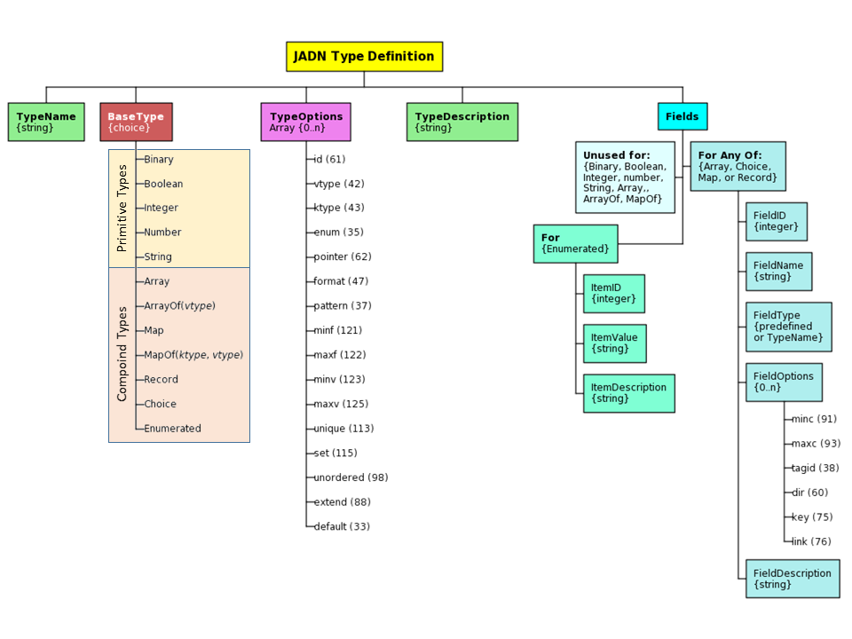

# OASIS Committee Note
-------

# Information Modeling with JADN Version 1.0

## Committee Note 01

## xx Mmmmm 2022

&nbsp;

<!-- URI list start (commented out except during publication by OASIS TC Admin)

#### This stage:
https://docs.oasis-open.org/openc2/imjadn/v1.0/cn01/imjadn-v1.0-cn01.md (Authoritative) \
https://docs.oasis-open.org/openc2/imjadn/v1.0/cn01/imjadn-v1.0-cn01.html \
https://docs.oasis-open.org/openc2/imjadn/v1.0/cn01/imjadn-v1.0-cn01.pdf

#### Previous stage of Version 1.0:
N/A

#### Latest stage of Version 1.0:
https://docs.oasis-open.org/openc2/imjadn/v1.0/imjadn-v1.0.md (Authoritative) \
https://docs.oasis-open.org/openc2/imjadn/v1.0/imjadn-v1.0.html \
https://docs.oasis-open.org/openc2/imjadn/v1.0/imjadn-v1.0.pdf

URI list end (commented out except during publication by OASIS TC Admin) -->

#### Technical Committee:
[OASIS Open Command and Control (OpenC2) TC](https://www.oasis-open.org/committees/openc2/)

#### Chair:
Duncan Sparrell (duncan@sfractal.com), [sFractal Consulting LLC](http://www.sfractal.com/) \
Michael Rosa (mjrosa@nsa.gov), [National Security Agency](https://www.nsa.gov)

#### Editors:
David Kemp (d.kemp@cyber.nsa.gov), [National Security Agency](https://www.nsa.gov/)

#### Additional artifacts:
This prose document is one component of a Work Product that also includes:
* XML schemas: (list file names or directory name)
* Other items (list titles and/or file names)

#### Related work:
This document is related to:
* _JSON Abstract Data Notation Version 1.0_. Edited by David Kemp.
Latest stage: https://docs.oasis-open.org/openc2/jadn/v1.0/jadn-v1.0.html.

#### Abstract:
Information models (IMs) are used to define and generate physical data models, validate information instances, and enable lossless translation across data formats. JSON Abstract Data Notation (JADN) is a UML-based information modeling language that defines data structure independently of data format. This Committee Note describes the use of IMs, explains how to construct IMs using JADN, and contrasts IMs with other modeling approaches, such as Entity-Relationship models for databases, and knowledge models / ontologies.

#### Status:
This is a Non-Standards Track Work Product. The patent provisions of the OASIS IPR Policy do not apply.

This document was last revised or approved by the OASIS Open Command and Control (OpenC2) TC on the above date. The level of approval is also listed above. Check the "Latest stage" location noted above for possible later revisions of this document. Any other numbered Versions and other technical work produced by the Technical Committee (TC) are listed at https://www.oasis-open.org/committees/tc_home.php?wg_abbrev=openc2#technical.

TC members should send comments on this document to the TC's email list. Others should send comments to the TC's public comment list, after subscribing to it by following the instructions at the "Send A Comment" button on the TC's web page at https://www.oasis-open.org/committees/openc2/.

#### Citation format:
When referencing this document the following citation format should be used:

**[IM-JADN-v1.0]**

_Information Modeling with JADN Version 1.0_. Edited by David Kemp. 13 October 2021. OASIS Committee Note 01. https://docs.oasis-open.org/openc2/imjadn/v1.0/cn01/imjadn-v1.0-cn01.html. Latest stage: https://docs.oasis-open.org/openc2/imjadn/v1.0/imjadn-v1.0.html.

#### Notices
Copyright &copy; OASIS Open 2021. All Rights Reserved.

Distributed under the terms of the OASIS [IPR Policy](https://www.oasis-open.org/policies-guidelines/ipr).

The name "OASIS" is a trademark of [OASIS](https://www.oasis-open.org/), the owner and developer of this specification, and should be used only to refer to the organization and its official outputs.

For complete copyright information please see the full Notices section in an Appendix below.

-------

# Table of Contents
[[TOC will be inserted here]]

-------

<!-- Insert a "line rule" (three or more hyphens alone on a new line, following a blank line) before each major section. This is used to generate a page break in the PDF format. -->

# 1 Introduction

> want to address
> * basic nature of information modeling
> * motivation for JADN
> * overview of document content


An Information Model (IM) defines the essential content of
entities used in computing, independently of how those entities
are represented (i.e., serialized) for communication or storage.
This Committee Note (CN) describes the nature of an IM, and the
application of the [JSON Abstract Data Notation
(JADN)](#jadn-v10) information modeling language in the creation
and use of IMs.

As an IM language, JADN is a syntax-independent, or abstract,
schema language. Abstract schema languages separate structure
definitions from encoding rules. JADN is oriented to work well
with common Internet data formats, such as 

 - JSON (Javascript Object Notation)
 - XMS (eXtensible Markup Language)
 - CBOR (Concise Binary Object Representation)

JADN is based rigorously on information theory, and an IM
composed in JADN formally defines equivalence (information
content) between data in different formats.

This CN discusses:

1) What is information modeling?
2) The value of an information model.
3) The distinction between an IM and other modeling approaches.
4) The creation and use of an IM using JADN and associated
    automated tools.

## 1.1 Terminology

This CN uses the definitions contained in the [[JADN
Specification](#jadn-v10)], section 1.2.1. The following
additional terms are defined for this document:

> TBD; this is a preliminary list; eliminate any terms not needed
> as document matures.

 - **Directed Acyclic Graph:** a directed acyclic graph (DAG) is
   a directed graph with no directed cycles. That is, it consists
   of vertices and edges (also called arcs), with each edge
   directed from one vertex to another, such that following those
   directions will never form a closed loop. A directed graph is
   a DAG if and only if it can be topologically ordered, by
   arranging the vertices as a linear ordering that is consistent
   with all edge directions (Wikipedia)

 - **Entity Relationship Model:** An entity–relationship model
   (or ER model) describes interrelated things of interest in a
   specific domain of knowledge. A basic ER model is composed of
   entity types (which classify the things of interest) and
   specifies relationships that can exist between entities
   (instances of those entity types). (Wikipedia)
  
 - **Schema:**  *(markup languages)* A formal description of
   data, data types, and data file structures, such as XML
   schemas for XML files. (Wiktionary)
 
 - **Ontology:** (information science) A representation, formal
   naming, and definition of the categories, properties, and
   relations between the concepts, data, and entities that
   substantiate one, many, or all domains of discourse. More
   simply, an ontology is a way of showing the properties of a
   subject area and how they are related, by defining a set of
   concepts and categories that represent the subject.
   (Wikipedia)

# 2 Information Modeling Overview

This section discusses the nature and benefits of IMs, types of
available modeling languages, and the tools that can be used in
information modeling.

## 2.1 Information Models And Data Models 

 > discussion based on RFC 3444

 As described in the introduction, IMs are a means to understand
 and document the essential information content relevant to a
 system, application, or protocol exchange without regard to how
 that information is represented in actual implementations.
 Having a clear view of the information required provides clarity
 regarding the goals that the eventual implementation must
 satisfy.

A small example may help clarify the concept of information. The
information content of an instance can be no greater than the
smallest data instance for which lossless round-trip conversion
is possible. For example, an IPv4 address presented in dotted
quad format is 17 bytes of JSON string data ("192.168.101.213"),
but can be converted to 4 byte RFC 791 format and back without
loss. The information content of an IPv4 address can therefore be
no greater than 4 bytes (32 bits), and an information model would
define the IPv4 address type as a byte sequence of length 4.

 [[RFC 3444](#rfc3444)] describes the purpose of an IM as:

 > "to model managed objects at a conceptual level, independent
 > of any specific implementations or protocols used to transport
 > the data. ... Another important characteristic of an IM is
 > that it defines relationships between managed objects." 

In a 2008 paper on information modeling, [[YTLee](#ytlee)]
describes the concept of a "conceptual schema", a "logically
neutral" view of the information in a system:

> "The conceptual view is a single, integrated definition of the
> data within an enterprise that is unbiased toward any single
> application of data and independent of how the data is
> physically stored or accessed."

and an IM:

> "An information model is a representation of concepts,
> relationships, constraints, rules, and operations to specify
> data semantics for a chosen domain of discourse. 

[[RFC3444](#rfc3444)] contrasts IMs with data models (DMs):

> "Compared to IMs, DMs define managed objects at a lower level
> of abstraction.  They include implementation- and
> protocol-specific details, e.g. rules that explain how to map
> managed objects onto lower-level protocol constructs."

and states DMs are "intended for implementors and include
protocol-specific constructs". 


## 2.2 Benefits of Information Models

A key point in all of the IM definitions and descriptions in the
previous section is the ability for the model to represent
information with a focus on its _meaning_, and without concern
for how that information will be represented. Focusing on meaning
encourages interoperability between applications by capturing
agreement about what the information conveys and how it can be
used, deferring decisions on storage and transmission matters
until a clear understanding of purpose has been reached.
Referring back to the example of the IPv4 address, regardless of
representation the address identifies the label applied to a
network interface within an available address space of 2^32.

[[YTLee](#ytlee)] identifies the key benefit of an IM:

> "The advantage of using an information model is that it can
> provide sharable, stable, and organized structure of
> information requirements for the domain context."

and describes a "quality" IM as being:

 - complete, 
 - sharable,
 - stable,
 - extensible, 
 - well-structured, 
 - precise, and
 - unambiguous.

An IM classifies the validity of serialized data with zero false
positives and zero false negatives. That is, an information model
is the authoritative definition of essential content, and any
serialized data is unambiguously one of: a) consistent with, b)
inconsistent with, or c) insignificant with respect to, the model.

> discussion based on RFC 8477

In [DThaler's](#dthaler) paper on _IoT Bridge Taxonomy_, which
addresses the challenges created when "many organizations develop
and implement different schemas for the same kind of things", the
concluding Recommendations section includes the following:

> To ... increase semantic interoperability, it is desirable that
> different data models for the same type of thing (e.g., light
> bulbs) are as similar as possible for basic functionality. In
> an ideal world, data models used by different protocols and
> organizations would express exactly the same information in
> ways that are algorithmically translatable by a dynamic schema
> bridge with no domain-specific knowledge. Sharing data models
> more widely, and having agreements in principle of at least
> using the same abstract information model, would be very
> beneficial.

The notion of "express[ing] exactly the same information in ways
that are algorithmically translatable" is a fundamental purpose
of information modeling.


## 2.3 Information Modeling Languages

[[YTLee](#ytlee)] describes an IM language as follows:

> "An information modeling language is a formal syntax that
> allows users to capture data semantics and constraints."

and defines their importance:

> "Formal information modeling languages that describe
> information requirements unambiguously is an enabling
> technology that facilitates the development of a large scale,
> networked, computer environment that behaves consistently and
> correctly."

[RFC 8477](#rfc8477), _IoT Semantic Interoperability Workshop
2016_, describes a lack of consistency across Standards
Developing Organizations (SDOs) in defining application layer data,
attributing it to the lack of an encoding-independent
standardization of the information represented by that data. The
JADN information modeling language is intended to address that
gap. Abstract Syntax Notation One (ASN.1) is another example of
an abstract schema language.


> JADN and other IM languages

 - JADN
 - ASN.1

> Piecing together a description of JADN

JADN is a syntax-independent schema language, based on UML
datatypes. JADN is designed to work with common Internet data
formats (JSON, XML, CBOR), providing a  schema to support them.
JADN is also graph oriented to align with the web and database
design practices - the concept of primary and foreign keys (URLs)
is fundamental.

JADN's native format is structured JSON, and a broad variety of
tools exist for creating and manipulating information in JSON
format. 

 - a JADN schema is structured data that can be generated and
   transformed programmatically 
 - JADN schemas employ a simple, regular structure (every type
   definition has the same five fields)


> ASN.1 description from ITU-T Introduction, excerpted from 
> https://www.itu.int/en/ITU-T/asn1/Pages/introduction.aspx

​ASN.1 is a formal notation used for describing data transmitted
by telecommunications protocols, regardless of language
implementation and physical representation of these data,
whatever the application, whether complex or very simple. The
notation provides a certain number of pre-defined basic types,
and makes it possible to define constructed types. Subtyping
constraints can be also applied on any ASN.1 type in order to
restrict its set of values. Data described in ASN.1 is serialized
and deserialized based on set of encoding rules, which are
defined for a broad variety of formats including the Basic
Encoding Rules (BER) and similar, which are closely associated
with ASN.1, as well as less closely tied standards such as XML
and JSON.


> What languages aren't really IM languages

Other languages have been used for information modeling, although that is not their primary purposes.  Some examples are

 - UML
 - IDEF1X

## 2.4 Information Modeling Tools 

> benefits of combining IMs with automated tooling for
> validation, translation

The value of an IM language multiplies when automated tooling
support creation, maintenance, and use of models created in that
language. The need for tools is discussed in [[RFC
8477](#rfc8477)], citing particularly the need for code
generation and debugging tools. A tool set to support an IM
language should provide

 - Model creation capabilities
 - Model validation capabilities
 - Translation among alternative representations of the IM (e.g.,
   textual, graphical)
 - Generation of language-specific schemas from an IM
 - Model translation to language- or protocol-specific
   serialization / deserialization capabilities
 

# 3 Creating Information Models with JADN

This section provides a brief overview of JADN, and describes the
use of JADN in information modeling.

## 3.1 JADN Overview

The JADN information modeling language was developed against specific objectives:

 1) Core types represent application-relevant "information", not "data"
 2) Single specification unambiguously defines multiple data formats
 3) Specification uses named type definitions equivalent to property tables
 4) Specification is data that can be serialized
 5) Specification has a fixed structure designed for extensibility

As described in the JADN specification introduction:

> JADN is a formal description technique that combines type
> constraints from the Unified Modeling Language (UML) with data
> abstraction based on information theory and structural
> organization using results from graph theory.

> EDITOR'S NOTE: consider whether the following adds clarity or
> confusion; it might need to be re-written to guide the reader
> through the concepts a bit more.

From UML JADN takes the concept of modeling information/data
using Simple Classifiers (see [UML](#uml), 10.2 Datatypes) as
opposed to the common practice of using Structured Classifiers
([UML](#uml), 11.4 Classes) which do not define data in a unique
way that can be validated and signed.  The JADN use of the UML
primitive types defined in [UML](#uml), Table 21.1, can be found
in [Appendix D.1](#d1-jadn-vs-uml-primitive-data-types).

The [[JADN Specification](#jadn-v10)] defines twelve base types:

 - Binary
 - Boolean
 - Integer
 - Number
 - String
 - Enmerated
 - Choice
 - Array
 - ArrayOf
 - Map
 - MapOf
 - Record


Another other significant UML concept is that JADN distinguishes
among all four multiplicity types ([UML](#uml), Table 7.1), while
class-based models typically support only sets.  JADN's
interpretation of this is summarized in the Table 3-1.


###### Table 3-1 -- Multiplicity Types
|            |                  Ordered                 |             Unordered             |
|:----------:|:----------------------------------------:|:---------------------------------:|
|   Unique   | Ordered Set, Record<br>JADN: ArrayOf+_unique_ | Set, Map<br>JADN: ArrayOf+_set_, MapOf |
| Non-Unique |       Sequence, List<br>JADN: ArrayOf       |    Bag<br>JADN: ArrayOf+*unordered*    |

JADN accepts the UML philosophy that schemas are classifiers that
take a unit of data and determine whether it is an instance of a
datatype, and recognizes the idea of generalization ([UML](#uml),
9.9.7) through use of the Choice type.

Beyond these UML concepts, JADN recognizes that information
models are directed graphs with a small predefined set of base
datatypes and only two kinds of relationship: "contain" and
"reference". 


### 3.1.1 Type Definitions

Figure 3-1 summarizes the structure of a JADN Type Definition,
and identifies values for each of the five elements in the
definition. The five elements are:

 1. A **TypeName**, which is simply a string used to refer to
that type. 
 1. The **BaseType** of the type, which is one of the either the
five "Primitive" (or, alternatively, "scalar") types or one of
the seven "Compound" types, as shown in Figure 3-1.
 1. Zero or more of the available JADN **TypeOptions** that
    refine the base types to fit particular needs.
 2. An optional **TypeDescription** string that provides
    additional information about the type.
 3. For any of the Compound types, a set of **Item** or **Field**
    options that define the items that comprise the compound
    type. 

###### Figure 3-1 -- JADN Type Definition Structure



### 3.1.2 TypeOptions

The third element of a JADN type definition is zero or more of
the TypeOptions defined in section 3.2.1 of the [JADN](#jadn-v10)
Specification. TypeOptions are classifiers that, along with the
base type, determine whether data values are instances of the
defined type. For example, the *pattern* TypeOption is used with
the String BaseType to define valid instances of that string type
using a regular expression conforming to
[ECMAScript](#ecmascript) grammar.

The following is the complete set of type options:

|   **Option**  |   **Type**  | **Description** |
|:---------:|:-------:|:-----------|
|     id    | Boolean | Items and Fields are denoted by FieldID rather than FieldName |
|   vtype   |  String | Value type for ArrayOf and MapOf  |
|   ktype   |  String | Key type for MapOf |
|    enum   |  String | Extension: Enumerated type derived from a specified type |
|  pointer  |  String | Extension: Enumerated type pointers derived from a specified type |
|   format  |  String | Semantic validation keyword |
|  pattern  |  String | Regular expression used to validate a String type |
|    minf   |  Number | Minimum real number value |
|    maxf   |  Number | Maximum real number value |
|    minv   | Integer | Minimum integer value, octet or character count, or element count |
|    maxv   | Integer | Maximum integer value, octet or character count, or element count |
|   unique  | Boolean | ArrayOf instance must not contain duplicate values |
|    set    | Boolean | ArrayOf instance is unordered and unique |
| unordered | Boolean | ArrayOf instance is unordered |
|   extend  | Boolean | Type is extensible; new Items or Fields may be appended |
|  default  |  String | Default value |

Detailed explanations of each type option can be found in
Sections 3.2.1.1-12 of the [[JADN Specification](#jadn-v10)].


### 3.1.3 Item Or Field Definitions

The use of the **Fields** element to convey Item or Field
Definitions is dependent on the **BaseType** selected, as
illustrated in [Figure
3-1](#figure-3-1----jadn-type-definition-structure). The rules
pertaining to the **Fields** array are as follows:

* If the **BaseType** is a Primitive type, ArrayOf, or MapOf, the
  **Fields** array MUST be empty:


* If the **BaseType** is Enumerated, each item definition in the
  **Fields** array MUST have three elements:

    1. **ItemID:** the integer identifier of the item
    2. **ItemValue:** the string value of the item
    3. **ItemDescription:** a non-normative comment


* If the **BaseType** is Array, Choice, Map, or Record, each
  field definition in the **Fields** array MUST have five
  elements:
    1. **FieldID:** the integer identifier of the field
    2. **FieldName:** the name or label of the field
    3. **FieldType:** the type of the field, a predefined type or
       a TypeName with optional Namespace ID prefix
       **NSID:TypeName**
    4. **FieldOptions:** an array of zero or more **FieldOption**
       or **TypeOption** ([JADN Specifciation](#jadn-v10)
       sections 3.2.2, or 3.2.1, respectively) applicable to the
       field
    5. **FieldDescription:** a non-normative comment

### 3.1.4  Field Options 

Compound types containing Items or Fields support field options
in addition to the type options describe in [Section
3.1.2](#312-typeoptions). JADN defines six field options.

| Option |    Type    | Description | JADN Spec Section |
|:------:|:----------:|:-----------|:-------:|
|  minc  |   Integer  | Minimum cardinality, default = 1, 0 = optional | 3.2.2.1 |
|  maxc  |   Integer  | Maximum cardinality, default = 1, 0 = default max, >1 = array | 3.2.2.1 |
|  tagid | Enumerated | Field containing an explicit tag for this Choice type | 3.2.2.2 |
|   dir  |   Boolean  | Pointer enumeration treats field as a group of items | 3.3.5 |
|   key  |   Boolean  | Field is a primary key for this type | 3.3.6 |
|  link  |   Boolean  | Field is a foreign key reference to a type instance | 3.3.6 |


### 3.1.5 JADN Representations

The native format of JADN is JSON, but JADN content can be
represented in others ways that are often more useful for
documentation. Corresponding to the description in the previous
section of how the **Fields** array is used, the JSON
representations are of the various BaseTypes are depicted here.

Figure 3-2 illustrates the structure of JADN for defining any
Primitive **BaseType**, or ArrayOf or MapOf type; for all of these
the **Fields** array is empty:

###### Figure 3-2 -- JADN for Primitive, ArrayOf, MapOf Types


Figure 3-3 illustrates the structure of JADN for defining an
Enumerated **BaseType**; for enumerations each item definition in the
**Fields** array has three elements:

###### Figure 3-3 -- JADN for Enumerated Types


Figure 3-4 illustrates the structure of JADN for defining a
**BaseType** of Array, Choice, Map, or Record; for these types each
field definition in the **Fields** array has five elements:

###### Figure 3-3 -- JADN for Types with Fields


The [JADN Specification](#jadn-v10) identifies three formats
(Section 5) in addition to the native format:

 - JADN Interface Definition Language (JIDL)
 - Table Style 
 - Entity Relationship Diagrams 

The formal definitions of each of these types are found in
sections 5.1, 5.2, and 5.3, respectively, of the [JADN
Specification](#jadn-v10).

Automated tooling makes it straightforward to translate among all
four of these formats in a lossless manner, and each format has
its advantages:

 - JADN in native JSON format can be readily processed by common
   JSON tooling.
 - JADN in table style presentation is often used in
specifications (e.g., as property tables such as are commonly
found in specifications).
 - JADN presented in entity relationship diagrams aids with
visualization of an information model. 
 - JADN in JIDL format, a simple text structure, is easy to edit,
making it a good format for both the initial creation and the
documentation of a JADN model. JIDL is also more compact than
table style presentation.

### 3.1.6 Basic Examples

This section provides illustrative examples of the JADN types and
their representations in JIDL and table formats.


#### 3.1.6.1 Binary 

**Definition:** A sequence of octets. Length is the number of
octets. 

**TypeOptions:** The *minv*, *maxv*, and *format* TypeOptions
are applicable to the Binary data type.

**Example:**  The Binary type is used for representing
arbitrary binary data.  An information item fitting a Binary type
would be defined as follows:

```json
["FileData", "Binary", [], "Binary contents of file", []]
```

The corresponding JIDL representation would be:

```
// Example definition of a binary datatype
  FileData = Binary   // Binary contents of file
```

> EDITOR'S NOTE:  need examples of applying the TypeOptions

#### 3.1.6.2 Boolean

**Definition:**  An element with one of two values: true or
false.

**TypeOptions:** No TypeOptions are applicable to the Boolean
data type.

**Example:**  The Boolean type is used for representing bi-valued
(i.e., true/false, yes/no, on/off) information. An information
item fitting a Boolean type would be defined as follows:

```json
["AccessGranted", "Boolean", [], "Result of access control decision", []]
```


The corresponding JIDL representation would be:

```
// Example definition of a boolean datatype
  AccessGranted = Boolean   // Result of access control decision
```


#### 3.1.6.3 Integer

**Definition:**  A positive or negative whole number.

**TypeOptions:** The *minv*, *maxv*, and *format* TypeOptions
are applicable to the Integer data type.

**Example:**  The Integer type is used for representing numerical
information with discrete integer values.  An information item
fitting an Integer type would be defined as follows:


```json
["TrackNumber", "Integer", [], "Track number for current song", []]
```


The corresponding JIDL representation would be:

```
// Example definition of an Integer datatype
  TrackNumber = Integer   // Track number for current song
```

> EDITOR'S NOTE:  need examples of applying the TypeOptions


#### 3.1.6.4 Number

**Definition:**  A real number.

**TypeOptions:** The *minf*, *maxf*, and *format* TypeOptions
are applicable to the Number data type.

**Example:**  The Number type is used for representing numerical
information with continuous values.  An information item fitting
a Number type would be defined as follows:


```json
["Temperature", "Number", [], "Current temperature observation in degrees C", []]
```


The corresponding JIDL representation would be:

```
// Example definition of an Number datatype
  Temperature = Number   // Current temperature observation in degrees C
```

> EDITOR'S NOTE:  need examples of applying the TypeOptions

#### 3.1.6.5 String 

**Definition:**  A sequence of characters, each of which has a
Unicode codepoint. Length is the number of characters.

**TypeOptions:** The *minv*, *maxv*, *format*, and *pattern*
TypeOptions are applicable to the String data type.

**Example:**  The String type is used for representing
information best presented as text.  An information item fitting
a String type would be defined as follows:


```json
["TrackTitle", "String", [], "Title of the song in the selected track", []]
```


The corresponding JIDL representation would be:

```
// Example definition of an String datatype
  TrackTitle = String   // Title of the song in the selected track
```

> EDITOR'S NOTE:  need examples of applying the TypeOptions

#### 3.1.6.6 Enumerated 

**Definition:**  A vocabulary of items where each item has an id
and a string value.

**TypeOptions:** The *id*, *enum*, *pointer*, and *extend*
TypeOptions are applicable to the Enumerated data type.

**Example:**  The Enumerated type is used to represent
information that has a finite set of applicable values. An
information item fitting the Enumerated type would be defined as
follows:


```json
["L4-Protocol", "Enumerated", [], "Value of the protocol (IPv4) or next header (IPv6) field in an IP packet. Any IANA value, [[RFC5237]](#rfc5237)", [
    [1, "icmp", "Internet Control Message Protocol - [RFC0792]"],
    [6, "tcp", "Transmission Control Protocol - [RFC0793]"],
    [17, "udp", "User Datagram Protocol - [RFC0768]"],
    [132, "sctp", "Stream Control Transmission Protocol - [RFC4960]"]
]]
```


The corresponding JIDL representation would be:

```
// Example definition of an Enumerated datatype
L4-Protocol = Enumerated  // Value of the protocol (IPv4) or next header (IPv6)
                          // field in an IP packet. Any IANA value per RFC5237
   1 icmp                 // Internet Control Message Protocol - [RFC0792]
   6 tcp                  // Transmission Control Protocol - [RFC0793]
  17 udp                  // User Datagram Protocol - [RFC0768]
 132 sctp                 // Stream Control Transmission Protocol - [RFC4960]
```

> EDITOR'S NOTE:  need examples of applying the TypeOptions

#### 3.1.6.7 Choice 

**Definition:**  A discriminated union: one type selected from a
set of named or labeled types.

**TypeOptions:** The *id*  and *extend* TypeOptions are
applicable to the Choice data type.

**Example:**  The Choice type is used to represent information
that {FILL IN: characteristics of information suitable for a
*choice*}. An information item fitting the Choice type would be
defined as follows:

```json
>>> need JSON for the ElementType choice item <<<
```

The corresponding JIDL representation would be:

```
// Example definition of a Choice datatype
ElementType = Choice
   1 annotation       Annotation
   2 relationship     Relationship
   3 identity         IdentityType                // Abstract "Subject"
   4 actor            Empty
   5 spdxDocument     SpdxDocument                // <- Collection: A file containing serialized element values
   6 bom              BOM                         // <- Collection
  10 snippet          Snippet                     // <- Artifact: pkg:Software
  11 file             File                        // <- Artifact: pkg:Software
  12 package          Package                     // <- Artifact: pkg:Software
  13 sbom             SBOM                        // <- BOM: pkg:Software
  14 license          License                     // pkg:License
```

> EDITOR'S NOTE:  need examples of applying the TypeOptions


#### 3.1.6.8 Array

**Definition:**  An ordered list of labeled fields with
positionally-defined semantics. Each field has a position, label,
and type.

**TypeOptions:** The *extend*, *minv*, *maxv*, and *format*
TypeOptions are applicable to the Array data type.

**Example:**  The Array type 

#### 3.1.6.9 ArrayOf(_vtype_)

**Definition:**  A collection of fields with the same semantics.
Each field has type *vtype*. Ordering and uniqueness are
specified by a collection option.

**TypeOptions:** The *vtype*, *minv*, *maxv*, *unique*, *set*,and
*unordered* TypeOptions are applicable to the ArrayOf data
type.

**Example:**  The ArrayOf type 

#### 3.1.6.10 Map

**Definition:**  An unordered map from a set of specified keys to
values with semantics bound to each key. Each key has an id and
name or label, and is mapped to a value type.

**TypeOptions:** The *id*, *extend* *minv*, and *maxv*
TypeOptions are applicable to the Map data type.

**Example:**  The Map type  is used to represent information that
{FILL IN: characteristics of information suitable for a *map*}.
An information item fitting the Map type would be defined as
follows:


```json
 ["Hashes", "Map", ["{1"], "Multiple discriminated unions with intrinsic tags is a Map", [
    [1, "md5", "Binary", ["/x", "{16", "}16", "[0"], ""],
    [2, "sha1", "Binary", ["/x", "{20", "}20", "[0"], ""],
    [3, "sha256", "Binary", ["/x", "{32", "}32", "[0"], ""]
  ]]
```


The corresponding JIDL representation would be:

```
// Example definition of an Map datatype
Hashes = Map{1..*}
   1 md5              Binary{16..16} /x optional
   2 sha1             Binary{20..20} /x optional
   3 sha256           Binary{32..32} /x optional
```

> EDITOR'S NOTE:  need examples of applying the TypeOptions


#### 3.1.6.11 MapOf(_ktype_,_vtype_)

**Definition:**  An unordered map from a set of keys of the same
type to values with the same semantics. Each key has key type
*ktype*, and is mapped to value type *vtype*.

**TypeOptions:** The *ktype*, *vtype*, *minv*, and *maxv*
TypeOptions are applicable to the MapOf data type.

**Example:**  The MapOf type 

#### 3.1.6.12 Record

**Definition:**  An ordered map from a list of keys with
positions to values with positionally-defined semantics. Each key
has a position and name, and is mapped to a value type.
Represents a row in a spreadsheet or database table.

**TypeOptions:** The *extend*, *minv*, and *maxv* TypeOptions
are applicable to the Record data type.

**Example:**  The Record type 

## 3.2 Information Modeling Process

> rough outline, starting from YTLee paper

 1) Define the scope of the model, identifying the domain of discourse and the processes to be supported by the IM.
 2) Conduct a requirements analysis to define information requirements.
 3) Develop the model, transforming information requirements into a conceptual model. This may employ a top-down, bottom-up, or mixed / inside-out approach.
 4) Group concepts to identify units of functionality
 5) Structure information requirements into entities, objects, or classes
 6) Capture the model in the chosen modeling language


## 3.3 Information Modeling Example

# 4 Advanced Techniques

-------

# Appendix A. Informative References

<!-- Required section -->

This appendix contains the informative references that are used in this document.


While any hyperlinks included in this appendix were valid at the time of publication, OASIS cannot guarantee their long-term validity.

(Reference sources:
For references to IETF RFCs, use the approved citation formats at:  
http://docs.oasis-open.org/templates/ietf-rfc-list/ietf-rfc-list.html.  
For references to W3C Recommendations, use the approved citation formats at:  
http://docs.oasis-open.org/templates/w3c-recommendations-list/w3c-recommendations-list.html.  
Remove this note before submitting for publication.)

###### [DThaler]

"IoT Bridge Taxonomy", D. Thaler, submission to Internet of
Things (IoT) Semantic Interoperability (IOTSI) Workshop 2016,
https://www.iab.org/wp-content/IAB-uploads/2016/03/DThaler-IOTSI.pdf

###### [ECMAScript]

ECMA International, "ECMAScript 2018 Language Specification", ECMA-262 9th Edition, June 2018, https://www.ecma-international.org/ecma-262.

###### [JADN-v1.0]
JSON Abstract Data Notation Version 1.0. Edited by David Kemp. 17 August 2021. OASIS Committee Specification 01. https://docs.oasis-open.org/openc2/jadn/v1.0/cs01/jadn-v1.0-cs01.html. Latest stage: https://docs.oasis-open.org/openc2/jadn/v1.0/jadn-v1.0.html.

###### [JSON-Schema]
"JSON Schema, a vocabulary that allows you to annotate and validate JSON documents.", retrieved 9/26/2022, https://json-schema.org/

###### [YTLee]
Lee, Y. (1999), Information Modeling: From Design to Implementation, IEEE Transactions on Robotics and Automation, [online], https://tsapps.nist.gov/publication/get_pdf.cfm?pub_id=821265 (Accessed October 5, 2022)

###### [RFC3444] 
Pras, A., Schoenwaelder, J., "On the Difference between Information Models and Data Models", RFC 3444, January 2003, https://tools.ietf.org/html/rfc3444.

###### [RFC8477] 
Jimenez, J., Tschofenig, H., and D. Thaler, "Report from the Internet of Things (IoT) Semantic Interoperability (IOTSI) Workshop 2016", RFC 8477, DOI 10.17487/RFC8477, October 2018, <https://www.rfc-editor.org/info/rfc8477>.

###### [RFC8610]

Birkholz, H., Vigano, C. and Bormann, C., "Concise Data Definition Language (CDDL): A Notational Convention to Express Concise Binary Object Representation (CBOR) and JSON Data Structures", RFC 8610, DOI 10.17487/RFC8610, June 2019, https://www.rfc-editor.org/info/rfc8610

###### [UML]

"Unified Modeling Language", Version 2.5.1, December 2017, https://www.omg.org/spec/UML/2.5.1/About-UML/

-------

# Appendix B. Acknowledgments

(Note: A Work Product approved by the TC must include a list of people who participated in the development of the Work Product. This is generally done by collecting the list of names in this appendix. This list shall be initially compiled by the Chair, and any Member of the TC may add or remove their names from the list by request.  
Remove this note before submitting for publication.)

## B.1 Special Thanks

<!-- This is an optional subsection to call out contributions from TC members. If a TC wants to thank non-TC members then they should avoid using the term "contribution" and instead thank them for their "expertise" or "assistance". -->

Substantial contributions to this document from the following individuals are gratefully acknowledged:

Participant Name, Affiliation or "Individual Member"

## B.2 Participants

<!-- A TC can determine who they list here, however, TC Observers must not be listed. It is common practice for TCs to list everyone that was part of the TC during the creation of the document, but this is ultimately a TC decision on who they want to list and not list, and in what order. -->

The following individuals have participated in the creation of this document and are gratefully acknowledged:

**tc-full-name TC Members:**

| First Name | Last Name | Company |
| :--- | :--- | :--- |
Philippe | Alcon | Marvelous Networks
Alex | Amir | Viacat
Kris | Anders | Trend Mission
Darren | Anysteel | Macro Networks

-------

# Appendix D. Frequently Asked Questions


## D.1 JADN vs. UML Primitive Data Types

Table D-1 maps basic data types between UML and JADN.

|        UML       |      JADN      |
|:----------------:|:--------------:|
|      Integer     |     Integer    |
|      Boolean     |     Boolean    |
|      String      |     String     |
| UnlimitedNatural | Integer {0..*} |
|      Real        |     Number     |
|        _xxx_     |     Binary     |

## D.2 Why JADN and not RDF?

This section discusses the relationship between JADN and RDF, and why RDF does not serve the purpose of an Information Model


### Comment
The following
[comment](https://lists.oasis-open.org/archives/openc2-comment/202106/msg00002.html)
was submitted in response to the OASIS JADN [public
review](https://lists.oasis-open.org/archives/openc2/202106/msg00019.html):

> *Have you considered the following specifications from W3C:
> **RDF, RDFS, JSON-LD, SHACL**? RDF, RDFS (and potentially OWL
> and BFO) should take care of your information modelling needs,
> JSON-LD provides a JSON serializations, SHACL provides
> extensive validation capabilities. I would be interested to see
> the analysis why these technologies were eliminated after your
> consideration.*

### Response
The short answer (RDF models *knowledge* while JADN models
*information*) is provided in the JADN
[introduction](https://docs.oasis-open.org/openc2/jadn/v1.0/cs01/jadn-v1.0-cs01.html#1-introduction):

> *UML class models and diagrams are commonly referred to as
> "Data Models", but they model knowledge of real-world entities
> using classes. In contrast, information models model data
> itself using datatypes.*

An RDF graph is a knowledge model / ontology consisting of
(subject, predicate, object) triples, where each member of the
triple can be an International Resource Identifier (IRI), blank
node, or literal. An RDF triple encodes a statement—a simple
logical expression, or claim about the world. A JADN graph, in
contrast, consists of DataType definitions that define the
information content of data instances.

In order to understand why RDF is not suitable as an information
modeling language, one must understand two things about
information:

 1. **[Information](https://www.quantamagazine.org/how-claude-shannons-information-theory-invented-the-future-20201222/)**
    distinguishes *significant* data from *insignificant* data.
    (In Shannon's original context signal and noise are in the
    analog domain, but entropy is meaningful even in purely
    digital communication.)
 
 3. Information defines *loss*. Lossless transformations across
    data formats preserve information; after a round trip
    significant data is unchanged and insignificant data can be
    ignored. A lossy round trip is lossy not because it alters
    data, but because it alters significant data.

Information models define the information capacity of data
instances; two data formats are *equivalent* if conversion
between them is lossless.


Resources can be physical or digital entities. Both can be
subjects of knowledge model statements, but only digital
resources can be modeled as information instances and serialized
for transmission and storage. The RDF primer contains the
following example statements about resources:

 - \<Bob> \<is a> \<person>.
 - \<Bob> \<is a friend of> \<Alice>.
 - \<Bob> \<is born on> \<the 4th of July 1990>.
 - \<Bob> \<is interested in> \<the Mona Lisa>.

From context we can infer that \<the Mona Lisa>, like \<Bob> and
\<Alice>, is intended to be a physical resource.

### Extreme Example
The physical painting can never be serialized losslessly, because
even a multi-band 3D camera that captures near-infrared images of
pencil sketches beneath the paint and elevation contours of the
brush strokes still does not capture, for example, the chemical
and physical properties of the canvas, pencils, washes, pigments,
binders, or other materials used in the painting. But though
physical entities can never be modeled completely as data, camera
images of them can be. A 1920x1080 image contains 2 million
pixels that could be serialized in the lossless PNG format, or as
2 million XML/RDF statements of the form \<mona lisa pixel
192,13> \<has color> \<#32b82f>. The raw image data can be
serialized as RDF and deserialized back to raw without loss, but
is it useful to do so? RDF is useful for statements like the
painting was created by da Vinci in 1503-1506, is housed in the
Louvre, depicts a smiling woman, and has cedar trees in the
background.  But if an application needs the image, PNG
serialization is an appropriate tool for the job, RDF is not.

### Practical Example
JADN defines specific digital resources that can be stored,
communicated, and referenced by an RDF graph.  If Bob is a
physical \<person> and \<person> is a Class, an information model
specifies selected details about Person entities in terms of
their format-independent information content:

```
People = ArrayOf(Person)

Person = Record
1 name       String
2 id         Key(PersonId)
3 dob        Integer /date-adhoc
4 weight     Weight optional
5 hair_color Color optional
6 eye_color  Color optional

Color = Enumerated
1 red
2 green
3 blue
4 brown
5 black
6 white

Weight = Integer 		// unit = grams

PersonId = String{pattern="..."}
```

This defines a set of properties of the Person datatype and the
collection characteristics of those properties: "Record" means
that the collection is both ordered and unique, which in turn
means that the properties could be serialized in JSON as either
maps or arrays. Formats (in this case the hypothetical
/date-adhoc) indicate that the "date of birth" property is the
integer number of [seconds since the
epoch](https://www.epochconverter.com/) and can be serialized
using the folksy string format from the RDF example. Defining
times and durations as integers in the information model allows
date strings of various text representations to be compared and
ordered. The Color vocabulary could contain the 140 [web-safe
color names](https://www.w3schools.com/colors/colors_names.asp),
or a defined set of [fashion
colors](https://www.latest-hairstyles.com/color/chart.html) such
as "medium golden blonde". Enumerations allow Color strings to be
both validated for semantic meaningfulness and serialized as 8-
or 16-bit values.

### Measuring Information
If a data instance can be losslessly converted among
serializations A, B, and C, then by definition the instance
conveys no more information than the smallest of its
serializations.

JSON verbose serialization of \<People>:
```
[{
  "weight": 79546,
  "dob": "the 4th of July 1990",
  "id": "K193-3498-234",
  "name": "Bob"
}, {
  "name": "Alice",
  "dob": "the 27th of June 1982",
  "id": "B239-5921-348"
}]
```

JSON compact serialization of \<People>:
```
[
  ["Bob", "K193-3498-234", "the 4th of July 1990", 79546],
  ["Alice", "B239-5921-348", "the 27th of June 1982"]
]
```
JSON concise serialization of \<People>:
```
[
  ["Bob", "K193-3498-234", 647049600, 79546],
  ["Alice", "B239-5921-348", 393984000]
]
```

CBOR serialization of \<People> ([converted](http://cbor.me/)
from concise JSON):

```
56 Bytes:
82                         # array(2)
84                         # array(4)
63                         # text(3)
426F62                     # "Bob"
6D                         # text(13)
4B3139332D333439382D323334 # "K193-3498-234"
1A 26913180                # unsigned(647049600)
1A 000136BA                # unsigned(79546)
83                         # array(3)
65                         # text(5)
416C696365                 # "Alice"
6D                         # text(13)
423233392D353932312D333438 # "B239-5921-348"
1A 177BB800                # unsigned(393984000)
```

This illustrates that regardless of serialization, the properties
of Bob and Alice convey less than 56 bytes of information, or on
average 28 bytes per person. An RDF/XML serialization could be
lossless but would not supply any additional information.
Information instances can be stored in a database, transmitted as
XML, JSON, CBOR, or other formats, referenced by RDF graphs and
included in other structured data. As with the PNG example, this
suggests that information can be serialized in any suitable
format, with RDF statements generated from it dynamically if
needed to satisfy queries. Although this Person example does not
include Bob's friends or interests, relationships can be defined
within the information model or specified independently with RDF.
[JADN section
5.3](https://docs.oasis-open.org/openc2/jadn/v1.0/cs01/jadn-v1.0-cs01.html#53-entity-relationship-diagrams)
includes a slightly larger information model example with three
types and four container and reference relationships among them.


## D.3 Why JADN and not OWL?

Capture from Google Doc at https://docs.google.com/document/d/1gY8ZaQJmJTpx8468Conchc2XVzTKE8x0WFSQT1qtB8o/edit#heading=h.ru8h2khtb5aw

-------

# Appendix E. Revision History
| Revision | Date | Editor | Changes Made |
| :--- | :--- | :--- | :--- |
| filename-v1.0-wd01 | yyyy-mm-dd | Editor Name | Initial working draft |

------

# Appendix F. Notices

Copyright &copy; OASIS Open 2021. All Rights Reserved.

All capitalized terms in the following text have the meanings assigned to them in the OASIS Intellectual Property Rights Policy (the "OASIS IPR Policy"). The full [Policy](https://www.oasis-open.org/policies-guidelines/ipr) may be found at the OASIS website.

This document and translations of it may be copied and furnished to others, and derivative works that comment on or otherwise explain it or assist in its implementation may be prepared, copied, published, and distributed, in whole or in part, without restriction of any kind, provided that the above copyright notice and this section are included on all such copies and derivative works. However, this document itself may not be modified in any way, including by removing the copyright notice or references to OASIS, except as needed for the purpose of developing any document or deliverable produced by an OASIS Technical Committee (in which case the rules applicable to copyrights, as set forth in the OASIS IPR Policy, must be followed) or as required to translate it into languages other than English.

The limited permissions granted above are perpetual and will not be revoked by OASIS or its successors or assigns.

This document and the information contained herein is provided on an "AS IS" basis and OASIS DISCLAIMS ALL WARRANTIES, EXPRESS OR IMPLIED, INCLUDING BUT NOT LIMITED TO ANY WARRANTY THAT THE USE OF THE INFORMATION HEREIN WILL NOT INFRINGE ANY OWNERSHIP RIGHTS OR ANY IMPLIED WARRANTIES OF MERCHANTABILITY OR FITNESS FOR A PARTICULAR PURPOSE.

The name "OASIS" is a trademark of [OASIS](https://www.oasis-open.org/), the owner and developer of this specification, and should be used only to refer to the organization and its official outputs. OASIS welcomes reference to, and implementation and use of, specifications, while reserving the right to enforce its marks against misleading uses. Please see https://www.oasis-open.org/policies-guidelines/trademark for above guidance.


----------------


## 1.3 Some markdown usage examples

**Text.**

Note that text paragraphs in markdown should be separated by a blank line between them -

Otherwise the separate paragraphs will be joined together when the HTML is generated.
Even if the text appears to be separate lines in the markdown source.

To avoid having the usual vertical space between paragraphs,  
append two or more space characters to the end of the lines  
which will generate an HTML break tag instead of a new paragraph tag  
(as demonstrated here).

### 1.3.1 Figures and Captions

FIGURE EXAMPLE:
<note caption is best ABOVE figure, to allow a link to it to display image - same for table captions>

###### Figure 1 -- Title of Figure
 (this image is missing)

###### Figure 2 -- OpenC2 Message Exchange


### 1.3.2 Tables

#### 1.3.2.1 Basic Table
**Table 1-1. Table Label**

| Item | Description |
| :--- | :--- |
| Item 1 | Something<br>(second line) |
| Item 2 | Something |
| Item 3 | Something<br>(second line) |
| Item 4 | text |

#### 1.3.2.2 Table with Three Columns and Some Bold Text
text.

| Title 1 | Title 2 | title 3 |
| :--- | :--- | :--- |
| something | something | something else that is a long string of text that **might** need to wrap around inside the table box and will just continue until the column divider is reached |
| something | something | something |

#### 1.3.2.3 Table with a caption which can be referenced

###### Table 1.6. See reference label construction

| Name | Description |
| :--- | :--- |
| **content** | Message body as specified by content_type and msg_type. |

Here is a reference to the table caption:
Please see [Table 1.6.or other meaningful label](#table-1.6.see-reference-label-construction) 


### 1.3.3 Lists

Bulleted list:
* bullet item 1.
* **Bold** bullet item 2.
* bullet item 3.
* bullet item 4.

Indented or multi-level bullet list - add two spaces per level before bullet character (* or -):
* main bullet type
  * Example second bullet
    * See third level
      * fourth level

Numbered list:
1. item 1
2. item 2
3. item 3

### 1.3.4 Reference Label Construction

REFERENCES and ANCHORS
- in markdown source, format the Reference tags as level 6 headings like: `###### [OpenC2-HTTPS-v1.0]`
###### [OpenC2-HTTPS-v1.0]
_Specification for Transfer of OpenC2 Messages via HTTPS Version 1.0_. Edited by...

- reference text has to be on a separate line below the tag

- format cross-references (citations of the references) like: `see [[OpenC2-HTTPS-v1.0](#openc2-https-v10)]`  
"see [[OpenC2-HTTPS-v1.0](#openc2-https-v10)]"  
(note the outer square brackets in markdown will appear in the visible HTML text)

- The text in the Reference tag (following ###### ) will become an HTML anchor using the following conversion rules:  
-- punctuation marks will be dropped (including "[" )  
-- leading white spaces will be dropped  
-- upper case will be converted to lower  
-- spaces between letters will be converted to a single hyphen

- The same HTML anchor construction rules apply to cross-references and to section headings.  
-- Thus, a section heading like "## 1.2 References"  
-- becomes an anchor in HTML like `<a href="#12-references">`  
-- referenced in the markdown like: see [Section 1.2](#12-references)  
-- (in markdown: `"see [Section 1.2](#12-references"`)  
-- similar HTML anchors are also used in constructing the TOC

### 1.3.5 Code Blocks

Text to appear as an indented code block with grey background and monospace font - use three back-ticks before and after the code block).

Note the actual backticks will not appear in the HTML version. If it's necessary to display visible backticks, place a back-slash before them like: \``` .

```
{   
    "target": {
        "x_kmip_2.0": {
            {"kmip_type": "json"},
            {"operation": "RekeyKeyPair"},
            {"name": "publicWebKey11DEC2017"}
        }
    }
}
```

Text to be highlighted as code can also be surrounded by a single "backtick" character: 
`code text`

## 1.4 Page Breaks
Add horizontal rule lines where page breaks are desired in the PDF - before each major section
- insert the line rules in markdown by inserting 3 or more hyphens on a line by themselves:  ---
- place these before each main section in markdown (usually "#" - which generates the HTML `<h1>` tag)

-------

# 2 Section Heading
text.

## 2.1 Level 2 Heading
text.

### 2.1.1 Level 3 Heading
text.

#### 2.1.1.1 Level 4 Heading
text.

##### 2.1.1.1.1 Level 5 Heading
This is the deepest level, because six # gets transformed into a Reference tag.


## 2.2 Next Heading
text.

