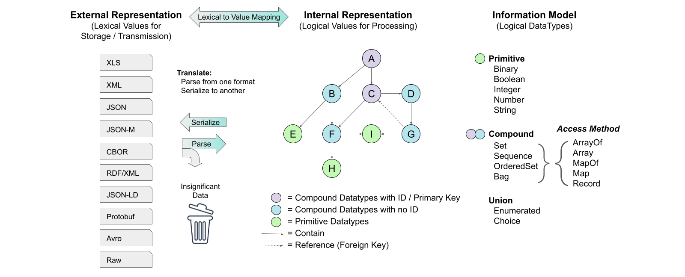

# OASIS Committee Note
-------

# Information Modeling with JADN Version 1.0

## Committee Note 02 - Working Draft 01

## 28 October 2024

#### This stage:
https://docs.oasis-open.org/openc2/imjadn/v1.0/cn01/imjadn-v1.0-cn01.md (Authoritative) \
https://docs.oasis-open.org/openc2/imjadn/v1.0/cn01/imjadn-v1.0-cn01.html \
https://docs.oasis-open.org/openc2/imjadn/v1.0/cn01/imjadn-v1.0-cn01.pdf

#### Previous stage of Version 1.0:
https://docs.oasis-open.org/openc2/imjadn/v1.0/cnd01/imjadn-v1.0-cnd01.md (Authoritative) \
https://docs.oasis-open.org/openc2/imjadn/v1.0/cnd01/imjadn-v1.0-cnd01.html \
https://docs.oasis-open.org/openc2/imjadn/v1.0/cnd01/imjadn-v1.0-cnd01.pdf

#### Latest stage of Version 1.0:
https://docs.oasis-open.org/openc2/imjadn/v1.0/imjadn-v1.0.md (Authoritative) \
https://docs.oasis-open.org/openc2/imjadn/v1.0/imjadn-v1.0.html \
https://docs.oasis-open.org/openc2/imjadn/v1.0/imjadn-v1.0.pdf

#### Technical Committee:
[OASIS Open Command and Control (OpenC2) TC](https://www.oasis-open.org/committees/openc2/)

#### Chairs:
Duncan Sparrell (duncan@sfractal.com), [sFractal Consulting LLC](http://www.sfractal.com/) \
Michael Rosa (mjrosa@nsa.gov), [National Security Agency](https://www.nsa.gov)

#### Editors:
David Lemire (david.p.lemire@hii.com), [HII](https://hii.com/) \
David Kemp (d.kemp@cyber.nsa.gov), [National Security Agency](https://www.nsa.gov/)

#### Related work:
This document is related to:
* _JSON Abstract Data Notation Version 1.0_. Edited by David Kemp.
Latest stage: https://docs.oasis-open.org/openc2/jadn/v1.0/jadn-v1.0.html.

#### Abstract:

An Information Model (IM) defines the essential content of data used in computing,
independently of how it is represented for processing, communication or storage.
JSON Abstract Data Notation (JADN) is an information modeling language based on
Unified Modeling Language (UML) datatypes designed to both express the meaning
of data items at a conceptual level and formally type and validate their essential content.
It uses information theory to define logical equivalence, allowing translation
of essential content across a wide range of representations without loss.
This Committee Note explains how to construct IMs using JADN, represent them
in various formats such as formal languages and entity-relationship diagrams,
contrast them with other IM languages such as ASN.1,
and integrate them with knowledge graphs and concrete data models.

#### Status:
This is a Non-Standards Track Work Product. The patent provisions of the OASIS IPR Policy do not apply.

This document was last revised or approved by the OASIS Open Command and Control
(OpenC2) TC on the above date.
The level of approval is also listed above. Check the "Latest stage" location
noted above for possible later revisions of this document.
Any other numbered Versions and other technical work produced by the Technical
Committee (TC) are listed at https://www.oasis-open.org/committees/tc_home.php?wg_abbrev=openc2#technical.

TC members should send comments on this document to the TC's email list.
Others should send comments to the TC's public comment list, after
subscribing to it by following the instructions at the "Send A Comment"
button on the TC's web page at https://www.oasis-open.org/committees/openc2/.

#### Citation format:
When referencing this document the following citation format should be used:

**[IM-JADN-v1.0]**

_Information Modeling with JADN Version 1.0_. Edited by David Kemp. 19 April 2023.
OASIS Committee Note 01. https://docs.oasis-open.org/openc2/imjadn/v1.0/cn01/imjadn-v1.0-cn01.html.
Latest stage: https://docs.oasis-open.org/openc2/imjadn/v1.0/imjadn-v1.0.html.

#### Notices
Copyright &copy; OASIS Open 2023. All Rights Reserved.

Distributed under the terms of the OASIS [IPR Policy](https://www.oasis-open.org/policies-guidelines/ipr/).

The name "OASIS" is a trademark of [OASIS](https://www.oasis-open.org/), the owner and developer of this specification,
and should be used only to refer to the organization and its official outputs.

For complete copyright information please see the full Notices section in [Appendix F](#appendix-f-notices).

-------

# Table of Contents

- [1 Introduction](#1-introduction)
  - [1.1 Background: Motivation for JADN](#11-background-motivation-for-jadn)
    - [1.1.1 Information Models and Data Models](#111-information-models-and-data-models)
    - [1.1.2 The Information Modeling Gap](#112-the-information-modeling-gap)
    - [1.1.3 Defining Information](#113-defining-information)
    - [1.1.4 Information Modeling Goals and Principles](#114-information-modeling-goals-and-principles)
  - [1.2 Terminology](#12-terminology)
- [2 Information Modeling Overview](#2-information-modeling-overview)
  - [2.4 Serialization](#24-serialization)
  - [2.5 Information Modeling Languages](#25-information-modeling-languages)
  - [2.6 Information Modeling Tools](#26-information-modeling-tools)
  - [2.7 Applying an Information Model](#27-applying-an-information-model)
- [3 Creating Information Models with JADN](#3-creating-information-models-with-jadn)
  - [3.1 JADN Overview](#31-jadn-overview)
    - [3.1.1 Type Definitions](#311-type-definitions)
      - [3.1.1.1 TypeNames and BaseTypes](#3111-typenames-and-basetypes)
      - [3.1.1.2 TypeOptions](#3112-typeoptions)
      - [3.1.1.3 Item Or Field Definitions](#3113-item-or-field-definitions)
      - [3.1.1.4 Field Options](#3114-field-options)
    - [3.1.2 Core Type Examples](#312-core-type-examples)
      - [3.1.2.1 Binary](#3121-binary)
      - [3.1.2.2 Boolean](#3122-boolean)
      - [3.1.2.3 Integer](#3123-integer)
      - [3.1.2.4 Number](#3124-number)
      - [3.1.2.5 String](#3125-string)
      - [3.1.2.6 Enumerated](#3126-enumerated)
      - [3.1.2.7 Choice](#3127-choice)
      - [3.1.2.8 Array](#3128-array)
      - [3.1.2.9 ArrayOf(vtype)](#3129-arrayofvtype)
      - [3.1.2.10 Map](#31210-map)
      - [3.1.2.11 MapOf(ktype,vtype)](#31211-mapofktypevtype)
      - [3.1.2.12 Record](#31212-record)
    - [3.1.3 JADN Representations](#313-jadn-representations)
      - [3.1.3.1 Native JSON Representation](#3131-native-json-representation)
      - [3.1.3.2 Alternative JADN Representations](#3132-alternative-jadn-representations)
        - [3.1.3.2.1  Array "Field Names" in JIDL](#31321--array-field-names-in-jidl)
    - [3.1.4 Type Definition Nuances](#314-type-definition-nuances)
      - [3.1.4.1 "Anonymous" Type Definitions](#3141-anonymous-type-definitions)
      - [3.1.4.2 Selection and Use of JADN Compound Types](#3142-selection-and-use-of-jadn-compound-types)
      - [3.1.4.3  JADN Handling of UML Multiplicity Options](#3143--jadn-handling-of-uml-multiplicity-options)
      - [3.1.4.4 Application of minv / maxv](#3144-application-of-minv--maxv)
  - [3.2 Information Modeling Process](#32-information-modeling-process)
    - [3.2.1 Y. Tina Lee Modeling Process](#321-y-tina-lee-modeling-process)
    - [3.2.2 Frederiks / van der Weide Modeling Process](#322-frederiks--van-der-weide-modeling-process)
  - [3.3 Information Modeling Example](#33-information-modeling-example)
    - [3.3.1 Example 1: A Digital Music Library](#331-example-1-a-digital-music-library)
    - [3.3.2 Multiple Representations Example](#332-multiple-representations-example)
- [4 Advanced Techniques](#4-advanced-techniques)
  - [4.1 Packages and Namespaces](#41-packages-and-namespaces)
    - [4.1.1 Packages](#411-packages)
    - [4.1.2 Namespaces](#412-namespaces)
  - [4.2 Reference Relationships: Keys and Links](#42-reference-relationships-keys-and-links)
- [Appendix A. Informative References](#appendix-a-informative-references)
- [Appendix B. Acknowledgments](#appendix-b-acknowledgments)
- [Appendix C. Revision History](#appendix-c-revision-history)
- [Appendix D. Frequently Asked Questions (FAQ)](#appendix-d-frequently-asked-questions-faq)
  - [D.1 JADN vs. UML Primitive Data Types](#d1-jadn-vs-uml-primitive-data-types)
  - [D.1 Declarative Specifications](#d1-declarative-specifications)
  - [D.2 Applications](#d2-applications)
  - [D.2 Why JADN and not RDF?](#d2-why-jadn-and-not-rdf)
  - [D.3 Why JADN and not OWL?](#d3-why-jadn-and-not-owl)
- [Appendix E. Example Information Model Source](#appendix-e-example-information-model-source)
- [Appendix F. Notices](#appendix-f-notices)

**List of Figures**
 - [Figure 1-1 -- Range of Model Types](#figure-1-1----range-of-model-types)
 - [Figure 2-1 -- Serialization / Deserialization](#figure-2-1----serialization--deserialization)
 - [Figure 2-2 -- Parsing and Serializing With An IM](#figure-2-2----parsing-and-serializing-with-an-im)
 - [Figure 3-1 -- JADN Concepts](#figure-3-1----jadn-concepts)
 - [Figure 3-2 -- JADN Type Definition Structure](#figure-3-2----jadn-type-definition-structure)
 - [Figure 3-3 -- JADN for Primitive, ArrayOf, MapOf Types](#figure-3-3----jadn-for-primitive-arrayof-mapof-types)
 - [Figure 3-4 -- JADN for Enumerated Types](#figure-3-4----jadn-for-enumerated-types)
 - [Figure 3-5 -- JADN for Types with Fields](#figure-3-5----jadn-for-types-with-fields)
 - [Figure 3-6 -- Simple University Example ERD](#figure-3-6----simple-university-example-erd)
 - [Figure 3-7 -- Simple University Example JADN (JSON format)](#figure-3-7----simple-university-example-jadn-json-format)
 - [Figure 3-8 -- Simple University Example JADN (JIDL format)](#figure-3-8----simple-university-example-jadn-jidl-format)
 - [Figure 3-9 -- Simple University Example JADN (table format)](#figure-3-9----simple-university-example-jadn-table-format)
 - [Figure 3-10 -- Simple University Example ERD Source Code (GraphViz)](#figure-3-10----simple-university-example-erd-source-code-graphviz)
 - [Figure 3-11 -- Music Library Example ERD](#figure-3-11----music-library-example-erd)
 - [Figure 4-1 -- Contains and References Relationships](#figure-4-1----contains-and-references-relationships)

**List of Tables**
 - [Table 3-1 -- Compound Type Decision Tree](#table-3-1----compound-type-decision-tree)
 - [Table 3-2 -- Multiplicity Types](#table-3-2----multiplicity-types)
 - [Table 3-3 -- JADN Type Options](#table-3-3----jadn-type-options)
 - [Table 3-4 -- Type Option Applicability](#table-3-4----type-option-applicability)
 - [Table 3-5 -- JADN Field Options](#table-3-5----jadn-field-options)
 - [Table 3-6 -- Binary Type Format Options](#table-3-6----binary-type-format-options)
 - [Table 3-7 -- Integer Type Format Options](#table-3-7----integer-type-format-options)
 - [Table 3-8 -- Number Type Format Options](#table-3-8----number-type-format-options)
 - [Table 3-9 -- Array Type Format Options](#table-3-9----array-type-format-options)
 - [Table D-1 -- UML and JADN Basic Type Equivalence](#table-d-1----uml-and-jadn-primitive-type-equivalence)

-------

# 1 Introduction

This Committee Note (CN) describes the nature of information models and the application
of the *JSON Abstract Data Notation* [[JADN Specification](#jadn-v10)] information modeling language
in the creation and use of IMs.

## 1.1 Background: Motivation for JADN

Information models are a means to understand
and document the essential information content relevant to a
system, application, or protocol exchange without regard to how
that information is represented in actual implementations.
Having a clear view of the information required provides clarity
regarding the goals that the eventual implementation must
satisfy.
This section provides the background for the creation of JADN as
an information modeling language for a spectrum of applications.

### 1.1.1 Information Models and Data Models

Internet Engineering Task Force (IETF) [RFC 3444](#rfc3444),
"On the Difference between Information Models and Data Models", says:

> * The main purpose of an IM is to model managed objects at a conceptual
level, independent of any specific implementations or protocols used
to transport the data.  The degree of specificity (or detail) of the
abstractions defined in the IM depends on the modeling needs of its
designers. (Section 2)
> 
> 
> * The terms "conceptual models" and "abstract models", which are often
used in the literature, relate to IMs.  IMs can be implemented in different
ways and mapped on different protocols.
> * IMs can be defined in an informal way, using natural languages such
as English. Alternatively, IMs can be defined using a formal language
or a semi-formal structured language.  One of the possibilities to formally
specify IMs is to use class diagrams of the Unified Modeling Language (UML).
> * In general, it seems advisable to use object-oriented techniques to
describe an IM. In particular, the notions of abstraction and
encapsulation, as well as the possibility that object definitions
include methods, are considered to be important. (Section&nbsp;3)
>
> 
> * Compared to IMs, DMs define managed objects at a lower level
of abstraction.  They include implementation- and
protocol-specific details, e.g., rules that explain how to map
managed objects onto lower-level protocol constructs. (Section 4)

Although RFC 3444 references protocols and object methods, the Unified Modeling Language
[UML](#uml) places data models and object-oriented programming models
in separate categories:
* Simple Classifiers (Section 10), including DataTypes (10.2), and
* Structured Classifiers (Section 11), including Classes (11.4)

JADN is aligned with UML's layered separation of concerns: the main purpose of an
IM is to model *data*, not managed objects, at both conceptually- and formally-defined levels.
This allows IMs to model any kind of data, from simple structures such as value ranges
or coordinates, to protocol messages, APIs, and method signatures, to complete documents,
without the complexity of also modeling programming languages and techniques.
An IM is a [declarative](#d1-declarative-specifications)
specification that defines desired outcomes (data item validity and equivalence)
without describing control flow.
Protocol models can use IMs to define and validate messages exchanged over the wire.

Because abstraction establishes a correspondence between logical values and
concrete representations, information modeling can be used for **synthesis**
starting with conceptual and logical design while leaving representation details
for later, or for **analysis** starting with existing data to find patterns and meaning:
* An IM defines the essential content of data artifacts used in computing
independently of how they are represented for processing, communication, or storage.
* An IM defines "information equivalence" of data artifacts, meaning that all
representations of a logical value are equivalent and data values can be converted
from any representation to any other without loss of information.

Focusing on meaning encourages interoperability between applications by capturing
agreement about what the information conveys and how it can be used, deferring decisions
on storage and transmission details until a clear understanding of purpose has been reached.

### 1.1.2 The Information Modeling Gap

The IETF, in the _Report from the Internet of Things (IoT)
Semantic Interoperability (IOTSI) Workshop 2016_
[[RFC 8477](https://www.rfc-editor.org/info/rfc8477)],
attributed challenges in achieving interoperability
to a lack of information modeling:

> One common problem is the lack of an encoding-independent
> standardization of the information, the so-called information
> model. Another problem is the strong relationship between data
> formats and the underlying communication architecture. (Section 1)

[[RFC 8477](https://www.rfc-editor.org/info/rfc8477)] recapitulates RFC 3444 terminology (Section 2):

> - **Information Model** -- An information model defines an
     environment at the highest level of abstraction and
     expresses the desired functionality. Information models can
     be defined informally (e.g., in prose) or more formally 
     (e.g., Unified Modeling Language (UML), Entity-
     Relationship Diagrams, etc.).  Implementation details are
     hidden.

> - **Data Model** -- A data model defines concrete data
     representations *at a lower level of abstraction, including
     implementation- and protocol-specific details*.  Some
     examples are SNMP Management Information Base (MIB)
     modules, World Wide Web Consortium (W3C) Thing Description
     (TD) Things, YANG modules, Lightweight Machine-to-Machine
     (LwM2M) Schemas, Open Connectivity Foundation (OCF)
     Schemas, and so on.

A JADN IM uses UML datatypes to define *data*, not *an environment*,
and expresses *desired effects* (meaning of datatype instances), not
*desired functionality* (temporal behavior of methods and protocols).
Datatypes can define object state, function signatures, and protocol
messages, but imperative specification of methods and protocols is
out of scope.

[DThaler's _IoT Bridge Taxonomy_](#dthaler) addresses the challenges
created when "many organizations develop and implement different schemas
for the same kind of things", and concludes:

> To ... increase semantic interoperability, it is desirable that
> different data models for the same type of thing (e.g., light
> bulbs) are as similar as possible for basic functionality. In
> an ideal world, data models used by different protocols and
> organizations would express exactly the same information in
> ways that are algorithmically translatable by a dynamic schema
> bridge with no domain-specific knowledge. Sharing data models
> more widely, and having agreements in principle of at least
> using the same abstract information model, would be very
> beneficial.

The notion of "express[ing] exactly the same information in ways
that are algorithmically translatable" is a fundamental purpose
of information modeling, reflected in JADN's focus on
_information equivalence_.

### 1.1.3 Defining Information

JADN is based on Information Theory
[[Info-Theory](#info-theory)], which provides a concrete way of
quantifying information that is explicitly independent of both
semantic meaning and data representation. This may sound paradoxical,
but information modeling is based on separating
application-specific abstract schemas from application-independent
encoding rules. A data format specifies encoding rules used for each
core information type, providing an unambiguous bridge between semantics
and data. This supports implementation flexibility while maintaining
interoperable information exchange across implementations.

A basic problem with discussing information models is that the
terms "information" and "data" are used widely but defined
imprecisely. The use of these terms across technical literature
has considerable variation and overlap. As described in _What is
Shannon information?_ [[Lombardi](#lombardi)], a precise
definition of "information" is a relatively recent development:

> Nevertheless, it is traditionally agreed that the seminal work
for the mathematical view of information is the paper where
Claude Shannon (1948) introduces a precise formalism designed to
solve certain specific technological problems in communication
engineering. ... Nowadays, Shannon’s theory is a basic ingredient
of the communication engineers training. 

Shannon's original article was later published as a book and gave
rise to the field of Information Theory [[Shannon](#shannon)].

The [[Resource Description Framework (RDF)](#rdf)], though limited
in capability **, defines the concept of lexical-to-value mapping, which
provides a precise vocabulary for describing the relationship between
"data" and information:

> * A **datatype** consists of a **lexical space**, a **value space**, and
> a **lexical-to-value mapping**.
> 
> * The lexical-to-value mapping of a datatype is a set of pairs
> whose first element belongs to the lexical space and the second element
> belongs to the value space of the datatype.

** *Note: the current version of RDF has two major limitations:
its lexical space is limited to "a set of strings" and
cannot support binary variables or data formats, and its datatypes
are limited to primitive "values such as strings, numbers and dates".
A future version of RDF could in principle be extended to support
full information modeling datatypes, but there is no roadmap indicating
plans to do so.*

A small example may help clarify the concept of information. The
information content of a logical value can be no greater than the
smallest lexical value for which lossless round-trip conversion
is possible. For example, an IPv4 address represented in dotted
quad format is 17 bytes of JSON string data ("192.168.101.213"),
but can be converted to 4 byte [[RFC 791](#rfc791)] format and back without
loss. The information content of an IPv4 address can therefore be
no greater than 4 bytes (32 bits), and an information model would
define the IPv4 address datatype as a byte sequence of length 4. Expanding
the example to include a full RFC 791 IP header illustrates some of the
equivalent terms used to describe logical and lexical values:

* An Information Model abstract datatype defines the "essential content"
of an IPv4 Header
* An IP packet being processed within a device or application is:
  * Information theory: information, entropy, or essential content
  * RDF: logical value in a value space
  * IM: logical value (instance of the IP Header abstract datatype, internal representation)
  * DM: an internal representation specific to a concrete data format
* An IP packet transmitted over the wire or stored in a packet capture
file is:
  * Information theory: a sequence of channel symbols (bytes or characters)
  * RDF: lexical value in the lexical space defined by a data format
  * IM: lexical value (instance of the IP Header abstract datatype, external representation)
  * DM: physical value (instance of an IP Header concrete datatype)

As with individual IP addresses, the information in an IPv4 header is
no greater than the 24 byte RFC 791 lexical value regardless of data format.

### 1.1.4 Information Modeling Goals and Principles

Lexical values are concrete visualizable representations of information,
but information itself is an abstract concept that focuses on meaning.
As described in [[YTLee](#ytlee)]'s 2008 paper on information modeling: 

> The conceptual view is a single, integrated definition of the
data within an enterprise that is unbiased toward any single
application of data and independent of how the data is physically
stored or accessed. It provides a consistent definition of the
meanings and interrelationship of the data in order to share,
integrate, and manage the data.

> The advantage of using an information model is that it can
provide sharable, stable, and organized structure of
information requirements for the domain context.

Note that while this description uses the term "data", the more
important terms are "unbiased", "independent", "consistent", and
"meanings and interrelationship".

Lee describes a "quality" IM as being:
 - complete,
 - sharable,
 - stable,
 - extensible,
 - well-structured,
 - precise, and
 - unambiguous.

JADN's approach to precision and ambiguity is summarized in these key principles:

 - An information model classifies serialized
data with zero false positives and zero false negatives. That is,
an information model is the authoritative definition of essential
content, and all serialized data is unambiguously one of:
a) consistent with the model, b) inconsistent with the model, or c) insignificant.

 - An application compares logical values in accordance
with the UML properties defined by their abstract datatype.

 - Lexical values are equivalent if they are instances of the same
abstract datatype and have the same logical value.
If a logical value can be losslessly converted among multiple
lexical values then its information content is no greater than the
smallest of those values.

Additional quality metrics (completeness, sharability, structure, extensibility,
etc.) are discussed in [Section&nbsp;3](#3-creating-information-models-with-jadn).

## 1.2 Terminology

This CN uses the definitions contained in the [[JADN
Specification](#jadn-v10)], section 1.2.1. The following
additional terms are defined for this document:

- **Classifier:** The core organizational concept of UML is the
classifier, used to classify different kinds of values according
to their features. UML is a complex specification defining many
kinds of simple and structured classifiers, but the only kind used
by JADN is the simple Datatype. Given a data value, a datatype
classifier determines whether the value is an instance of a type,
indicating both whether the data is valid, and if so, its logical
type(s). Two data values are equivalent if they are instances of
the same datatype and their logical values are equal.

- **Directed Acyclic Graph:** A directed acyclic graph (DAG) is
  a directed graph with no directed cycles. That is, it consists
  of vertices and edges (also called arcs), with each edge
  directed from one vertex to another, such that following those
  directions will never form a closed loop. A directed graph is
  a DAG if and only if it can be topologically ordered, by
  arranging the vertices as a linear ordering that is consistent
  with all edge directions<br>(Wikipedia, https://en.wikipedia.org/wiki/Directed_acyclic_graph)

- **Entity Relationship Model:** An entity–relationship model
  (or ER model) describes interrelated things of interest in a
  specific domain of knowledge. A basic ER model is composed of
  entity types (which classify the things of interest) and
  specifies relationships that can exist between entities
  (instances of those entity types).<br>(Wikipedia, https://en.wikipedia.org/wiki/Entity%E2%80%93relationship_model)

- **Ontology:** (information science) A representation, formal
  naming, and definition of the categories, properties, and
  relations between the concepts, data, and entities that
  substantiate one, many, or all domains of discourse. More
  simply, an ontology is a way of showing the properties of a
  subject area and how they are related, by defining a set of
  concepts and categories that represent the subject.<br>
  (Wikipedia, https://en.wikipedia.org/wiki/Ontology_(computer_science))

- **Schema:**  *(markup languages)* A formal description of
   data, data types, and data file structures, such as XML
   schemas for XML files.<br>(Wiktionary, https://en.wiktionary.org/wiki/schema#Noun, definition #3)

-------

# 2 Information Modeling Overview

*Note: to be deleted after merging any non-redundant content into section 1.*

This section discusses the nature and benefits of IMs, the role
of serialization, types of available modeling languages, and
tools that can be used in information modeling.

## 2.4 Serialization

Information exists in the minds of users (producers and
consumers), in the state of applications running on systems, and
in the data exchanged among applications. Serialization converts
application information into byte sequences (a.k.a. protocol data
units, messages, payloads, information exchange packages) that can
be validated, communicated and stored. De-serialization parses
payloads back into application state. Serialization is not a goal
in and of itself, it is the mechanism by which applications
exchange information in order to make it available to users.

###### Figure 2-1 -- Serialization / Deserialization


Serialization and deserialization are intimately connected to the
chosen format: the same data can be serialized in JSON, CBOR, and
XML, and while the serialized data will look very different,
the received information that is recovered by deserialization
should match the transmitted information. The [[JADN Specification](#jadn-v10)] 
include serialization rules for four different formats:

 - Verbose JSON
 - Compact JSON
 - Concise JSON
 - CBOR

The specification also describes what is needed to connect JADN
and IMs defined in JADN to other serialization formats:

 - Specify an unambiguous serialized representation for each JADN type
 - Specify how each option applicable to a type affects serialized values
 - Specify any validation requirements defined for that format.

Regardless of format, serialization should be:
1) **lossless**, so that information is not modified in transit
   and all applications have the identical information
2) **transparent**, so that information is unaffected by whether
or how it has been serialized; users should not know or care.

As noted above, serialization is an important aspect of
implementation, but it is a means to an end. The user cares about
the information the serialized data represents, not the format by
which it is moved from system to system. An Automated Teller
Machine customer cares about their bank balance, and an airline
customer cares that their tickets are for the proper flights. How
the information system handles the bits to make that happen is of
no concern to the customer. 

Shannon's information theory defines the relationship between
information and serialization (coding). Mathematicians
characterize conditions applied to a mechanism as *necessary*
and/or *sufficient*: a serialization that omits necessary data
loses information, one that uses more data than sufficient
conveys no extra information, and potentially wastes storage or
communications bandwidth. However, particular requirements (e.g.,
human readability) may indicate that a serialization that uses
more data than sufficient is appropriate for particular
situations.

## 2.5 Information Modeling Languages

[[YTLee](#ytlee)] describes an IM language as follows:

> "An information modeling language is a formal syntax that
> allows users to capture data semantics and constraints."

and defines their importance:

> "Formal information modeling languages that describe
> information requirements unambiguously is an enabling
> technology that facilitates the development of a large scale,
> networked, computer environment that behaves consistently and
> correctly."

 _Report from IoT Semantic Interoperability Workshop 2016_ [[RFC
8477](#rfc8477)] describes a lack of consistency across Standards
Developing Organizations (SDOs) in defining application layer
data, attributing it to the lack of an encoding-independent
standardization of the information represented by that data. The
JADN information modeling language is intended to address that
gap. Abstract Syntax Notation One [[ASN.1](#asn1)] is another
example of an abstract schema language.

JADN is a syntax-independent schema language, based on Unified
Modeling Language (UML) datatypes. JADN is designed to work with
common Internet data formats (JSON, XML, CBOR), providing a
schema to support them. JADN is also graph-oriented to align with
the web and database design practices, with options to identify
primary and foreign keys, including web URLs..

JADN's native format is structured JSON, and a broad variety of
tools exist for creating and manipulating information in JSON
format.

 - a JADN schema is structured data that can be generated and
   transformed programmatically
 - JADN schemas employ a simple, regular structure (every type
   definition has the same five fields)

​ASN.1 is a formal notation used for describing data transmitted
by telecommunications protocols, regardless of language
implementation and physical representation of these data,
whatever the application, whether complex or very simple. The
notation provides a certain number of pre-defined basic types,
and makes it possible to define constructed types. Subtyping
constraints can be also applied on any ASN.1 type in order to
restrict its set of values. Data described in ASN.1 is serialized
and deserialized based on set of encoding rules, which are
defined for a broad variety of formats including the Basic
Encoding Rules (BER) and similar, which are closely associated
with ASN.1, as well as less closely tied standards such as XML
and JSON.

Other languages have been used for information modeling, although
that is not their primary purposes.  Some examples are 
Unified Modeling Language [[UML](#uml)], and 
Integration DEFinition for information modeling [[IDEF1X](#idef1x)].

## 2.6 Information Modeling Tools

The value of an IM language multiplies when automated tooling is
available to support creation, maintenance, and use of models
created in that language. The need for tools is discussed in
[[RFC 8477](#rfc8477)], citing particularly the need for code
generation and debugging tools. A tool set to support an IM
language should provide

 - Model creation capabilities
 - Model validation capabilities
 - Translation among alternative representations of the IM (e.g.,
   textual, graphical)
 - Generation of language-specific schemas from an IM
 - Model translation to language- or protocol-specific
   serialization / deserialization capabilities

## 2.7 Applying an Information Model

*Note: this becomes the heart of section 2, after rewriting.*

A primary application of an IM is in the translation of data into
and out of in-memory representation and serialized formats for
storage and transmission. The IM defines the types, organization,
and validation requirements for the information manipulated by an
application or protocol. Within an application the IM is
instantiated through the data structures and types supported by
the chosen programming language. The IM also guides the creation
of routines to parse and validate data being input from storage
or through communications, and to serialize data being output to
storage or transmission. Deriving the processing capabilities
from the IM ensures consistency as the data is manipulated.
Figure 2-2 illustrates the concept of applying an IM to manage
the associated data.

###### Figure 2-2 -- Parsing and Serializing With An IM



The internal representation, illustrated in Figure 2-1 as a graph,
is guided by rules associated with applying the IM:

 - the internal representation conforms to the IM
 - each node in the internal representation has an abstract core
   type from the IM
 - each core type has associated serialization rules for each
   external representation format

The [[JADN Specification](#jadn-v10)] defines 12 core types, which
are described in [Section&nbsp;3.1.7](#317-base-type-examples) of this
CN. The JADN Specification also defines serialization rules for
JSON (with three levels of verbosity) and CBOR
[[RFC7409](#rfc7049)]. Supporting a new data format ("external
representation") requires defining serialization rules to
translate each core type to that data format.

As an example, consider an information element defined as a
boolean type, which is the simplest core type. The essential
nature of a boolean is that it is limited to only two values,
usually identified as "true" and "false". However, the *data*
representing a Boolean value is determined by serialization
rules, and could be any of "false" and "true", 0 and 1, "n" and
"y", etc. In a programming language, many variable types and
values may evaluate as "true":

 - Non-zero integers
 - Non-empty strings
 - Non-empty arrays

An abstract representation of an IM does not capture data types
and values for a Boolean node, e.g. integer 0 or 37 or string
"yes". It has only the characteristics of the node type: false or
true. A JSON representation can use a Boolean type with values
'false' and 'true', but for efficient serialization might also
use the JSON number type with values 0 and 1.

-------

# 3 Creating Information Models with JADN

This section provides a brief overview of JADN, and describes the use of JADN in
information modeling. The JADN information modeling language was developed
against specific objectives:

 1) Core types represent application-relevant "information", not "data"
 2) Single specification unambiguously defines multiple data formats
 3) Specification uses named type definitions equivalent to property tables
 4) Specification is data that can be serialized
 5) Specification has a fixed structure designed for extensibility

As stated in the [[JADN Specification](#jadn-v10)] introduction:

> JADN is a formal description technique that combines type
> constraints from the Unified Modeling Language (UML) with data
> abstraction based on information theory and structural
> organization using results from graph theory.

From UML JADN takes the concept of modeling information/data
using Simple Classifiers (see [[UML](#uml)], 10.2 Datatypes) as
opposed to the common practice of using Structured Classifiers
([[UML](#uml)], 11.4 Classes), which do not define data in a unique
way that can be validated and signed.  The JADN use of the UML
primitive types defined in [[UML](#uml)], Table 21.1, can be found
in [Appendix D.1](#d1-jadn-vs-uml-primitive-data-types).

## 3.1 JADN Overview

Figure 3-1 provides a high-level view of the components of JADN type definitions that
will be described in this section. JADN provides *primitive*, 
*compound*, and *union* core data types that can be refined using type and field
options (field options only apply to compound and union types).

###### Figure 3-1 -- JADN Type Definition Components


A JADN schema in its native form is a JSON document containing an optional object labeled
"info" and an array labeled "types". 

* The "info" object contains metadata about
the schema contained in the document, including the types exported from this
schema and namespace information to connect it with other JADN schema documents.

* The "types" section of the schema document is an array of arrays, with each of
the inner arrays defining one type in the schema. Each type in the schema
document will use one of JADN's core types and may be either simple or compound.
Each type array has five fields, two of which are themselves arrays: one for
type options and one for the fields or elements that make up a compound type.

* The fields / elements array is always empty in the definition of a primitive type.
For structured compound types and union types, each field or element within the fields / elements array is
also an array, with three items in an element array and five items in a field
array. 

These structures are illustrated and explained in more detail 
in [Section&nbsp;3.1.5.1, Native JSON Representation](#3131-native-json-representation).
JADN can also be represented in multiple formats, both textual and
graphical, and automated tooling can transform a JADN model
between the different representations without loss of
information. The Native JADN representation as JSON data is
authoritative, but each representation has advantages. The other representations are described in 
[Section&nbsp;3.1.5.2, Alternative JSON Representation](#3132-alternative-jadn-representations). 
The examples that follow in subsequent sections are typically illustrated using
both normative JADN (i.e., JSON data) for precision and the JADN Interface
Definition Language (JIDL) format for its easy readability.

The [[JADN Specification](#jadn-v10)] defines twelve core types:

| **Primitive** | **Compound** | **Selection /<br> Union** |
|:-------------:|:------------:|:-------------------------:|
|     Binary    |     Array    |         Enumerated        |
|    Boolean    |    ArrayOf   |           Choice          |
|    Integer    |      Map     |                           |
|     Number    |     MapOf    |                           |
|     String    |    Record    |                           |

> **NOTE:** The JADN v1.0 Committee Specification
> [[JADN](#jadn-v10)] uses the term "structured" rather than
> "compound" when referring to Array, ArrayOf, Map, MapOf, and
> Record types. An update is planned to change the specification
> to use "compound" in order to avoid any potential confusion
> with UML's use of "structured".

### 3.1.1 Type Definitions

Figure 3-2 summarizes the structure of a JADN Type Definition, and identifies
values for each of the five elements in the definition. As noted above, a Type
Definition is an array; the elements must appear in the order listed here. The
five elements are:

 1. A **TypeName**, which is simply a string used to refer to
that type.
 2. The **BaseType** for the definition, which must be one the twelve core
    types shown in Figure 3-2.
 3. Zero or more of the available JADN **TypeOptions** that
    refine the core types to fit particular needs.
 4. An optional **TypeDescription** string that provides
    additional information about the type.
 5. For structured compound types and union types, a set
    of **Item** or **Field** options that define the items that
    comprise the compound type.

###### Figure 3-2 -- JADN Type Definition Structure


#### 3.1.1.1 TypeNames and BaseTypes

The first two elements of a type definition are the **TypeName** and **BaseType**. 
A firm requirement of JADN is that a TypeName in a schema must not be a JADN
predefined (i.e., core) type. There are also name formatting conventions intended to improve
the consistency and readability of JADN specifications. These
conventions are defined in JADN but can be overridden within a
JADN schema if desired (see Section&nbsp;3.1.2 of the
[[JADN Specification](#jadn-v10)]):

 - **TypeNames** are written in PascalCase or Train-Case (using
   hyphens) with an initial upper case letter, and are limited to
   64 upper case, lower case or numeric characters, or the
   "system" character (used for tool-generated type definitions).

 - **FieldNames** are written in camelCase or snake_case (using
   underscores) with an initial lower case letter, and are
   limited to 64 upper case, lower case or numeric characters.

 - **Name space identifiers** (nsids) are limited to 8 upper
   case, lower case or numeric characters and must begin with a
   letter.

 - The **"system character"** (which defaults to `$`) is used by
   JADN processing tools when generating derived types while
   processing a JADN model; it is not normally used by JADN
   schema authors.

The BaseType must be one of the twelve JADN core types previously identified.

#### 3.1.1.2 TypeOptions

The third element of a JADN type definition is an array of zero
or more of the TypeOptions defined in Section&nbsp;3.2.1 of the
[[JADN Specification](#jadn-v10)]. JADN includes options for both
_types_ (discussed in this section) and _fields_ (discussed in
[Section&nbsp;3.1.1.4](#3114-field-options)). As explained in the JADN
Specification:

> Each option is a text string that may be included in
> TypeOptions or FieldOptions, encoded as follows:
> - The first character is the option ID.
> - The remaining characters are the option value.

TypeOptions are classifiers that, along with the BaseType,
determine whether data values are instances of the defined type.
For example, the *pattern* TypeOption is used with the String
BaseType to define valid instances of that string type using a
regular expression conforming to [[ECMAScript](#ecmascript)]
grammar.

Table 3-3 lists the complete set of type options, including the option name,
type, ID character, and description. Note that the ID characters are the normative form and are used in
standard JADN representation ([Section&nbsp;3.1.5.1](#3131-native-json-representation)) 
when specifying type options. The text labels for the options (e.g., vtype,
ktype, pattern) are non-normative and intended to be human friendly. Many of the
Type and Field options labels have JSON Schema and XML Schema equivalents.

###### Table 3-3 -- JADN Type Options

| **Option** | **Type** | **ID** | **Description**                                                   |
|:----------:|:--------:|:------:|:------------------------------------------------------------------|
|     id     | Boolean  |   `=`  | Items and Fields are denoted by FieldID rather than FieldName     |
|   vtype    |  String  |   `*`  | Value type for ArrayOf and MapOf                                  |
|   ktype    |  String  |   `+`  | Key type for MapOf                                                |
|    enum    |  String  |   `#`  | Extension: Enumerated type derived from a specified type          |
|  pointer   |  String  |   `>`  | Extension: Enumerated type pointers derived from a specified type |
|   format   |  String  |   `/`  | Semantic validation keyword                                       |
|  pattern   |  String  |   `%`  | Regular expression used to validate a String type                 |
|    minf    |  Number  |   `y`  | Minimum real number value                                         |
|    maxf    |  Number  |   `z`  | Maximum real number value                                         |
|    minv    | Integer  |   `{`  | Minimum integer value, octet or character count, or element count |
|    maxv    | Integer  |   `}`  | Maximum integer value, octet or character count, or element count |
|   unique   | Boolean  |   `q`  | ArrayOf instance must not contain duplicate values                |
|    set     | Boolean  |   `s`  | ArrayOf instance is unordered and unique                          |
| unordered  | Boolean  |   `b`  | ArrayOf instance is unordered                                     |
|   extend   | Boolean  |   `X`  | Type is extensible; new Items or Fields may be appended           |
|  default   |  String  |   `!`  | Default value                                                     |

Detailed explanations of each type option can be found in
Sections 3.2.1.1 through 3.2.1.12 of the [[JADN Specification](#jadn-v10)].
Table 3-4 summarizes the applicability of type options to JADN core types.

###### Table 3-4 -- Type Option Applicability

|           | Binary | Boolean | Integer | Number | String | Array | ArrayOf | Map | MapOf | Record | Choice | Enumerated |
|----------:|:------:|:-------:|:-------:|:------:|:------:|:-----:|:-------:|:---:|:-----:|:------:|:------:|:----------:|
|        id |        |         |         |        |        |       |         |  X  |       |        |   X    |     X      |
|     vtype |        |         |         |        |        |       |    X    |     |   X   |        |        |            |
|     ktype |        |         |         |        |        |       |         |     |   X   |        |        |            |
|      enum |        |         |         |        |        |       |         |     |       |        |        |     X      |
|   pointer |        |         |         |        |        |       |         |     |       |        |        |     X      |
|    format |   X    |         |    X    |   X    |   X    |   X   |         |     |       |        |        |            |
|   pattern |        |         |         |        |   X    |       |         |     |       |        |        |            |
|      minf |        |         |         |   X    |        |       |         |     |       |        |        |            |
|      maxf |        |         |         |   X    |        |       |         |     |       |        |        |            |
|      minv |   X    |         |    X    |        |   X    |   X   |    X    |  X  |   X   |   X    |        |            |
|      maxv |   X    |         |    X    |        |   X    |   X   |    X    |  X  |   X   |   X    |        |            |
|    unique |        |         |         |        |        |       |    X    |     |       |        |        |            |
|       set |        |         |         |        |        |       |    X    |     |       |        |        |            |
| unordered |        |         |         |        |        |       |    X    |     |       |        |        |            |
|    extend |        |         |         |        |        |   X   |         |  X  |       |   X    |   X    |     X      |
|   default |        |         |         |        |        |       |         |     |       |        |        |            |

#### 3.1.1.3 Item Or Field Definitions

The use of the **Fields** element to convey Item or Field
Definitions is dependent on the **BaseType** selected, as
illustrated in [Figure 3-2](#figure-3-2----jadn-type-definition-structure). The rules
pertaining to the **Fields** array are as follows:

* If the **BaseType** is a Primitive type, ArrayOf, or MapOf, no
  fields are permitted (i.e., the **Fields** array must be empty).

* If the **BaseType** is Enumerated, the fields for each item
  definition in the **Fields** array are described with three
  elements:

    1. **ItemID:** the integer identifier of the item
    2. **ItemValue:** the string value of the item
    3. **ItemDescription:** a non-normative comment

* If the **BaseType** is Array, Choice, Map, or Record, the
  fields for each item definition in the **Fields** array are
  described with five elements:
    1. **FieldID:** the integer identifier of the field
    2. **FieldName:** the name or label of the field
    3. **FieldType:** the type of the field, a predefined type or
       a TypeName with optional Namespace ID prefix
       **NSID:TypeName**
    4. **FieldOptions:** an array of zero or more **FieldOption**
       or **TypeOption** ([[JADN Specification](#jadn-v10)]
       sections 3.2.2, or 3.2.1, respectively) applicable to the
       field
    5. **FieldDescription:** a non-normative comment

The selection of Map or Record for a type definition carries 
serialization implications, which are discussed in 
[Section&nbsp;3.1.X.2](#3142-selection-and-use-of-jadn-compound-types).

#### 3.1.1.4 Field Options

Compound types containing Items or Fields support field options
in addition to the type options described in [Section&nbsp;3.1.1.2](#3112-typeoptions). 
JADN defines six field options. As with
the type options described in Section&nbsp;3.1.1.2,
the ID characters are normative and used in standard JADN representation
([Section&nbsp;3.1.5.1](#3131-native-json-representation)) when
specifying field options. Table 3-5 lists the JADN field options.

###### Table 3-5 -- JADN Field Options

| **Option** |  **Type**  |  **ID**  | **Description**                                               | **JADN Spec Section** |
|:----------:|:----------:|:--------:|:--------------------------------------------------------------|:---------------------:|
|    minc    |  Integer   |   `[`    | Minimum cardinality, default = 1, 0 = optional                |        3.2.2.1        |
|    maxc    |  Integer   |   `]`    | Maximum cardinality, default = 1, 0 = default max, >1 = array |        3.2.2.1        |
|   tagid    | Enumerated |   `&`    | Field containing an explicit tag for this Choice type         |        3.2.2.2        |
|    dir     |  Boolean   |   `<`    | Pointer enumeration treats field as a group of items          |         3.3.5         |
|    key     |  Boolean   |   `K`    | Field is a primary key for this type                          |         3.3.6         |
|    link    |  Boolean   |   `L`    | Field is a foreign key reference to a type instance           |         3.3.6         |

The type options described in [Section&nbsp;3.1.1.2](#3112-typeoptions) can also apply
to fields, with the constraint that the type option must be applicable to the
field's type, as described in the core type examples in [Section&nbsp;3.1.7](#317-base-type-examples). 
The application of a type option to a field
triggers an "anonymous" type definition when the JADN model is processed, as
described in [Section&nbsp;3.1.X.1](#3141-anonymous-type-definitions).

### 3.1.2 Core Type Examples

This section provides illustrative examples of the JADN core
types. For each type, the definition from the [[JADN
Specification](#jadn-v10)] is quoted, the relevant type options
are listed, and an example is provided using the JADN and JIDL
formats.

#### 3.1.2.1 Binary

<table class="table">
  <thead>
    <tr>
      <th class="th">Definition</th>
      <th class="th">TypeOptions</th>
    </tr>
  </thead>
  <tbody>
    <tr>
      <td class="td">
        A sequence of octets. Length is the number of octets.
      </td>
      <td class="td">
        <i>
          <center>minv, maxv, format</center>
        </i>
      </td>
    </tr>
  </tbody>
</table>

The **Binary** core type is used for representing
arbitrary binary data.  An information item fitting a Binary type
would be defined as follows:

```json
["FileData", "Binary", [], "Binary contents of file", []]
```

The corresponding JIDL representation would be:

```
// Example JIDL definition of a binary datatype
  FileData = Binary   // Binary contents of file
```

The *minv* and *maxv* TypeOptions are used to specify a minimum and/or maximum
number of octets for a binary type. If *minv* equals *maxv* the size of the
binary type is fixed. Table 3-6 lists the *format* options applicable to the
Binary type:

###### Table 3-6 -- Binary Type Format Options

| Keyword      | Type   | Requirement |
| ------------ | ------ | ------------|
| eui          | Binary | IEEE Extended Unique Identifier (MAC Address), EUI-48 or EUI-64 as specified in [EUI](#eui) |
| ipv4-addr    | Binary | IPv4 address as specified in [RFC 791](#rfc791) Section&nbsp;3.1 |
| ipv6-addr    | Binary | IPv6 address as specified in [RFC 8200](#rfc8200)  Section&nbsp;3 |

#### 3.1.2.2 Boolean

<table class="table">
  <thead>
    <tr>
      <th class="th">Definition</th>
      <th class="th">TypeOptions</th>
    </tr>
  </thead>
  <tbody>
    <tr>
      <td class="td">
        An element with one of two values: true or false.
      </td>
      <td class="td">
          <center>None</center>
      </td>
    </tr>
  </tbody>
</table>

The **Boolean** core type is used for representing bi-valued
(i.e., true/false, yes/no, on/off) information. An information
item fitting a Boolean type would be defined as follows:

```json
["AccessGranted", "Boolean", [], "Result of access control decision", []]
```

The corresponding JIDL representation would be:

```
// Example JIDL definition of a boolean datatype
  AccessGranted = Boolean   // Result of access control decision
```

#### 3.1.2.3 Integer

<table class="table">
  <thead>
    <tr>
      <th class="th">Definition</th>
      <th class="th">TypeOptions</th>
    </tr>
  </thead>
  <tbody>
    <tr>
      <td class="td">
        A positive or negative whole number.
      </td>
      <td class="td">
        <i>
          <center>minv, maxv, format</center>
        </i>
      </td>
    </tr>
  </tbody>
</table>

The **Integer** core type is used for representing numerical
information with discrete integer values.  An information item
fitting an Integer type would be defined as follows:

```json
["TrackNumber", "Integer", [], "Track number for current song", []]
```

The corresponding JIDL representation would be:

```
// Example JIDL definition of an Integer datatype
  TrackNumber = Integer   // Track number for current song
```

The *minv* and *maxv* TypeOptions are used to specify a minimum and/or maximum
value that may be assigned to an Integer type. The JADN Integer primitive type
encompasses the UML UnlimitedNatural primitive type through the use the *minv*
Type Option: an Integer with a *minv* of `0` has the same range of values as an
UnlimitedNatural.

Table 3-7 lists the *format* options applicable to the Integer type:

###### Table 3-7 -- Integer Type Format Options

| Keyword  | Type    | Requirement                                                                               |
|----------|---------|-------------------------------------------------------------------------------------------|
| i8       | Integer | Signed 8 bit integer, value must be between -128 and 127.                                 |
| i16      | Integer | Signed 16 bit integer, value must be between -32768 and 32767.                            |
| i32      | Integer | Signed 32 bit integer, value must be between -2147483648 and 2147483647.                  |
| u\<*n*\> | Integer | Unsigned integer or bit field of \<*n*\> bits, value must be between 0 and 2^\<*n*\> - 1. |

#### 3.1.2.4 Number

<table class="table">
  <thead>
    <tr>
      <th class="th">Definition</th>
      <th class="th">TypeOptions</th>
    </tr>
  </thead>
  <tbody>
    <tr>
      <td class="td">
        A real number.
      </td>
      <td class="td">
        <i>
          <center>minf, maxf, format, pattern</center>
        </i>
      </td>
    </tr>
  </tbody>
</table>

The **Number** core type is used for representing numerical
information with continuous values.  An information item fitting
a Number type would be defined as follows:

```json
["Temperature", "Number", [], "Current temperature observation in degrees C", []]
```

The corresponding JIDL representation would be:

```
// Example JIDL definition of an Number datatype
  Temperature = Number   // Current temperature observation in degrees C
```

The *minf* and *maxf* TypeOptions are used to specify a minimum and/or maximum
value that may be assigned to a Number type. Table 3-8 lists the *format*
options applicable to the Number type. These *format* options are only relevant
when serializing using CBOR; see the [[JADN Specification](#jadn-v10)], Section&nbsp;4.4:

###### Table 3-8 -- Number Type Format Options

| Keyword |  Type  | Requirement                                                       |
|:-------:|:------:|-------------------------------------------------------------------|
| **f16** | Number | **float16**: Serialize as IEEE 754 Half-Precision Float (#7.25)   |
| **f32** | Number | **float32**: Serialize as IEEE 754 Single-Precision Float (#7.26) |
| **f64** | Number | **float64**: Serialize as IEEE 754 Single-Precision Float (#7.27) |

The parenthetical (#7.2x) references in the above table identify the CBOR major
type (7) and associated additional information (25/26/27) as defined in the
Concise Data Definition Language (CDDL) Standard Prelude specified in Apppendix&nbsp;D 
of [[RFC8610](#rfc8610)].


#### 3.1.2.5 String

<table class="table">
  <thead>
    <tr>
      <th class="th">Definition</th>
      <th class="th">TypeOptions</th>
    </tr>
  </thead>
  <tbody>
    <tr>
      <td class="td">
        A sequence of characters, each of which has a Unicode codepoint. Length is the number of characters.
      </td>
      <td class="td">
        <i>
          <center>minv, maxv, format, pattern</center>
        </i>
      </td>
    </tr>
  </tbody>
</table>

The **String** core type is used for representing
information best presented as text.  An information item fitting
a String type would be defined as follows:

```json
["TrackTitle", "String", [], "Title of the song in the selected track", []]
```

The corresponding JIDL representation would be:

```
// Example JIDL definition of an String datatype
  TrackTitle = String   // Title of the song in the selected track
```

All semantic validation keywords defined in Section 7.3 of [[JSON
Schema](#jsonschema)] are valid *format* options for the String type. The *minv*
and *maxv* TypeOptions are used to specify a minimum and/or maximum number of
characters that may be assigned to a String type (i.e., the acceptable range of
string lengths). 

The *pattern* option in JADN is identified by the `%` type option
character followed immediately by the regular expression to be
applied, with the entire option contained in double-quotes. When
applying the *pattern* option in JIDL, it should be directly
connected to the `String` type name. The JIDL pattern
specification is surrounded with braces "{ }", containing
`pattern="REGEX"` where `REGEX` is the regular expression that
governs the format of the string. Here are the JADN and JIDL
presentations of a String with an associated pattern:

```
["Barcode", "String", ["%^\d{12}$"], "A UPC-A barcode is 12 digits", []]

Barcode = String{pattern="^\d{12}$"}    // A UPC-A barcode is 12 digits
```

The JADN Specification states (Section&nbsp;3.2.1.6):

> The *pattern* value SHOULD conform to the Pattern grammar of
> ECMAScript Section 21.2.

and references the 9th edition (published in 2018) of the
[[ECMAScript](#ecmascript)] specification.  The pattern grammar
in the current 15th edition (published in 2022) of the
specification is in Section 22.2.


#### 3.1.2.6 Enumerated

<table class="table">
  <thead>
    <tr>
      <th class="th">Definition</th>
      <th class="th">TypeOptions</th>
    </tr>
  </thead>
  <tbody>
    <tr>
      <td class="td">
        A vocabulary of items where each item has an id and a string value.
      </td>
      <td class="td">
        <i>
          <center>id, enum, pointer, extend</center>
        </i>
      </td>
    </tr>
  </tbody>
</table>

The Enumerated core type is used to represent
information that has a finite set of applicable values. An
information item fitting the Enumerated type would be defined as
follows:

```json
["L4-Protocol", "Enumerated", [], "Value of the protocol (IPv4) or next header (IPv6) field in an IP packet. Any IANA value, [[RFC5237]](#rfc5237)", [
    [1, "icmp", "Internet Control Message Protocol - [RFC0792]"],
    [6, "tcp", "Transmission Control Protocol - [RFC0793]"],
    [17, "udp", "User Datagram Protocol - [RFC0768]"],
    [132, "sctp", "Stream Control Transmission Protocol - [RFC4960]"]
]]
```

The corresponding JIDL representation would be:

```
// Example JIDL definition of an Enumerated datatype
L4-Protocol = Enumerated  // Value of the protocol (IPv4) or next header (IPv6)
                          // field in an IP packet. Any IANA value per RFC5237
   1 icmp                 // Internet Control Message Protocol - [RFC0792]
   6 tcp                  // Transmission Control Protocol - [RFC0793]
  17 udp                  // User Datagram Protocol - [RFC0768]
 132 sctp                 // Stream Control Transmission Protocol - [RFC4960]
```

> EDITOR'S NOTE:  need examples of applying the TypeOptions

#### 3.1.2.7 Choice

<table class="table">
  <thead>
    <tr>
      <th class="th">Definition</th>
      <th class="th">TypeOptions</th>
    </tr>
  </thead>
  <tbody>
    <tr>
      <td class="td">
        A discriminated union: one type selected from a set of named or labeled types.
      </td>
      <td class="td">
        <i>
          <center>id, extend</center>
        </i>
      </td>
    </tr>
  </tbody>
</table>

The **Choice** core type is used to represent information
limited to selecting one type from a defined set of named or
labeled types. An information item fitting the Choice type would
be defined as follows:

```json
["IdentityType", "Choice", [], "Nature of the referenced identity", [
  [1, "person", "Person", [], "Identity refers to a person"],
  [2, "organization", "Organization", [], "Identity refers to an organization"],
  [3, "tool", "Tool", [], "Identity refers to an automated tool"]
]]
```

The corresponding JIDL representation would be:

```
// Example JIDL definition of a Choice datatype
IdentityType = Choice                // Nature of the referenced identity
   1 person           Person         // Identity refers to a person
   2 organization     Organization   // Identity refers to an organization
   3 tool             Tool           // Identity refers to an automated tool
```

> EDITOR'S NOTE:  need examples of applying the TypeOptions include the v1.1 enhancements.


#### 3.1.2.8 Array

<table class="table">
  <thead>
    <tr>
      <th class="th">Definition</th>
      <th class="th">TypeOptions</th>
    </tr>
  </thead>
  <tbody>
    <tr>
      <td class="td">An ordered list of labeled fields with
        positionally-defined semantics. Each field has a position, label,
        and type.
      </td>
      <td class="td">
        <i>
          <center>extend, minv, maxv, format</center>
        </i>
      </td>
    </tr>
  </tbody>
</table>

The **Array** type is used to represent information
where it is appropriate to group related information elements
together, even if the elements of the array are heterogeneous.
Each element in the array is defined as a field, using the field
definitions described in [Section&nbsp;3.1.3](#3113-item-or-field-definitions) and refined using the
field options described in [Section&nbsp;3.1.4](#3114-field-options).
An information item fitting the Array core type would be defined
as follows:

```json
  ["IPv4-Net", "Array", ["/ipv4-net"], "IPv4 address and prefix length", [
    [1, "ipv4_addr", "IPv4-Addr", [], "IPv4 address as defined in [[RFC0791]](#rfc0791)"],
    [2, "prefix_length", "Integer", ["[0"], "CIDR prefix-length. If omitted, refers to a single host address."]
  ]]
```

Note this example also uses a type option for semantic validation
(the `ipv4-net` keyword). The corresponding JIDL representation
would be:

```
// Example JIDL definition of an Array datatype with heterogenous elements
// the IPv4-Net type is an array used to represent a CIDR block

IPv4-Net = Array /ipv4-net   // IPv4 address and prefix length
   1  IPv4-Addr              // ipv4_addr:: IPv4 address as defined in RFC0791
   2  Integer optional       // prefix_length:: CIDR prefix-length. If omitted, refers to a single host address.
```

The example above illustrates the positioning of Array "field names" within the
JIDL comments, as described in [Section&nbsp;3.1.5.2.1](#31521-array-field-names-in-jidl).

Table 3-9 lists the *format* options applicable to the Array type:

###### Table 3-9 -- Array Type Format Options

| Keyword      | Type   | Requirement |
| ------------ | ------ | ------------|
| ipv4-net     | Array  | Binary IPv4 address and Integer prefix length as specified in [RFC 4632](#rfc4632) Section&nbsp;3.1 |
| ipv6-net     | Array  | Binary IPv6 address and Integer prefix length as specified in [RFC 4291](#rfc4291) Section 2.3 |

The `ipv4-net` and `ipv6-net` format options impose several constraints when applied to an Array type:

* Specifies that the Binary element of the Array to be 32 or 128 bits, respectively
* Constrains the Integer prefix value to a range of 0..32 or 0..128, respectively
* Specifies that text representations of the type will use CIDR notation


#### 3.1.2.9 ArrayOf(vtype)

<table class="table">
  <thead>
    <tr>
      <th class="th">Definition</th>
      <th class="th">TypeOptions</th>
    </tr>
  </thead>
  <tbody>
    <tr>
      <td class="td">A collection of fields with the same semantics.
        Each field has type <i>vtype</i>. Ordering and uniqueness are
        specified by a collection option.
      </td>
      <td class="td">
        <i>
          <center>vtype, minv, maxv, unique, set, unordered</center>
        </i>
      </td>
    </tr>
  </tbody>
</table>

The **ArrayOf** type is used to represent information
where it is appropriate to group a set of uniform information
elements together. The fields of the array are defined by the
*vtype*, which can be primitive or compound. An information item
fitting the ArrayOf core type would be defined as follows. This
example uses an explicit ArrayOf type derived using the 
multiplicity extension on the "tracks" field of Album, as shown in
[Section&nbsp;3.3.1](#331-example-1-a-digital-music-library)):

```json
[
  ["Tracks", "ArrayOf", ["*Track", "{1"], "Tracks is an array of one or more Track values", []],
  
  ["Track", "Record", [], "for each track there's a file with the audio and a metadata record", [
    [1, "location", "String", [], "path to the file audio location in local storage"],
    [2, "metadata", "TrackInfo", [], "description of the track"]
  ]]
]
```

And the corresponding JIDL would be:

```
Tracks = ArrayOf(Track){1..*}                     // Tracks is an array of one or more Track values

Track = Record                                    // for each track there's a file with the audio and a metadata record
   1 location         String                      // path to the file audio location in local storage
   2 metadata         TrackInfo                   // description of the track
```

> EDITOR'S NOTE:  need examples of applying the TypeOptions


#### 3.1.2.10 Map

<table class="table">
  <thead>
    <tr>
      <th class="th">Definition</th>
      <th class="th">TypeOptions</th>
    </tr>
  </thead>
  <tbody>
    <tr>
      <td class="td">An unordered map from a set of specified keys to
        values with semantics bound to each key. Each key has an id and
        name or label, and is mapped to a value type.
      </td>
      <td class="td">
        <i>
          <center>id, extend, minv, maxv</center>
        </i>
      </td>
    </tr>
  </tbody>
</table>

The **Map** type is used to represent information that
can be represented as (key, value) pairs. Another term for this
type of information structure is an "associative array": 

> An *Associative Array* is "an abstract data type
> that stores a collection of (key, value) pairs, such that each
> possible key appears at most once in the collection."
> Alternative names include "map", "symbol table", and
> "dictionary". (https://en.wikipedia.org/wiki/Associative_array)

The Map core type always uses an integer identifier as the key,
with each integer associated with a specific value. An
information item fitting the Map type would be defined as
follows:

```json
  ["Hashes", "Map", ["{1"], "Cryptographic hash values", [
    [1, "md5", "Binary", ["/x", "{16", "}16", "[0"], "MD5 hash as defined in [[RFC1321]](#rfc1321)"],
    [2, "sha1", "Binary", ["/x", "{20", "}20", "[0"], "SHA1 hash as defined in [[RFC6234]](#rfc6234)"],
    [3, "sha256", "Binary", ["/x", "{32", "}32", "[0"], "SHA256 hash as defined in [[RFC6234]](#rfc6234)"]
  ]]
```

The corresponding JIDL representation would be:

```
// Example JIDL definition of an Map datatype
Hashes = Map{1..*}    // Cryptographic hash values
   1 md5        Binary{16..16} /x optional   // MD5 hash as defined in RFC1321
   2 sha1       Binary{20..20} /x optional   // SHA1 hash as defined in RFC6234
   3 sha256     Binary{32..32} /x optional   // SHAs26 hash as defined in RFC6234
```

In the example above, note the combination of the `{minv..maxv}`
type options in the record's definition and the presence of the
`optional` keyword on all fields of the record. This reflects a
design pattern: the compound type's cardinality of `{1..*}`
defines that there is a minimum number of required fields even
though every individual field is optional. An empty `Hashes` map is
invalid, but a map where any one or more of the three hash types
exists is valid. This is an example of one application of _minv_,
_maxv_, as described above in [Section&nbsp;3.1.X.4](#3144-application-of-minv--maxv).


#### 3.1.2.11 MapOf(ktype,vtype)

<table class="table">
  <thead>
    <tr>
      <th class="th">Definition</th>
      <th class="th">TypeOptions</th>
    </tr>
  </thead>
  <tbody>
    <tr>
      <td class="td">An unordered map from a set of keys of the same
        type to values with the same semantics. Each key has key type
        <i>ktype</i>, and is mapped to value type <i>vtype</i>.
      </td>
      <td class="td">
        <i>
          <center>ktype, vtype, minv, maxv</center>
        </i>
      </td>
    </tr>
  </tbody>
</table>

The **MapOf** type is used to represent information
that can be represented as (key, value) pairs, where the types
for the keys and the values in the MapOf are of specific types
and are defined using type options. MapOf is suitable when the
collection of items can't be represented as an enumeration, such
as the association of employee identification numbers, which have
an arbitrary and non-contiguous distribution, to employees.  An
information item fitting the MapOf type would be defined as
follows:


```json
[
  ["Employees","MapOf", ["+EID","*Employee"], "Maps employee identifier numbers to employee information", []],

  ["EID", "Integer", ["{0","}1000"], "will need new system when exceed 1,000 employees", []],

  ["Employee", "Record","", "Employee Information",[
    [1, "name", "String", "", "Usually First M. Last"],
    [2, "start_date", "Date", "", "always record start date"],
    [3, "end_date", "Date", ["[0"], "if end_date is present = former employee"]
  ]],

  ["Date", "String", ["/date"], "", []] 
]
```

The corresponding JIDL representation would be:

```
// Example JIDL definition of a MapOf datatype
// Maps employee identifier numbers to employee information
Employees = MapOf(EID, Employee)

// Employee identifier numbers
EID = Integer{0..1000}        // will need new system when exceed 1,000 employees

// Employee information
Employee = Record
  1 name        String         // usually "First M. Last"
  2 start_date  Date           // always record start date
  3 end_date    Date optional  // if end_date is present = former employee

Date = String /date
```

#### 3.1.2.12 Record

<table class="table">
  <thead>
    <tr>
      <th class="th">Definition</th>
      <th class="th">TypeOptions</th>
    </tr>
  </thead>
  <tbody>
    <tr>
      <td class="td">An ordered map from a list of keys with
        positions to values with positionally-defined semantics. Each key
        has a position and name, and is mapped to a value type.
        Represents a row in a spreadsheet or database table.
      </td>
      <td class="td">
        <i>
          <center>extend, minv, maxv</center>
        </i>
      </td>
    </tr>
  </tbody>
</table>

The **Record** type is used to represent information that has a consistent
repeated structure, such as a database record. Elements of a record can be
accessed by either position or value. The following example defines a JADN
Record type for the common 5-tuple often used to describe a network connection.

```json
  ["IPv4-Connection", "Record", ["{1"], "5-tuple that specifies a tcp/ip connection", [
    [1, "src_addr", "IPv4-Net", ["[0"], "IPv4 source address range"],
    [2, "src_port", "Port", ["[0"], "Source service per RFC6335"],
    [3, "dst_addr", "IPv4-Net", ["[0"], "IPv4 destination address range"],
    [4, "dst_port", "Port", ["[0"], "Destination service per RFC6335"],
    [5, "protocol", "L4-Protocol", ["[0"], "Layer 4 protocol (e.g., TCP)"]
  ]]
  ```

The corresponding JIDL representation would be:

```
// Example JIDL definition of a record datatype
// the IPv4-Connection type is a record

IPv4-Connection = Record{1..*}                    // 5-tuple that specifies a tcp/ip connection
   1 src_addr         IPv4-Net optional           // IPv4 source address range
   2 src_port         Port optional               // Source service per RFC6335
   3 dst_addr         IPv4-Net optional           // IPv4 destination address range
   4 dst_port         Port optional               // Destination service per RFC6335
   5 protocol         L4-Protocol optional        // Layer 4 protocol (e.g., TCP)
```

As with the `Map` example in [Section&nbsp;3.1.7.10](#31210-map), the
cardinality of `{1..*}` for the `Record` defines that there is a
minimum number of required fields even though every individual
field is optional. An empty IPv4-Connection record is invalid,
but an IPv4-Connection record where any one or more of the five
fields exists is valid.


### 3.1.3 JADN Representations

The native format of JADN is JSON, but JADN content can be
represented in other ways that are often easier to edit or more
useful for documentation. This section describes the JSON content
used for each of the JADN basic types, and then illustrates the
other representations using a simple example.

#### 3.1.3.1 Native JSON Representation

This section illustrates the JSON representations of the Base
Types described in [Section&nbsp;3.1](#31-jadn-overview). Depictions
are provided for overall structure of a JADN schema and for 
each of three ways that the **Fields** array is
used, depending on the core type used in a particular type
definition.

Figure 3-3 illustrates the top-level structure of a native JADN schema document,
as described in [Section&nbsp;3.1](#31-jadn-overview).

###### Figure 3-3 -- JADN Schema Top-Level Structure


Figure 3-4 illustrates the structure of JADN for defining any
Primitive **BaseType**, or ArrayOf or MapOf type; for all of these
the **Fields** array is empty:

###### Figure 3-4 -- JADN for Primitive, ArrayOf, MapOf Types


Figure 3-5 illustrates the structure of JADN for defining an
Enumerated **BaseType**; for enumerations each item definition in the
**Fields** array has three elements:

###### Figure 3-5 -- JADN for Enumerated Types


Figure 3-6 illustrates the structure of JADN for defining a
**BaseType** of Array, Choice, Map, or Record; for these types each
field definition in the **Fields** array has five elements:

###### Figure 3-6 -- JADN for Types with Fields


#### 3.1.3.2 Alternative JADN Representations

The [[JADN Specification](#jadn-v10)] identifies three formats
(Section 5) in addition to the native format:

 - JADN Interface Definition Language (JIDL)
 - Property Tables
 - Entity Relationship Diagrams (ERDs)

Figure 3-6a identifies the various representations. 
The formal definitions of each of these types are found in
sections 5.1, 5.2, and 5.3, respectively, of the 
[[JADN Specification](#jadn-v10)].

###### Figure 3-6a -- JADN Representations


Automated tooling makes it straightforward to translate among all
four of these formats in a lossless manner, and each format has
its advantages:

 - JADN in native JSON format can be readily processed by common
   JSON tooling.
 - JADN in table style presentation is often used in
specifications (e.g., as property tables such as are commonly
found in specifications).
 - JADN presented in entity relationship diagrams aids with
visualization of an information model.
 - JADN in JIDL format, a simple text structure, is easy to edit,
making it a good format for both the initial creation and the
documentation of a JADN model. JIDL is also more compact than
table style presentation.

The table style and ERD representations can be readily generated
in an automated manner by translating the JADN schema to source
code for rendering in various formats. For example, tables can be
created using Markdown or HTML code, and ERDs can be created from
code for rendering engines such as [[Graphviz](#graphviz)] or
[[PlantUML](#plantuml)].

##### 3.1.3.2.1  Array "Field Names" in JIDL

When defining elements of type Array or Enum.ID in JIDL, no field
names are used. These types are defined using a field ID and a
TypeName. For documentation and debugging purposes a FieldName
can be included in the JIDL comment field, immediately following
the `//` and followed by a double colon delimiter (i.e., `::`).
For more information see the [[JADN Specification](#jadn-v10)]
descriptions of Field Identifiers (Section&nbsp;3.2.1.1) and JADN-IDL
format (section 5.1). Here is a brief JIDL example of this format:

```
Publication-Data = Array         // who and when of publication
    1 String          // label:: name of record label 
    2 String /date    // rel_date:: and when did they let this drop
```


### 3.1.4 Type Definition Nuances

> EDITOR'S NOTE: section heading subject to change

This section describes JADN usage details that add flexibility or simplify the
development of IMs.

#### 3.1.4.1 "Anonymous" Type Definitions

The [[JADN Specification](#jadn-v10)] conformance statement
(section 7) separates the definition of JADN into "Core JADN"
(sections 3.1, 3.2, 4, and 6) and "JADN Extensions" (section
3.3). Section&nbsp;3.3 explains that extensions "make type definitions
more compact or support the Don't Repeat Yourself (DRY) software
design principle. Extensions are syntactic sugar that can be
replaced by core definitions without changing their meaning."
While the implementation of extensions by JADN tools is optional,
in a conformance sense, the availability of extensions reduces
the level of effort required by a JADN schema author and can make
a schema more compact and understandable.

The JADN Specification also defines a "system character" (by
default the dollar sign, `$`) and in the Name Formats (section
3.1.2) reserves the use of that character to automated tooling,
saying "Schema authors should not create TypeNames containing the
System character, but schema processing tools may do so".

Examples of the use of extensions and the role of the system
character are provided in sections 3.3.1, 3.3.2, and 3.3.2 of the
JADN Specification. As noted in [Section&nbsp;3.1.1.4](#3114-field-options), 
JADN Type Options can be applied to
fields in compound types, but as explained in Section&nbsp;3.3.1 of
the JADN Specification, this is an extension that leads to the
anonymous definition of a new type when processed by automated
tooling. The example provided there is:

```
Member = Record
  1 name         String
  2 email        String /email
```
Unfolding replaces this with:
```
Member = Record
  1 name         String
  2 email        Member$email
    
Member$email = String /email    // Tool-generated type definition.
```
The type definition for `Member$email` was generated by the
tooling, as both noted in the comment and indicated by the
presence of the `$` character in the type name. The same result
could be achieved in Core JADN by defining a separate `Email`
type:

```
Member = Record
  1 name         String
  2 email        Email
    
Email = String /email
```

The author(s) of an IM can determine whether the use of anonymous
type definitions generated by JADN tooling improves the clarity
of an model. For the example above, defining an email type that
can be referenced throughout the model would likely be better
than multiple, equivalent anonymous email types. In other cases
the readability of the model can benefit from concisely written
JADN (or JIDL) that relies on the tooling to generate the
necessary types.

#### 3.1.4.2 Selection and Use of JADN Compound Types

Each of the compound types is a *container*, a named group of related items
such as the latitude and longitude of a geographic coordinate, or the set of
properties of an object. In addition to its individual items, every container
has *multiplicity* attributes, including limits on the number of items,
whether the items have a sequential ordering, and whether duplicate items
are allowed.

The JADN compound types and their options are chosen for an IM based on the
information characteristics to be modeled:

* Array and ArrayOf contain a group of values.
* Map, MapOf and Record contain a group of keys and corresponding values (a mapping)
* All items in ArrayOf and MapOf groups have the same value (and key) type
* Each item in Array, Map, and Record groups has an individual value (and key) type

and the decision tree for which compound type to use is shown in Table 3-1:

###### Table 3-1 -- Compound Type Decision Tree

|                     |      **Value**     |       **Key:Value**       |
|:-------------------:|:------------------:|:-------------------------:|
|    **Same Type**    | ArrayOf(ValueType) | MapOf(KeyType, ValueType) |
| **Individual Type** |        Array       |       Map or Record       |

For the last information type - containers of individually-defined key:value pairs -
JADN provides two types: Map and Record. The difference is that Record keys have a
sequential ordering while Map keys do not. Map instances are always serialized as
key:value pairs, while Record instances may be serialized as either key:value pairs
or table rows with values in column position, depending on data format.

For example if Location is a Record type:
```
Location = Record
  1 name       String
  2 state      String
  3 latitude   Number
  4 longitude  Number
```
its instances are serialized using *verbose* JSON data format as:
```json
[
  {
    "name": "St. Louis",
    "state": "Missouri",
    "latitude": "38.627003",
    "longitude": "-90.199402"
  },
  {
    "name": "Seattle",
    "state": "Washington",
    "latitude": "47.60621",
    "longitude": "-122.33207"
  }
]
```
The same Record values are serialized using *compact* JSON data format (where the column
positions are 1: name, 2: state, 3: latitude, 4: longitude) as:
```json
[
  ["St. Louis", "Missouri", "38.627003", "-90.199402"],
  ["Seattle", "Washington", "47.60621", "-122.33207"]
]
```
If Location is a Map type, its instances are always serialized as
key:value pairs regardless of data format, the same as a Record
in verbose JSON.

#### 3.1.4.3  JADN Handling of UML Multiplicity Options

Another significant UML concept is that JADN distinguishes among
all four multiplicity types ([[UML](#uml)], Table 7.1), while
logical models typically support only sets. Table 3-2 replicates
the information from UML Table 7.1 and adds the equivalent JADN
types. Note that the UML Specification cites the "traditional
names" in its "Collection Type" column.

###### Table 3-2 -- Multiplicity Types

| **isOrdered** | **isUnique** | **Collection<br>Type** |    **JADN Type**   |
|:-------------:|:------------:|:----------------------:|:------------------:|
|    _false_    |    _true_    |           Set          | ArrayOf+set, MapOf |
|     _true_    |    _true_    |       OrderedSet       |   ArrayOf+unique   |
|    _false_    |    _false_   |           Bag          |  ArrayOf+unordered |
|     _true_    |    _false_   |        Sequence        |       ArrayOf      |


JADN accepts the UML philosophy that schemas are classifiers that
take a unit of data and determine whether it is an instance of a
datatype, and recognizes the idea of generalization ([[UML](#uml)],
9.9.7) through use of the Choice type.

Beyond these UML concepts, JADN recognizes that information
models are directed graphs with a small predefined set of core
datatypes and only two kinds of relationship: "contain" and
"reference".

#### 3.1.4.4 Application of minv / maxv

The `minv` and `maxv` type options are distinctive in that they
can apply to both primitive and compound types, with a different
meaning in these two applications:

 - When applied to a primitive type (Binary, Integer or String),
   the `minv` and `maxv` type options constrain the *values* an
   instance of that type may hold. Specifically, when applied to:
   - An Integer type, the `minv` and `maxv` type options constrain
     the numeric values an instance of that type may hold.
   - A String type, the `minv` and `maxv` type options constrain the
     number of characters in the string.
   - A Binary type, the `minv` and `maxv` type options constrain the
     number of octets (bytes) in the binary value.
   
For example, the following specifies an Integer type that can be
assigned values between `1` and `1000`, using both JADN (see
[Section&nbsp;3.5.1.1](#3131-native-json-representation)) and JIDL
notation (see [section3132-alternative-jadn-representations
3.5.1.2](#3152-alternative-jadn-representations)):

```
["count","integer",["{1", "}1000"], "count of objects",[]]

// define a restricted count value
  count = integer {1..1000}  // count of objects
```

 - When applied to a compound type (Array, ArrayOf, Map, MapOf,
   Record), the `minv` and `maxv` type options constrain the
   *number of elements* an instance of that type may have. For
   example, the following specifies a Record type that must have
   at least two fields populated, even though only one field is
   required (fields `field_2` and `field_3` are indicated as
   optional by the `["[0"]` *field* option 
   [see [Section&nbsp;3.1.4](#3114-field-options)]):

```
["RecordType", "Record", ["{2"], "requires field_1 and either or both field_2 and field_3", [
  [1, "field_1", "String", [], ""],
  [2, "field_2", "String", ["[0"], ""],
  [3, "field_3", "String", ["[0"], ""],
]]


RecordType = Record {2..*} // requires field_1 and either or both field_2 and field_3
  1 field_1   String
  2 field_2   String optional
  3 field_3   String optional  
```

## 3.2 Information Modeling Process

The JADN language is generally applicable to information
modeling, and independent of the process used for developing a
model. Future versions of this Committee Note will provide
process notes based on experience developing and documenting
information models using JADN. Brief summations are provided here
of the approaches described in available literature; the reader
is encouraged to reviewed the referenced papers for a more
thorough discussion of each process described.


### 3.2.1 Y. Tina Lee Modeling Process

In her paper *Information Modeling: From Design to
Implementation* [[YTLee](#ytlee)], the author discusses the
importance of information models and describes a process. While
the paper focuses on information modeling for manufacturing, the
process described is generally applicable. The process described
in this paper has the following steps:

 1) Define the scope of the model, identifying the domain of
    discourse and the processes to be supported by the IM.

 2) Conduct a requirements analysis to define information
    requirements.
 3) Develop the model, transforming information requirements into
    a conceptual model. This may employ a top-down, bottom-up, or
    mixed / inside-out approach.
 4) Group concepts to identify units of functionality
 5) Structure information requirements into entities, objects, or
    classes
 6) Capture the model in the chosen modeling language

### 3.2.2 Frederiks / van der Weide Modeling Process

In their paper *Information modeling: The process and the
required competencies of its participants*
[[Frederiks](#fredericks)], the authors discuss the process of
information modeling, its quality and the required competencies
of its participants. 

In the Frederiks approach, the process has two roles (which may
be filled by groups):
 - A **Domain Expert**: someone with superior detailed knowledge
of the Universe of Discourse (UoD) but often minor powers of
abstraction from that same UoD
 - A **System Analyst**: someone with superior powers of
   abstraction, but limited knowledge of the UoD.

and the process has four phases:
 1. *Elicitation*: used to drive creation of a requirements document, an informal specification in natural language.

 2. *Modeling*: the creation of a conceptual model based on the requirements document.
 3. *Verification*: confirmation that the formal specification correctly applies the formal syntax rules of the chosen modeling technique.
 4. *Validation*: confirmation with the domain expert that the formal model properly represents the requirements document.

The process is executed in an iterative sequence of modeling, verification and validation. At least one iteration of the modeling loop is required.


## 3.3 Information Modeling Example

As discussed in [Section 1.1.1](#111-openc2-and-jadn), JADN is a
general purpose tool for information modeling, and can be applied
to a broad range of IM needs.  Some possible subjects for IMs
are:
 - Complex organizations, such as a business (people,
   departments, roles, locations, organizational structure) or
   university (people, departments, classes, buildings, rooms,
   schedules)
 - Shopping Website (customers, accounts, catalogs, carts,
   payment processing, shipping)
 - Vehicle Rental Management (customers, accounts, vehicles,
   rentals, check-out, check-in, billing)
 - Boutique Manufacturer (catalog, customization options, supply
   chain, orders, builds, shipping)
 - Website Message Board (users, accounts, forums, threads,
   messages)
 - Information structures such as a software bill of materials
   (SBOM)
 - Standard Development Organization (SDO) management system (member
   organizations, member persons, voting rights, topic-focused groups and
   rosters, discussion forums and messages, calendars, meeting attendance, draft
   and approved documents, ballots)
 - Music Database (artists, albums, songs, tracks, metadata,
   guest artists)

This CN provides an example of an IM for a digital music library.
Additional examples may be added in future versions of the CN.

### 3.3.1 Example 1: A Digital Music Library

This example shows a simple IM for a digital music library and
can be considered a "Hello World" example of applying the
concepts described above. The components of the library are presented
here in JIDL form along with brief descriptions. The final ERD for the
library appears at the end of this section. The complete,
consolidated JADN, JIDL, and property tables can be found in
[Appendix&nbsp;E.1](#e1-music-library).

The model assumes that each track is stored as a file with its audio in one of
several recognized formats. The library organizes tracks into albums, which are
associated with a barcode identifier. The model is loosely based
on the ID3 metadata used with MP3 audio files. Figure 3-Concept provides a
conceptual overview of the music library's structure.

###### Figure 3-Concept -- Music Library Conceptual Overview


The JADN package for the music library IM provides basic metadata:


```
       title: "Music Library"
     package: "http://fake-audio.org/music-lib"
     version: "1.1"
 description: "This information model defines a library of audio tracks, 
              organized by album, with associated metadata regarding 
              each track. It is modeled on the types of library data 
              maintained by common websites and music file tag editors."
     license: "CC0-1.0"
     exports: ["Library"]
```

At the top level, the library is map of barcodes to albums. The barcode serves
as a convenient unique identifier for each album. A UPC-A barcode is a 12-digit
number, and a `pattern` Type Option is used to constrain the `String` type that
models it accordingly.

```
Library = MapOf(Barcode, Album){1..*} // Top level of the library is a map of CDs by barcode

Barcode = String{pattern="^\d{12}$"}  // A UPC-A barcode is 12 digits
```

Each album is represented by a record containing the album's artist, title,
publication data, cover art, total track count, and an array of individual audio
tracks. Multiple digital image formats are supported for the cover art. Note
that this example also contains an example of an anonymous type definition
(i.e., the `release_date` field in the `Publication-Data` record) as described 
in [Section&nbsp;3.1.6](#316-anonymous-type-definitions).

```
Album = Record                         // model for the album
   1 album_artist     Artist           // primary artist associated with this album
   2 album_title      String           // publisher's title for this album
   3 pub_data         Publication-Data // metadata about the album's publication
   4 tracks           Track [1..*]     // individual track descriptions and content
   5 total_tracks     Integer{1..*}    // total track count
   6 cover_art        Image optional   // cover art image for this album

Publication-Data = Record              // who and when of publication
   1 publisher        String           // record label that released this album
   2 release_date     String /date     // and when did they let this drop

Image = Record                         // pretty picture for the album or track
   1 image_format     Image-Format     // what type of image file?
   2 image_content    Binary           // the image data in the identified format

Image-Format = Enumerated              // can only be one, but can extend list
   1 PNG
   2 JPG
   3 GIF
```

Artists have a name and one or more associated instruments that they perform on.
The same information applies whether the artist is the primary performer (i.e.,
`album_artist` in the `Album` record) or a guest performer (i.e.,
`featured_artist` in a `Track-Info` record)

```
Artist = Record                                // interesting information about a performer
   1 artist_name      String                   // who is this person
   2 instruments      Instrument unique [1..*] // and what do they play

Instrument = Enumerated                        // collection of instruments (non-exhaustive)
   1 vocals
   2 guitar
   3 bass
   4 drums
   5 keyboards
   6 percussion
   7 brass
   8 woodwinds
   9 harmonica
```

Each track is stored in a file, and has a track number within the album along
with a title, length, genre, potentially "featured" artists, the audio data, and
optionally individual track art.  Multiple digital audio formats are supported
for the audio content.

```
Track = Record                             // for each track there's a file with the audio and a metadata record
   1 location         File-Path            // path to the audio file location in local storage
   2 metadata         Track-Info           // description of the track

Track-Info = Record                        // information about the individual audio tracks
   1 track_number     Integer              // track sequence number
   2 title            String               // track title
   3 length           Integer{1..*}        // length of track in seconds; anticipated user display is mm:ss; 
                                           // minimum length is 1 second
   4 audio_format     Audio-Format         // format of the digital audio
   5 featured_artist  Artist unique [0..*] // notable guest performers
   6 track_art        Image optional       // each track can have optionally have individual artwork
   7 genre            Genre

Audio-Format = Enumerated                  // can only be one, but can extend list
   1 MP3
   2 OGG
   3 FLAC
   4 MP4
   5 AAC
   6 WMA
   7 WAV

Genre = Enumerated                         // Enumeration of common genres
   1 rock
   2 jazz
   3 hip_hop
   4 electronic
   5 folk_country_world
   6 classical
   7 spoken_word

File-Path = String                         // local storage location of file with directory path 
                                           // from root, filename, and extension
```

The entity relationship diagram in Figure 3-11 illustrates how
the model components connect.

###### Figure 3-11 -- Music Library Example ERD


### 3.3.2 Multiple Representations Example

The [[JADN Specification](#jadn-v10)], section 5.3,
uses a simple example of an IM for a university to illustrate the
use of ERDs for IMs. This section uses that ERD as a starting
point for an example to illustrate the various JADN
representations described in [Section 3.1.5.2](#3132-alternative-jadn-representations). The example
begins with the ERD for the model:

###### Figure 3-7 -- Simple University Example ERD


The package (see [Section 4.1](#41-packages-and-namespaces)) 
containing the JADN corresponding to the above ERD is shown here:

###### Figure 3-8 -- Simple University Example JADN (JSON format)
```json
{
 "info": {
  "package": "http://example.com/uni",
  "exports": ["University"]
 },

 "types": [
  ["University", "Record", [], "A place of learning", [
    [1, "name", "String", [], "University Name"],
    [2, "classes", "ArrayOf", ["*Class"], "Available classes"],
    [3, "people", "ArrayOf", ["*Person"], "Students and faculty"]
  ]],

  ["Class", "Record", [], "Pertinent info about classes", [
    [1, "name", "String", [], "Name of class"],
    [2, "room", "String", [], "Where it happens"],
    [3, "teachers", "Person", ["L", "]0", "q"], "Teacher(s) for this class"],
    [4, "students", "Person", ["L", "]0", "q"], "Students attending this class"],
    [5, "syllabus", "String", ["/uri"], "Link to class syllabus on the web"]
  ]],

  ["Person", "Record", [], "", [
    [1, "name", "String", [], "Student / faculty member name"],
    [2, "univ_id", "UnivId", ["K"], "Unique ID for student / faculty member"],
    [3, "email", "String", ["/email"], "Student / faculty member email"]
  ]],

  ["UnivId", "String", ["%^U-\\d{6}$"], "University ID (U-nnnnnn)", []]
 ]
}
```

Converting the JSON to JIDL yields a representation that is both
more readable and easier to edit:

###### Figure 3-9 -- Simple University Example JADN (JIDL format)

```
     package: "http://example.com/uni"
     exports: ["University"]

University = Record                               // A place of learning
   1 name             String                      // University Name
   2 classes          ArrayOf(Class)              // Available classes
   3 people           ArrayOf(Person)             // Students and faculty

Class = Record                                    // Pertinent info about classes
   1 name             String                      // Name of class
   2 room             String                      // Where it happens
   3 teachers         Link(Person unique) [1..*]  // Teacher(s) for this class
   4 students         Link(Person unique) [1..*]  // Students attending this class
   5 syllabus         String /uri                 // Link to class syllabus on the web

Person = Record
   1 name             String                      // Student / faculty member name
   2 univ_id          Key(UnivId)                 // Unique ID for student / faculty member
   3 email            String /email               // Student / faculty member email

UnivId = String{pattern="^U-\d{6}$"}              // University ID (U-nnnnnn)
```

Property tables are a common representation of data structures in
specifications. JADN is easily converted to property tables, which are quite
readable but somewhat more challenging to edit than JIDL (the package
information has been omitted from the set of property tables illustrated here).
Each property table is preceeded by the comment on the type definition that
created that table (e.g., the University Record type has the comment "A place of
learning"). Those comments are set in italics in this example for clarity.

###### Figure 3-10 -- Simple University Example JADN (table format)

*A place of learning*

**Type: University (Record)**

| ID | Name        | Type            | \# | Description          |
|----|-------------|-----------------|----|----------------------|
| 1  | **name**    | String          | 1  | University Name      |
| 2  | **classes** | ArrayOf(Class)  | 1  | Available classes    |
| 3  | **people**  | ArrayOf(Person) | 1  | Students and faculty |

*Pertinent info about classes*

**Type: Class (Record)**

| ID | Name         | Type                | \#    | Description                       |
|----|--------------|---------------------|-------|-----------------------------------|
| 1  | **name**     | String              | 1     | Name of class                     |
| 2  | **room**     | String              | 1     | Where it happens                  |
| 3  | **teachers** | Link(Person unique) | 1..\* | Teacher(s) for this class         |
| 4  | **students** | Link(Person unique) | 1..\* | Students attending this class     |
| 5  | **syllabus** | String /uri         | 1     | Link to class syllabus on the web |

**Type: Person (Record)**

| ID | Name        | Type          | \# | Description                            |
|----|-------------|---------------|----|----------------------------------------|
| 1  | **name**    | String        | 1  | Student / faculty member name          |
| 2  | **univ_id** | Key(UnivI+d)   | 1  | Unique ID for student / faculty member |
| 3  | **email**   | String /email | 1  | Student / faculty member email         |

| Type Name  | Type Definition             | Description              |
|------------|-----------------------------|--------------------------|
| **UnivId** | String{pattern="^U-\d{6}$"} | University ID (U-nnnnnn) |


Finally, the code to generate the ERD presented at the beginning of the example
is easily generated from the JADN model.  In this specific example code for the
widely-used GraphViz tool is provided. JADN tooling can created "diagram as
text" code for GraphVIZ and PlantUML with varying levels of detail (i.e., Conceptual, Logical, Informational). 
For example, contrast the simple conceptual view of the music libary in 
[Figure 3-Concept](#figure-3-concept----music-library-conceptual-overview) with the
detailed informational ERD at the start of this section 
([Figure 3-7](#figure-3-7----simple-university-example-erd)).

###### Figure 3-11 -- Simple University Example ERD Source Code (GraphViz)
```
# package: http://example.com/uni
# exports: ['University']

digraph G {
  graph [fontname=Arial, fontsize=12];
  node [fontname=Arial, fontsize=8, shape=record, style=filled, fillcolor=lightskyblue1];
  edge [fontname=Arial, fontsize=7, arrowsize=0.5, labelangle=45.0, labeldistance=0.9];
  bgcolor="transparent";

n0 [label=<{<b>University : Record</b>|
  1 name : String<br align="left"/>
  2 classes : ArrayOf(Class)<br align="left"/>
  3 people : ArrayOf(Person)<br align="left"/>
}>]

n1 [label=<{<b>Class : Record</b>|
  1 name : String<br align="left"/>
  2 room : String<br align="left"/>
  3 teachers : Link(Person unique) [1..*]<br align="left"/>
  4 students : Link(Person unique) [1..*]<br align="left"/>
  5 syllabus : String /uri<br align="left"/>
}>]

n2 [label=<{<b>Person : Record</b>|
  1 name : String<br align="left"/>
  2 univ_id : Key(UnivId)<br align="left"/>
  3 email : String /email<br align="left"/>
}>]

n3 [label=<<b>UnivId : String{pattern="^U-\d{6}$"}</b>>, shape=ellipse, style=filled, fillcolor=palegreen]

  n0 -> n1 [label=classes]
  n0 -> n2 [label=people]
  n1 -> n2 [label=teachers, style="dashed"]
  n1 -> n2 [label=students, style="dashed"]
  n2 -> n3 [label=univ_id]
}
```


-------
# 4 Advanced Techniques

## 4.1 Packages and Namespaces

Section 6 of the [[JADN Specification](#jadn-v10)] introduces the
use of packages as the mechanism for organizing JADN schemas.
This section provides additional information on the use of
packages, along with the associated concept of namespaces.

### 4.1.1 Packages

At the simplest level, a package is a file containing a JADN
schema in the form of JSON data, as described in [Section3131-native-json-representation
3.1.5.1](#3151-native-json-representation). The file has two
top-level components: 

 - metadata about the file, labeled as "information", and 
 - the schema content itself, labeled as "types".

Definitions of all of the `Information` fields are provided in
the JADN specification. 

The metadata portion is entirely optional, but if present must
include the `package` field providing a URI for the package to
enable the package to be referenced from other packages. A single
schema may be divided into multiple packages (e.g., common types
that are used extensively in a model might be collected into a
library package), and a schema might also import one or more
packages from a different schema (e.g., to use information
objects defined in the official schema for a standard).

The `exports` portion of the package information is
informational; JADN packages aren't intended to enforce a
rigorous distinction between public and private types
distinction. The `exports` list provides a means for schema
authors to indicate the intended public types, and a basis for
JADN schema tools to detect discrepancies.

### 4.1.2 Namespaces

> NOTE: this discussion of namespace management includes features to be added in
> JADN v1.1. The implementation of these features is backward-compatible with
> the handling of namespaces in JADN v1.0.

Namespaces identified in a schema package's metadata are the mechanism for managing the
relationships among multiple schema packages. JADN namespace management provides
for:

* Breaking a schema into multiple packages that can be combined without defining
  a namespace

* Including types defined in other schema packages under a namespace, including
  importing multiple packages under a single namespace

The JIDL representation of JADN namespace definition is:

```
Information = Map                     // Information about this package
     ...
   8 namespaces   Namespaces optional // Referenced packages
     ...

Namespaces = Choice(anyOf)            // anyOf v1.1 or v1.0, in priority order
   1  NsArr                           // ns_arr:: [prefix, namespace] syntax - v1.1
   2  NsObj                           // ns_obj:: {prefix: namespace} syntax - v1.0

NsArr = ArrayOf(PrefixNs){1..*}       // Type references to other packages - v1.1

PrefixNs = Array                      // Prefix corresponding to a namespace IRI
   1  NSID                            // prefix::
   2  Namespace                       // namespace::

NsObj = MapOf(NSID, Namespace){1..*}  // Type references to other packages - v1.0

Namespace = String /uri               // Unique name of a package
```

The `Namespaces = Choice(AnyOf)` type allows the flexible association of
Namespace Identifiers (`NSID`) with the `Namespace` other packages declare for
themselves. A Namespace Identifier (NSID) is, by default, a 1-8 character string
beginning with a letter and containing only letters and numbers (the default
formatting can be overridden by inserting an alternative definition into a JADN
schema). The JADN v1.1 `NsAr / PrefixNS` structure enables multiple schema
packages to be mapped to one NSID to group all of the types defined in that
collection of packages into a single namespace. For any array element where the
`NSID` field is blank, the types in the referenced package are made available in
the current package without need for any NSID.

Within the schema package's Types definitions
JADN uses the common convention of using the NSID followed by a
colon to link an item to the namespace where it is defined (e.g.,
NSID:TypeName).  So assuming the existence of `Package A`, and
`Package B`, where `Package B` imports `Package A` with the NSID
`packa`, then types defined in `Package A` can be used within
`Package B` by identifying them as `packa:Some-Package-A-Type`.

An example of grouping multiple packages into the namespace of the importing
package can be drawn from an IM of the NIST Open Security Controls Assessment
Language [[OSCAL](#oscal)], where the packages for the common `metadata` and
`backmatter` structures, along with the various OSCAL document types, are
imported without any NSID to create a single schema.

```
 namespaces: [["", "https://example.gov/ns/oscal/0.0.1/metadata/"],
               ["", "https://example.gov/ns/oscal/0.0.1/backmatter/"],
               ["", "https://example.gov/ns/oscal/0.0.1/catalog/"],
               ["", "https://example.gov/ns/oscal/0.0.1/profile/"],
               ["", "https://example.gov/ns/oscal/0.0.1/component/"],
               ["", "https://example.gov/ns/oscal/0.0.1/ssp/"],
               ["", "https://example.gov/ns/oscal/0.0.1/assessment_plan/"],
               ["", "https://example.gov/ns/oscal/0.0.1/assessment_results/"],
               ["", "https://example.gov/ns/oscal/0.0.1/component/poam/"]]
```

> EDITOR'S NOTE: is it worthwhile to present both the v1.0 and v1.1 approaches
> to the following example?


As a concrete example of applying distinct namespaces for multiple packages,
here is the `info` portion of a JADN
Schema for an OpenC2 consumer that implements two actuator
profiles: stateless packet filtering (SLPF) and posture attribute
collection, along with the OpenC2 Language Specification:

```
"info": {
	  "package": "http://acme.com/schemas/device-base/pacf/v3",
	  "title": "OpenC2 base device schema for the PACE collection service and packet filter",
	  "exports": ["OpenC2-Command", "OpenC2-Response"],
	  "namespaces": {
	   "ls": "http://docs.oasis-open.org/openc2/ns/types/v2.0",
	   "slpf": "http://docs.oasis-open.org/openc2/ns/ap-slpf/v2.0",
	   "pac": "http://docs.oasis-open.org/openc2/ns/ap-pac/v2.0"
	  }
}
```
Within this schema `ls:`, `slpf:`, and `pac:` will be used when
referencing types from the three external schemas .


## 4.2 Reference Relationships: Keys and Links

As noted at the end of Section&nbsp;3.1 of this CN, JADN recognizes
only two kinds of relationship: "contain" and "reference". The
relationships shown in previous examples are all of the "contain"
variety. The "reference" relationship type applies when using the
"contain" relationship would create a cycle or loop in the graph
of the information model.  An example of this might occur, for
example, in an IM for an SBOM format: as software components
often incorporate other components a recursive situation arises
when referring to the incorporated components:

```
Component - Record
  ...
  8  Components  ArrayOf(Component) {0..*}
  ...
```

When recursion is used in programming it is terminated by a base
condition, but an IM has no corresponding concept to terminate
recursion. JADN uses "reference" relationships in situations
where cycles occur in order to address this need. The method to
define reference relationships is explained in Section&nbsp;3.3.6,
*Links*, of the [[JADN Specification](#jadn-v10)]. 

Figure 4-1 illustrates permissible and impermissible "contains"
relationships, and the use of the `key` and `link` keywords
combined with an identifier field to establish permissible
"reference" relationships. The green lines show permissible
relationships, the red lines impermissible ones that create
cycles in the graph. The dotted green line in the lower left
portion is a "reference" relationship enabled by the inclusion of
a unique identifier in `Record H`, created by the use of the
`key` field option to designate a primary key for objects
described by `Record H`, and the corresponding use of the `link`
field option in `Record G` when referring to such objects; the
`link` field option both designates the field as a reference and
generates the correct key type when extensions are removed by
JADN tooling.

###### Figure 4-1 -- Contains and References Relationships


`Record J` in the lower right portion of the figure shows a self-referential `key / link` application. This is a generalization of the example from Section&nbsp;3.3.6 of the JADN Specification, which allows for numerous relationships between objects of type `Person`:

```
Person = Record
    1 id        Key(Integer)
    2 name      String
    3 mother    Link(Person)
    4 father    Link(Person)
    5 siblings  Link(Person) [0..*]
    6 friends   Link(Person) [0..*]
```
-------

# Appendix A. Informative References

<!-- Required section -->

This appendix contains the informative references that are used in this document.

While any hyperlinks included in this appendix were valid at the time of publication, OASIS cannot guarantee their long-term validity.

###### [ASN.1]
Recommendation ITU-T X.680 (2021) *Information technology - Abstract Syntax Notation One (ASN.1): Specification of basic notation* 

###### [Declarative]
"The Data Engineer's Guide to Declarative vs Imperative for Data",
https://www.dataops.live/the-data-engineers-guide-to-declarative-vs-imperative-for-data

###### [DThaler]
"IoT Bridge Taxonomy", D. Thaler, submission to Internet of
Things (IoT) Semantic Interoperability (IOTSI) Workshop 2016,
https://www.iab.org/wp-content/IAB-uploads/2016/03/DThaler-IOTSI.pdf

###### [Fredericks]
P.J.M. Frederiks, Th.P. van der Weide, *Information modeling: The process and the required competencies of its participants*, Data & Knowledge Engineering,
Volume 58, Issue 1, 2006,
https://www.sciencedirect.com/science/article/pii/S0169023X05000753

###### [ECMAScript]
CMA International, "ECMAScript 2022 Language Specification",
ECMA-262 15th Edition, June 2022,
https://www.ecma-international.org/ecma-262.

###### [Graphviz]
https://graphviz.org/

###### [IDEF1X]
ISO/IEC/IEEE 31320-2:2012 _Information technology — Modeling Languages — Part 2: Syntax and Semantics for IDEF1X97 (IDEFobject)_, International Organization for Standardization and International Electrotechnical Commission, 2012.  https://www.iso.org/standard/60614.html 

###### [Info-Theory]
"Entropy (information theory)", https://en.wikipedia.org/wiki/Entropy_(information_theory)

###### [JADN-v1.0]
JSON Abstract Data Notation Version 1.0. Edited by David Kemp. 17
August 2021. OASIS Committee Specification 01.
https://docs.oasis-open.org/openc2/jadn/v1.0/cs01/jadn-v1.0-cs01.html.
Latest stage:
https://docs.oasis-open.org/openc2/jadn/v1.0/jadn-v1.0.html.

###### [JSONSCHEMA]
Wright, A., Andrews, H., Hutton, B., *"JSON Schema Validation"*,
Internet-Draft, 16 September 2019,
https://tools.ietf.org/html/draft-handrews-json-schema-validation-02,
or for latest drafts: https://json-schema.org/work-in-progress.

###### [Lombardi]
Lombardi, Olimpia ; Holik, Federico & Vanni, Leonardo (2016).
What is Shannon information? _Synthese_ 193 (7):1983-2012,
https://www.researchgate.net/publication/279780496_What_is_Shannon_information


###### [NTIA-SBOM]
NTIA Multistakeholder Process on Software Component Transparency, "SBOM At A Glance", April 2021,   https://ntia.gov/sites/default/files/publications/sbom_at_a_glance_apr2021_0.pdf

###### [OSCAL]
OSCAL: the Open Security Controls Assessment Language, https://pages.nist.gov/OSCAL/

###### [OpenC2-Arch-v1.0]

Open Command and Control (OpenC2) Architecture Specification Version 1.0. Edited by Duncan Sparrell. 30 September 2022. OASIS Committee Specification 01. https://docs.oasis-open.org/openc2/oc2arch/v1.0/cs01/oc2arch-v1.0-cs01.html. Latest stage: https://docs.oasis-open.org/openc2/oc2arch/v1.0/oc2arch-v1.0.html

###### [OpenC2-Lang-v1.0]

Open Command and Control (OpenC2) Language Specification Version 1.0. Edited by Jason Romano and Duncan Sparrell. 24 November 2019. OASIS Committee Specification 02. https://docs.oasis-open.org/openc2/oc2ls/v1.0/cs02/oc2ls-v1.0-cs02.html. Latest version: https://docs.oasis-open.org/openc2/oc2ls/v1.0/oc2ls-v1.0.html.

###### [OWL-Primer]
"OWL 2 Web Ontology Language Primer (Second Edition)", retrieved
10/25/2022, https://www.w3.org/TR/owl-primer/

###### [PlantUML]
https://plantuml.com/

###### [RDF]
"Resource Description Framework (RDF) 1.2 Concepts and Abstract Syntax", W3C Working Draft, 22 August 2024,
https://www.w3.org/TR/rdf12-concepts/#section-Datatypes

###### [RFC791]
"Internet Protocol - DARPA Internet Program Protocol Specification", RFC 791, September 1981,
https://datatracker.ietf.org/doc/html/rfc791#section-3.1

###### [RFC3444]
Pras, A., Schoenwaelder, J., "On the Difference between
Information Models and Data Models", RFC 3444, January 2003,
https://tools.ietf.org/html/rfc3444.

###### [RFC7049]
Bormann, C., Hoffman, P., *"Concise Binary Object Representation
(CBOR)"*, RFC 7049, October 2013,
https://tools.ietf.org/html/rfc7049.

###### [RFC8477]
Jimenez, J., Tschofenig, H., and D. Thaler, "Report from the
Internet of Things (IoT) Semantic Interoperability (IOTSI)
Workshop 2016", RFC 8477, DOI 10.17487/RFC8477, October 2018,
<https://www.rfc-editor.org/info/rfc8477>.

###### [RFC8610]
Birkholz, H., Vigano, C. and Bormann, C., "Concise Data
Definition Language (CDDL): A Notational Convention to Express
Concise Binary Object Representation (CBOR) and JSON Data
Structures", RFC 8610, DOI 10.17487/RFC8610, June 2019,
https://www.rfc-editor.org/info/rfc8610

###### [Shannon]
"A Mathematical Theory of Communication", 
https://en.wikipedia.org/wiki/A_Mathematical_Theory_of_Communication

###### [UML]
"Unified Modeling Language", Version 2.5.1, December 2017,
https://www.omg.org/spec/UML/2.5.1/About-UML/

###### [YTLee]
Lee, Y. (1999), *Information Modeling: From Design to
Implementation*, IEEE Transactions on Robotics and Automation,
[online],
https://tsapps.nist.gov/publication/get_pdf.cfm?pub_id=821265
(Accessed October 5, 2022)


-------

# Appendix B. Acknowledgments


## B.1 Special Thanks

The OpenC2 TC thanks the following individuals for their
assistance in the development of this Committee Note:

 - Kevin Cressman, Praxis Engineering
 - Matthew Roberts, Bestgate Engineering
 - Kaitlyn Hsu, Bestgate Engineering
 - Kouloum Abidji, HII Mission Technologies
 - Jerome Czachor, HII Mission Technologies

## B.2 Participants

The following individuals have participated in the creation of this document and are gratefully acknowledged:

| First Name | Last Name  | Company                                        |
|------------|------------|------------------------------------------------|
| Marco      | Caselli    | Siemens AG                                     |
| Toby       | Considine  | University of North Carolina at Chapel Hill    |
| Alex       | Everett    | University of North Carolina at Chapel Hill    |
| Jane       | Ginn       | Cyber Threat Intelligence Network, Inc. (CTIN) |
| Andreas    | Hverven    | University of Oslo                             |
| David      | Kemp       | National Security Agency                       |
| David      | Lemire     | National Security Agency                       |
| Patrick    | Maroney    | AT&T                                           |
| Vasileios  | Mavroeidis | University of Oslo                             |
| Michael    | Rosa       | National Security Agency                       |
| Duane      | Skeen      | Northrop Grumman                               |
| Duncan     | Sparrell   | sFractal Consulting LLC                        |
| Gerald     | Stueve     | Fornetix                                       |
| Drew       | Varner     | NineFX, Inc.                                   |

-------

# Appendix C. Revision History
| Revision           | Date       | Editor      | Changes Made          |
|:-------------------|:-----------|:------------|:----------------------|
| imjadn-v1.0-cn01-wd01.md | 2023-01-18 | David Kemp | Initial working draft / CND01 |
| imjadn-v1.0-cn01-wd02.md | 2023-04-19 | David Kemp | Second WD / CN01 candidate |
| imjadn-v1.0-cn01-wd02.md | 2023-09-25 | David Lemire | Music librar example updates (PR #53) |
| imjadn-v1.0-cn01-wd02.md | 2023-09-25 | David Kemp | Reorganize introduction (PR #55) |
| imjadn-v1.0-cn01-wd02.md | 2023-09-25 | David Lemire | Normalize JADN Spec reference style (PR #56) |
| imjadn-v1.0-cn01-wd02.md | 2023-10-04 | David Kemp | Move information definition to introduction (PR #57) |
| imjadn-v1.0-cn01-wd02.md | 2023-10-09 | David Lemire | Overall updates to types descriptions in 3.1.x (PR #58) |
| imjadn-v1.0-cn01-wd02.md | 2023-10-09 | David Lemire | Generalize description of SDO management system IM (PR #60) |
| imjadn-v1.0-cn01-wd02.md | 2023-10-23 | David Lemire | Update namespaces discussion (4.1.2) with JADN v1.1 capabilities (PR #61) |
| imjadn-v1.0-cn01-wd02.md | 2023-10-23 | David Lemire | Initial revisions to Section 3.1 to improve readability (PR #63) |
| imjadn-v1.0-cn01-wd02.md | 2023-11-xx | David Lemire | Relocate multiple representations example (from 3.1.5.3 to 3.3.2) (PR #65) |
| imjadn-v1.0-cn01-wd02.md | 2023-11-xx | David Lemire | Revise structure of Section 3.1 for improved clarity and sequencing (PR #66) |

-------

# Appendix D. Frequently Asked Questions (FAQ)

This appendix responds to a variety of Frequently Asked Questions
regarding JADN.

## D.1 JADN vs. UML Primitive Data Types

The Universal Modeling Language [UML](#uml) says in section 21:
"*The PrimitiveTypes package is an independent package that defines a set of
reusable PrimitiveTypes that are commonly used in the definition of metamodels.*"
and takes the position that the set of natural numbers includes the value zero.

JADN uses the same UML primitive types with two exceptions:
* JADN defines a Binary (byte sequence) primitive type, UML does not.
* UML defines an UnlimitedNatural primitive type, JADN does not.

UML natural numbers (integers greater than or equal to zero) are a subset of
integers, so there is no need for a separate UnlimitedNatural primitive type.
A JADN multivalued element may have an unlimited number of values if its type
definition does not have a multiplicity upper bound. JADN assigns the Integer
*sentinel value* -1, which is distinguished from all UML natural numbers,
to indicate an unspecified upper bound in a multiplicity range.
By convention text representations of a multiplicity range use the character "*"
to indicate an unspecified upper bound.

* A **sentinel value** is a predefined data value used to indicate the end
of a sequence or the absence of valid data.

Table D-1 lists the UML and JADN Primitive types.

###### Table D-1 -- UML and JADN Primitive Type Equivalence

|       UML        |      JADN      |
|:----------------:|:--------------:|
|       ---        |     Binary     |
|     Boolean      |    Boolean     |
|     Integer      |    Integer     |
|       Real       |     Number     |
|      String      |     String     |
| UnlimitedNatural | Integer {0..*} |

## D.1 Declarative Specifications

*Editor's Note: Ignore numbering; Primitives will be moved into document body. Declarative
may as well, or FAQ appendix may be renamed to something like "Notes"*

The introduction states: "An IM is a declarative specification that defines desired outcomes
(data item validity and equivalence) without describing control flow."
But what does "declarative" mean in practice?

The [DataOps Guide](#declarative) is a tutorial on the difference between declarative
and imperative approaches, as well as the difference between those approaches when applied
to software programming vs. database management. It uses simple relational database
tables for illustration, but declarative schemas are also used with more
flexible NoSQL databases such as Elasticsearch and MongoDB, graph databases including
Neo4j, and non-database artifacts such as protocol messages and documents.

The *Guide* points out that:
> A declarative approach is an abstraction based on our interaction with the system.
> When you look under the hood, all systems depend on a set of [imperative] instructions.
> Instead of the system depending on you to supply those instructions, they are predefined. 

An information model combines the abstraction of declarative specifications with
the abstraction of separating logical datatypes from concrete representations.
Its desired outcomes are:
* a classification decision: given a data value, is it an instance of an abstract datatype?
* an equality comparison decision: given two instances of the same datatype,
do they have the same logical value?

Its predefined instructions implement the behavior of its built-in datatypes,
which can be extended with application-specific imperative validation
and translation functions.

## D.2 Applications

Examples of other possible JADN applications include
defining:

 - Complex information structures, such as Software
   Bills of Materials
   (SBOMs) [[NTIA-SBOM](#ntia-sbom)];
   examples would be the SPDX and CycloneDX SBOM formats
 - Formal definition of structured information exchanges, such as
   are described by
   [NIEM](https://github.com/niemopen/oasis-open-project#readme)

## D.2 Why JADN and not RDF?

This section discusses the relationship between JADN and RDF, and why RDF does not serve the purpose of an Information Model

### Comment
The following
[comment](https://lists.oasis-open.org/archives/openc2-comment/202106/msg00002.html)
was submitted in response to the OASIS JADN [public
review](https://lists.oasis-open.org/archives/openc2/202106/msg00019.html):

> *Have you considered the following specifications from W3C:
> **RDF, RDFS, JSON-LD, SHACL**? RDF, RDFS (and potentially OWL
> and BFO) should take care of your information modelling needs,
> JSON-LD provides a JSON serializations, SHACL provides
> extensive validation capabilities. I would be interested to see
> the analysis why these technologies were eliminated after your
> consideration.*

### Response
The short answer (RDF models *knowledge* while JADN models
*information*) is provided in the [[JADN Specification](#jadn-v10)] introduction:

> *UML class models and diagrams are commonly referred to as
> "Data Models", but they model knowledge of real-world entities
> using classes. In contrast, information models model data
> itself using datatypes.*

An RDF graph is a knowledge model / ontology consisting of
(subject, predicate, object) triples, where each member of the
triple can be an International Resource Identifier (IRI), blank
node, or literal. An RDF triple encodes a statement—a simple
logical expression, or claim about the world. A JADN graph, in
contrast, consists of DataType definitions that define the
information content of data instances.

In order to understand why RDF is not suitable as an information
modeling language, one must understand two things about
information:

 1. **[Information](https://www.quantamagazine.org/how-claude-shannons-information-theory-invented-the-future-20201222/)**
    distinguishes *significant* data from *insignificant* data.
    (In Shannon's original context signal and noise are in the
    analog domain, but entropy is meaningful even in purely
    digital communication.)

 2. Information defines *loss*. Lossless transformations across
    data formats preserve information; after a round trip
    significant data is unchanged and insignificant data can be
    ignored. A lossy round trip is lossy not because it alters
    data, but because it alters significant data.

Information models define the information capacity of data
instances; two data formats are *equivalent* if conversion
between them is lossless.


Resources can be physical or digital entities. Both can be
subjects of knowledge model statements, but only digital
resources can be modeled as information instances and serialized
for transmission and storage. The RDF primer contains the
following example statements about resources:

 - \<Bob> \<is a> \<person>.
 - \<Bob> \<is a friend of> \<Alice>.
 - \<Bob> \<is born on> \<the 4th of July 1990>.
 - \<Bob> \<is interested in> \<the Mona Lisa>.

From context we can infer that \<the Mona Lisa>, like \<Bob> and
\<Alice>, is intended to be a physical resource.

### Extreme Example
The physical painting can never be serialized losslessly, because
even a multi-band 3D camera that captures near-infrared images of
pencil sketches beneath the paint and elevation contours of the
brush strokes still does not capture, for example, the chemical
and physical properties of the canvas, pencils, washes, pigments,
binders, or other materials used in the painting. But though
physical entities can never be modeled completely as data, camera
images of them can be. A 1920x1080 image contains 2 million
pixels that could be serialized in the lossless PNG format, or as
2 million XML/RDF statements of the form \<mona lisa pixel
192,13> \<has color> \<#32b82f>. The raw image data can be
serialized as RDF and deserialized back to raw without loss, but
is it useful to do so? RDF is useful for statements like the
painting was created by da Vinci in 1503-1506, is housed in the
Louvre, depicts a smiling woman, and has cedar trees in the
background.  But if an application needs the image, PNG
serialization is an appropriate tool for the job, RDF is not.

### Practical Example
JADN defines specific digital resources that can be stored,
communicated, and referenced by an RDF graph.  If Bob is a
physical \<person> and \<person> is a Class, an information model
specifies selected details about Person entities in terms of
their format-independent information content:

```
People = ArrayOf(Person)

Person = Record
1 name       String
2 id         Key(PersonId)
3 dob        Integer /date-adhoc
4 weight     Weight optional
5 hair_color Color optional
6 eye_color  Color optional

Color = Enumerated
1 red
2 green
3 blue
4 brown
5 black
6 white

Weight = Integer 		// unit = grams

PersonId = String{pattern="..."}
```

This defines a set of properties of the Person datatype and the
collection characteristics of those properties: "Record" means
that the collection is both ordered and unique, which in turn
means that the properties could be serialized in JSON as either
maps or arrays. Formats (in this case the hypothetical
/date-adhoc) indicate that the "date of birth" property is the
integer number of [seconds since the
epoch](https://www.epochconverter.com/) and can be serialized
using the folksy string format from the RDF example. Defining
times and durations as integers in the information model allows
date strings of various text representations to be compared and
ordered. The Color vocabulary could contain the 140 [web-safe
color names](https://www.w3schools.com/colors/colors_names.asp),
or a defined set of [fashion
colors](https://www.latest-hairstyles.com/color/chart.html) such
as "medium golden blonde". Enumerations allow Color strings to be
both validated for semantic meaningfulness and serialized as 8-
or 16-bit values.

### Measuring Information
If a data instance can be losslessly converted among
serializations A, B, and C, then by definition the instance
conveys no more information than the smallest of its
serializations.

JSON verbose serialization of \<People>:
```
[{
  "weight": 79546,
  "dob": "the 4th of July 1990",
  "id": "K193-3498-234",
  "name": "Bob"
}, {
  "name": "Alice",
  "dob": "the 27th of June 1982",
  "id": "B239-5921-348"
}]
```

JSON compact serialization of \<People>:
```
[
  ["Bob", "K193-3498-234", "the 4th of July 1990", 79546],
  ["Alice", "B239-5921-348", "the 27th of June 1982"]
]
```
JSON concise serialization of \<People>:
```
[
  ["Bob", "K193-3498-234", 647049600, 79546],
  ["Alice", "B239-5921-348", 393984000]
]
```

CBOR serialization of \<People> ([converted](http://cbor.me/)
from concise JSON):

```
56 Bytes:
82                         # array(2)
84                         # array(4)
63                         # text(3)
426F62                     # "Bob"
6D                         # text(13)
4B3139332D333439382D323334 # "K193-3498-234"
1A 26913180                # unsigned(647049600)
1A 000136BA                # unsigned(79546)
83                         # array(3)
65                         # text(5)
416C696365                 # "Alice"
6D                         # text(13)
423233392D353932312D333438 # "B239-5921-348"
1A 177BB800                # unsigned(393984000)
```

This illustrates that regardless of serialization, the properties
of Bob and Alice convey less than 56 bytes of information, or on
average 28 bytes per person. An RDF/XML serialization could be
lossless but would not supply any additional information.
Information instances can be stored in a database, transmitted as
XML, JSON, CBOR, or other formats, referenced by RDF graphs and
included in other structured data. As with the PNG example, this
suggests that information can be serialized in any suitable
format, with RDF statements generated from it dynamically if
needed to satisfy queries. Although this Person example does not
include Bob's friends or interests, relationships can be defined
within the information model or specified independently with RDF.
[JADN section
5.3](https://docs.oasis-open.org/openc2/jadn/v1.0/cs01/jadn-v1.0-cs01.html#53-entity-relationship-diagrams)
includes a slightly larger information model example with three
types and four container and reference relationships among them.


## D.3 Why JADN and not OWL?

Capture from Google Doc at https://docs.google.com/document/d/1gY8ZaQJmJTpx8468Conchc2XVzTKE8x0WFSQT1qtB8o/edit#heading=h.ru8h2khtb5aw

The [[OWL Primer](#owl-primer)] describes OWL as follows:

> The W3C OWL 2 Web Ontology Language (OWL) is a Semantic Web
> language designed to represent rich and complex knowledge about
> things, groups of things, and relations between things. OWL is
> a computational logic-based language such that knowledge
> expressed in OWL can be reasoned with by computer programs
> either to verify the consistency of that knowledge or to make
> implicit knowledge explicit.

Ontologies represent "knowledge about things", whereas IMs
represent digital "things" themselves. As discussed in the body
of this CN, an IM defines the essential content of entities used
in computing independently of how those entities are serialized
for communication or storage.

OWL has "object properties" and "data properties". Object
properties are relationships between two entities and data
properties are relations between an entity and a simple type.
There is a rough correspondence between OWL terminology and
concepts from Entity-Relationship modeling, Object Oriented
Programming, and Information Modeling.

An information model models data, and the only entities in an
information model are datatypes, where datatypes are either
simple (a single value like string or integer) or structured (a
collection of values like list or map). Translating an ontology's
objects or classes into an information model's datatypes is often
straightforward, but when there are alternative ways of
representing the same objects as datatypes, an information model
captures design decisions that are left unspecified in the
ontology.

Some primary distinctions between knowledge and information
models are *directionality*, *multiplicity*, *referenceability*,
and *individuality*.

### Directionality:
Although it may appear otherwise, an ontology is an undirected
graph. Classes are connected by associations, and class
associations are symmetric. If "car" and "part" are classes and a
car is a composition of parts, then parts are components of car.
If rose is a specialization of flower, then flower is a
generalization of rose. If A is a parent of B, then B is a child
of A. Arrows in an ontology diagram indicate which association
term applies in the indicated direction, but the direction and
term can be reversed together without changing the semantics of
the graph. In contrast, an information model is a directed graph
where direction determines syntax, and it has only two
association types: contain and reference.

As an example, if a City datatype with name, elevation, and
location properties contains a Coordinate datatype with latitude
and longitude properties, one could say that Coordinate is
"contained by" City without changing the  model. The association
direction is always container to contained, or referencing to
referenced. A City instance with this graph direction is
serialized as:

```
{ 'name': 'Hamilton',
  'elevation': 20,
  'location': { 'latitude': 32.2912, 'longitude': -64.7864 } }
```

Reversing the direction changes the model. If Coordinate were the
container it would have place, latitude, and longitude
properties, while City would have just name and elevation:

```
{ 'place': { 'name': 'Hamilton', 'elevation': 20 },
  'latitude': 32.2912,
  'longitude': -64.7864 }
```

### Multiplicity:
OWL defines multiplicity as an attribute of associations.
Collections (associations with a maximum cardinality greater than
one) also have collection attributes ordered and unique, about
which OWL says:

 - By default, all associations are sets; that is, the objects in
   them are unordered and repetitions are disallowed.
 - The {ordered, non-unique} attribute is placed next to the
   association ends that are ordered and in which repetitions are
   allowed. Such associations have the semantics of lists.

In an information model, collection attributes are intrinsic to
the datatype itself and don't depend on associations with other
datatypes.  Just as a string type always has a string value, a
list type always is an ordered, non-unique collection of values.
In an information model both "object properties'' and "data
properties" are datatypes, and a collection datatype has fixed
collection attributes regardless of where it is used.

For whatever reason, {ordered, non-unique} almost never appears in
ontologies.  In contrast, lists are a fundamental variable type
in computing and a fundamental data type in data interchange.
List elements have an ordinal position and can be referenced by
position. Collections that are {ordered, unique} have elements
that can be referenced by either position or name, used when
modeling data that can be structured as tables.

The datatype names commonly applied to collection attributes are:

| **collection attributes** |    **datatype**     |
|:-------------------------:|:-------------------:|
|    ordered, non-unique    |   sequence / list   |
|     unordered, unique     |      set, map       |
|      ordered, unique      | ordered set, record |
|   unordered, non-unique   |         bag         |


An information model specifies collection attributes that are not
explicit in an ontology in order to ensure equivalence across
syntaxes.

Continuing the City example, Coordinate was assumed to
be the default map type. But an information model would generally
make it a list type, resulting in more compact serialized
instances. All properties of type Coordinate would be serialized
as lists without having to individually designate every
association as {ordered, nonunique}:

```
{ 'name': 'Hamilton',
  'elevation': 20,
  'location': [32.2912, -64.7864] }
```

Defining both City and Coordinate as record types (values are
{ordered, unique}) allows them to be serialized either with
property names or as table rows with "name", "elevation", and
"location" columns:

```
[ 'Hamilton', 20, [32.2912, -64.7864] ]
```

The record datatype specifies data that can be losslessly
converted between map and table serializations (an
object-relational mapping - ORM), unlike an ontology's default
unordered properties which are two-column sets of key:value
pairs.

### Referenceability:
Ontologies treat all objects as referenceable graph nodes, which
requires every object to be assigned a primary key / unique
identifier. Information models represent data structures using
both referenceable and non-referenceable graph nodes. Containers
are used by default to define serialization. References (foreign
keys) are used when necessary to avoid data duplication and
recursive structures.

### Individuality:
All datatypes are distinguished only by their value, but some
datatypes may be individually identified by having a primary key
as part of their value.  The terms used for non-individual types
vary, but to avoid overloaded terms such as "class type" or "type
type", types can be classified as either individual or fungible.
People and bank accounts are examples of individual datatypes.
Measurements, observations, mass-produced parts, currency, and IP
addresses are examples of fungible datatypes. Coins are fungible
unless grouped by mint; bills are fungible unless an application
such as fraud detection requires identification by serial number.

These characteristics result in design guidelines for
constructing an information graph from an ontology graph:

 1. Fungible nodes may have more than one parent.
 2. Each individual node should have exactly one parent. A node
    with no parent has nowhere for its instances to be
    serialized, so any references will be dead links. An
    individual node with more than one parent needs a mechanism
    to ensure that ids are unique and a mechanism to dereference
    an id to the correct parent.
 3. The container associations in an information model must form
    a set of directed acyclic graphs.  Any container cycles must
    be broken by converting a container association to a
    reference, which in turn may require converting an otherwise
    fungible contained node to a referenceable individual node.

------

# Appendix E. Example Information Model Source

## E.1 Music Library

### E.1.1 Music Library JADN

```
{
  "info": {
    "title": "Music Library",
    "package": "http://fake-audio.org/music-lib",
    "version": "1.1",
    "description": "This information model defines a library of audio tracks, organized by album, with associated metadata regarding each track. It is modeled on the types of library data maintained by common websites and music file tag editors.",
    "license": "CC0-1.0",
    "exports": ["Library"]
  },
  "types": [
    ["Library", "MapOf", ["+Barcode", "*Album", "{1"], "Top level of the library is a map of CDs by barcode", []],
    ["Barcode", "String", ["%^\\d{12}$"], "A UPC-A barcode is 12 digits", []],
    ["Album", "Record", [], "model for the album", [
        [1, "album_artist", "Artist", [], "primary artist associated with this album"],
        [2, "album_title", "String", [], "publisher's title for this album"],
        [3, "pub_data", "Publication-Data", [], "metadata about the album's publication"],
        [4, "tracks", "Track", ["]0"], "individual track descriptions and content"],
        [5, "total_tracks", "Integer", ["{1"], "total track count"],
        [6, "cover_art", "Image", ["[0"], "cover art image for this album"]
      ]],
    ["Publication-Data", "Record", [], "who and when of publication", [
        [1, "publisher", "String", [], "record label that released this album"],
        [2, "release_date", "String", ["/date"], "and when did they let this drop"]
      ]],
    ["Image", "Record", [], "pretty picture for the album or track", [
        [1, "image_format", "Image-Format", [], "what type of image file?"],
        [2, "image_content", "Binary", [], "the image data in the identified format"]
      ]],
    ["Image-Format", "Enumerated", [], "can only be one, but can extend list", [
        [1, "PNG", ""],
        [2, "JPG", ""],
        [3, "GIF", ""]
      ]],
    ["Artist", "Record", [], "interesting information about a performer", [
        [1, "artist_name", "String", [], "who is this person"],
        [2, "instruments", "Instrument", ["q", "]0"], "and what do they play"]
      ]],
    ["Instrument", "Enumerated", [], "collection of instruments (non-exhaustive)", [
        [1, "vocals", ""],
        [2, "guitar", ""],
        [3, "bass", ""],
        [4, "drums", ""],
        [5, "keyboards", ""],
        [6, "percussion", ""],
        [7, "brass", ""],
        [8, "woodwinds", ""],
        [9, "harmonica", ""]
      ]],
    ["Track", "Record", [], "for each track there's a file with the audio and a metadata record", [
        [1, "location", "File-Path", [], "path to the audio file location in local storage"],
        [2, "metadata", "Track-Info", [], "description of the track"]
      ]],
    ["Track-Info", "Record", [], "information about the individual audio tracks", [
        [1, "track_number", "Integer", ["[1"], "track sequence number"],
        [2, "title", "String", [], "track title"],
        [3, "length", "Integer", ["{1"], "length of track in seconds; anticipated user display is mm:ss; minimum length is 1 second"],
        [4, "audio_format", "Audio-Format", [], "format of the digital audio"],
        [5, "featured_artist", "Artist", ["q", "[0", "]0"], "notable guest performers"],
        [6, "track_art", "Image", ["[0"], "each track can have optionally have individual artwork"],
        [7, "genre", "Genre", [], ""]
      ]],
    ["Audio-Format", "Enumerated", [], "can only be one, but can extend list", [
        [1, "MP3", ""],
        [2, "OGG", ""],
        [3, "FLAC", ""],
        [4, "MP4", ""],
        [5, "AAC", ""],
        [6, "WMA", ""],
        [7, "WAV", ""]
      ]],
    ["Genre", "Enumerated", [], "Enumeration of common genres", [
        [1, "rock", ""],
        [2, "jazz", ""],
        [3, "hip_hop", ""],
        [4, "electronic", ""],
        [5, "folk_country_world", ""],
        [6, "classical", ""],
        [7, "spoken_word", ""]
      ]],
    ["File-Path", "String", [], "local storage location of file with directory path from root, filename, and extension"]
  ]
}
```

### E.1.2 Music Library JIDL

```
       title: "Music Library"
     package: "http://fake-audio.org/music-lib"
     version: "1.1"
 description: "This information model defines a library of audio tracks, organized by album, 
               with associated metadata regarding each track. It is modeled on the types of 
               library data maintained by common websites and music file tag editors."
     license: "CC0-1.0"
     exports: ["Library"]

Library = MapOf(Barcode, Album){1..*}  // Top level of the library is a map of CDs by barcode

Barcode = String{pattern="^\d{12}$"}   // A UPC-A barcode is 12 digits

Album = Record                         // model for the album
   1 album_artist     Artist           // primary artist associated with this album
   2 album_title      String           // publisher's title for this album
   3 pub_data         Publication-Data // metadata about the album's publication
   4 tracks           Track [1..*]     // individual track descriptions and content
   5 total_tracks     Integer{1..*}    // total track count
   6 cover_art        Image optional   // cover art image for this album

Publication-Data = Record              // who and when of publication
   1 publisher        String           // record label that released this album
   2 release_date     String /date     // and when did they let this drop

Image = Record                         // pretty picture for the album or track
   1 image_format     Image-Format     // what type of image file?
   2 image_content    Binary           // the image data in the identified format

Image-Format = Enumerated              // can only be one, but can extend list
   1 PNG
   2 JPG
   3 GIF

Artist = Record                        // interesting information about a performer
   1 artist_name      String           // who is this person
   2 instruments      Instrument unique [1..*]  // and what do they play

Instrument = Enumerated                // collection of instruments (non-exhaustive)
   1 vocals
   2 guitar
   3 bass
   4 drums
   5 keyboards
   6 percussion
   7 brass
   8 woodwinds
   9 harmonica

Track = Record                             // for each track there's a file with the audio and a metadata record
   1 location         File-Path            // path to the audio file location in local storage
   2 metadata         Track-Info           // description of the track

Track-Info = Record                        // information about the individual audio tracks
   1 track_number     Integer              // track sequence number
   2 title            String               // track title
   3 length           Integer{1..*}        // length of track in seconds; anticipated user display is mm:ss; 
                                           // minimum length is 1 second
   4 audio_format     Audio-Format         // format of the digital audio
   5 featured_artist  Artist unique [0..*] // notable guest performers
   6 track_art        Image optional       // each track can have optionally have individual artwork
   7 genre            Genre

Audio-Format = Enumerated                  // can only be one, but can extend list
   1 MP3
   2 OGG
   3 FLAC
   4 MP4
   5 AAC
   6 WMA
   7 WAV

Genre = Enumerated                         // Enumeration of common genres
   1 rock
   2 jazz
   3 hip_hop
   4 electronic
   5 folk_country_world
   6 classical
   7 spoken_word

File-Path = String     // local storage location of file with directory path from root, filename, and extension
```

### E.1.3 Music Library Tables

Information Header

```
         title: "Music Library"
       package: "http://fake-audio.org/music-lib"
       version: "1.1"
   description: "This information model defines a library of audio tracks, 
                 organized by album, with associated metadata regarding each 
                 track. It is modeled on the types of library data maintained 
                 by common websites and music file tag editors."
       license: "CC0-1.0"
       exports: ["Library"]
```

| Type Name   | Type Definition             | Description                                         |
|-------------|-----------------------------|-----------------------------------------------------|
| **Library** | MapOf(Barcode, Album){1..*} | Top level of the library is a map of CDs by barcode |

**********

| Type Name   | Type Definition            | Description                  |
|-------------|----------------------------|------------------------------|
| **Barcode** | String{pattern="^\d{12}$"} | A UPC-A barcode is 12 digits |

**********

model for the album

**Type: Album (Record)**

| ID | Name             | Type             | \#    | Description                               |
|----|------------------|------------------|-------|-------------------------------------------|
| 1  | **album_artist** | Artist           | 1     | primary artist associated with this album |
| 2  | **album_title**  | String           | 1     | publisher's title for this album          |
| 3  | **pub_data**     | Publication-Data | 1     | metadata about the album's publication    |
| 4  | **tracks**       | Track            | 1..\* | individual track descriptions and content |
| 5  | **total_tracks** | Integer{1..\*}   | 1     | total track count                         |
| 6  | **cover_art**    | Image            | 0..1  | cover art image for this album            |

**********

who and when of publication

**Type: Publication-Data (Record)**

| ID | Name             | Type         | \# | Description                           |
|----|------------------|--------------|----|---------------------------------------|
| 1  | **publisher**    | String       | 1  | record label that released this album |
| 2  | **release_date** | String /date | 1  | and when did they let this drop       |

**********

pretty picture for the album or track

**Type: Image (Record)**

| ID | Name              | Type         | \# | Description                             |
|----|-------------------|--------------|----|-----------------------------------------|
| 1  | **image_format**  | Image-Format | 1  | what type of image file?                |
| 2  | **image_content** | Binary       | 1  | the image data in the identified format |

**********

can only be one, but can extend list

**Type: Image-Format (Enumerated)**

| ID | Item    | Description |
|----|---------|-------------|
| 1  | **PNG** |             |
| 2  | **JPG** |             |
| 3  | **GIF** |             |

**********

interesting information about a performer

**Type: Artist (Record)**

| ID | Name            | Type              | \#    | Description           |
|----|-----------------|-------------------|-------|-----------------------|
| 1  | **artist_name** | String            | 1     | who is this person    |
| 2  | **instruments** | Instrument unique | 1..\* | and what do they play |

**********

collection of instruments (non-exhaustive)

**Type: Instrument (Enumerated)**

| ID | Item           | Description |
|----|----------------|-------------|
| 1  | **vocals**     |             |
| 2  | **guitar**     |             |
| 3  | **bass**       |             |
| 4  | **drums**      |             |
| 5  | **keyboards**  |             |
| 6  | **percussion** |             |
| 7  | **brass**      |             |
| 8  | **woodwinds**  |             |
| 9  | **harmonica**  |             |

**********

for each track there's a file with the audio and a metadata record

**Type: Track (Record)**

| ID | Name         | Type       | \# | Description                                      |
|----|--------------|------------|----|--------------------------------------------------|
| 1  | **location** | File-Path  | 1  | path to the audio file location in local storage |
| 2  | **metadata** | Track-Info | 1  | description of the track                         |

**********

information about the individual audio tracks

**Type: Track-Info (Record)**

| ID | Name                | Type           | \#    | Description                                                                               |
|----|---------------------|----------------|-------|-------------------------------------------------------------------------------------------|
| 1  | **track_number**    | Integer        | 1     | track sequence number                                                                     |
| 2  | **title**           | String         | 1     | track title                                                                               |
| 3  | **length**          | Integer{1..\*} | 1     | length of track in seconds; anticipated user display is mm:ss; minimum length is 1 second |
| 4  | **audio_format**    | Audio-Format   | 1     | format of the digital audio                                                               |
| 5  | **featured_artist** | Artist unique  | 0..\* | notable guest performers                                                                  |
| 6  | **track_art**       | Image          | 0..1  | each track can have optionally have individual artwork                                    |
| 7  | **genre**           | Genre          | 1     |                                                                                           |

**********

| Type Name     | Type Definition | Description                                                                           |
|---------------|-----------------|---------------------------------------------------------------------------------------|
| **File-Path** | String          | local storage location of file with directory path from root, filename, and extension |

**********

can only be one, but can extend list

**Type: Audio-Format (Enumerated)**

| ID | Item     | Description |
|----|----------|-------------|
| 1  | **MP3**  |             |
| 2  | **OGG**  |             |
| 3  | **FLAC** |             |
| 4  | **MP4**  |             |
| 5  | **AAC**  |             |
| 6  | **WMA**  |             |
| 7  | **WAV**  |             |

**********

Enumeration of common genres

**Type: Genre (Enumerated)**

| ID | Item                   | Description |
|----|------------------------|-------------|
| 1  | **rock**               |             |
| 2  | **jazz**               |             |
| 3  | **hip_hop**            |             |
| 4  | **electronic**         |             |
| 5  | **folk_country_world** |             |
| 6  | **classical**          |             |
| 7  | **spoken_word**        |             |


------

# Appendix F. Notices

Copyright &copy; OASIS Open 2023. All Rights Reserved.

All capitalized terms in the following text have the meanings assigned to them in the OASIS Intellectual Property Rights Policy (the "OASIS IPR Policy"). The full [Policy](https://www.oasis-open.org/policies-guidelines/ipr/) may be found at the OASIS website.

This document and translations of it may be copied and furnished to others, and derivative works that comment on or otherwise explain it or assist in its implementation may be prepared, copied, published, and distributed, in whole or in part, without restriction of any kind, provided that the above copyright notice and this section are included on all such copies and derivative works. However, this document itself may not be modified in any way, including by removing the copyright notice or references to OASIS, except as needed for the purpose of developing any document or deliverable produced by an OASIS Technical Committee (in which case the rules applicable to copyrights, as set forth in the OASIS IPR Policy, must be followed) or as required to translate it into languages other than English.

The limited permissions granted above are perpetual and will not be revoked by OASIS or its successors or assigns.

This document and the information contained herein is provided on an "AS IS" basis and OASIS DISCLAIMS ALL WARRANTIES, EXPRESS OR IMPLIED, INCLUDING BUT NOT LIMITED TO ANY WARRANTY THAT THE USE OF THE INFORMATION HEREIN WILL NOT INFRINGE ANY OWNERSHIP RIGHTS OR ANY IMPLIED WARRANTIES OF MERCHANTABILITY OR FITNESS FOR A PARTICULAR PURPOSE.

The name "OASIS" is a trademark of [OASIS](https://www.oasis-open.org/), the owner and developer of this specification, and should be used only to refer to the organization and its official outputs. OASIS welcomes reference to, and implementation and use of, specifications, while reserving the right to enforce its marks against misleading uses. Please see https://www.oasis-open.org/policies-guidelines/trademark/ for above guidance.

