# OASIS Committee Note
-------

# Information Modeling with JADN Version 2.0

## Committee Note 01

## 27 March 2025

#### This stage:
https://docs.oasis-open.org/openc2/imjadn/v2.0/cn01/imjadn-v2.0-cn01.md (Authoritative) \
https://docs.oasis-open.org/openc2/imjadn/v2.0/cn01/imjadn-v2.0-cn01.html \
https://docs.oasis-open.org/openc2/imjadn/v2.0/cn01/imjadn-v2.0-cn01.pdf

#### Previous stage of Version 1.0:
https://docs.oasis-open.org/openc2/imjadn/v1.0/cn03/imjadn-v1.0-cn03.md (Authoritative) \
https://docs.oasis-open.org/openc2/imjadn/v1.0/cn03/imjadn-v1.0-cn03.html \
https://docs.oasis-open.org/openc2/imjadn/v1.0/cn03/imjadn-v1.0-cn03.pdf

#### Latest stage of Version 2.0:
https://docs.oasis-open.org/openc2/imjadn/v2.0/imjadn-v2.0.md (Authoritative) \
https://docs.oasis-open.org/openc2/imjadn/v2.0/imjadn-v2.0.html \
https://docs.oasis-open.org/openc2/imjadn/v2.0/imjadn-v2.0.pdf

#### Technical Committee:
[OASIS Open Command and Control (OpenC2) TC](https://groups.oasis-open.org/communities/tc-community-home2?CommunityKey=a34c9baf-48b2-44c5-a567-018dc7d32296)

#### Chairs:
Duncan Sparrell (duncan@sfractal.com), [sFractal Consulting LLC](http://www.sfractal.com/) \
Michael Rosa (mjrosa@nsa.gov), [National Security Agency](https://www.nsa.gov)

#### Editors:
David Lemire (david.p.lemire@hii.com), [HII](https://hii.com/) \
David Kemp (d.kemp@cyber.nsa.gov), [National Security Agency](https://www.nsa.gov/)

#### Related work:
This document is related to:
* _JSON Abstract Data Notation Version 2.0_. Edited by David Kemp.
Latest stage: https://docs.oasis-open.org/openc2/jadn/v2.0/jadn-v2.0.html.

#### Abstract:

An Information Model (IM) defines the essential content of data used in computing,
independently of how it is represented for processing, communication or storage.
JSON Abstract Data Notation (JADN) is an information modeling language based on
Unified Modeling Language (UML) datatypes designed to both express the meaning
of data items at a conceptual level and formally type and validate their essential content.
Essentially it is a UML profile for defining messages and other data structures.
JADN uses information theory to define logical equivalence, allowing translation
of essential content across a wide range of representations without loss.
This Committee Note provides background on the nature and value of IMs,
contrasts JADN with other IM languages such as ASN.1,
and explains how to construct IMs using JADN, represent them
in various formats such as formal languages and entity-relationship diagrams,
and integrate them with knowledge graphs and concrete data models.

#### Status:
This is a Non-Standards Track Work Product. The patent provisions of the OASIS IPR Policy do not apply.

This document was last revised or approved by the OASIS Open Command and Control
(OpenC2) TC on the above date.
The level of approval is also listed above. Check the "Latest stage" location
noted above for possible later revisions of this document.
Any other numbered Versions and other technical work produced by the Technical
Committee (TC) are listed on the TC's OASIS home page under 
[Technical Work Product by the Committee](https://groups.oasis-open.org/communities/tc-community-home2?CommunityKey=a34c9baf-48b2-44c5-a567-018dc7d32296#technical).

TC members should send comments on this document to the TC's email list.
Others should send comments to the TC's public comment list, after
subscribing to it by following the instructions on the 
[openc2-comment](https://groups.oasis-open.org/communities/community-home?communitykey=9ae0f0f9-24b5-44ea-9fe7-018dce260e09) page at OASIS.

#### Citation format:
When referencing this document the following citation format should be used:

**[IM-JADN-v2.0]**

_Information Modeling with JADN Version 2.0_. Edited by David Lemire and David Kemp. 19 February 2025.
OASIS Committee Note 01. https://docs.oasis-open.org/openc2/imjadn/v2.0/cn01/imjadn-v2.0-cn01.html.
Latest stage: https://docs.oasis-open.org/openc2/imjadn/v2.0/imjadn-v2.0.html.

#### Notices
Copyright &copy; OASIS Open 2025. All Rights Reserved.

Distributed under the terms of the OASIS [IPR Policy](https://www.oasis-open.org/policies-guidelines/ipr/).

The name "OASIS" is a trademark of [OASIS](https://www.oasis-open.org/), the owner and developer of this specification,
and should be used only to refer to the organization and its official outputs.

For complete copyright information please see the full Notices section in [Appendix F](#appendix-f-notices).

-------

# Table of Contents

- [1 Introduction](#1-introduction)
  - [1.1 Background: Motivation for JADN](#11-background-motivation-for-jadn)
    - [1.1.1 Information Models and Data Models](#111-information-models-and-data-models)
    - [1.1.2 The Information Modeling Gap](#112-the-information-modeling-gap)
    - [1.1.3 Defining Information](#113-defining-information)
    - [1.1.4 Information Modeling Goals and Principles](#114-information-modeling-goals-and-principles)
    - [1.1.5 Information Modeling Languages](#115-information-modeling-languages)
  - [1.2 Terminology](#12-terminology)
- [2 Creation and Use of Information Models](#2-creation-and-use-of-information-models)
  - [2.1 Information Modeling](#21-information-modeling)
  - [2.2 Applying an Information Model](#22-applying-an-information-model)
  - [2.3 Serialization](#23-serialization)
  - [2.4 Information Modeling Tools](#24-information-modeling-tools)
- [3 Creating Information Models with JADN](#3-creating-information-models-with-jadn)
  - [3.1 JADN Overview](#31-jadn-overview)
    - [3.1.1 Type Definitions](#311-type-definitions)
      - [3.1.1.1 TypeNames and CoreTypes](#3111-typenames-and-coretypes)
      - [3.1.1.2 TypeOptions](#3112-typeoptions)
      - [3.1.1.3 Item Or Field Definitions](#3113-item-or-field-definitions)
      - [3.1.1.4 Field Options](#3114-field-options)
    - [3.1.2 Core Type Examples](#312-core-type-examples)
      - [3.1.2.1 Boolean](#3121-boolean)
      - [3.1.2.2 Integer](#3122-integer)
      - [3.1.2.3 Number](#3123-number)
      - [3.1.2.4 String](#3124-string)
      - [3.1.2.5 Binary](#3125-binary)
      - [3.1.2.6 Enumerated](#3126-enumerated)
      - [3.1.2.7 Choice (Tagged / Untagged)](#3127-choice-tagged--untagged)
      - [3.1.2.8 Array](#3128-array)
      - [3.1.2.9 ArrayOf(vtype)](#3129-arrayofvtype)
      - [3.1.2.10 Map](#31210-map)
      - [3.1.2.11 MapOf(ktype,vtype)](#31211-mapofktypevtype)
      - [3.1.2.12 Record](#31212-record)
    - [3.1.3 JADN Representations](#313-jadn-representations)
      - [3.1.3.1 Native JSON Representation (Normative)](#3131-native-json-representation-normative)
      - [3.1.3.2 JADN Interface Definition Language (JIDL)](#3132-jadn-interface-definition-language-jidl)
      - [3.1.3.3 Property Tables](#3133-property-tables)
      - [3.1.3.4 Entity Relationship Diagrams (ERDs)](#3134-entity-relationship-diagrams-erds)
      - [3.1.3.5 Translation Among JADN Representations](#3135-translation-among-jadn-representations)
    - [3.1.4 Type Definition Nuances](#314-type-definition-nuances)
      - [3.1.4.1 "Anonymous" Type Definitions](#3141-anonymous-type-definitions)
      - [3.1.4.2 Selection and Use of JADN Compound Types](#3142-selection-and-use-of-jadn-compound-types)
      - [3.1.4.3  JADN Handling of UML Multiplicity Options](#3143--jadn-handling-of-uml-multiplicity-options)
      - [3.1.4.4 Application of minLength / maxLength](#3144-application-of-minlength--maxlength)
      - [3.1.4.5 Inheritance](#3145-inheritance)
    - [3.1.5 Reference Relationships: Keys and Links](#315-reference-relationships-keys-and-links)
    - [3.1.6 Schemas, Packages and Namespaces](#316-schemas-packages-and-namespaces)
      - [3.1.6.1 Packages](#3161-packages)
      - [3.1.6.2 Namespaces](#3162-namespaces)
  - [3.2 Information Modeling Process](#32-information-modeling-process)
    - [3.2.1 Y. Tina Lee Modeling Process](#321-y-tina-lee-modeling-process)
    - [3.2.2 Frederiks / van der Weide Modeling Process](#322-frederiks--van-der-weide-modeling-process)
  - [3.3 Information Modeling Examples](#33-information-modeling-examples)
    - [3.3.1 Digital Music Library](#331-digital-music-library)
    - [3.3.2 Internet Protocol Version 4 Packet Header](#332-internet-protocol-version-4-packet-header)
    - [3.3.3 Multiple Representations Example](#333-multiple-representations-example)
    - [3.3.4 Converting JSON Schema to JADN](#334-converting-json-schema-to-jadn)
    - [3.3.5 Inheritance Example](#335-inheritance-example)
- [Appendix A. Informative References](#appendix-a-informative-references)
- [Appendix B. Acknowledgments](#appendix-b-acknowledgments)
- [Appendix C. Revision History](#appendix-c-revision-history)
  - [C.1 Revision History Table](#c1-revision-history-table)
  - [C.2 JADN Version 2 Changes](#c2-jadn-version-2-changes)
- [Appendix D. Frequently Asked Questions (FAQ)](#appendix-d-frequently-asked-questions-faq)
  - [D.1 JADN vs. UML Primitive Data Types](#d1-jadn-vs-uml-primitive-data-types)
  - [D.2 Declarative Specifications](#d2-declarative-specifications)
  - [D.3 Applications](#d3-applications)
  - [D.4 Why JADN and not RDF?](#d4-why-jadn-and-not-rdf)
  - [D.5 Why JADN and not OWL?](#d5-why-jadn-and-not-owl)
- [Appendix E. Example Information Model Source](#appendix-e-example-information-model-source)
  - [E.1 Music Library](#e1-music-library)
  - [E.2 Inheritance Example JIDL](#e2-inheritance-example-jidl)
- [Appendix F. Notices](#appendix-f-notices)

**List of Figures**
- [Figure 1-1 -- Music Track Metadata Example (JIDL)](#figure-1-1----music-track-metadata-example-jidl)
- [Figure 1-2 -- Music Track Metadata JSON Schema](#figure-1-2----music-track-metadata-json-schema)
- [Figure 1-3 -- Music Track Metadata XML Schema](#figure-1-3----music-track-metadata-xml-schema)
- [Figure 2-1 -- Parsing and Serializing With An IM](#figure-2-1----parsing-and-serializing-with-an-im)
- [Figure 2-2 -- Serialization / Deserialization](#figure-2-2----serialization--deserialization)
- [Figure 3-1 -- JADN Type Definition Components](#figure-3-1----jadn-type-definition-components)
- [Figure 3-2 -- JADN V2 Type Definition Structure](#figure-3-2----jadn-v2-type-definition-structure)
- [Figure 3-3 -- JADN Representations](#figure-3-3----jadn-representations)
- [Figure 3-4 -- JADN Schema Top-Level Structure](#figure-3-4----jadn-schema-top-level-structure)
- [Figure 3-5 -- JADN for Primitive, ArrayOf, MapOf Types](#figure-3-5----jadn-for-primitive-arrayof-mapof-types)
- [Figure 3-6 -- JADN Fields for Enumerated Types](#figure-3-6----jadn-fields-for-enumerated-types)
- [Figure 3-7 -- JADN Fields for Structured Compound Types](#figure-3-7----jadn-fields-for-structured-compound-types)
- [Figure 3-8 -- Compound Type Decision Tree](#figure-3-8----compound-type-decision-tree)
- [Figure 3-9 -- Collection and Reference Relationships](#figure-3-9----collection-and-reference-relationships)
- [Figure 3-10 -- Music Library Conceptual Overview](#figure-3-10----music-library-conceptual-overview)
- [Figure 3-11 -- Music Library Example ERD](#figure-3-11----music-library-example-erd)
- [Figure 3-12 -- IPv4 Header (JIDL)](#figure-3-12----ipv4-header-jidl)
- [Figure 3-13 -- IPv4 Packet Header Enumerations](#figure-3-13----ipv4-packet-header-enumerations)
- [Figure 3-14 -- Simple University Example ERD](#figure-3-14----simple-university-example-erd)
- [Figure 3-15 -- Simple University Example JADN (JSON format)](#figure-3-15----simple-university-example-jadn-json-format)
- [Figure 3-16 -- Simple University Example JADN (JIDL format)](#figure-3-16----simple-university-example-jadn-jidl-format)
- [Figure 3-17 -- Simple University Example JADN (table format)](#figure-3-17----simple-university-example-jadn-table-format)
- [Figure 3-18 -- Simple University Example ERD Source Code (GraphViz)](#figure-3-18----simple-university-example-erd-source-code-graphviz)
- [Figure 3-19 -- Basic Inheritance Example Overview](#figure-3-19----basic-inheritance-example-overview)

**List of Tables**
- [Table 2-1 -- Modeling Approach Comparison](#table-2-1----modeling-approach-comparison)
- [Table 2-2 -- Serialization Styles](#table-2-2----serialization-styles)
- [Table 3-1 -- JADN Core Types](#table-3-1----jadn-core-types)
- [Table 3-2 -- JADN Type Options](#table-3-2----jadn-type-options)
- [Table 3-3 -- Type Option Applicability](#table-3-3----type-option-applicability)
- [Table 3-4 -- JADN Field Options](#table-3-4----jadn-field-options)
- [Table 3-5 -- Integer Type Format Options](#table-3-5----integer-type-format-options)
- [Table 3-6 -- Number Type Format Options](#table-3-6----number-type-format-options)
- [Table 3-7 -- Binary Type Format Options](#table-3-7----binary-type-format-options)
- [Table 3-8 -- Array Type Format Options](#table-3-8----array-type-format-options)
- [Table D-1 -- UML and JADN Primitive Type Equivalence](#table-d-1----uml-and-jadn-primitive-type-equivalence)


-------

# 1 Introduction

This Committee Note (CN) describes the nature of information models and the application
of the *JSON Abstract Data Notation* [[JADN Specification](#jadn-v20)] information modeling language
in the creation and use of IMs.

JADN is a simple standard language for specifying strong typing of messages and
other data structures using Unified Modeling Language (UML) DataTypes. It
establishes information equivalence (i.e., consistency of meaning) across
multiple serialization options to enhance interoperability between systems and
among systems of systems and provides a range of type definition options that enable addressing a
broad range of information modeling needs.

## 1.1 Background: Motivation for JADN

Information is *what* needs to be communicated between applications (i.e.,
meaning), and data is *how* that information is represented when communicating
(i.e., presentation). Information *models* are a means to understand and
document the essential information content relevant to a system, application, or
protocol exchange without regard to how that information is represented in
actual implementations. Having a clear view of the information required provides
clarity regarding the goals that the eventual implementation must satisfy. This
section provides the background for the creation of JADN as an information
modeling language for a spectrum of applications.

JADN complements existing schema languages such as JSON Schema and XSD while
providing distinctive features that focus on accurate definition of the
information of interest:

 * Unambiguous definition of the meaning of information separate from its representation for transmission or storage
 * Ready translation of JADN models to widely-used formats such as JSON Schema and XML Schema that can then be used with common tooling for those formats
 * Serialization rules for JSON and CBOR, easily extensible to other representations
 * Conversion of representation between formats that preserves the underlying meaning
 * Concise, readable format that accurately represents the information model and is readily translatable

An excerpt from the Digital Music Library example presented in full 
in [Section&nbsp;3.3.1](#331-digital-music-library)
helps to illustrate. Each music track in the library is described by a collection of metadata
(presented here in JADN Interface Definition Language [JIDL] format):

###### Figure 1-1 -- Music Track Metadata Example (JIDL)

```
Track-Info = Record                          // information about the individual audio tracks
   1 track_number     Integer                // track sequence number
   2 title            String                 // track title
   3 length           Integer{1..*}          // length of track in seconds; 
                                             // anticipated user display is mm:ss; minimum length is 1 second
   4 audio_format     Audio-Format           // format of the digital audio (enumeration)
   5 featured_artist  Artist unique [0..*]   // optional notable guest performers 
   6 track_art        Image optional         // each track can have optionally have individual artwork
   7 genre            Genre                  // musical genre of the track (enumeration)
```

The JIDL presentation is concise and easily understood. Each element is defined
by its meaning (e.g., the track number is an _integer_, not a string containing
only digits). The details of `Artist`, `Image`, and other types referenced in
this metadata record are defined in other similar structures. The JADN from
which the JIDL is generated can be readily translated into JSON schema
([Figure&nbsp;1-2](#figure-1-2----music-track-metadata-json-schema)) or XML schema 
([Figure&nbsp;1-3](#figure-1-3----music-track-metadata-xml-schema)) forms for use with
existing tooling for those formats but the readability of the JIDL format
simplifies development, examination, and refinement of the model. (The
descriptive comments have been omitted from the JSON and XML schemas below for
space reasons.)

###### Figure 1-2 -- Music Track Metadata JSON Schema

```json
    "Track-Info": {
      "title": "Track Info",
      "type": "object",
      "additionalProperties": false,
      "required": [
        "track_number",
        "title",
        "length",
        "audio_format",
        "genre"
      ],
      "maxProperties": 100,
      "properties": {
        "track_number": {
          "type": "integer",
        },
        "title": {
          "type": "string",
          "maxLength": 255
        },
        "length": {
          "type": "integer",
          "minimum": 1
        },
        "audio_format": {
          "$ref": "#/definitions/Audio-Format",
        },
        "featured_artist": {
          "type": "array",
          "uniqueItems": true,
          "minItems": 0,
          "items": {
            "$ref": "#/definitions/Artist",
          }
        },
        "track_art": {
          "$ref": "#/definitions/Image",
        },
        "genre": {
          "$ref": "#/definitions/Genre",
        }
      }
    },
```

###### Figure 1-3 -- Music Track Metadata XML Schema

```xml
	<xs:complexType name="Track-Info">
		<xs:sequence>
			<xs:element id="track_info_track_number" name="track_number" type="jadn:Integer" minOccurs="1" />
			<xs:element id="track_info_title" name="title" type="jadn:String" />
			<xs:element id="track_info_length" name="length">
				<xs:simpleType>
					<xs:restriction base="jadn:Integer">
						<xs:minInclusive value="1" />
					</xs:restriction>
				</xs:simpleType>
			</xs:element>
			<xs:element id="track_info_audio_format" name="audio_format" type="Audio-Format" />
			<xs:element id="track_info_featured_artist" name="featured_artist" type="Artist" minOccurs="0" maxOccurs="unbounded" />
			<xs:element id="track_info_track_art" name="track_art" type="Image" minOccurs="0" />
			<xs:element id="track_info_genre" name="genre" type="Genre" />
		</xs:sequence>
	</xs:complexType>
```

The following sections examine the meaning of information and the value of
information models in more detail.

### 1.1.1 Information Models and Data Models

"On the Difference between Information Models and Data Models",
Internet Engineering Task Force (IETF) [[RFC 3444](#rfc3444)], says:

> * The main purpose of an IM is to model managed objects at a conceptual
level, independent of any specific implementations or protocols used
to transport the data.  The degree of specificity (or detail) of the
abstractions defined in the IM depends on the modeling needs of its
designers. (Section 2)
> 
> 
> * The terms "conceptual models" and "abstract models", which are often
used in the literature, relate to IMs.  IMs can be implemented in different
ways and mapped on different protocols.
> * IMs can be defined in an informal way, using natural languages such
as English. Alternatively, IMs can be defined using a formal language
or a semi-formal structured language.  One of the possibilities to formally
specify IMs is to use class diagrams of the Unified Modeling Language (UML).
> * In general, it seems advisable to use object-oriented techniques to
describe an IM. In particular, the notions of abstraction and
encapsulation, as well as the possibility that object definitions
include methods, are considered to be important. (Section&nbsp;3)
>
> 
> * Compared to IMs, [Data Models] define managed objects at a lower level
of abstraction.  They include implementation- and
protocol-specific details, e.g., rules that explain how to map
managed objects onto lower-level protocol constructs. (Section 4)

Although RFC 3444 references protocols and object methods, the Unified Modeling Language
[[UML](#uml)] places data models and object-oriented programming models
in separate categories:
* Simple Classifiers (Section 10), including DataTypes (10.2), and
* Structured Classifiers (Section 11), including Classes (11.4)

JADN is aligned with UML's layered separation of concerns: the main purpose of an
IM is to model *data*, not managed objects, at both conceptually- and formally-defined levels.
This allows IMs to model any kind of data, from simple structures such as value ranges
or coordinates, to protocol messages, APIs, and method signatures, to complete documents,
without the complexity of also modeling programming languages and techniques.
An IM is a [declarative](#d2-declarative-specifications)
specification that defines desired outcomes (data item validity and equivalence)
without describing control flow.
Protocol models can use IMs to define and validate messages exchanged over the wire.

Because abstraction establishes a correspondence between logical values and
concrete representations, information modeling can be used for **synthesis**
starting with conceptual and logical design while leaving representation details
for later, or for **analysis** starting with existing data to find patterns and meaning:
* An IM defines the essential content of data artifacts used in computing
independently of how they are represented for processing, communication, or storage.
* An IM defines "information equivalence" of data artifacts, meaning that all
representations of a logical value are equivalent and data values can be converted
from any representation to any other without loss of information.

Focusing on meaning encourages interoperability between applications by capturing
agreement about what the information conveys and how it can be used, deferring decisions
on storage and transmission details until a clear understanding of purpose has been reached.

### 1.1.2 The Information Modeling Gap

In the "Report from the Internet of Things (IoT)
Semantic Interoperability (IOTSI) Workshop 2016"
[[RFC 8477](https://www.rfc-editor.org/info/rfc8477)],
the IETF attributed challenges in achieving interoperability
to a lack of information modeling:

> One common problem is the lack of an encoding-independent
> standardization of the information, the so-called information
> model. Another problem is the strong relationship between data
> formats and the underlying communication architecture. (Section 1)

Section 2 of the IOTSI Workshop Report recapitulates RFC 3444 terminology:

> - **Information Model** -- An information model defines an
     environment at the highest level of abstraction and
     expresses the desired functionality. Information models can
     be defined informally (e.g., in prose) or more formally 
     (e.g., Unified Modeling Language (UML), Entity-Relationship Diagrams, etc.).
     Implementation details are hidden.

> - **Data Model** -- A data model defines concrete data
     representations *at a lower level of abstraction, including
     implementation- and protocol-specific details*.  Some
     examples are SNMP Management Information Base (MIB)
     modules, World Wide Web Consortium (W3C) Thing Description
     (TD) Things, YANG modules, Lightweight Machine-to-Machine
     (LwM2M) Schemas, Open Connectivity Foundation (OCF)
     Schemas, and so on.

A JADN IM uses UML datatypes to define *data*, not *an environment*,
and expresses *desired effects* (meaning of datatype instances), not
*desired functionality* (temporal behavior of methods and protocols).
Datatypes can define object state, function signatures, and protocol
messages, but imperative specification of methods and protocols is
out of scope.

DThaler's [[_IoT Bridge Taxonomy_](#dthaler)] addresses the challenges
created when "many organizations develop and implement different schemas
for the same kind of things", and concludes:

> To ... increase semantic interoperability, it is desirable that
> different data models for the same type of thing (e.g., light
> bulbs) are as similar as possible for basic functionality. In
> an ideal world, data models used by different protocols and
> organizations would express exactly the same information in
> ways that are algorithmically translatable by a dynamic schema
> bridge with no domain-specific knowledge. Sharing data models
> more widely, and having agreements in principle of at least
> using the same abstract information model, would be very
> beneficial.

The notion of "express[ing] exactly the same information in ways
that are algorithmically translatable" is a fundamental purpose
of information modeling, reflected in JADN's focus on
_information equivalence_.

### 1.1.3 Defining Information

Formally, information is the unexpected data, or entropy, contained in a
document, file, or message.  When information is serialized for transmission in a canonical
format, the additional data used for purposes such as text conversion,
delimiting, and framing contains no information because it is known *a priori*
by the sender(s) and receiver(s). If the serialization is non-canonical, any
additional entropy introduced during serialization (e.g., whitespace, leading
zeroes, field reordering, case-insensitive capitalization) is discarded on
deserialization.

JADN is based on Information Theory
[[Info-Theory](#info-theory)], which provides a concrete way of
quantifying information that is explicitly independent of both
semantic meaning and data representation. It may sound paradoxical,
but information modeling is based on separating
application-specific abstract schemas from application-independent
encoding rules. A data format specifies encoding rules used for each
core information type, providing an unambiguous bridge between semantics
and data. This supports implementation flexibility while maintaining
interoperable information exchange across implementations.

A basic problem with discussing information models is that the
terms "information" and "data" are used widely but defined
imprecisely. The use of these terms across technical literature
has considerable variation and overlap. As described in _What is
Shannon information?_ [[Lombardi](#lombardi)], a precise
definition of "information" is a relatively recent development:

> Nevertheless, it is traditionally agreed that the seminal work
for the mathematical view of information is the paper where
Claude Shannon (1948) introduces a precise formalism designed to
solve certain specific technological problems in communication
engineering. ... Nowadays, Shannon’s theory is a basic ingredient
of the communication engineers training. 

Shannon's original article was later published as a book and gave
rise to the field of Information Theory [[Shannon](#shannon)].

The [[Resource Description Framework (RDF)](#rdf)] 
defines the concept of _lexical-to-value mapping_, which
provides a precise vocabulary for describing the relationship between
"data" and information:

> * A *datatype* consists of a *lexical space*, a *value space*, and
> a *lexical-to-value mapping*.
> 
> * The *lexical-to-value* mapping of a datatype is a set of pairs
> whose first element belongs to the *lexical space* and second element
> belongs to the *value space* of the datatype.

A small example may help clarify the concept of information. The information
content of a logical value can be no greater than the smallest lexical value for
which lossless round-trip conversion is possible. A variable that can take on
2^N different values conveys at most N bits of information. For example, an IPv4
address (as defined in [[RFC 791](#rfc0791)]) can specify exactly 2^32 different addresses and therefore is, by definition, a 32-bit
value*.  But different data may be used to represent that information:

* IPv4 dotted-quad contained in a JSON string: "192.168.141.240" (17 bytes / 136
  bits).
* IPv4 dotted-quad contained in a CBOR string:
  0x6F3139322E3136382E3134312E323430 (16 bytes / 128 bits)
* Hex value contained in a JSON string: "C0A88DF0" (10 bytes / 80 bits)
* CBOR byte string: 0x44c0a88df0 (5 bytes / 40 bits).
* IPv4 packet (unadorned RFC 791-style serialization): 0xc0a88df0 (4 bytes / 32
  bits).

\* *Note: all references to information assume independent uniformly-distributed
values. Non-uniform or correlated data contains less than one byte of
information per data byte, but source coding is beyond the scope of this
description.*

The 13 extra bytes used to format a 4-byte IP address as a dotted quad are
useful for display purposes, but provide no information to the receiving
application.  Field names and enumerated strings selected from a dozen
possibilities convey less than four *bits* of information, while the strings
themselves may be half a dozen to hundreds of *bytes* of data. By distinguishing
information from data, information modeling is key to effectively using both
binary data formats such as Protobuf and CBOR and text formats such as XML and
JSON.

Expanding the example to include a full RFC 791 IP header illustrates some of
the equivalent terms used to describe logical and lexical values:

* An Information Model abstract datatype defines the "essential content"
of an IPv4 Header
* An IP packet being processed within a device or application is:
  * Information theory: information, entropy, or essential content
  * RDF: logical value in a value space
  * IM: logical value (instance of the IP Header abstract datatype, internal representation)
  * DM: an internal representation specific to a concrete data format
* An IP packet transmitted over the wire or stored in a packet capture
file is:
  * Information theory: a sequence of channel symbols (bytes or characters)
  * RDF: lexical value in the lexical space defined by a data format
  * IM: lexical value (instance of the IP Header abstract datatype, external representation)
  * DM: physical value (instance of an IP Header concrete datatype)

As with individual IP addresses, the information in an IPv4 header is no greater
than the 24 byte RFC 791 lexical value regardless of data format. 
[Section&nbsp;3.3.2](#332-internet-protocol-version-4-packet-header) 
provides a more detailed illustration of an IM for an IPv4 packet header.

### 1.1.4 Information Modeling Goals and Principles

Lexical values are concrete visualizable representations of information,
but information itself is an abstract concept that focuses on meaning.
As described in [[YTLee](#ytlee)]'s 2008 paper on information modeling: 

> The conceptual view is a single, integrated definition of the
data within an enterprise that is unbiased toward any single
application of data and independent of how the data is physically
stored or accessed. It provides a consistent definition of the
meanings and interrelationship of the data in order to share,
integrate, and manage the data.
>
> The advantage of using an information model is that it can
provide sharable, stable, and organized structure of
information requirements for the domain context.

Note that while this description uses the term "data", the more
important terms are "unbiased", "independent", "consistent", and
"meanings and interrelationship".

Lee describes a "quality" IM as being:
 - complete,
 - sharable,
 - stable,
 - extensible,
 - well-structured,
 - precise, and
 - unambiguous.

JADN's approach to precision and ambiguity is summarized in these key principles:

 - An information model classifies serialized
data with zero false positives and zero false negatives. That is,
an information model is the authoritative definition of essential
content, and all serialized data is unambiguously one of:
a)&nbsp;consistent with the model, b)&nbsp;inconsistent with the model, or c)&nbsp;insignificant.

 - An application compares logical values in accordance
with the UML properties defined by their abstract datatype.

 - Lexical values are equivalent if they are instances of the same
abstract datatype and have the same logical value.
If a logical value can be losslessly converted among multiple
lexical values then its information content is no greater than the
smallest of those values.

Additional quality metrics (completeness, sharability, structure, extensibility,
etc.) are discussed in [Section&nbsp;3](#3-creating-information-models-with-jadn).

### 1.1.5 Information Modeling Languages

[[YTLee](#ytlee)] describes an IM language as follows:

> "An information modeling language is a formal syntax that
> allows users to capture data semantics and constraints."

and defines their importance:

> "Formal information modeling languages that describe
> information requirements unambiguously is an enabling
> technology that facilitates the development of a large scale,
> networked, computer environment that behaves consistently and
> correctly."

_Report from IoT Semantic Interoperability Workshop 2016_ [[RFC 8477](#rfc8477)] 
describes a lack of consistency across Standards
Development Organizations (SDOs) in defining application layer
data, attributing it to the lack of an encoding-independent
standardization of the information represented by that data. The
JADN information modeling language is intended to address that
gap.

JADN is a syntax-independent schema language, based on Unified
Modeling Language (UML) datatypes. JADN is designed to work with
common Internet data formats (JSON, XML, CBOR), providing a
schema to support them. JADN is also graph-oriented to align with
the web and database design practices, with options to identify
primary and foreign keys, including web URLs.

JADN's native format is structured JSON, and a broad variety of
tools exist for creating and manipulating information in JSON
format.

 - A JADN schema is structured data that can be generated and
   transformed programmatically
 - Types in JADN schemas are defined using a simple, regular structure (every type
   definition has the same five fields)

Abstract Syntax Notation One [[ASN.1](#asn1)] is another
example of an abstract schema language. ​ASN.1 is a formal notation used for describing data transmitted
by telecommunications protocols, regardless of language
implementation and physical representation of these data,
whatever the application, whether complex or very simple. The
notation provides a certain number of pre-defined basic types,
and makes it possible to define constructed types. Subtyping
constraints can be also applied on any ASN.1 type in order to
restrict its set of values. Data described in ASN.1 is serialized
and deserialized based on set of encoding rules, which are
defined for a broad variety of formats including the Basic
Encoding Rules (BER) and similar, which are closely associated
with ASN.1, as well as less closely tied standards such as XML
and JSON.

Other languages have been used for information modeling, although
that is not their primary purposes.  Some examples are 
Unified Modeling Language [[UML](#uml)], and 
Integration DEFinition for information modeling [[IDEF1X](#idef1x)].

The current version of RDF has two major limitations 
related to its potential use for information modeling:
its lexical space is limited to "a set of strings" and
cannot support binary variables or data formats, and its datatypes
are limited to primitive "values such as strings, numbers and dates".
A future version of RDF could in principle be extended to support
full information modeling datatypes, but there is no roadmap indicating
plans to do so.

## 1.2 Terminology

This CN uses the definitions contained in the [[JADN
Specification](#jadn-v20)], section 1.1.1. The following
additional terms are defined for this document:

- **Classifier:** The core organizational concept of UML is the classifier, used
to classify different kinds of values according to their features. UML is a
complex specification defining many kinds of simple and structured classifiers,
but the only kind used by JADN is the simple Datatype. Given a data value, a
datatype classifier determines whether the value is an instance of a type,
indicating both whether the data is valid, and if so, its logical type(s). Two
data values are equivalent if they are instances of the same datatype and their
logical values are equal. (See [[UML Specification](#uml)] section 10.2.3 for
additional details.)

- **Directed Acyclic Graph:** A directed acyclic graph (DAG) is
  a directed graph with no directed cycles. That is, it consists
  of vertices and edges (also called arcs), with each edge
  directed from one vertex to another, such that following those
  directions will never form a closed loop. A directed graph is
  a DAG if and only if it can be topologically ordered, by
  arranging the vertices as a linear ordering that is consistent
  with all edge directions<br>(Wikipedia, https://en.wikipedia.org/wiki/Directed_acyclic_graph)

- **Entity Relationship Model:** An entity–relationship model
  (or ER model) describes interrelated things of interest in a
  specific domain of knowledge. A basic ER model is composed of
  entity types (which classify the things of interest) and
  specifies relationships that can exist between entities
  (instances of those entity types).<br>(Wikipedia, https://en.wikipedia.org/wiki/Entity%E2%80%93relationship_model)

- **Lexical Mapping:** A prescribed relation which maps from the *lexical space* of the datatype into its *value space*.
  <br>[[XSD](#xsd)], adapted

- **Lexical Space:** The set of valid literal representations of a value from
  the *value space* for a datatype.
  <br>[[XSD](#xsd)], adapted

- **Ontology:** (information science) A representation, formal
  naming, and definition of the categories, properties, and
  relations between the concepts, data, and entities that
  substantiate one, many, or all domains of discourse. More
  simply, an ontology is a way of showing the properties of a
  subject area and how they are related, by defining a set of
  concepts and categories that represent the subject.<br>
  (Wikipedia, https://en.wikipedia.org/wiki/Ontology_(computer_science))

- **Schema:**  *(markup languages)* A formal description of
   data, data types, and data file structures, such as XML
   schemas for XML files.<br>(Wiktionary, https://en.wiktionary.org/wiki/schema#Noun, definition #3)

- **Value Space:** The set of values for a given datatype. The value spaces 
  and the values therein are abstractions. Each value in the
  value space of a datatype is denoted by one or more literals in its *lexical
  space*. Value spaces have certain properties (e.g., cardinality, some
  definition of equality, ordering) by which individual values within the value
  space can be compared to one another.
  <br>[[XSD](#xsd)], adapted

-------

# 2 Creation and Use of Information Models

This section discusses the nature and benefits of IMs, the role
of serialization, the application of information models, and
desirable tool capabilities for information modeling.

## 2.1 Information Modeling
Modeling in the conceptual \> logical \> physical sense is a top-down process starting with goals and ending
with a physical data model. But in practice "data modeling" is often a bottom-up exercise that begins with
a collection of desired data instances and ends with a concrete schema.
That bottom-up process could be called data-centric design, in contrast with information-centric design which
begins with a set of types that reflect purpose rather than syntax.
An information-centric design approach that creates 
conceptual and logical models can readily be connected with a data-centric design, allowing bottom-up and top-down approaches to meet in the middle. 
This connects information-centric synthesis and data-centric analysis, as described in [Section 1.1.1](#111-information-models-and-data-models).
However, there are significant process and outcome differences between these approaches, as shown in Table 2-1.

###### Table 2-1 -- Modeling Approach Comparison

| Data-centric | Information-centric |
| --- | --- |
| A data definition language defines a specific data storage and exchange format. | An information modeling language expresses application needs in terms of desired effects. |
| Serialization-specific details are built into applications. | Serialization is a communication function like compression and encryption, provided to applications. |
| JSON Schema defines integer as a value constraint on the JSON number type. | Distinct Integer and Number types reflect mathematical properties regardless of data representation. |
| CDDL types: "While arrays and maps are only two representation formats, they are used to specify four loosely-distinguishable styles of composition". | The five compound types are defined unambiguously in terms of composition characteristics.  Each type can be represented in multiple data formats. |
| No table composition style exists. | Tables are a fundamental way of organizing information. The Record type holds tabular information that can be represented as either arrays or maps in multiple data formats. |
| Instance equality is defined at the data level. | Instance equality is defined in ways meaningful to applications. For example "Optional" and "Nullable" are different at the data level but applications make no logical distinction between "not present" and "present with null value". Record data values in array and map formats are different at the data level but their information instances can be compared for equality. |
| Data-centric design is often Anglocentric, embedding English-language identifiers in protocol data. | Information-centric design encourages definition of natural-language-agnostic protocols while supporting localized text identifiers within applications. |

Information-centric design promotes consensus when faced with conflicting developer preferences.
Because information is the "substance" of a message, separating substance (information) from style (data format)
may make it easier to agree on an information model first, deferring debate on data formats.
Reverse-engineering an information model from existing data models allows
commonalities and incompatibilities to be identified, facilitating convergence
across multiple specifications with similar goals.

## 2.2 Applying an Information Model

A primary application of an IM is in the translation of data into
and out of in-memory representation and serialized formats for
storage and transmission. The IM defines the types, organization,
and validation requirements for the information manipulated by an
application or protocol. Within an application the IM is
instantiated through the data structures and types supported by
the chosen programming language. The IM also guides the creation
of routines to parse and validate data being input from storage
or through communications, and to serialize data being output to
storage or transmission. 

Two general approaches can be used to implement IM-based protocol specifications:

1) Translate the IM to a data-format-specific schema language such as [[XSD](#xsd)],
[[Relax-NG](#relaxng)], [[JSON Schema](#jsonschema)], [[Protobuf](#proto)], or [[CDDL](#rfc8610)],
then use format-specific serialization and validation libraries to process data in the selected format.
Applications use data objects specific to each serialization format.

2) Use the IM directly as a format-independent schema language, using IM serialization and validation libraries
to process data without a separate schema generation step. Applications use the same IM instances regardless of
serialization format, making it easy to bridge from one format to another.

Implementations based on serialization-specific code interoperate with those using an IM serialization library,
allowing developers to use either approach. Deriving the processing capabilities
from the IM ensures consistency as the data is manipulated.
Figure 2-1 illustrates the concept of applying an IM to manage
the associated data.

###### Figure 2-1 -- Parsing and Serializing With An IM

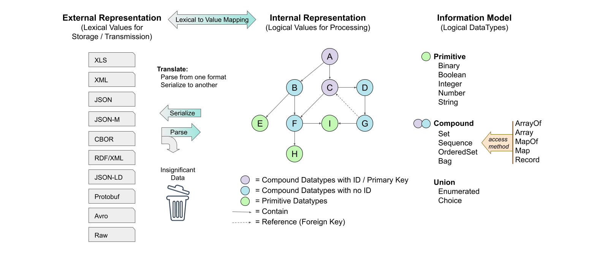

The internal representation, illustrated in Figure 2-1 as a graph,
is guided by rules associated with applying the IM:

 - the internal representation conforms to the IM
 - each node in the internal representation has an abstract core
   type from the IM
 - each core type has associated serialization rules for each
   external representation format

As an example, consider an information element defined as a
boolean type, which is the simplest core type. The essential
nature of a boolean is that it is limited to only two values,
usually identified as "true" and "false". However, the *data*
representing a Boolean value is determined by serialization
rules, and could be any of "false" and "true", 0 and 1, "n" and
"y", etc. In a programming language, many variable types and
values may evaluate as "true":

 - Non-zero integers
 - Non-empty strings
 - Non-empty arrays

An abstract representation of an IM does not capture data types
and values for a Boolean node, e.g. integer 0 or 37 or string
"yes". It has only the characteristics of the node type: false or
true. A JSON representation can use a Boolean type with values
'false' and 'true', but for efficient serialization might also
use the JSON number type with values 0 and 1.

## 2.3 Serialization

Information exists in the minds of users (producers and consumers), in the state
of applications running on systems, and in the data exchanged among
applications. Serialization converts application information into byte sequences
(a.k.a. protocol data units, messages, payloads, information exchange packages)
that can be validated, communicated, and stored. De-serialization parses payloads
back into application state. This can also be stated as serialization is the
transformation from value space to lexical space, and de-serialization is the
inverse transformation. Serialization is not a goal in and of itself, it is the
mechanism by which applications exchange information in order to make it
available to users. The user cares about
the information the serialized data represents, not the format by
which it is moved from system to system. An Automated Teller
Machine customer cares about their bank balance, and an airline
customer cares that their tickets are for the proper flights. How
the information system handles the bits to make that happen is of
no concern to the customer.

###### Figure 2-2 -- Serialization / Deserialization
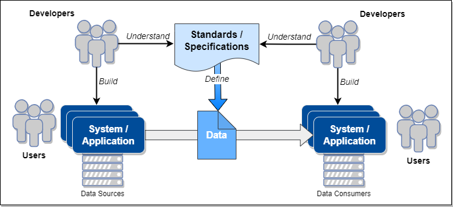

Serialization and deserialization are intimately connected to the
chosen format: the same data can be serialized in JSON, CBOR, and
XML, and while the serialized data will look very different,
the received information that is recovered by deserialization
should match the transmitted information. 

JADN defines three kinds of information that have alternate representations:
1. Primitive types such as dates and IP addresses: text representation or numeric value (formats)
2. Enumerations: string value or numeric id (Enumerated vocabularies and field identifiers)
3. Table rows: column name or position (Records)

These alternatives can be grouped into distinct serialization styles
([Table&nbsp;2-2](#table-2-2----serialization-styles)).

###### Table 2-2 -- Serialization Styles

|         Style             |           **Verbose**          |              **Compact**             |            **Concise**            |
|--------------------------:|:------------------------------:|:------------------------------------:|:---------------------------------:|
| _Serialization<br>Method_ | _repeated<br>name-value pairs_ | _element / property<br>names-values_ | _machine-to-machine<br>optimized_ |
|                Primitives |       Text Representation      |          Text Representation         |     Integer / Binary / Base64     |
|              Enumerations |             String             |                String                |              Integer              |
|                Table Rows |           Column Name          |            Column Position           |          Column Position          |

A data format is a serialization style applied to a data language: "Compact JSON",
"Concise JSON", "Compact XML", "Verbose CBOR", etc. 

The [[JADN Specification](#jadn-v20)] defines 12 core types, which
are described in [Section&nbsp;3.1.2](#312-core-type-examples) of this
CN. The JADN Specification, Section&nbsp;6, also defines serialization rules for
JSON (with three levels of verbosity) and CBOR
[[RFC 7409](#rfc7049)]:

 - Verbose JSON
 - Compact JSON
 - Concise JSON
 - CBOR

The name "Verbose" here is intended to be descriptive rather than pejorative. An
information model allows designers to compare Verbose and Compact styles for
usability, and allows data to be validated and successfully round tripped
between a readable JSON style and an actually concise CBOR style.

Supporting a new data format ("external representation") requires defining
serialization rules to translate each core type to that data format. The JADN
Specification describes what is needed to connect JADN and IMs defined in JADN
to other serialization formats:

 - Specify an unambiguous serialized representation for each JADN type
 - Specify how each option applicable to a type affects serialized values
 - Specify any validation requirements defined for that format.

Regardless of format, serialization should be:
1) **Lossless**, so that information is not modified in transit
   and all applications have the identical information
2) **Transparent**, so that information is unaffected by whether
or how it has been serialized; users should not know or care.

Shannon's information theory defines the relationship between
information and serialization (coding). Mathematicians
characterize conditions applied to a mechanism as *necessary*
and/or *sufficient*: a serialization that omits necessary data
loses information, one that uses more data than sufficient
conveys no extra information, and potentially wastes storage or
communications bandwidth. However, particular requirements (e.g.,
human readability) may indicate that a serialization that uses
more data than sufficient is appropriate for particular
situations.

## 2.4 Information Modeling Tools

The value of an IM language multiplies when automated tooling is
available to support creation, maintenance, and use of models
created in that language. The need for tools is discussed in
[[RFC 8477](#rfc8477)], citing particularly the need for code
generation and debugging tools. A tool set to support an IM
language should provide:

 - Model creation capabilities
 - Model validation capabilities
 - Translation among alternative representations of the IM (e.g.,
   textual, graphical)
 - Generation of language-specific schemas from an IM
 - Model translation to language- or protocol-specific
   serialization / deserialization capabilities

-------

# 3 Creating Information Models with JADN

This section provides a description of the JADN language and its use in
information modeling. JADN is a formal description technique that combines type
constraints from the Unified Modeling Language (UML) with data
abstraction based on information theory and structural
organization using results from graph theory.
The JADN information modeling language was developed
against specific objectives:

 1) Core types represent application-relevant "information", not "data"
 2) Single specification unambiguously defines multiple data formats
 3) Specification uses named type definitions equivalent to property tables
 4) Specification is data that can be serialized
 5) Specification has a fixed structure designed for extensibility

A JADN information model is a set of type definitions. Each field in a compound
type may be associated with another model-defined type, and the set of
associations between types forms a directed graph.  Each association is either a
container or a reference, and the direction of each edge is toward the contained
or referenced type.

The container edges of an information model must be acyclic in order to ensure that:
1) every model has one or more roots,
2) every path from a root to any leaf has finite length, and equivalently
3) every instance has finite nesting depth.

There is no restriction on reference edges, so any container cycles in a model can be
broken by converting one or more containers to references.

From UML JADN takes the concept of modeling information/data
using Simple Classifiers (see [[UML](#uml)], 10.2 Datatypes) as
opposed to the common practice of using Structured Classifiers
(UML, 11.4 Classes), which do not define data in a unique
way that can be validated and signed.  The JADN use of the UML
primitive types defined in UML, Table 21.1, can be found
in [Appendix D.1](#d1-jadn-vs-uml-primitive-data-types).

## 3.1 JADN Overview

> NOTE: The [[JADN Specification](#jadn-v20)] is the authoritative normative
> definition of the JADN language. Any discrepancies between that specification
> and this committee note should be resolved based on the specification.

Figure 3-1 provides a high-level view of the components of JADN type definitions that
will be described in this section. JADN provides *primitive*, 
*compound* (both structured and unstructured), and *union* core data types that can be refined using type and field
options (field options only apply to compound and union types).

###### Figure 3-1 -- JADN Type Definition Components
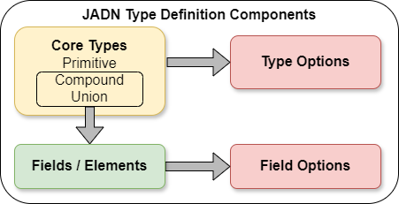

A JADN schema in its native form is a collection of one or more JSON documents,
each containing a single JSON object consisting of an optional map labeled
"meta" and an array labeled "types". Each document is called a "package".

* The "meta" map contains metadata about the schema contained in the document,
including the types exported from this schema and namespace information to
connect it with other JADN schema documents. The "meta" map is optional but if
included it must define a namespace for the model.

* The "types" section of the schema document is an array of arrays, with each of
the inner arrays defining one type in the schema. Each type in the schema
document will use one of JADN's core types and may be either simple or compound.
Each type array has five fields, two of which are themselves arrays: one for
type options and one for the fields or elements that make up a compound type.

* The fields / elements array is always empty in the definition of a primitive type.
For structured compound types and union types, each field or element within the fields / elements array is
also an array, with three items in an element array and five items in a field
array. 

These structures are illustrated and explained in more detail 
in [Section&nbsp;3.1.3.1, Native JSON Representation](#3131-native-json-representation-normative).
JADN can be represented in multiple formats, both textual and
graphical, and automated tooling can transform a JADN model
between the different representations without loss of
information. The Native JADN representation as JSON data is
authoritative, but each representation has advantages. The other representations are described in 
[Section&nbsp;3.1.3.2, Alternative JSON Representation](#3132-alternative-jadn-representations). 
The examples that follow in subsequent sections are typically illustrated using
both normative JADN (i.e., JSON data) for precision and the JADN Interface
Definition Language (JIDL) format for its easy readability.

The [[JADN Specification](#jadn-v20)], Section&nbsp;4, defines twelve core types
([Table&nbsp;3-1](#table-3-1----jadn-core-types)).

###### Table 3-1 -- JADN Core Types

| **Primitive** | **Compound** | **Union** |
|:-------------:|:------------:|:-------------------------:|
|    Boolean    |     Array    |         Enumerated        |
|    Integer    |    ArrayOf   |           Choice          |
|     Number    |      Map     |                           |
|     String    |     MapOf    |                           |
|     Binary    |    Record    |                           |

### 3.1.1 Type Definitions

Figure 3-2 illustrates the components of a JADN Type Definition, and identifies
values for each of the five elements in the definition. As noted above, a Type
Definition is an array; the elements must appear in the order listed here. The
five elements are:

 1. A **TypeName**, which is simply a string used to refer to
that type.
 2. The **CoreType** for the definition, which must be one the twelve core
    types shown in Figure 3-2.
 3. Zero or more of the available JADN **TypeOptions** that
    refine the core types to fit particular needs.
 4. An optional **TypeDescription** string that provides
    additional information about the type.
 5. For structured compound types and union types, a set
    of **Item** or **Field** definitions for the items or fields that
    comprise the compound type.

###### Figure 3-2 -- JADN V2 Type Definition Structure
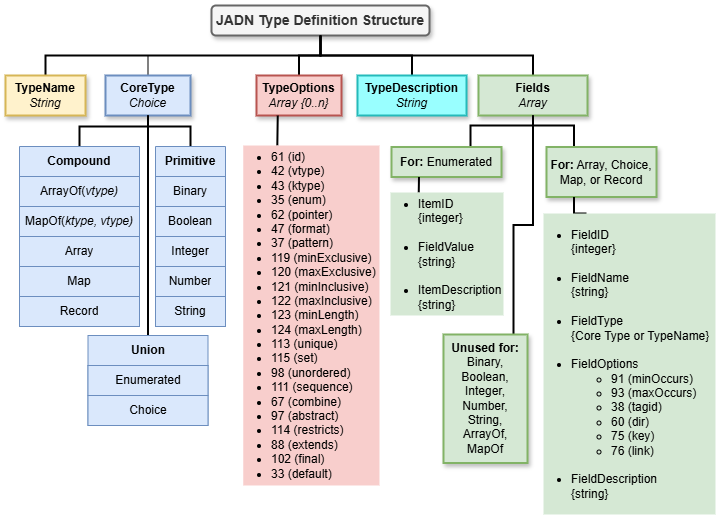

#### 3.1.1.1 TypeNames and CoreTypes

The first two elements of a type definition are the **TypeName** and **CoreType**. 
A firm requirement of JADN is that a TypeName in a schema must not be a JADN
predefined (i.e., core) type. There are also name formatting conventions intended to improve
the consistency and readability of JADN schemas. These
conventions are defined in the JADN Specification but can be overridden within a
JADN schema package if desired (see "Name Formats" in Section&nbsp;3.1.2 of the
[[JADN Specification](#jadn-v20)]):

 - **TypeNames** are written in PascalCase or Train-Case (using
   hyphens) with an initial upper case letter, and are limited to
   64 upper case, lower case or numeric characters, or the
   "system" character (used for tool-generated type definitions).

 - **FieldNames** are written in camelCase or snake_case (using
   underscores) with an initial lower case letter, and are
   limited to 64 upper case, lower case or numeric characters.

 - **Name space identifiers** (nsids) are limited to 8 upper
   case, lower case or numeric characters and must begin with a
   letter.

 - The **"system character"** (which defaults to `.`) is used by
   JADN processing tools when generating derived types while
   processing a JADN model; it is not normally used by JADN
   schema authors.

The CoreType must be one of the twelve JADN core types previously identified.

#### 3.1.1.2 TypeOptions

The third element of a JADN type definition is an array of zero or more of the
**TypeOptions** as described in Section&nbsp;4.1.4 of the [[JADN
Specification](#jadn-v20)]. JADN includes options for both _types_ (discussed in
this section) and _fields_ (discussed in
[Section&nbsp;3.1.1.4](#3114-field-options)). As explained in the JADN
Specification, options are presented in the normative JSON format as text
strings containing the option ID character concatenated with the option value:

As an example the TypeOption "minLength = 1" is represented as:

```
+----+-----------+     Option ID = 0x7b (Left Curley Bracket) = "minLength"
| ID | Value     |     Value = 1
+----+-----------+     TypeOption string = "{1"
```

TypeOptions are classifiers that, along with the CoreType,
determine whether data values are instances of the defined type.
For example, the *pattern* TypeOption is used with the String
CoreType to define valid instances of that string type using a
regular expression conforming to [[ECMAScript](#ecmascript)]
grammar.

Table 3-1 lists the complete set of type options, including the option name,
type, ID character, and description. Note that the ID characters are the normative form and are used in
standard JADN representation ([Section&nbsp;3.1.3.1](#3131-native-json-representation-normative)) 
when specifying type options. The text labels for the options (e.g., vtype,
ktype, pattern) are non-normative and intended to be human friendly. Many of the
Type and Field options labels have JSON Schema and XML Schema equivalents. An
option whose type is Boolean is True if the option ID appears in a type
definition. Options whose type is String, Integer, or Number indicate the type
of information expected as the option's value.

###### Table 3-2 -- JADN Type Options

|  **Option**  | **Type** | **ID** | **Description**                                                  |
|:------------:|:--------:|:------:|-------------------------------------------------------------------|
|      id      |  Boolean |   `=`  | Items and Fields are denoted by FieldID rather than FieldName     |
|     vtype    |  String  |   `*`  | Value type for ArrayOf and MapOf                                  |
|     ktype    |  String  |   `+`  | Key type for MapOf                                                |
|     enum     |  String  |   `#`  | Shortcut: Enumerated type derived from a specified type           |
|    pointer   |  String  |   `>`  | Shortcut: Enumerated type pointers derived from a specified type  |
|    format    |  String  |   `/`  | Semantic validation keyword identifying data value boundaries     |
|    pattern   |  String  |   `%`  | Regular expression used to validate a String type                 |
| minExclusive |  Number  |   `w`  | Minimum numeric/string value, excluding bound                     |
| maxExclusive |  Number  |   `x`  | Maximum numeric/string value, excluding bound                     |
| minInclusive |  Number  |   `y`  | Minimum numeric/string value, including bound                     |
| maxInclusive |  Number  |   `z`  | Maximum numeric/string value, including bound                     |
|   minLength  |  Integer |   `{`  | Minimum byte or text string length, collection item count         |
|   maxLength  |  Integer |   `}`  | Maximum byte or text string length, collection item count         |
|    unique    |  Boolean |   `q`  | ArrayOf instance must not contain duplicate values                |
|    ordered   |  Boolean |   `q`  | MapOf, Map, Record instance is an ordered set                     |
|      set     |  Boolean |   `s`  | ArrayOf instance is unordered and unique                          |
|   unordered  |  Boolean |   `b`  | ArrayOf instance is unordered and not unique (bag)                |
|   sequence   |  Boolean |   `o`  | Map, MapOr or Record instance is ordered and unique (ordered set) |
|    combine   |  Boolean |   `C`  | Choice instance is a logical combination (anyOf, allOf, oneOf)    |
|    extends   |  Boolean |   `e`  | Inheritance: extension - superset of referenced type              |
|   restricts  |  Boolean |   `r`  | Inheritance: restriction - subset of referenced type              |
|   abstract   |  Boolean |   `a`  | Inheritance: abstract, non-instantiatable                         |
|     final    |  Boolean |   `f`  | Inheritance: final - cannot have subtype                          |
|    default   |  String  |   `u`  | Default value                                                     |
|     const    |  String  |   `v`  | Constant value                                                    |

Detailed explanations of each type option can be found with the descriptions of
the types to which they apply throughout section 4 of the [[JADN
Specification](#jadn-v20)]. In general, any type option can only be applied once
in a type definition, using the format of concatenating the Option ID with the
Option Value described above. The semantic validation `format` option is an
exception to this, as explained in Section&nbsp;4.2.5 of the specification: "format
options have no value; the keyword is part of the key so a type may include
multiple format options". An example is provided in the specification of applying
both the `/date-time` format and the `/d3` format to an `Integer` type to
specify a time resolution in milliseconds:

```
Timestamp = Integer /date-time          // 1727877600 sec:     2024-10-02T15:00:00Z
Timestamp-ms = Integer /date-time /d3   // 1727877600000 msec: 2024-10-02T15:00:00.000Z
```

Format options have two important characteristics:

- Each format option is applicable only to one or more specific JADN primitive types
- The implications of format options vary with the serialization format being used

As noted in section&nbsp;6 of the JADN Specification, the definition of a new
serialization format must "specify how each option applicable to a type affects
serialized values". The various serialization formats defines in that section of
the specification include tables documenting how format options apply to that
format.

Table 3-2 summarizes the applicability of type options to JADN core types. The
`ArrayOf` and `MapOf` types have required options, as indicated. Other type
options can be applied to individual types where the option is relevant, as
indicated by table cells with an "X".

###### Table 3-3 -- Type Option Applicability

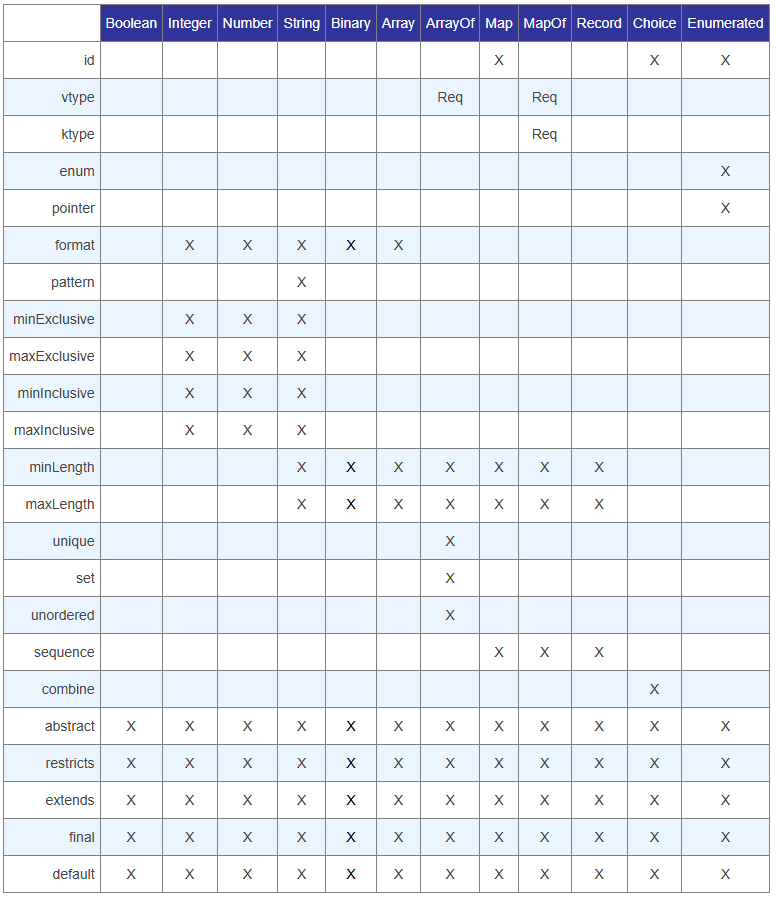

The `min / max` type options fall into two groups:

- `minLength / maxLength` apply to the *size* of a Binary or String type; an
  instance of either of those types must be of at least the specified
  `minLength` and not longer than the specified `maxLength`, but these options
  place no constraints on the value contained in that instance.

- `min / max / Inclusive / Exclusive` apply to the *value* that an instance that
  a numeric or String type can contain. These type options imply that there is
  an ordering of possible values for the type they are applied to, but place no
  constraints on the size of an instance of the type, only its possible values.

#### 3.1.1.3 Item Or Field Definitions

The use of the **Fields** element to convey Item or Field
Definitions is dependent on the **CoreType** selected, as
illustrated in [Figure 3-2](#figure-3-2----jadn-v2-type-definition-structure). The rules
pertaining to the **Fields** array are as follows:

* If the **CoreType** is a Primitive type, ArrayOf, or MapOf, no
  fields are permitted (i.e., the **Fields** array must be empty).

* If the **CoreType** is Enumerated, the fields for each item
  definition in the **Fields** array are described with three
  elements:

    1. **ItemID:** the integer identifier of the item
    2. **ItemValue:** the string value of the item
    3. **ItemDescription:** a non-normative comment

* If the **CoreType** is Array, Choice, Map, or Record, the
  fields for each item definition in the **Fields** array are
  described with five elements:
    1. **FieldID:** the integer identifier of the field
    2. **FieldName:** the name or label of the field
    3. **FieldType:** the type of the field, a predefined type or
       a TypeName with optional Namespace ID prefix
       **NSID:TypeName**
    4. **FieldOptions:** an array of zero or more **FieldOption**
       or **TypeOption** applicable to the field
    5. **FieldDescription:** a non-normative comment

Note that the JADN Specification constrains the ItemID and FieldID values to be Integers.

The selection of Map or Record for a type definition carries 
serialization implications, which are discussed in 
[Section&nbsp;3.1.4.2](#3142-selection-and-use-of-jadn-compound-types).

#### 3.1.1.4 Field Options

Compound types containing Items or Fields support field options
in addition to the type options described in [Section&nbsp;3.1.1.2](#3112-typeoptions). 
JADN defines six field options. As with
the type options described in Section&nbsp;3.1.1.2,
the ID characters are normative and used in standard JADN representation
([Section&nbsp;3.1.3.1](#3131-native-json-representation-normative)) when
specifying field options. Table 3-4 lists the JADN **FieldOptions**.

###### Table 3-4 -- JADN Field Options

| **Option** |  **Type**  | **ID** | **Description**                                               | **JADN Spec Section** |
|:----------:|:----------:|:------:|---------------------------------------------------------------|:---------------------:|
|  minOccurs |   Integer  |   `[`  | Minimum cardinality, default = 1, 0 = optional                |     4.2.2.2           |
|  maxOccurs |   Integer  |   `]`  | Maximum cardinality, default = 1, 0 = default max, >1 = array |     4.2.2.2           |
|    tagid   | Enumerated |   `&`  | Field containing an explicit tag for this Choice type         |     4.2.3.4           |
|     key    |   Boolean  |   `K`  | Field is a primary key for this type                          |     4.2.2.3           |
|    link    |   Boolean  |   `L`  | Field is a foreign key reference to a type instance           |     4.2.2.3           |

The type options described in [Section&nbsp;3.1.1.2](#3112-typeoptions) can also apply
to fields, with the constraint that the type option must be applicable to the
field's type, as described in the core type examples in [Section&nbsp;3.1.2](#312-core-type-examples). 
The application of a type option to a field
triggers an "anonymous" type definition when the JADN model is processed, as
described in [Section&nbsp;3.1.4.1](#3141-anonymous-type-definitions).

### 3.1.2 Core Type Examples 

This section provides illustrative examples of the JADN core types. For each
type, the relevant [[JADN Specification](#jadn-v20)] section is identified, the
definition from the JADN Specification is quoted, the relevant type options are
listed, and an example is provided using the JADN and JIDL formats. The
inheritance type options described in [Section&nbsp;3.1.4.5](#3145-inheritance)
are applicable to all JADN types and so are not included in the type option
lists in this section.

#### 3.1.2.1 Boolean

<table class="table">
  <thead>
    <tr>
      <th class="th">Definition (JADN Spec 4.2.1.1)</th>
      <th class="th">TypeOptions</th>
    </tr>
  </thead>
  <tbody>
    <tr>
      <td class="td">
        A Boolean instance is one of the predefined values *true* and *false*.
      </td>
      <td class="td">
        <i>
          <center>const, default</center>
        </i>
      </td>
    </tr>
  </tbody>
</table>

The **Boolean** core type is used for representing bi-valued
(i.e., true/false, yes/no, on/off) information. An information
item fitting a Boolean type would be defined as follows:

```json
["AccessGranted", "Boolean", [], "Result of access control decision", []]
```

The corresponding JIDL representation would be:

```
// Example JIDL definition of a boolean datatype
  AccessGranted = Boolean   // Result of access control decision
```

#### 3.1.2.2 Integer

<table class="table">
  <thead>
    <tr>
      <th class="th">Definition (JADN Spec 4.2.1.2)</th>
      <th class="th">TypeOptions</th>
    </tr>
  </thead>
  <tbody>
    <tr>
      <td class="td">
        An Integer instance is a value in the ordered infinite set of integers (…, -2, -1, 0, 1, 2, …).
      </td>
      <td class="td">
        <i>
          <center>const, default, format,<br>minInclusive, maxInclusive,<br>minExclusive, maxExclusive</center>
        </i>
      </td>
    </tr>
  </tbody>
</table>

The **Integer** core type is used for representing numerical
information with discrete integer values.  An information item
fitting an Integer type would be defined as follows:

```json
["TrackNumber", "Integer", [], "Track number for current song", []]
```

The corresponding JIDL representation would be:

```
// Example JIDL definition of an Integer datatype
  TrackNumber = Integer   // Track number for current song
```

The *minInclusive/maxInclusive* and *minExclusive/maxExclusive* TypeOptions are used to specify minimum and/or maximum
values that may be assigned to an Integer type.

Table 3-5 lists the *format* options applicable to the Integer type:

###### Table 3-5 -- Integer Type Format Options

| Keyword  | Type    | Requirement                                                                               |
|----------|---------|-------------------------------------------------------------------------------------------|
| i\<*n*\> | Integer | Signed _n_-byte integer; the value of _n_ must be a power of 2.                           |
| u\<*n*\> | Integer | Unsigned integer or bit field of \<*n*\> bits, value must be between 0 and 2^\<*n*\> - 1. |
| d\<*n*\> | Integer | _n_-bit fixed precision integer.                                                          |

These format options provide flexibility in defining Integer types in an IM:

* The "i\<*n*\>" format option provides flexible scaling of the size of an Integer
type and its associated value range
* The "u\<*n*\>" format option provides for specifying unsigned (i.e., positive-only)
  Integers or creating bit fields
* The "d\<*n*\>" format option allows using performing fixed point math against
Integer types without rounding errors or loss of precision.

The "d\<*n*\>" option supports arbitrary fixed point representation of
values. For example, the Integer option `/d3` specifies an integer that is scaled
by 10^3, providing three decimal digits after a "decimal point".  So an integer
Time with no option would be seconds before or after the POSIX epoch, and with
`/d3` it would be milliseconds, or `/d6` would be microseconds. If an integer
temperature is documented to be degrees Celsius, its type could use the option
`/d1` or `/d2` to give precision of tenths or hundredths of a degree.

#### 3.1.2.3 Number

<table class="table">
  <thead>
    <tr>
      <th class="th">Definition (JADN Spec 4.2.1.3)</th>
      <th class="th">TypeOptions</th>
    </tr>
  </thead>
  <tbody>
    <tr>
      <td class="td">
        A Number instance is a value in the ordered infinite set of real numbers.
      </td>
      <td class="td">
        <i>
          <center>const, default, format,<br>minInclusive, maxInclusive,<br>minExclusive, maxExclusive</center>
        </i>
      </td>
    </tr>
  </tbody>
</table>

The **Number** core type is used for representing numerical
information with continuous values.  An information item fitting
a Number type would be defined as follows:

```json
["Temperature", "Number", [], "Current temperature observation in degrees C", []]
```

The corresponding JIDL representation would be:

```
// Example JIDL definition of an Number datatype
  Temperature = Number   // Current temperature observation in degrees C
```

> **TO-DO:** should the "only relevant" language be expanded to cite serializing with binary formats?

The *minInclusive/maxInclusive* and *minExclusive/maxExclusive* TypeOptions are used to specify a minimum and/or maximum
value that may be assigned to a Number type. Table 3-6 lists the *format*
options applicable to the Number type. These *format* options are only relevant
when serializing using CBOR; see the [[JADN Specification](#jadn-v20)], Section&nbsp;6.4:

###### Table 3-6 -- Number Type Format Options

| Keyword  |  Type  | Requirement                                                        |
|:--------:|:------:|--------------------------------------------------------------------|
| **f16**  | Number | **float16**: Serialize as IEEE 754 Half-Precision Float (#7.25)    |
| **f32**  | Number | **float32**: Serialize as IEEE 754 Single-Precision Float (#7.26)  |
| **f64**  | Number | **float64**: Serialize as IEEE 754 Double-Precision Float (#7.27)  |
| **f128** | Number | **float64**: Serialize as IEEE 754 Quadruple-Precision Float (n/a) |

The parenthetical (#7.2x) references in the above table identify the CBOR major
type (7) and associated additional information (25/26/27) as defined in the
Concise Data Definition Language (CDDL) Standard Prelude specified in Apppendix&nbsp;D 
of [[RFC 8610](#rfc8610)].


#### 3.1.2.4 String

<table class="table">
  <thead>
    <tr>
      <th class="th">Definition (JADN Spec 4.2.1.4)</th>
      <th class="th">TypeOptions</th>
    </tr>
  </thead>
  <tbody>
    <tr>
      <td class="td">
        A String instance is a sequence of characters in a character set.
      </td>
      <td class="td">
        <i>
          <center>const, default, pattern, format,<br>minLength, maxLength,<br>minInclusive, maxInclusive,<br>minExclusive, maxExclusive</center>
        </i>
      </td>
    </tr>
  </tbody>
</table>

The **String** core type is used for representing
information best presented as text.  An information item fitting
a String type would be defined as follows:

```json
["TrackTitle", "String", [], "Title of the song in the selected track", []]
```

The corresponding JIDL representation would be:

```
// Example JIDL definition of a String datatype
  TrackTitle = String   // Title of the song in the selected track
```

Strings have a large variety of applicable type options that have the potential
for overlapping meanings. As stated in the [[JADN Specification](#jadn-v20)]:
"The pattern, length, and range options are not normally used together, but if
more than one kind is present in a type definition an instance must satisfy all
conditions." In particular:

 - The `minLength / maxLength` options define the acceptable character count for
   an instance of a String type.
 - The `minInclusive / maxInclusive / minExclusive / maxExclusive` options
   define ranges of acceptable content for an instance of a String type if the
   character set defines a collation order.

Any of those options could potentially overlap with a pattern specification.

The `pattern` option in JADN is used to provide a regular expression to be
applied to a string type instance. When
representing the `pattern` option in JIDL, it should be directly
connected to the `String` type name. The JIDL pattern
specification is surrounded with braces "{ }", containing
`pattern="REGEX"` where `REGEX` is the regular expression that
governs the format of the string. Here are the JADN and JIDL
presentations of a String with an associated pattern:

```
["Barcode", "String", ["%^\d{12}$"], "A UPC-A barcode is 12 digits", []]

Barcode = String{pattern="^\d{12}$"}    // A UPC-A barcode is 12 digits
```

The preferred pattern grammar for JADN is defined in the 15th edition of the
[[ECMAScript](#ecmascript)] specification (June 2024).

Semantic validation keywords for Strings are defined in Sections 4.2.5.2 and
54.2.5.3 the JADN Specification. These keywords support constraining a String
type to represent a variety of commonly used formats, such as dates and times,
emails, hostnames, etc.

#### 3.1.2.5 Binary

<table class="table">
  <thead>
    <tr>
      <th class="th">Definition (JADN Spec 4.2.1.5)</th>
      <th class="th">TypeOptions</th>
    </tr>
  </thead>
  <tbody>
    <tr>
      <td class="td">
        A Binary instance is sequence of octets.
      </td>
      <td class="td">
        <i>
          <center>const, default, format,<br>minLength, maxlength</center>
        </i>
      </td>
    </tr>
  </tbody>
</table>

The **Binary** core type is used for representing
arbitrary binary data.  An information item fitting a Binary type
would be defined as follows:

```json
["FileData", "Binary", [], "Binary contents of file", []]
```

The corresponding JIDL representation would be:

```
// Example JIDL definition of a binary datatype
  FileData = Binary   // Binary contents of file
```

Binary values are not ordered so the range Type Options are not applicable. 
The *minLength* and *maxLength* TypeOptions are used to specify a minimum and/or maximum
number of octets for a binary type. If *minLength* equals *maxLength* the size of the
binary type is fixed. Table 3-7 lists the *format* options applicable to the
Binary type:

###### Table 3-7 -- Binary Type Format Options

| Keyword      | Type   | Requirement |
| ------------ | ------ | ------------|
| eui          | Binary | IEEE Extended Unique Identifier (MAC Address), EUI-48 or EUI-64 as specified in [[EUI](#eui)] |
| ipv4-addr    | Binary | IPv4 address as specified in [[RFC 791](#rfc0791)] Section&nbsp;3.1 |
| ipv6-addr    | Binary | IPv6 address as specified in [[RFC 8200](#rfc8200)]  Section&nbsp;3 |

#### 3.1.2.6 Enumerated

<table class="table">
  <thead>
    <tr>
      <th class="th">Definition (JADN Spec 4.2.3.1)</th>
      <th class="th">TypeOptions</th>
    </tr>
  </thead>
  <tbody>
    <tr>
      <td class="td">
        A vocabulary of items where each item has an id and a string value.
      </td>
      <td class="td">
        <i>
          <center>id, enum, pointer</center>
        </i>
      </td>
    </tr>
  </tbody>
</table>

The Enumerated core type is used to represent
information that has a finite set of applicable values. An
information item fitting the Enumerated type would be defined as
follows:

```json
["L4-Protocol", "Enumerated", [], "Value of the protocol (IPv4) or next header (IPv6) field in an IP packet. Any IANA value, [RFC 5237]", [
    [1, "icmp", "Internet Control Message Protocol - [RFC 0792]"],
    [6, "tcp", "Transmission Control Protocol - [RFC 0793]"],
    [17, "udp", "User Datagram Protocol - [RFC 0768]"],
    [132, "sctp", "Stream Control Transmission Protocol - [RFC 4960]"]
]]
```

The corresponding JIDL representation would be:

```
// Example JIDL definition of an Enumerated datatype
L4-Protocol = Enumerated  // Value of the protocol (IPv4) or next header (IPv6)
                          // field in an IP packet. Any IANA value per RFC 5237
   1 icmp                 // Internet Control Message Protocol - [RFC 0792]
   6 tcp                  // Transmission Control Protocol - [RFC 0793]
  17 udp                  // User Datagram Protocol - [RFC 0768]
 132 sctp                 // Stream Control Transmission Protocol - [RFC 4960]
```

> EDITOR'S NOTE:  need examples of applying the TypeOptions

#### 3.1.2.7 Choice (Tagged / Untagged)

<table class="table">
  <thead>
    <tr>
      <th class="th">Definition (JADN Spec 4.2.3.2 / 4.2.3.3)</th>
      <th class="th">TypeOptions</th>
    </tr>
  </thead>
  <tbody>
    <tr>
      <td class="td">
        Without a <em>combine</em> TypeOption: a tagged union, a structure that defines a set of tag:type pairs.<br>
        With a <em>combine</em> TypeOption: an untagged union, a structure that defines a set of types used collectively to classify a value.
      </td>
      <td class="td">
        <i>
          <center>id, combine</center>
        </i>
      </td>
    </tr>
  </tbody>
</table>

The **Choice** core type, without any `combine` option is used to represent information
limited to selecting one type from a defined set of named or
labeled types. An information item fitting such a Choice type would
be defined as follows:

```json
["IdentityType", "Choice", [], "Nature of the referenced identity", [
  [1, "person", "Person", [], "Identity refers to a person"],
  [2, "organization", "Organization", [], "Identity refers to an organization"],
  [3, "tool", "Tool", [], "Identity refers to an automated tool"]
]]
```

The corresponding JIDL representation would be:

```
// Example JIDL definition of a Choice datatype
IdentityType = Choice                // Nature of the referenced identity
   1 person           Person         // Identity refers to a person
   2 organization     Organization   // Identity refers to an organization
   3 tool             Tool           // Identity refers to an automated tool
```

The `combine` option provides additional flexibility in applying the **Choice**
type by specifying a required combination of the field types in the Choice. Any
one of three values can be applied to a Choice using the `combine` option:

- `A`: value must be an instance of `allOf` the types
- `O`: value must be an instance of `anyOf` the types, tried in field order until a match is found
- `X`: value must be an instance of `oneOf` the types and no others

When either the `allOf` or `oneOf` values is used, the order of the fields in
the Choice is irrelevant as the value of an instance must be compared to all of
the possible types to determine its validity. In contrast, order is significant
for the `anyOf` option value because the instance values are checked against the
Choice fields in the order they are defined. 

> EDITOR'S NOTE:  need examples of applying the TypeOptions include the v2.0 enhancements.


#### 3.1.2.8 Array

<table class="table">
  <thead>
    <tr>
      <th class="th">Definition (JADN Spec 4.2.2)</th>
      <th class="th">TypeOptions</th>
    </tr>
  </thead>
  <tbody>
    <tr>
      <td class="td">An ordered list of labeled fields with
        positionally-defined semantics. Each field has a position, label,
        and type.
      </td>
      <td class="td">
        <i>
          <center>format, minLength, maxLength</center>
        </i>
      </td>
    </tr>
  </tbody>
</table>

The **Array** type is used to represent information
where it is appropriate to group related information elements
together, even if the elements of the array are heterogeneous.
Each element in the array is defined as a field, using the field
definitions described in [Section&nbsp;3.1.3](#3113-item-or-field-definitions) and refined using the
field options described in [Section&nbsp;3.1.4](#3114-field-options).
An information item fitting the Array core type would be defined
as follows:

```
["License-Data", "Array", [], "Driver's license data based on Real ID requirements", [
    [1, "last_name", "String", [], "family name of license holder"],
    [2, "given_names", "String", [], "given (first and zero or more middle) names of license holder"],
    [3, "issuing_state", "String", ["%[A-Z]{2}"], "State of issuance (pattern matching pairs of capital letters)"],
    [4, "license_number", "String", [], "License identification number per format used by issuing state"],
    [5, "vision_correction", "Boolean", [], "Is license holder required to use vision correction?"],
    [6, "dob", "Integer", ["/date"], "License holder's date of birth"],
    [7, "exp_date", "Integer", ["/date"], "License expiration date"],
    [8, "photo", "Binary", [], "Photo of license holder (JPEG format)"]
  ]]
```

and the corresponding JIDL representation:

```
License-Data = Array  // Driver's license data based on Real ID requirements
   1  String                      // last_name:: family name of license holder
   2  String                      // given_names:: given (first and zero or more middle) names of license holder
   3  String{pattern="[A-Z]{2}"}  // issuing_state:: State of issuance (pattern matching pairs of capital letters)
   4  String                      // license_number:: License identification number per format used by issuing state
   5  Boolean                     // vision_correction:: Is license holder required to use vision correction?
   6  Integer /date               // dob:: License holder's date of birth (/date)
   7  Integer /date               // exp_date:: License expiration date (/date)
   8  Binary                      // photo:: Photo of license holder (JPEG format)
```

Note that in the JIDL representationn the Array field names are moved into the
description field, as described in
[Section&nbsp;3.1.3.2](#3132-jadn-interface-definition-language-jidl).

JADN provides several semantic validation keywords for the Array type which invoke
pre-defined Array structures that fit specific information modeling needs. The
following example shows the `/ipv4-net` keyword, which defines an array that
conveys the address in CIDR form with a 32-bit binary field and an integer
prefix.

```json
  ["IPv4-Net", "Array", ["/ipv4-net"], "IPv4 address and prefix length", [
    [1, "ipv4_addr", "Binary", ["/ipv4-addr], "32-bit IPv4 address as defined in [RFC 791]"],
    [2, "prefix_length", "Integer", ["[0"], "CIDR prefix-length. If omitted, refers to a single host address."]
  ]]
```

The corresponding JIDL representation would be:

```
// Example JIDL definition of an Array datatype with heterogenous elements
// the IPv4-Net type is an array used to represent a CIDR block

IPv4-Net = Array /ipv4-net   // IPv4 address and prefix length
   1  Binary /ipv4-addr      // ipv4_addr:: 32-bit IPv4 address as defined in RFC 791
   2  Integer optional       // prefix_length:: CIDR prefix-length. If omitted, refers to a single host address.
```

Table 3-8 lists the *format* options applicable to the Array type:

###### Table 3-8 -- Array Type Format Options

| Keyword      | Type   | Requirement |
| ------------ | ------ | ------------|
| ipv4-net     | Array  | Binary IPv4 address and Integer prefix length as specified in [[RFC 4632](#rfc4632)] Section&nbsp;3.1 |
| ipv6-net     | Array  | Binary IPv6 address and Integer prefix length as specified in [[RFC 4291](#rfc4291)] Section 2.3 |
| tag-uuid     | Array  | Tag portion is a String, UUID portion is a 128-bit (16 byte) binary value |

The `ipv4-net` and `ipv6-net` format options impose constraints appropriate for
their respective address type:

* Specifies the Binary element of the Array to be 32 or 128 bits, respectively
* Constrains the Integer prefix value to a range of 0..32 or 0..128, respectively
* Specifies that text representations of the type will use CIDR notation

The `tag-uuid` format option imposes similar constraints:

* Specifies a two-field Array with one String and one Binary value
* The String value contains the tag, which is descriptive text and may contain hyphens
* The Binary value contains the 128-bit UUID value
* The JSON serialization will be `"tagString--<UUID as text>"`; e.g., `"my-tag-type--ccf8a573-bbf3-48b8-b0ba-b14ddd1fc27d"`

The `tag-uuid` format for identifiers is used in the [[STIX](#stix-v21)] and
[[CACAO](#cacao-security-playbooks-v20)] specifications (see sections 2.9 and
10.10, respectively, of those specifications).

#### 3.1.2.9 ArrayOf(vtype)

<table class="table">
  <thead>
    <tr>
      <th class="th">Definition (JADN Spec 4.2.2)</th>
      <th class="th">TypeOptions</th>
    </tr>
  </thead>
  <tbody>
    <tr>
      <td class="td">A collection of fields with the same semantics.
        Each field has type <i>vtype</i>. Ordering and uniqueness are
        specified by a collection option.
      </td>
      <td class="td">
        <i>
          <center>vtype, minLength, maxLength,<br>unique, set, unordered</center>
        </i>
      </td>
    </tr>
  </tbody>
</table>

The **ArrayOf** type is used to represent information
where it is appropriate to group a set of uniform information
elements together. The fields of the array are defined by the
*vtype*, which can be primitive or compound. An information item
fitting the ArrayOf core type would be defined as follows. This
example uses an explicit ArrayOf type derived using the 
multiplicity extension on the "tracks" field of Album, as shown in
[Section&nbsp;3.3.1](#331-digital-music-library)):

```json
[
  ["Tracks", "ArrayOf", ["*Track", "{1"], "Tracks is an array of one or more Track values", []],
  
  ["Track", "Record", [], "for each track there's a file with the audio and a metadata record", [
    [1, "location", "String", [], "path to the file audio location in local storage"],
    [2, "metadata", "TrackInfo", [], "description of the track"]
  ]]
]
```

And the corresponding JIDL would be:

```
Tracks = ArrayOf(Track){1..*}                     // Tracks is an array of one or more Track values

Track = Record                                    // for each track there's a file with the audio and a metadata record
   1 location         String                      // path to the file audio location in local storage
   2 metadata         TrackInfo                   // description of the track
```

> EDITOR'S NOTE:  need examples of applying the TypeOptions


#### 3.1.2.10 Map

<table class="table">
  <thead>
    <tr>
      <th class="th">Definition (JADN Spec 4.2.2)</th>
      <th class="th">TypeOptions</th>
    </tr>
  </thead>
  <tbody>
    <tr>
      <td class="td">An unordered map from a set of specified keys to
        values with semantics bound to each key. Each key has an id and
        name or label, and is mapped to a value type.
      </td>
      <td class="td">
        <i>
          <center>id, ordered, sequence,<br>minLength, maxLength</center>
        </i>
      </td>
    </tr>
  </tbody>
</table>

The **Map** type is used to represent information that
can be represented as (key, value) pairs. Another term for this
type of information structure is an "associative array": 

> An *Associative Array* is "an abstract data type
> that stores a collection of (key, value) pairs, such that each
> possible key appears at most once in the collection."
> Alternative names include "map", "symbol table", and
> "dictionary". (https://en.wikipedia.org/wiki/Associative_array)

The Map core type always uses an integer identifier as the key,
with each integer associated with a specific value. An
information item fitting the Map type would be defined as
follows:

```json
  ["Hashes", "Map", ["{1"], "Cryptographic hash values", [
    [1, "md5", "Binary", ["/x", "{16", "}16", "[0"], "MD5 hash as defined in [RFC 1321]"],
    [2, "sha1", "Binary", ["/x", "{20", "}20", "[0"], "SHA1 hash as defined in [RFC 6234]"],
    [3, "sha256", "Binary", ["/x", "{32", "}32", "[0"], "SHA256 hash as defined in [RFC 6234]"]
  ]]
```

The corresponding JIDL representation would be:

```
// Example JIDL definition of an Map datatype
Hashes = Map{1..*}    // Cryptographic hash values
   1 md5        Binary{16..16} /x optional   // MD5 hash as defined in RFC 1321
   2 sha1       Binary{20..20} /x optional   // SHA1 hash as defined in RFC 6234
   3 sha256     Binary{32..32} /x optional   // SHAs26 hash as defined in RFC 6234
```

In the example above, note the combination of the `{minLength..maxLength}`
type options in the record's definition and the presence of the
`optional` keyword on all fields of the record. This reflects a
design pattern: the compound type's cardinality of `{1..*}`
defines that there is a minimum number of required fields even
though every individual field is optional. An empty `Hashes` map is
invalid, but a map where any one or more of the three hash types
exists is valid. This is an example of one application of _minLength_,
_maxLength_, as described above in [Section&nbsp;3.1.4.4](#3144-application-of-minlength--maxlength).

#### 3.1.2.11 MapOf(ktype,vtype)

<table class="table">
  <thead>
    <tr>
      <th class="th">Definition (JADN Spec 4.2.2)</th>
      <th class="th">TypeOptions</th>
    </tr>
  </thead>
  <tbody>
    <tr>
      <td class="td">An unordered map from a set of keys of the same
        type to values with the same semantics. Each key has key type
        <i>ktype</i>, and is mapped to value type <i>vtype</i>.
      </td>
      <td class="td">
        <i>
          <center>ktype, vtype, minLength, maxLength, ordered, sequence</center>
        </i>
      </td>
    </tr>
  </tbody>
</table>

The **MapOf** type is used to represent information
that can be represented as (key, value) pairs, where the types
for the keys and the values in the MapOf are of specific types
and are defined using type options. MapOf is suitable when the
collection of items can't be represented as an enumeration, such
as the association of employee identification numbers, which have
an arbitrary and non-contiguous distribution, to employees.  An
information item fitting the MapOf type would be defined as
follows:


```json
[
  ["Employees","MapOf", ["+EID","*Employee"], "Maps employee identifier numbers to employee information", []],

  ["EID", "Integer", ["{0","}1000"], "will need new system when exceed 1,000 employees", []],

  ["Employee", "Record","", "Employee Information",[
    [1, "name", "String", "", "Usually First M. Last"],
    [2, "start_date", "Date", "", "always record start date"],
    [3, "end_date", "Date", ["[0"], "if end_date is present = former employee"]
  ]],

  ["Date", "String", ["/date"], "", []] 
]
```

The corresponding JIDL representation would be:

```
// Example JIDL definition of a MapOf datatype
// Maps employee identifier numbers to employee information
Employees = MapOf(EID, Employee)

// Employee identifier numbers
EID = Integer{0..1000}        // will need new system when exceed 1,000 employees

// Employee information
Employee = Record
  1 name        String         // usually "First M. Last"
  2 start_date  Date           // always record start date
  3 end_date    Date optional  // if end_date is present = former employee

Date = String /date
```

#### 3.1.2.12 Record

<table class="table">
  <thead>
    <tr>
      <th class="th">Definition (JADN Spec 4.2.2)</th>
      <th class="th">TypeOptions</th>
    </tr>
  </thead>
  <tbody>
    <tr>
      <td class="td">An ordered map from a list of keys with
        positions to values with positionally-defined semantics. Each key
        has a position and name, and is mapped to a value type.
        Represents a row in a spreadsheet or database table.
      </td>
      <td class="td">
        <i>
          <center>minLength, maxLength, ordered, sequence</center>
        </i>
      </td>
    </tr>
  </tbody>
</table>

The **Record** type is used to represent information that has a consistent
repeated structure, such as a database record. Elements of a record can be
accessed by either position or value. The following example defines a JADN
Record type for the common 5-tuple often used to describe a network connection.

```json
  ["IPv4-Connection", "Record", ["{1"], "5-tuple that specifies a tcp/ip connection", [
    [1, "src_addr", "IPv4-Net", ["[0"], "IPv4 source address range"],
    [2, "src_port", "Port", ["[0"], "Source service per RFC 6335"],
    [3, "dst_addr", "IPv4-Net", ["[0"], "IPv4 destination address range"],
    [4, "dst_port", "Port", ["[0"], "Destination service per RFC 6335"],
    [5, "protocol", "L4-Protocol", ["[0"], "Layer 4 protocol (e.g., TCP)"]
  ]]
  ```

The corresponding JIDL representation would be:

```
// Example JIDL definition of a record datatype
// the IPv4-Connection type is a record

IPv4-Connection = Record{1..*}                    // 5-tuple that specifies a tcp/ip connection
   1 src_addr         IPv4-Net optional           // IPv4 source address range
   2 src_port         Port optional               // Source service per RFC 6335
   3 dst_addr         IPv4-Net optional           // IPv4 destination address range
   4 dst_port         Port optional               // Destination service per RFC 6335
   5 protocol         L4-Protocol optional        // Layer 4 protocol (e.g., TCP)
```

As with the `Map` example in [Section&nbsp;3.1.2.10](#31210-map), the
cardinality of `{1..*}` for the `Record` defines that there is a
minimum number of required fields even though every individual
field is optional. An empty IPv4-Connection record is invalid,
but an IPv4-Connection record where any one or more of the five
fields exists is valid.


### 3.1.3 JADN Representations

The native format of JADN is JSON, but JADN content can be
represented in other ways that are often easier to edit or more
useful for documentation. This section describes the JSON content
used for each of the JADN basic types, and then illustrates the
other representations using a simple example.

The [[JADN Specification](#jadn-v20)] identifies three presentation formats
in addition to the native JSON format:

 - JADN Interface Definition Language (JIDL, Section 7.1)
 - Property Tables (Section 7.2)
 - Entity Relationship Diagrams (ERDs, Section 7.3)

Figure 3-3 identifies the various representations. Each of the four
representations is described below. 

###### Figure 3-3 -- JADN Representations
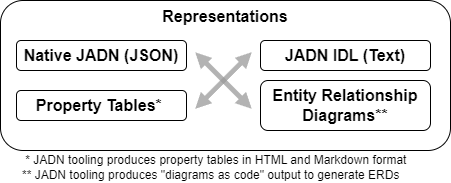


#### 3.1.3.1 Native JSON Representation (Normative)

This section illustrates the JSON representations of the Base
Types described in [Section&nbsp;3.1](#31-jadn-overview). Depictions
are provided for the overall structure of a JADN schema and for 
each of three ways that the **Fields** array is
used, depending on the core type used in a particular type
definition.

Figure 3-4 illustrates the top-level structure of a native JADN schema document,
as described in [Section&nbsp;3.1](#31-jadn-overview).

###### Figure 3-4 -- JADN Schema Top-Level Structure
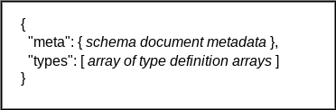

Figure 3-5 illustrates the JADN structure for defining any
Primitive **CoreType**, or ArrayOf or MapOf type; for all of these
the **Fields** array is empty:

###### Figure 3-5 -- JADN for Primitive, ArrayOf, MapOf Types
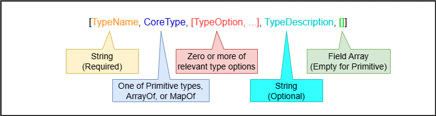

Figure 3-6 illustrates the JADN structure for defining an
Enumerated **CoreType**; for enumerations each item definition in the
**Fields** array has three elements:

###### Figure 3-6 -- JADN Fields for Enumerated Types
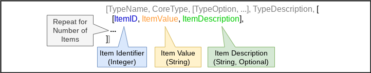


Figure 3-7 illustrates the JADN structure for defining a
**CoreType** of Array, Choice, Map, or Record; for these types each
field definition in the **Fields** array has five elements:

###### Figure 3-7 -- JADN Fields for Structured Compound Types
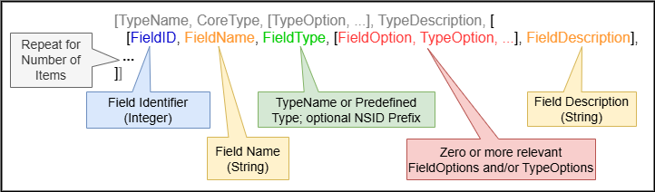

For each of the type definition formats illustrated in Figures 3-5, 3-6, and
3-7, only the initial elements are required to create a valid type or field
definition, and unused elements default to an empty value of the relevant type. For
a JADN schema in normative JSON format this means the optional fields at the end
of a type or field definition can either be represented by empty elements
(arrays or strings, as appropriate) or simply omitted. As an illustration, all
of the following are legimate representations of a primitive type definition
where none of the optional fields are used:

```json
["Counter", "Integer",[],"",[]]  <-- empty arrays and string for unused optional elements
["Counter", "Integer",[],""]     <-- field array omitted
["Counter", "Integer",[]]        <-- description string and field array omitted
["Counter", "Integer"]           <-- all optional fields omitted
```

The same principle applies to item and field definitions for union and compound types. 

#### 3.1.3.2 JADN Interface Definition Language (JIDL)

JIDL is a compact representation of JADN that is both easily readable, even for
those with a minimal familiarity with JADN, and easy to edit. JIDL combines each
type and its options into a single string formatted for readability, and
lossless conversion between the normative JSON format and JIDL is
straightforward. The basic structure of a simple type in JIDL is:

```
TypeName = <Primitive Core Type or IM-defined type> <type options> // <description>
```

Types with fields or items show those indented underneath the TypeName being
defined, for example:

```
ARecordType = Record <type options> // an illustrative record type
  1 fieldName FieldType <field options>  // field description
  ...
```  

The field or items definitions in the JIDL convey all of the same information as
the normative JSON illustrated in Figures 3-5 and 3-6. The Information Modeling
Examples in [Section 3.3](#33-information-modeling-examples) include numerous
examples of JIDL representation of a variety of JADN types.

When defining elements of type Array or Enum.ID in JIDL, no field
names are used. These types are defined using a field ID and a
TypeName. For documentation and debugging purposes a FieldName
can be included in the JIDL comment field, immediately following
the `//` and followed by a double colon delimiter (i.e., `::`).
For more information see the [[JADN Specification](#jadn-v20)]
discussion of fields in Compound types (Section&nbsp;4.2.2) and JADN-IDL
format (section 7.1). Here is a brief JIDL example of this format:

```
Publication-Data = Array         // who and when of publication
    1 String          // label:: name of record label 
    2 String /date    // rel_date:: and when did they let this drop
```

#### 3.1.3.3 Property Tables

Property tables commonly used in specifications to describe the format of, e.g.,
database records or protocol data units provide a structured representation that
is easy to read but less efficient for editing. The JADN Specification describes
the characteristics of property tables but does not define a normative format
for them. 

A typical property table for a JADN type with fields will have columns for:

- Identifier (ID), a number
- Name
- Type (with field options)
- Cardinality constraints
- Description

where the Type column will also convey field options other than cardinality
constraints. The multiple representations example in
[Section&nbsp;3.3.3](#333-multiple-representations-example) and the tables for
the music library example in [Appendix&nbsp;E.1.3](#e13-music-library-tables)
illustrate the use of property table presentation of JADN type definitions.

#### 3.1.3.4 Entity Relationship Diagrams (ERDs)

Entity relationship diagrams (ERDs) are used to visually display the structure
of an IM and can convey varying levels of detail. A normative JADN schema can be
translated into a diagram-as-code representation such as [[GraphViz](#graphviz)]
or [[PlantUML](#plantuml)] to generate ERDs, at any of three levels of detail:

- Conceptual: A top-level overview of the IM showing the organization of types
- Logical: A more detailed illustration of the IM including attributes of its types
- Informational: A complete illustration with all of the details of the constituent types

The music library example in [Section&nbsp;3.3.1](#331-digital-music-library)
and the multiple representation examples in
[Section&nbsp;3.3.3](#333-multiple-representations-example) both provide
examples of ERDs generated from JADN models at various levels of detail.

#### 3.1.3.5 Translation Among JADN Representations

Automated tooling makes it straightforward to translate among all
four of these formats in a lossless manner, and each format has
its advantages:

 - JADN in native JSON format can be readily processed by common
   JSON tooling.
 - JADN in table style presentation is often used in
specifications (e.g., as property tables such as are commonly
found in specifications).
 - JADN presented in entity relationship diagrams aids with
visualization of an information model.
 - JADN in JIDL format, a simple text structure, is easy to edit,
making it a good format for both the initial creation and the
documentation of a JADN model. JIDL is also more compact than
table style presentation.

The table style and ERD representations can be readily generated
in an automated manner by translating the JADN schema to source
code for rendering in various formats. For example, tables can be
created using Markdown or HTML code, and ERDs can be created from
code for rendering engines such as [[Graphviz](#graphviz)] or
[[PlantUML](#plantuml)].

### 3.1.4 Type Definition Nuances

> EDITOR'S NOTE: section heading subject to change

This section describes JADN shortcuts and other usage details that add flexibility or simplify the
development of IMs. The [[JADN Specification](#jadn-v20)] conformance statement
(section 8) separates the definition of JADN into "Core JADN"
(sections 3.1, 3.2, 4, and 6) and "JADN Shortcuts" (section&nbsp;3.3).
Section&nbsp;3.3 explains that shortcuts "make type definitions
more compact or support the Don't Repeat Yourself (DRY) software
design principle. Shortcuts are syntactic sugar that can be
replaced by core definitions without changing their meaning."
While the implementation of shortcuts by JADN tools is optional,
in a conformance sense, the availability of shortcuts reduces
the level of effort required by a JADN schema author and can make
a schema more compact and understandable.

The JADN Specification also defines a "system character" (by
default the period, `.`) and in the Name Formats (section&nbsp;3.1.2)
reserves the use of that character to automated tooling,
saying "Schema authors should not create TypeNames containing the
System character, but schema processing tools may do so".

Examples of the use of shortcuts and the role of the system
character are provided in sections 3.3.1, 3.3.2, and 3.3.2 of the
JADN Specification.

#### 3.1.4.1 "Anonymous" Type Definitions

As noted in [Section&nbsp;3.1.1.4](#3114-field-options), 
JADN Type Options can be applied to
fields in compound types, but as explained in Section&nbsp;3.3.1 of
the JADN Specification, this is an shortcut that leads to the
anonymous definition of a new type when processed by automated
tooling. The example provided there is:

```
Member = Record
  1 name         String
  2 email        String /email   // email is a type option for String types
```

Expanding replaces this with:

```
Member = Record
  1 name         String
  2 email        Member.email   // email is a type option for String types
    
Member.email = String /email    // email type option triggers tool-generated type definition.
```
The type definition for `Member.email` was generated by the
tooling, as both noted in the comment and indicated by the
presence of the `.` character in the type name. The same result
could be achieved in Core JADN by defining a separate `Email`
type:

```
Member = Record
  1 name         String
  2 email        Email
    
Email = String /email
```

The author(s) of an IM can determine whether the use of anonymous
type definitions generated by JADN tooling improves the clarity
of an model. For the example above, defining an email type that
can be referenced throughout the model would likely be better
than multiple, equivalent anonymous email types. In other cases
the readability of the model can benefit from concisely written
JADN (or JIDL) that relies on the tooling to generate the
necessary types.

#### 3.1.4.2 Selection and Use of JADN Compound Types

As described in Section 4.2.2 of the JADN Specification, each of the compound types defines a *collection* of related items
such as the latitude and longitude of a geographic coordinate, or the set of
properties of an object. In addition to its individual items, every collection
has *multiplicity* attributes, including limits on the number of items,
whether the items have a sequential ordering, and whether duplicate items
are allowed.

The JADN compound types and their options are chosen for an IM based on the
information characteristics to be modeled:

* Array and ArrayOf contain a group of values.
* Map, MapOf and Record contain a group of keys and corresponding values (a mapping)
* All items in ArrayOf and MapOf groups have the same value (and key) type
* Each item in Array, Map, and Record groups has an individual value (and key) type

and the decision tree for which compound type to use is shown in Figure 3-8:

###### Figure 3-8 -- Compound Type Decision Tree

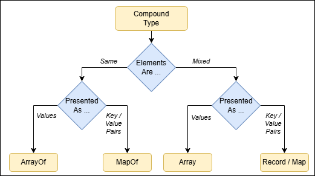

For the last information type - collections of individually-defined key:value pairs -
JADN provides two types: Map and Record. The difference is that Record keys have a
sequential ordering while Map keys do not. Map instances are always serialized as
key:value pairs, while Record instances may be serialized as either key:value pairs
or table rows with values in column position, depending on data format.

For example if Location is a Record type:
```
Location = Record
  1 name       String
  2 state      String
  3 latitude   Number
  4 longitude  Number
```
its instances are serialized using *verbose* JSON data format as:
```json
[
  {
    "name": "St. Louis",
    "state": "Missouri",
    "latitude": "38.627003",
    "longitude": "-90.199402"
  },
  {
    "name": "Seattle",
    "state": "Washington",
    "latitude": "47.60621",
    "longitude": "-122.33207"
  }
]
```
The same Record values are serialized using *compact* JSON data format (where the column
positions are 1: name, 2: state, 3: latitude, 4: longitude) as:
```json
[
  ["St. Louis", "Missouri", "38.627003", "-90.199402"],
  ["Seattle", "Washington", "47.60621", "-122.33207"]
]
```
If Location is a Map type, its instances are always serialized as
key:value pairs regardless of data format, the same as a Record
in verbose JSON.

#### 3.1.4.3  JADN Handling of UML Multiplicity Options

Another significant UML concept is that JADN distinguishes among
all four multiplicity types ([[UML](#uml)], Table 7.1), while
logical models typically support only sets. Table 3-9 replicates
the information from UML Table 7.1 and adds the equivalent JADN
types. Note that the UML Specification cites the "traditional
names" in its "Collection Type" column.

###### Table 3-9 -- Multiplicity Types

| **isOrdered** | **isUnique** | **Collection<br>Type** |    **JADN Type**   |
|:-------------:|:------------:|:----------------------:|:------------------:|
|    _false_    |    _true_    |           Set          | ArrayOf+set, MapOf |
|     _true_    |    _true_    |       OrderedSet       |   ArrayOf+unique   |
|    _false_    |    _false_   |           Bag          |  ArrayOf+unordered |
|     _true_    |    _false_   |        Sequence        |       ArrayOf      |


JADN accepts the UML philosophy that schemas are classifiers that
take a unit of data and determine whether it is an instance of a
datatype, and recognizes the idea of generalization ([[UML](#uml)],
9.9.7) through use of the Choice type.

Beyond these UML concepts, JADN recognizes that information
models are directed graphs with a small predefined set of core
datatypes and only two kinds of relationship: "collection" and
"reference" (Section 4.2.2.3 of the JADN Specification).

#### 3.1.4.4 Application of minLength / maxLength

The `minLength` and `maxLength` type options are distinctive in that they
can apply to both primitive and compound types, with a different
meaning in these two applications:

 - When applied to a primitive type (Binary, Integer or String),
   the `minLength` and `maxLength` type options constrain the *values* an
   instance of that type may hold. Specifically, when applied to:
   - An Integer type, the `minLength` and `maxLength` type options constrain
     the numeric values an instance of that type may hold.
   - A String type, the `minLength` and `maxLength` type options constrain the
     number of characters in the string.
   - A Binary type, the `minLength` and `maxLength` type options constrain the
     number of octets (bytes) in the binary value.
   
For example, the following specifies an Integer type that can be
assigned values between `1` and `1000`, using both JADN (see
[Section&nbsp;3.1.3.1](#3131-native-json-representation-normative)) and JIDL
notation (see 
[Section&nbsp;3.1.3.2](#3132-alternative-jadn-representations)):

```
["count","integer",["{1", "}1000"], "count of objects",[]]

// define a restricted count value
  count = integer {1..1000}  // count of objects
```

 - When applied to a compound type (Array, ArrayOf, Map, MapOf,
   Record), the `minLength` and `maxLength` type options constrain the
   *number of elements* an instance of that type may have. For
   example, the following specifies a Record type that must have
   at least two fields populated, even though only one field is
   required (fields `field_2` and `field_3` are indicated as
   optional by the `["[0"]` *field* option 
   [see [Section&nbsp;3.1.1.4](#3114-field-options)]):

```
["RecordType", "Record", ["{2"], "requires field_1 and either or both field_2 and field_3", [
  [1, "field_1", "String", [], ""],
  [2, "field_2", "String", ["[0"], ""],
  [3, "field_3", "String", ["[0"], ""],
]]


RecordType = Record {2..*} // requires field_1 and either or both field_2 and field_3
  1 field_1   String
  2 field_2   String optional
  3 field_3   String optional  
```

#### 3.1.4.5 Inheritance

> NOTE 1: Inheritance capabilities are a new feature in JADN v2.0.

> NOTE 2: The JADN v2 inheritance-oriented `extends` type option is unrelated to
> deprecated `extend` type option in JADN v1.

JADN supports inheritance in information modeling, providing for class /
subclass relationships. There are four type options to manage the class
relationships among types, which are defined in Section 4.2.4 of [[JADN Specification](#jadn-v20)].

- `abstract`: The `abstract` option indicates that a type definition is only a
  basis for defining sub-classes and should never be instantiated in data. 

- `extends`: The `extends` option indicates that the associated type definition
  is adding to the super-type on which it is based. An extending sub-type can
  add new fields to its supertype. An extending sub-type can modify the cardinality 
  of a field in the super-type but cannot redefine other aspects of existing, inherited
  fields.

- `restricts`: The `restricts` option indicates that the associated type
  definition is subtracting from the super-type on which it is based. A
  restricting sub-type can remove optional fields defined in its supertype,
  however required fields cannot be removed.

- `final`: The `final` type option identifies a type that cannot have sub-types
  defined based on it.

Type inheritance is static and can be applied both to primitive and compound
types. However, as explained in the JADN Specification, there are other
mechanisms applicable to primitive and some compound types to achieve equivalent
results. The primary applications on inheritance identified in the specification are: 

- adding, removing, or modifying the cardinality of fields in structured compound types
- adding items to Enumerated types

An example of applying the inheritance type options to an IM loosely based on
geography markup language concepts can be found in [Section&nbsp;3.3.5](#335-inheritance-example).

### 3.1.5 Reference Relationships: Keys and Links

As explained in [Section&nbsp;3](#3-creating-information-models-with-jadn), JADN recognizes
only two kinds of relationship: "collections" and "references". The
relationships shown in previous examples are all of the "collection"
variety. The "reference" relationship type applies when using a "collection" relationship would either 

  1) create a cycle or loop in the graph of the information model, or 
  2) create data duplication.

An example of cycle creation might occur, for
example, in an IM for an SBOM format: because software components
often incorporate other components a recursive situation arises
when referring to the incorporated components:

```
Component - Record
  ...
  8  Components  ArrayOf(Component) {0..*}
  ...
```

When recursion is used in programming it is terminated by a base
condition, but as a declarative specification an IM has no corresponding concept to terminate
recursion. JADN uses "reference" relationships in situations
where cycles occur in order to address this need. The method to
define reference relationships is explained in Section&nbsp;3.3.6,
*Links*, of the [[JADN Specification](#jadn-v20)]. 

Figure 3-9 illustrates permissible and impermissible "collection"
relationships, and the use of the `key` and `link` keywords
combined with an identifier field to establish permissible
"reference" relationships. The green lines show permissible
relationships, the red lines impermissible ones that create
cycles in the graph. The dotted green line in the lower left
portion is a "reference" relationship enabled by the inclusion of
a unique identifier in `Record H`, created by the use of the
`key` field option to designate a primary key for objects
described by `Record H`, and the corresponding use of the `link`
field option in `Record G` when referring to such objects; the
`link` field option both designates the field as a reference and
generates the correct key type when extensions are removed by
JADN tooling.

###### Figure 3-9 -- Collection and Reference Relationships

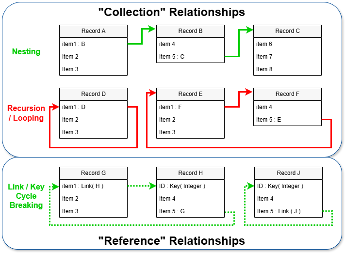

`Record J` in the lower right portion of the figure shows a self-referential
`key / link` application. This is a generalization of the example from
Section&nbsp;3.3.6 of the JADN Specification, which allows for numerous
relationships between objects of type `Person`:

```
Person = Record
    1 id        Key(Integer)
    2 name      String
    3 mother    Link(Person)
    4 father    Link(Person)
    5 siblings  Link(Person) [0..*]
    6 friends   Link(Person) [0..*]
```

The "references" relationship is also useful to reduce duplication when an
information item may apprear multiple times in a data structure. This use of the
`key` / `link` structure is demonstrated in [Section&nbsp;3.3.3](#333-multiple-representations-example).
In that example university classes are linked to students by a reference
relationship to account for the likelihood that any individual student will most
likely be registered for multiple classes. By *referencing* students records, only one
record per student need appear in the data set regardless of how many classes
they are registered for.

While is it common to use a primitive type such as `Integer` for a key, JADN
permits the use of a compound type to support composite keys.

### 3.1.6 Schemas, Packages and Namespaces

Section 6 of the [[JADN Specification](#jadn-v20)] introduces the
use of packages as the mechanism for organizing JADN schemas.
This section provides additional information on the use of
packages, along with the associated concept of namespaces.

#### 3.1.6.1 Packages

At the simplest level, a package is a file containing a JADN
schema in the form of JSON data, as described in 
[Section&nbsp;3.1.3.1](#3131-native-json-representation-normative).
A JADN package document may contain a complete JADN schema 
or a portion of a schema. 
The file has two top-level components: 

 - optional metadata about the file, labeled as `meta`, and 
 - the schema content itself, labeled as `types`.

Definitions of all of the `Metadata` fields are provided in
the JADN specification. 

The metadata portion is entirely optional, but if present must
include the `package` field providing a URI for the package to
enable the package to be referenced from other packages. A single
schema may be divided into multiple packages (e.g., common types
that are used extensively in a model might be collected into a
library package), and a schema might also import one or more
packages from a different schema (e.g., to use information
objects defined in the official schema for a standard).

The `roots` portion of the package information is
informational; JADN packages aren't intended to enforce a
rigorous distinction between public and private types
distinction. The `roots` list provides a means for schema
authors to indicate the intended public types, and a basis for
JADN schema tools to detect discrepancies.

#### 3.1.6.2 Namespaces

> NOTE: this discussion of namespace management includes features to be added in
> JADN v2.0. The implementation of these features is backward-compatible with
> the handling of namespaces in JADN v1.0.

Namespaces identified in a schema package's metadata are the mechanism for managing the
relationships among multiple schema packages. JADN namespace management provides
for:

* Breaking a schema into multiple packages that can be combined without defining
  a namespace

* Including types defined in other schema packages under a specified namespace, including
  importing multiple packages under a single namespace

The JIDL representation of JADN namespace definition is:

```
Metadata = Map                     // Information about this package
     ...
   8 namespaces   Namespaces optional // Referenced packages
     ...

Namespaces = Choice(anyOf)            // anyOf v2.0 or v1.0, in priority order
   1  NsArr                           // ns_arr:: [prefix, namespace] syntax - v2.0
   2  NsObj                           // ns_obj:: {prefix: namespace} syntax - v1.0

NsArr = ArrayOf(PrefixNs){1..*}       // Type references to other packages - v2.0

PrefixNs = Array                      // Prefix corresponding to a namespace IRI
   1  NSID                            // prefix::
   2  Namespace                       // namespace::

NsObj = MapOf(NSID, Namespace){1..*}  // Type references to other packages - v1.0

Namespace = String /uri               // Unique name of a package
```

The `Namespaces = Choice(AnyOf)` type allows the flexible association of
Namespace Identifiers (`NSID`) with the `Namespace` other packages declare for
themselves. A Namespace Identifier (NSID) is, by default, a 1-8 character string
beginning with a letter and containing only letters and numbers (the default
formatting can be overridden by inserting an alternative definition into a JADN
schema's `Metadata` map's `config` section). The JADN v2.0 `NsAr / PrefixNS` structure enables multiple schema
packages to be mapped to one NSID to group all of the types defined in that
collection of packages into a single namespace. For any array element where the
`NSID` field is blank, the types in the referenced package are made available in
the current package without need for any NSID.

Within the schema package's `Types` definitions
JADN uses the common convention of using the NSID followed by a
colon to link an item to the namespace where it is defined (e.g.,
`NSID:TypeName`).  So assuming the existence of `Package A`, and
`Package B`, where `Package B` imports `Package A` with the NSID
`packa`, then types defined in `Package A` can be used within
`Package B` by identifying them as `packa:Some-Package-A-Type`.

An example of grouping multiple packages into the namespace of the importing
package can be drawn from an IM of the NIST Open Security Controls Assessment
Language [[OSCAL](#oscal)], where the packages for the common `metadata` and
`backmatter` structures, along with the various OSCAL document types, are
imported without any NSID to create a single schema.

```
 namespaces: [["", "https://example.gov/ns/oscal/0.0.1/metadata/"],
               ["", "https://example.gov/ns/oscal/0.0.1/backmatter/"],
               ["", "https://example.gov/ns/oscal/0.0.1/catalog/"],
               ["", "https://example.gov/ns/oscal/0.0.1/profile/"],
               ["", "https://example.gov/ns/oscal/0.0.1/component/"],
               ["", "https://example.gov/ns/oscal/0.0.1/ssp/"],
               ["", "https://example.gov/ns/oscal/0.0.1/assessment_plan/"],
               ["", "https://example.gov/ns/oscal/0.0.1/assessment_results/"],
               ["", "https://example.gov/ns/oscal/0.0.1/component/poam/"]]
```

> EDITOR'S NOTE: is it worthwhile to present both the v1.0 and v1.1 approaches
> to the following example?

As a concrete example of applying distinct namespaces for multiple packages,
here is the `meta` portion of a JADN
Schema for an OpenC2 consumer that implements two actuator
profiles: stateless packet filtering (SLPF) and posture attribute
collection, along with the OpenC2 Language Specification:

```
"meta": {
	  "package": "http://acme.com/schemas/device-base/pacf/v3",
	  "title": "OpenC2 base device schema for the PACE collection service and packet filter",
	  "roots": ["OpenC2-Command", "OpenC2-Response"],
	  "namespaces": {
	   "ls": "http://docs.oasis-open.org/openc2/ns/types/v2.0",
	   "slpf": "http://docs.oasis-open.org/openc2/ns/ap-slpf/v2.0",
	   "pac": "http://docs.oasis-open.org/openc2/ns/ap-pac/v2.0"
	  }
}
```
Within this schema `ls:`, `slpf:`, and `pac:` will be used when
referencing types from the three external schemas .

## 3.2 Information Modeling Process

The JADN language is generally applicable to information
modeling, and independent of the process used for developing a
model. Future versions of this Committee Note will provide
process notes based on experience developing and documenting
information models using JADN. Brief summations are provided here
of the approaches described in available literature; the reader
is encouraged to reviewed the referenced papers for a more
thorough discussion of each process described.


### 3.2.1 Y. Tina Lee Modeling Process

In her paper *Information Modeling: From Design to
Implementation* [[YTLee](#ytlee)], the author discusses the
importance of information models and describes a process. While
the paper focuses on information modeling for manufacturing, the
process described is generally applicable. The process described
in this paper has the following steps:

 1) Define the scope of the model, identifying the domain of
    discourse and the processes to be supported by the IM.

 2) Conduct a requirements analysis to define information
    requirements.
 3) Develop the model, transforming information requirements into
    a conceptual model. This may employ a top-down, bottom-up, or
    mixed / inside-out approach.
 4) Group concepts to identify units of functionality
 5) Structure information requirements into entities, objects, or
    classes
 6) Capture the model in the chosen modeling language

### 3.2.2 Frederiks / van der Weide Modeling Process

In their paper *Information modeling: The process and the
required competencies of its participants*
[[Frederiks](#fredericks)], the authors discuss the process of
information modeling, its quality and the required competencies
of its participants. 

In the Frederiks approach, the process has two roles (which may
be filled by groups):
 - A **Domain Expert**: someone with superior detailed knowledge
of the Universe of Discourse (UoD) but often minor powers of
abstraction from that same UoD
 - A **System Analyst**: someone with superior powers of
   abstraction, but limited knowledge of the UoD.

and the process has four phases:
 1. *Elicitation*: used to drive creation of a requirements document, an informal specification in natural language.

 2. *Modeling*: the creation of a conceptual model based on the requirements document.
 3. *Verification*: confirmation that the formal specification correctly applies the formal syntax rules of the chosen modeling technique.
 4. *Validation*: confirmation with the domain expert that the formal model properly represents the requirements document.

The process is executed in an iterative sequence of modeling, verification and validation. At least one iteration of the modeling loop is required.


## 3.3 Information Modeling Examples

As discussed in [Section 1.1.5](#115-information-modeling-languages), JADN is a
general purpose tool for information modeling, and can be applied
to a broad range of IM needs.  Some possible subjects for IMs
are:
 - Complex organizations, such as a business (people,
   departments, roles, locations, organizational structure) or
   university (people, departments, classes, buildings, rooms,
   schedules)
 - Shopping Website (customers, accounts, catalogs, carts,
   payment processing, shipping)
 - Vehicle Rental Management (customers, accounts, vehicles,
   rentals, check-out, check-in, billing)
 - Boutique Manufacturer (catalog, customization options, supply
   chain, orders, builds, shipping)
 - Website Message Board (users, accounts, forums, threads,
   messages)
 - Information structures such as a software bill of materials
   (SBOM)
 - Standard Development Organization (SDO) management system (member
   organizations, member persons, voting rights, topic-focused groups and
   rosters, discussion forums and messages, calendars, meeting attendance, draft
   and approved documents, ballots)
 - Music Database (artists, albums, songs, tracks, metadata,
   guest artists)

This CN provides several examples to illustrate approaches to information
modeling and the application of JADN. The example IMs are:

 - A digital music library: an example of top-down analysis to develop an IM
 - An IP version 4 packet header: an example of developing an IM from a
   well-defined data structure
 - A university with classes and people (teachers and students): an example to
   illustrate the relationship among the available JADN representations
   described in [Section 3.1.3](#313-jadn-representations)
 - A calendar event model: an example of developing a JADN model from an existing
   JSON schema
 - An example applying the new JADN v2.0 inheritance features, loosely inspired
by the [[CityGML](#citygml)] and [[CityJSON](#cityjson)] geographic modeling
languages

These examples use a mixture of the various JADN representation formats
described in [Section&nbsp;3.1.3](#313-jadn-representations), and the university
example in [Section&nbsp;3.3.3](#333-multiple-representations-example)
specifically incorporates all of the representations describing a
single information model.

### 3.3.1 Digital Music Library

This example shows a simple IM for a digital music library and
can be considered a "Hello World" example of applying the
concepts described in this committee note. The components of the library are presented
here in JIDL form along with brief descriptions. The final ERD for the
library appears at the end of this section. The complete,
consolidated JADN, JIDL, and property tables can be found in
[Appendix&nbsp;E.1](#e1-music-library).

The model assumes that each track is stored as a file with its audio in one of
several recognized formats. The library organizes tracks into albums, which are
associated with a barcode identifier. The model is loosely based
on the ID3 metadata used with MP3 audio files. Figure 3-10 provides a
conceptual overview of the music library's structure.

###### Figure 3-10 -- Music Library Conceptual Overview

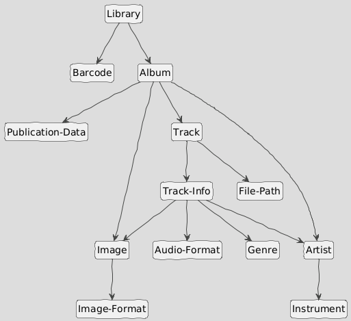

The JADN package for the music library IM provides basic metadata:

```
       title: "Music Library"
     package: "http://fake-audio.org/music-lib"
     version: "1.1"
 description: "This information model defines a library of audio tracks, 
              organized by album, with associated metadata regarding 
              each track. It is modeled on the types of library data 
              maintained by common websites and music file tag editors."
     license: "CC0-1.0"
     roots: ["Library"]
```

At the top level, the library is map of barcodes to albums. The barcode serves
as a convenient unique identifier for each album. A UPC-A barcode is a 12-digit
number, and a `pattern` Type Option is used to constrain the `String` type that
models it accordingly.

```
Library = MapOf(Barcode, Album){1..*} // Top level of the library is a map of CDs by barcode

Barcode = String{pattern="^\d{12}$"}  // A UPC-A barcode is 12 digits
```

Each album is represented by a record containing the album's artist, title,
publication data, cover art, total track count, and an array of individual audio
tracks. Multiple digital image formats are supported for the cover art. Note
that this example also contains an example of an anonymous type definition
(i.e., the `release_date` field in the `Publication-Data` record) as described 
in [Section&nbsp;3.1.4.1](#3141-anonymous-type-definitions).

```
Album = Record                         // model for the album
   1 album_artist     Artist           // primary artist associated with this album
   2 album_title      String           // publisher's title for this album
   3 pub_data         Publication-Data // metadata about the album's publication
   4 tracks           Track [1..*]     // individual track descriptions and content
   5 total_tracks     Integer{1..*}    // total track count
   6 cover_art        Image optional   // cover art image for this album

Publication-Data = Record              // who and when of publication
   1 publisher        String           // record label that released this album
   2 release_date     String /date     // and when did they let this drop

Image = Record                         // pretty picture for the album or track
   1 image_format     Image-Format     // what type of image file?
   2 image_content    Binary           // the image data in the identified format

Image-Format = Enumerated              // can only be one, but can extend list
   1 PNG
   2 JPG
   3 GIF
```

Artists have a name and one or more associated instruments that they perform on.
The same information applies whether the artist is the primary performer (i.e.,
`album_artist` in the `Album` record) or a guest performer (i.e.,
`featured_artist` in a `Track-Info` record)

```
Artist = Record                                // interesting information about a performer
   1 artist_name      String                   // who is this person
   2 instruments      Instrument unique [1..*] // and what do they play

Instrument = Enumerated                        // collection of instruments (non-exhaustive)
   1 vocals
   2 guitar
   3 bass
   4 drums
   5 keyboards
   6 percussion
   7 brass
   8 woodwinds
   9 harmonica
```

Each track is stored in a file, and has a track number within the album along
with a title, length, genre, potentially "featured" artists, the audio data, and
optionally individual track art.  Multiple digital audio formats are supported
for the audio content.

```
Track = Record                             // for each track there's a file with the audio and a metadata record
   1 location         File-Path            // path to the audio file location in local storage
   2 metadata         Track-Info           // description of the track

Track-Info = Record                        // information about the individual audio tracks
   1 track_number     Integer              // track sequence number
   2 title            String               // track title
   3 length           Integer{1..*}        // length of track in seconds; anticipated user display is mm:ss; 
                                           // minimum length is 1 second
   4 audio_format     Audio-Format         // format of the digital audio
   5 featured_artist  Artist unique [0..*] // notable guest performers
   6 track_art        Image optional       // each track can have optionally have individual artwork
   7 genre            Genre

Audio-Format = Enumerated                  // can only be one, but can extend list
   1 MP3
   2 OGG
   3 FLAC
   4 MP4
   5 AAC
   6 WMA
   7 WAV

Genre = Enumerated                         // Enumeration of common genres
   1 rock
   2 jazz
   3 hip_hop
   4 electronic
   5 folk_country_world
   6 classical
   7 spoken_word

File-Path = String                         // local storage location of file with directory path 
                                           // from root, filename, and extension
```

The entity relationship diagram in Figure 3-11 illustrates how
the model components connect.

###### Figure 3-11 -- Music Library Example ERD

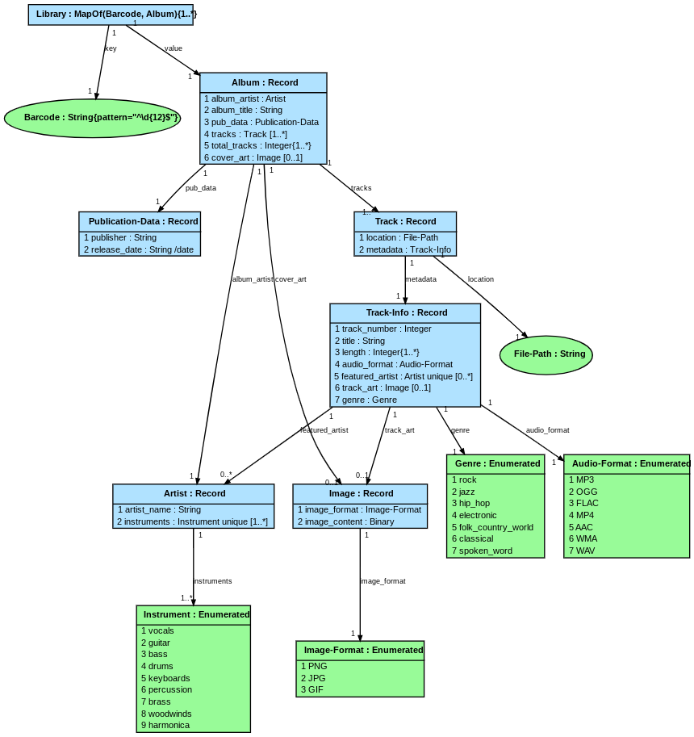

### 3.3.2 Internet Protocol Version 4 Packet Header

This example illustrates developing an abstract IM from an existing well-defined
data structure. The IPv4 packet header definition originates from 
[[RFC 791](#rfc0791)], with some details of the header modified by subsequent RFCs.
While there may be limited utility in leveraging JADN's information equivalence
focus to generate IPv4 packet header encodings other than binary, the
model is useful to document the fields of the header and describe their
conceptual purpose. This model was developed based on the content of
three Wikipedia pages related to the IPv4 packet header:

 - The [Header](https://en.wikipedia.org/wiki/IPv4#Header) section of the
   [IPv4](https://en.wikipedia.org/wiki/IPv4) article 
 - The [Classification and Marking](https://en.wikipedia.org/wiki/Differentiated_services#Classification_and_marking)
   section of the [Differentiated Services](https://en.wikipedia.org/wiki/Differentiated_services) article
 - The [Operation of ECN with IP](https://en.wikipedia.org/wiki/Explicit_Congestion_Notification#Operation_of_ECN_with_IP) section of the
   [Explicit Congestion Notification](https://en.wikipedia.org/wiki/Explicit_Congestion_Notification#Operation_of_ECN_with_IP) article

The model comprises a JADN Array type containing all of the fields of the IPv4
packet header (except the `options` field), supported by two Enumerated types to
explicate the meanings of particular fields. Figure 3-12 shows the
packet header array in JIDL form. In this representation the field "names" are
embedded in the JIDL comment field between the `//` and `::` delimiters, as
described in [Section&nbsp;3.1.3.2.1](#31321--array-field-names-in-jidl).

###### Figure 3-12 -- IPv4 Header (JIDL)

```
IPv4-Packet-Header = Array    // fields in an IPv4 packet header, per RFC 791 and subsequent contributions
   1  Integer /u4             // version:: version; always = 4 for an IPv4 packet header (4 bits)
   2  Integer /u4             // ihl:: Internet Header Length (4 bits)
   3  Diff-Svcs-Code-Point    // dscp:: Differentiated Services Code Point (enumeration, 6 bits)
   4  ECN                     // ecn:: Explicit Congestion Notification (enumeration, 2 bits)
   5  Integer{20..65535} /u16 // total_length:: entire packet size in bytes, including header and data 
                              // (min: 20 bytes (header without data) / max: 65,535 bytes)
   6  Integer /u16            // ident:: identification field; primarily used for uniquely identifying 
                              // the group of fragments of a single IP datagram
   7  Boolean                 // reserved_flag:: Reserved flag field; should be set to 0 (1-bit)
   8  Boolean                 // dont_frag:: Don't Fragment flag (1 bit)
   9  Boolean                 // more_frags:: More Fragments (1 bit): cleared for unfragmented packets 
                              // and last fragment of a fragmented packet
  10  Integer{0..8191} /u13   // frag_offset:: specifies the offset of a particular fragment relative to 
                              // the beginning of the original unfragmented IP datagram (13 bits)
  11  Integer /u8             // time_to_live:: datagram's lifetime specified in seconds, but time intervals less than 
                              // 1 second are rounded up to 1. In practice, the field is used as a hop count
  12  Integer /u8             // protocol:: transport layer protocol, per IANA registry
  13  Integer /u16            // header_checksum:: used for error checking of the packet header
  14  Binary /ipv4-addr       // source_addr:: source address for the packet sender; may be modified by NAT
  15  Binary /ipv4-addr       // dest_addr:: address for the intended recipient of the packet; may be modified by NAT
```

This portion of the model highlights the application of a number of JADN capabilities:

 - The use of the Array type for an information structure with rigid positioning
 - The use of the /u\<*n*\> Integer type format option to define fields of arbitrary bit length
 - The combination of a Binary type and the `/ipv4-addr` TypeOption to specify IPv4 network addresses
 - The use of the Boolean type to clarify the meaning of flag field bits
 
Three fields of the IPv4 packet header are functionally enumerations: 

 - Differentiated Service Code Point (DSCP)
 - Explicit Congestion Notification (ECN)
 - Protocol

The values for the `Protocol` field are managed by the Internet Assigned Numbers
Authority (IANA); this model does not include an explicit enumeration of the
IANA-assigned values. The model makes the meaning and use of the DSCP and ECN fields 
clearer by definiting associated enumerations, as illustrated in Figure 3-13.

###### Figure 3-13 -- IPv4 Packet Header Enumerations

```
Diff-Svcs-Code-Point = Enumerated       // Differentiated Services Code Point, 6 bits
   0 df          // Default Forwarding (best effort)
  10 af-c1-dpL   // Assured Forwarding (RFCs 2597 / 3260) - class 1 / drop probability low
  12 af-c1-dpM   // Assured Forwarding (RFCs 2597 / 3260) - class 1 / drop probability medium
  14 af-c1-dpH   // Assured Forwarding (RFCs 2597 / 3260) - class 1 / drop probability high
  18 af-c2-dpL   // Assured Forwarding (RFCs 2597 / 3260) - class 2 / drop probability low
  20 af-c2-dpM   // Assured Forwarding (RFCs 2597 / 3260) - class 2 / drop probability medium
  22 af-c2-dpH   // Assured Forwarding (RFCs 2597 / 3260) - class 2 / drop probability high
  26 af-c3-dpL   // Assured Forwarding (RFCs 2597 / 3260) - class 3 / drop probability low
  28 af-c3-dpM   // Assured Forwarding (RFCs 2597 / 3260) - class 3 / drop probability medium
  33 af-c3-dpH   // Assured Forwarding (RFCs 2597 / 3260) - class 3 / drop probability high
  34 af-c4-dpL   // Assured Forwarding (RFCs 2597 / 3260) - class 4 / drop probability low
  36 af-c4-dpM   // Assured Forwarding (RFCs 2597 / 3260) - class 4 / drop probability medium
  43 af-c4-dpH   // Assured Forwarding (RFCs 2597 / 3260) - class 4 / drop probability high
  44 va          // Voice Admit (RFC 5865)
  46 ef          // Expedited Routing (RFC 3246)

ECN = Enumerated // Explicit Congestion Notification (RF 3168)
   0 not_ect     // Not ECN-Capable Transport, Not-ECT
   1 ect_1       // ECN Capable Transport(1), ECT(1)
   2 ect_0       // ECN Capable Transport(0), ECT(0)
   3 ce          // Congestion Experienced, CE
```

In order to align with the various RFCs documenting the use of DCSP, the DSCP
enumeration defines its field values in terms of the IETF's recommended values
as documented in the Wikipedia article, rather than a simple monontic sequence of
field values that would be the usual approach in a more design-oriented modeling activity.

### 3.3.3 Multiple Representations Example

The [[JADN Specification](#jadn-v20)], section 7.3,
uses a simple example of an IM for a university to illustrate the
use of ERDs for IMs. This section uses that ERD as a starting
point for an example to illustrate the various JADN
representations described in [Section 3.1.3.2](#3132-alternative-jadn-representations). The example
begins with the ERD for the model:

###### Figure 3-14 -- Simple University Example ERD

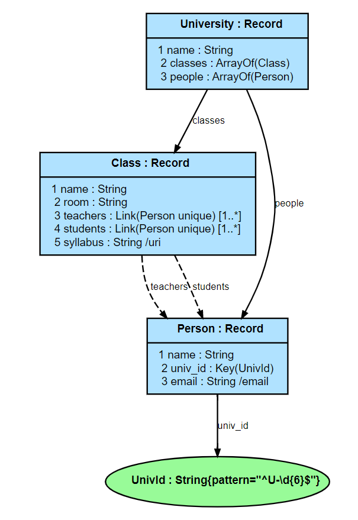

The package (see [Section 3.1.6.1](#3161-packages)) 
containing the JADN corresponding to the above ERD is shown here:

###### Figure 3-15 -- Simple University Example JADN (JSON format)

```json
{
 "info": {
  "package": "http://example.com/uni",
  "roots": ["University"]
 },

 "types": [
  ["University", "Record", [], "A place of learning", [
    [1, "name", "String", [], "University Name"],
    [2, "classes", "ArrayOf", ["*Class"], "Available classes"],
    [3, "people", "ArrayOf", ["*Person"], "Students and faculty"]
  ]],

  ["Class", "Record", [], "Pertinent info about classes", [
    [1, "name", "String", [], "Name of class"],
    [2, "room", "String", [], "Where it happens"],
    [3, "teachers", "Person", ["L", "]0", "q"], "Teacher(s) for this class"],
    [4, "students", "Person", ["L", "]0", "q"], "Students attending this class"],
    [5, "syllabus", "String", ["/uri"], "Link to class syllabus on the web"]
  ]],

  ["Person", "Record", [], "", [
    [1, "name", "String", [], "Student / faculty member name"],
    [2, "univ_id", "UnivId", ["K"], "Unique ID for student / faculty member"],
    [3, "email", "String", ["/email"], "Student / faculty member email"]
  ]],

  ["UnivId", "String", ["%^U-\\d{6}$"], "University ID (U-nnnnnn)", []]
 ]
}
```

Converting the JSON to JIDL yields a representation that is both
more readable and easier to edit:

###### Figure 3-16 -- Simple University Example JADN (JIDL format)

```
     package: "http://example.com/uni"
     roots: ["University"]

University = Record                               // A place of learning
   1 name             String                      // University Name
   2 classes          ArrayOf(Class)              // Available classes
   3 people           ArrayOf(Person)             // Students and faculty

Class = Record                                    // Pertinent info about classes
   1 name             String                      // Name of class
   2 room             String                      // Where it happens
   3 teachers         Link(Person unique) [1..*]  // Teacher(s) for this class
   4 students         Link(Person unique) [1..*]  // Students attending this class
   5 syllabus         String /uri                 // Link to class syllabus on the web

Person = Record
   1 name             String                      // Student / faculty member name
   2 univ_id          Key(UnivId)                 // Unique ID for student / faculty member
   3 email            String /email               // Student / faculty member email

UnivId = String{pattern="^U-\d{6}$"}              // University ID (U-nnnnnn)
```

Property tables are a common representation of data structures in
specifications. JADN is easily converted to property tables, which are quite
readable but somewhat more challenging to edit than JIDL (the package
information has been omitted from the set of property tables illustrated here).
Each property table is preceeded by the comment on the type definition that
created that table (e.g., the University Record type has the comment "A place of
learning"). Those comments are set in italics in this example for clarity.

###### Figure 3-17 -- Simple University Example JADN (table format)

*A place of learning*

**Type: University (Record)**

| ID | Name        | Type            | \# | Description          |
|----|-------------|-----------------|----|----------------------|
| 1  | **name**    | String          | 1  | University Name      |
| 2  | **classes** | ArrayOf(Class)  | 1  | Available classes    |
| 3  | **people**  | ArrayOf(Person) | 1  | Students and faculty |

*Pertinent info about classes*

**Type: Class (Record)**

| ID | Name         | Type                | \#    | Description                       |
|----|--------------|---------------------|-------|-----------------------------------|
| 1  | **name**     | String              | 1     | Name of class                     |
| 2  | **room**     | String              | 1     | Where it happens                  |
| 3  | **teachers** | Link(Person unique) | 1..\* | Teacher(s) for this class         |
| 4  | **students** | Link(Person unique) | 1..\* | Students attending this class     |
| 5  | **syllabus** | String /uri         | 1     | Link to class syllabus on the web |

**Type: Person (Record)**

| ID | Name        | Type          | \# | Description                            |
|----|-------------|---------------|----|----------------------------------------|
| 1  | **name**    | String        | 1  | Student / faculty member name          |
| 2  | **univ_id** | Key(UnivI+d)   | 1  | Unique ID for student / faculty member |
| 3  | **email**   | String /email | 1  | Student / faculty member email         |

| Type Name  | Type Definition             | Description              |
|------------|-----------------------------|--------------------------|
| **UnivId** | String{pattern="^U-\d{6}$"} | University ID (U-nnnnnn) |


Finally, the code to generate the ERD presented at the beginning of the example
is easily generated from the JADN model.  In this specific example code for the
widely-used GraphViz tool is provided. JADN tooling can created "diagram as
text" code for GraphVIZ and PlantUML with varying levels of detail (i.e., Conceptual, Logical, Informational). 
For example, contrast the simple conceptual view of the music libary in 
[Figure 3-10](#figure-3-10----music-library-conceptual-overview) with the
detailed informational ERD at the start of this section 
([Figure 3-14](#figure-3-14----simple-university-example-erd)).

###### Figure 3-18 -- Simple University Example ERD Source Code (GraphViz)

```
# package: http://example.com/uni
# roots: ['University']

digraph G {
  graph [fontname=Arial, fontsize=12];
  node [fontname=Arial, fontsize=8, shape=record, style=filled, fillcolor=lightskyblue1];
  edge [fontname=Arial, fontsize=7, arrowsize=0.5, labelangle=45.0, labeldistance=0.9];
  bgcolor="transparent";

n0 [label=<{<b>University : Record</b>|
  1 name : String<br align="left"/>
  2 classes : ArrayOf(Class)<br align="left"/>
  3 people : ArrayOf(Person)<br align="left"/>
}>]

n1 [label=<{<b>Class : Record</b>|
  1 name : String<br align="left"/>
  2 room : String<br align="left"/>
  3 teachers : Link(Person unique) [1..*]<br align="left"/>
  4 students : Link(Person unique) [1..*]<br align="left"/>
  5 syllabus : String /uri<br align="left"/>
}>]

n2 [label=<{<b>Person : Record</b>|
  1 name : String<br align="left"/>
  2 univ_id : Key(UnivId)<br align="left"/>
  3 email : String /email<br align="left"/>
}>]

n3 [label=<<b>UnivId : String{pattern="^U-\d{6}$"}</b>>, shape=ellipse, style=filled, fillcolor=palegreen]

  n0 -> n1 [label=classes]
  n0 -> n2 [label=people]
  n1 -> n2 [label=teachers, style="dashed"]
  n1 -> n2 [label=students, style="dashed"]
  n2 -> n3 [label=univ_id]
}
```
### 3.3.4 Converting JSON Schema to JADN

This example begins with an existing JSON schema that is developed into a JADN
IM. The starting point is the 
[Calendar schema](https://json-schema.org/learn/json-schema-examples#calendar) on the
examples page of the [json-schema.org](https://json-schema.org/) website. The
first step was to validate the JSON schema using the 
[JSON Schema Linter](https://www.json-schema-linter.com/). The changes from the starting
example were:

 1) Change `"dtStart"` in the `"required"` field to `"startDate"`
 2) Remove the reference to the geographic location schema

These changes enabled the JSON schema to pass validation. An automated JADN tool
was used to convert the JSON scheme to JADN, leading to an initial JADN schema
(JIDL representation):

```
     package: "https://example.com/calendar.schema.json"
     roots: ["$Root"]
      config: {"$FieldName": "^[$a-z][-_$A-Za-z0-9]{0,63}$", "$MaxString": 1000}

$Root = Record                          // A representation of an event
   1 startDate        String            // Event starting time
   2 endDate          String optional   // Event ending time
   3 summary          String
   4 location         String optional
   5 url              String optional
   6 duration         String optional   // Event duration
   7 recurrenceDate   String optional   // Recurrence date
   8 recurrenceRule   String optional   // Recurrence rule
   9 category         String optional
  10 description      String optional
```

This initial JADN schema reflects the original JSON schema with regard to field type and
optionality but also presents multiple opportunities for fine tuning:

1) The `startDate`, `endDate`, `url`, and `recurrenceDate` fields can have
   validation keywords applied to limit their content to appropriate values
   (this is also possible in JSON schema but was not a feature of original
   example)
2) The `duration` field can be changed to an `Integer` representing duration
   in a time unit (e.g., minutes) to simplify automated processing
3) Guidance can be provided for the format of the recurrenceRule field
4) The automatically generated `"$Root"` name for record in the schema can be
   changed to something more meaningful (e.g., `Event`)
5) Comments can be added to fields that lack them to further clarify their
   intent

The starting JSON schema appears to have been modeled on the iCalendar standard
[[RFC 5545](#rfc5545)] which also can be used as a source for refinements:

1) The `summary` field can have a character limit applied to align with its
      intended use as "a short summary or subject for the calendar component"
2) Similarly, the `description` field could be given a larger character limit to
      align with its intended use as "a more complete description of the
      calendar component than that provided by the "SUMMARY" property"
3) The `recurrenceDate` and `recurrenceRule` fields can be connected to their
   iCalendar counterpart properties to clarify their use
4) Field comments can be updated to reflect the intents for the corresponding
   iCalendar properties

Applying these changes leads to a refined model for the event schema:

```
     package: "https://example.com/calendar.schema.json"
     roots: ["Event"]
      config: {"$FieldName": "^[$a-z][-_$A-Za-z0-9]{0,63}$", "$MaxString": 1000}

Event = Record                                   // A representation of an event
   1 startDate        String /date-time          // Event starting time
   2 endDate          String /date-time optional // Event ending time
   3 summary          String{1..120}             // a short summary or subject of the event (<= 120 characters)
   4 location         String optional            // the intended venue for the event
   5 url              String /uri optional       // a Uniform Resource Locator (URL) associated with the event
   6 duration         Integer optional           // Event duration in minutes (should display as DD : HH : MM)
   7 recurrenceDate   String /date-time optional // the list of DATE-TIME values for recurring events (populate 
                                                    per iCalendar RDATE property, RFC 5545, Section 3.8.5.2)
   8 recurrenceRule   String optional            // Recurrence rule (populate per iCalendar 
                                                    RRULE property, RFC 5545, Section 3.8.5.3)
   9 category         String optional            // defines the category (ies) for the event
  10 description      String optional            // a more complete description of the event than that provided by the summary
```

Compared to the complexity of the iCalendar standard this IM for a calendar
event is greatly simplified but could serve as the starting point for a more
complete IM for describing calendar information for exchange among systems.

### 3.3.5 Inheritance Example

JADN v2.0 introduces inheritance features to support constructing DataType
inheritance hierarchies. This example uses concepts inspired by the
[[CityGML](#citygml)] and [[CityJSON](#cityjson)] geographic modeling languages
to provide an introduction to the use of inheritance in JADN. An overview of the
key types defined in this example and their inheritance relationships is shown
in Figure 3-19. This description focuses on the inheritance-related aspects of the
model; the JIDL for the complete model is provided in [Appendix&nbsp;E.2](#e2-inheritance-example-jidl).

###### Figure 3-19 -- Basic Inheritance Example Overview

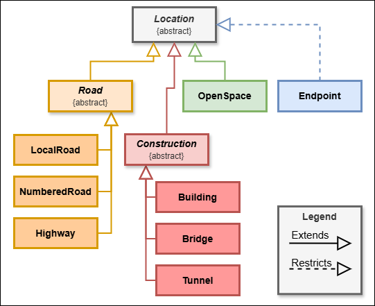

The example defines abstract (i.e., non-instantiable) types for
`Location`, `Road`, and `Construction` as a basis for more specific types in the
model. The `Location` type simply identifies the geographic center of a feature
(i.e., its latitude and longitude) and optionally the political unit within
which the feature resides:

```
Coordinate = Array            // A single geographic point (latitude / longitude)
   1  Number=[-90.0, 90.0]     // latitude::
   2  Number=[-180.0, 180.0]   // longitude::

PolUnit = String              // the name of the political area where the feature exists 
                              // (city / county / state level, as appropriate)

Location = Record abstract
   1 geoCenter        Coordinate        // geographic center of the feature of interest at the location
   2 politicalUnit    PolUnit optional  // the name of the political area where the location exists
```

Note that this simplified model is 2-dimensional; the definition of `Coordinate`
does not include an elevation component.

Endpoints use the `restricts` inheritance option to make the political unit
field required in order to be able to specify where, politically, the endpoints
of a road, tunnel, or bridge segment reside.

```
Endpoint = Record restricts(Location) // politicalUnit is required for an endpoint
   2 politicalUnit    PolUnit         // the name of the political area where the endpoint exists
```

This supports situations where, for example, a bridge or tunnel spans a river
that runs between different states. Note that both `Location` and `Endpoint` are
Record types, and in the definition of `Endpoint` the restricted field has the
same identifier as in the referenced `Location` type. Both of these are
important aspects when applying the inheritance type options.

The model uses the `extends` inheritance type option in multiple places. The first
is `OpenSpace`, which extends the `Location` Record type with a field to define
the boundary of an open space using the `Coordinates` type.

```
Coordinates = ArrayOf(Coordinate)     // A list of geographic points

OpenSpace = Record extends(Location)  // a defined area of open space
   3 boundary Coordinates     // an array of lat/long points defining the line segments
                              // around the boundary of an OpenSpace, equivalent to the
                              // gml:LinearRing type; the first and last Coordinates in
                              // the array MUST match
```

Because the `OpenSpace` type is adding a field to the referenced `Location` type a new
identifier (`3`) is required for the new field
(in contrast with the `Endpoint` restriction re-using the field identifier for `politicalUnit`).

The `Location` type is more extensively extended by the `Road`, `Bridge`,
`Tunnel`, and `Building` types. The latter three types are grouped under the
abstract `Construction` type which groups the subtypes. As with the extension
for `OpenSpace`, all of the extensions for these new subtypes assign unique
field IDs for the added fields. The same is true for the subtypes of `Road` (see
the full JIDL in [Appendix E.2](#e2-inheritance-example-jidl) for details).

```
Road = Record extends(Location) abstract                // essential information about any road
   3 endpoints        Endpoints       // center of start/end points of a road, in lat/long + political unit
   4 waypoints        Coordinates     // list of center points (lat/long) of a road that defines its route;
                                      // curvature is approximated as straight line segments between waypoints
                                      // enabling arbitrary precision about the route
   5 width            Number{1.0..*}  // Width of the road in meters. MUST be >0
   6 name             String          // official (or commonly used) name of the road
   7 maintainedBy     Maintainer      // what level of government is responsible for maintenance

Construction = Record extends(Location) abstract  // Abstract type to connect location to constructed types, no unique fields

Bridge = Record extends(Construction)
   3 endpoints        Endpoints       // center of start and end points of a bridge, in lat/long plus political unit
   4 waypoints        Coordinates     // list of center points (lat/long) of a bridge that defines its route;
                                      // curvature is approximated as straight line segments between waypoints,
                                      // enabling arbitrary precision about the route
   5 width            Number          // width of the bridge in meters, must be >0
   6 maxHeight        Number          // maximum height of the bridge in meters
   7 name             String          // official (or commonly used) name of the bridge
   8 purpose          BridgePurpose   // purpose of this bridge

Tunnel = Record extends(Construction)
   3 endpoints        Endpoints       // center of start and end points of a tunnel, in lat/long plus political unit
   4 waypoints        Coordinates     // list of center points (lat/long) of a tunnel that defines its route;
                                      // curvature is approximated as straight line segments between waypoints,
                                      // enabling arbitrary precision about the route
   5 width            Number          // width of the tunnel in meters, must be >0
   6 height           Number          // height of a tunnel from road surface to ceiling, in meters
   7 depth            Number          // lowest elevation of a tunnel's road surface, in meters
   8 name             String          // official (or commonly used) name of the tunnel
   9 purpose          TunnelPurpose   // purpose of this tunnel

Building = Record extends(Construction)
   3 address          Address
   4 perimeter        Coordinates     // an array of lat/long points defining the line segments around the
                                      // perimeter of a building, equivalent to the gml:LinearRing type; 
                                      // the first and last Coordinates in the array MUST match
   5 maxHeight        Number          // maximum height of the building in meters
   6 function         BuildingFunction
```


-------

# Appendix A. Informative References

<!-- Required section -->

This appendix contains the informative references that are used in this document.

While any hyperlinks included in this appendix were valid at the time of publication, OASIS cannot guarantee their long-term validity.

###### [ASN.1]
Recommendation ITU-T X.680 (2021) *Information technology - Abstract Syntax Notation One (ASN.1): Specification of basic notation* 


###### [CityGML]
OGC City Geography Markup Language (CityGML) Part 1: Conceptual Model Standard, 
13 September 2021, http://www.opengis.net/doc/IS/CityGML-1/3.0 

###### [CityJSON]
CityJSON Specifications 2.0.1, 11 April 2024, https://www.cityjson.org/specs/2.0.1/

###### [CACAO-Security-Playbooks-v2.0]
_CACAO Security Playbooks Version 2.0_. Edited by Bret Jordan and Allan Thomson. 27 November 2023. OASIS Committee Specification 01. https://docs.oasis-open.org/cacao/security-playbooks/v2.0/cs01/security-playbooks-v2.0-cs01.html. Latest version: https://docs.oasis-open.org/cacao/security-playbooks/v2.0/security-playbooks-v2.0.html.

###### [Declarative]
"The Data Engineer's Guide to Declarative vs Imperative for Data",
https://www.dataops.live/the-data-engineers-guide-to-declarative-vs-imperative-for-data

###### [DThaler]
"IoT Bridge Taxonomy", D. Thaler, submission to Internet of
Things (IoT) Semantic Interoperability (IOTSI) Workshop 2016,
https://www.iab.org/wp-content/IAB-uploads/2016/03/DThaler-IOTSI.pdf

###### [Fredericks]
P.J.M. Frederiks, Th.P. van der Weide, *Information modeling: The process and the required competencies of its participants*, Data & Knowledge Engineering,
Volume 58, Issue 1, 2006,
https://www.sciencedirect.com/science/article/pii/S0169023X05000753

###### [ECMAScript]
CMA International, "ECMAScript 2024 Language Specification",
ECMA-262 15th Edition, June 2024,
https://www.ecma-international.org/ecma-262.

###### [Graphviz]
https://graphviz.org/

###### [IDEF1X]
ISO/IEC/IEEE 31320-2:2012 _Information technology — Modeling Languages — Part 2: Syntax and Semantics for IDEF1X97 (IDEFobject)_, International Organization for Standardization and International Electrotechnical Commission, 2012.  https://www.iso.org/standard/60614.html 

###### [Info-Theory]
"Entropy (information theory)", https://en.wikipedia.org/wiki/Entropy_(information_theory)

###### [JADN-v2.0]
_JSON Abstract Data Notation Version 2.0_. Edited by David Kemp. 19 February 2025. 
OASIS Committee Specification Draft 01. https://docs.oasis-open.org/openc2/jadn/v2.0/csd01/jadn-v2.0-csd01.html. 
Latest version: https://docs.oasis-open.org/openc2/jadn/v2.0/jadn-v2.0.html.

###### [JSONSCHEMA]
Wright, A., Andrews, H., Hutton, B., *"JSON Schema Validation"*,
Internet-Draft, 16 September 2019,
https://tools.ietf.org/html/draft-handrews-json-schema-validation-02,
or for latest drafts: https://json-schema.org/work-in-progress.

###### [Lombardi]
Lombardi, Olimpia ; Holik, Federico & Vanni, Leonardo (2016).
What is Shannon information? _Synthese_ 193 (7):1983-2012,
https://www.researchgate.net/publication/279780496_What_is_Shannon_information


###### [NTIA-SBOM]
NTIA Multistakeholder Process on Software Component Transparency, "SBOM At A Glance", April 2021,   https://ntia.gov/sites/default/files/publications/sbom_at_a_glance_apr2021_0.pdf

###### [OSCAL]
OSCAL: the Open Security Controls Assessment Language, https://pages.nist.gov/OSCAL/

###### [OWL-Primer]
"OWL 2 Web Ontology Language Primer (Second Edition)", retrieved
10/25/2022, https://www.w3.org/TR/owl-primer/

###### [PlantUML]
https://plantuml.com/

###### [PROTO]
Google Developers, *"Protocol Buffers"*, https://developers.google.com/protocol-buffers/.

###### [RDF]
"Resource Description Framework (RDF) 1.2 Concepts and Abstract Syntax", W3C Working Draft, 22 August 2024,
https://www.w3.org/TR/rdf12-concepts/#section-Datatypes

###### [RELAXNG]
OASIS Technical Committee, *"RELAX NG"*, November 2002, https://www.oasis-open.org/committees/tc_home.php?wg_abbrev=relax-ng.

###### [RFC0791]
"Internet Protocol - DARPA Internet Program Protocol Specification", RFC 791, September 1981,
https://datatracker.ietf.org/doc/html/rfc791#section-3.1

###### [RFC3444]
Pras, A., Schoenwaelder, J., "On the Difference between
Information Models and Data Models", RFC 3444, January 2003,
https://tools.ietf.org/html/rfc3444.

###### [RFC5545] 

Desruisseaux, B., Ed., "Internet Calendaring and Scheduling 
Core Object Specification (iCalendar)", RFC 5545, DOI 10.17487/RFC5545, 
September 2009, <https://www.rfc-editor.org/info/rfc5545>.

###### [RFC4291]

Hinden, R. and S. Deering, *"IP Version 6 Addressing Architecture"*,
RFC 4291, DOI 10.17487/RFC4291, February 2006, <https://www.rfc-editor.org/info/rfc4291>.\

###### [RFC4632]

Fuller, V. and T. Li, *"Classless Inter-domain Routing (CIDR): The Internet Address Assignment and Aggregation Plan"*,
BCP 122, RFC 4632, DOI 10.17487/RFC4632, August 2006, <https://www.rfc-editor.org/info/rfc4632>.

###### [RFC7049]
Bormann, C., Hoffman, P., *"Concise Binary Object Representation
(CBOR)"*, RFC 7049, October 2013,
https://tools.ietf.org/html/rfc7049.

###### [RFC8200] 
Deering, S. and R. Hinden, *"Internet Protocol, Version 6 (IPv6) Specification"*,
STD 86, RFC 8200, DOI 10.17487/RFC8200, July 2017, <https://www.rfc-editor.org/info/rfc8200>.

###### [RFC8477]
Jimenez, J., Tschofenig, H., and D. Thaler, "Report from the
Internet of Things (IoT) Semantic Interoperability (IOTSI)
Workshop 2016", RFC 8477, DOI 10.17487/RFC8477, October 2018,
<https://www.rfc-editor.org/info/rfc8477>.

###### [RFC8610]
Birkholz, H., Vigano, C. and Bormann, C., "Concise Data
Definition Language (CDDL): A Notational Convention to Express
Concise Binary Object Representation (CBOR) and JSON Data
Structures", RFC 8610, DOI 10.17487/RFC8610, June 2019,
https://www.rfc-editor.org/info/rfc8610

###### [Shannon]
"A Mathematical Theory of Communication", 
https://en.wikipedia.org/wiki/A_Mathematical_Theory_of_Communication

###### [STIX-v2.1]
_STIX Version 2.1_. Edited by Bret Jordan, Rich Piazza, and Trey Darley. 10 June 2021. OASIS Standard. https://docs.oasis-open.org/cti/stix/v2.1/os/stix-v2.1-os.html. Latest stage: https://docs.oasis-open.org/cti/stix/v2.1/stix-v2.1.html.

###### [UML]
"Unified Modeling Language", Version 2.5.1, December 2017,
https://www.omg.org/spec/UML/2.5.1/About-UML/

###### [XSD]
W3C, "XML Schema Definition Language (XSD) 1.1 Part 1: Structures", 5 April 2012, https://www.w3.org/TR/xmlschema11-1.
W3C, "XML Schema Definition Language (XSD) 1.1 Part 2: Datatypes", 5 April 2012, https://www.w3.org/TR/xmlschema11-2.

###### [YTLee]
Lee, Y. (1999), *Information Modeling: From Design to
Implementation*, IEEE Transactions on Robotics and Automation,
[online],
https://tsapps.nist.gov/publication/get_pdf.cfm?pub_id=821265
(Accessed October 5, 2022)


-------

# Appendix B. Acknowledgments


## B.1 Special Thanks

The OpenC2 TC thanks the following individuals for their
assistance in the development of this Committee Note:

 - Larry Feldman, HII
 - Kevin Cressman, Praxis Engineering
 - Matthew Roberts, Bestgate Engineering

## B.2 Participants

The following individuals have participated in the creation of this document and are gratefully acknowledged:

| First Name | Last Name  | Company                                        |
|------------|------------|------------------------------------------------|
| Marco      | Caselli    | Siemens AG                                     |
| Toby       | Considine  | University of North Carolina at Chapel Hill    |
| Alex       | Everett    | University of North Carolina at Chapel Hill    |
| Jane       | Ginn       | Cyber Threat Intelligence Network, Inc. (CTIN) |
| Andreas    | Hverven    | University of Oslo                             |
| David      | Kemp       | National Security Agency                       |
| David      | Lemire     | National Security Agency                       |
| Patrick    | Maroney    | AT&T                                           |
| Vasileios  | Mavroeidis | University of Oslo                             |
| Michael    | Rosa       | National Security Agency                       |
| Duane      | Skeen      | Northrop Grumman                               |
| Duncan     | Sparrell   | sFractal Consulting LLC                        |
| Gerald     | Stueve     | Fornetix                                       |
| Drew       | Varner     | NineFX, Inc.                                   |

-------

# Appendix C. Revision History

## C.1 Revision History Table

| Revision           | Date       | Editor      | Changes Made          |
|:-------------------|:-----------|:------------|:----------------------|
| imjadn-v1.0-cn01-wd01.md | 2023-01-18 | David Kemp | Initial working draft / CND01 |
| imjadn-v1.0-cn01-wd02.md | 2023-04-19 | David Kemp | Second WD / CN01 candidate |
| imjadn-v1.0-cn01-wd02.md | 2024-09-25 | David Lemire | Music library example updates (PR #53) |
| imjadn-v1.0-cn01-wd02.md | 2024-09-25 | David Kemp | Reorganize introduction (PR #55) |
| imjadn-v1.0-cn01-wd02.md | 2024-09-25 | David Lemire | Normalize JADN Spec reference style (PR #56) |
| imjadn-v1.0-cn01-wd02.md | 2024-10-04 | David Kemp | Move information definition to introduction (PR #57) |
| imjadn-v1.0-cn01-wd02.md | 2024-10-09 | David Lemire | Overall updates to types descriptions in 3.1.x (PR #58) |
| imjadn-v1.0-cn01-wd02.md | 2024-10-09 | David Lemire | Generalize description of SDO management system IM (PR #60) |
| imjadn-v1.0-cn01-wd02.md | 2024-10-23 | David Lemire | Update namespaces discussion (4.1.2) with JADN v1.1 capabilities (PR #61) |
| imjadn-v1.0-cn01-wd02.md | 2024-10-23 | David Lemire | Initial revisions to Section 3.1 to improve readability (PR #63) |
| imjadn-v1.0-cn01-wd02.md | 2024-10-28 | David Lemire | Relocate multiple representations example (from 3.1.5.3 to 3.3.2) (PR #65) |
| imjadn-v1.0-cn01-wd02.md | 2024-10-28 | David Lemire | Revise structure of Section 3.1 for improved clarity and sequencing (PR #66) |
| imjadn-v1.0-cn01-wd02.md | 2024-10-29 | David Lemire | Refine Figure 4-1 (references relationships) (PR #70) |
| imjadn-v1.0-cn01-wd02.md | 2024-11-06 | David Lemire | Transfer Section 2 material from CS (PR #71) and integrate with existing content (PR #74) |
| imjadn-v1.0-cn01-wd02.md | 2024-11-06 | David Lemire | Add IPv4 packet header models as example of building from known structure (PR #71) |
| imjadn-v1.0-cn01-wd02.md | 2024-11-07 | David Lemire | Add definitions for lexical and value space and make associated adjustments (PR #76) |
| imjadn-v1.0-cn01-wd02.md | 2024-11-07 | David Lemire | Migrate Section 4 content into section 3.1 (PR #77) |
| imjadn-v1.0-cn01-wd02.md | 2024-11-07 | David Lemire | Administrative clean-up (PR #78) |
| imjadn-v1.0-cn01-wd02.md | 2024-11-14 | David Lemire | Update diagrams (PR #81) and text (PR #82) to align w/JADN Spec changes |
| imjadn-v1.0-cn03.md      | 2024-11-26 | David Lemire | Add example development JADN IM from JSON schema starting point (PR #xx), rename document for next CN version |
| imjadn-v1.0-cn03.md      | 2024-12-11 | David Lemire | Add "Why JADN?" material in Section 1.1 (PR #88) |
| imjadn-v1.0-cn03.md      | 2024-12-23 | David Lemire | Consolidate duplicative 2.1 content into 1.1.3 (PR #89) |
| imjadn-v1.0-cn03.md      | 2025-01-08 | David Lemire | Document v2 changes in Appendix C, corrections to revision table (PR #90) |
| imjadn-v1.0-cn03.md      | 2025-01-08 | David Lemire | Update Type & Field Options in section 3.x (PR #91) |
| imjadn-v1.0-cn03.md      | 2025-01-08 | David Lemire | Incorporate "elevator speech" into abstract and section 1.0 (PR #93) |
| imjadn-v1.0-cn03.md      | 2025-02-12 | David Lemire | New content addressing inheritance features added in JADV v2 (PRs #92 & #97) |
| imjadn-v1.0-cn03.md      | 2025-02-18 | David Lemire | Update discussion of String type options for JADV v2 (PR #98) |
| imjadn-v1.0-cn03.md      | 2025-03-05 | David Lemire | Update JADN Spec references, reorder primitive types to match (PR #102) |
| imjadn-v1.0-cn03.md      | 2025-03-26 | David Lemire | Updates throughout CN for alignment with JADN v2 specification and improved presentation (PR #106) |

## C.2 JADN Version 2 Changes

This section details differences between versions 1 and 2 of JADN.

### C.2.1 Breaking Change

In JADN v2.0 the "unlimited" value for the `maxOccurs` (formerly `maxc`)
sentinel is changed from 0 to -1. *This minor but incompatible change required a
new major version.* Two options are defined for an unspecified `maxOccurs` value:

- `maxOccurs` = -1 denotes an upper size limit defined by the JADN default value or package-specified upper value
- `maxOccurs` = -2 denotes an unbounded upper size limit

### C.2.2 General Changes

The following general changes were made:

- The `namespaces` prefix list was change from mappings to pairings to provide greater flexibility in managing namespaces and packages.
- The package `Information` element was renamed to `Metadata` to avoid conflation with information modeling.
- The package `exports` element was renamed to `roots` to better describe its purpose and effect.
- Type Options have been revised and expanded to support defining both size and content (value) range limits for primitive types

### C.2.3 Type and Field Option Changes

The following changes were made to JADN type options:

- New options:
  - `minExclusive`, `maxExclusive`, `minInclusive`, `maxInclusive`: used to specify allowable value ranges for instances of types
  - `const`: specifies a pre-set value used as a classifier, equivalent to setting both `minInclusive` and `maxInclusive` to that value.
  - `minLength, maxLength`: used to specify the allowable size range for a binary or string type and to specify the number of items in a collection type
  - `sequence`: enables specifying that `Map, MapOf, Record` types have a required field order 
  - `combine`: provides greater flexibility for `Choice` types with `oneOf, anyOf, allOf, not` sub-options
  - `abstract`, `extends`, `restricts`, `final`: options related to defining and controlling types using inheritance
- Replaced options:
  - `minc`, `maxc`: these options have been renamed to `minOccurs, maxOccurs`
  - `minv`, `maxv`: these options have been separated into `minInclusive`, `maxInclusive` to specify value ranges and `minLength`, `maxLength` to specify size and item count ranges
  - `minf`, `maxf`: these floating-point specific options have been replaced by `minInclusive`, `maxInclusive`
- Removed options:
  - `extend`, `dir`

### C.2.4 Inheritance

Four new type options were introduced to support inheritance in information models:

- `abstract`: a type definition with this option is only usable as a base type
  that other types can extend or restrict. Abstract types are never instantiated
  in serialized data.
- `restricts`: this option is used when defining a type that is a subset of the
  type that it references; it enables removing optional fields from the
  referenced type (required fields cannot be removed).
- `extends`: this option is used when defining a type that is a superset of the
  type that it references; it enables adding new non-conflicting fields to a
  subtype but cannot redefine existing fields from the referenced type.
- `final`: this option is used to designate a type that cannot be referenced to
  create a subtype.

The `extends` and `restricts` options are complementary: if B `extends` A then
every instance of A MUST be an instance of B.  If B `restricts` A then every
instance of B MUST be an instance of A. 

### C.2.5 Format and Validation Options Changes

The following changes were made to format and validation options:

- `/d#` was added as an option for the time-oriented format options (i.e., `date-time`, `date`, `time`, `duration`) to allow for sub-second precision for the time aspect.
- `i<n>` replaces the `i8`, `i16`, `i32` format options to provide greater flexibility in specifying signed integer types; the permissable values are between -2^(n-1) and 2^(n-1)-1.
- `d<n>` applies a decimal integer scale factor of 10^n: value has n digits after decimal point, n > 0.


-------

# Appendix D. Frequently Asked Questions (FAQ)

This appendix responds to a variety of Frequently Asked Questions
regarding JADN.

## D.1 JADN vs. UML Primitive Data Types

The Universal Modeling Language [UML](#uml) says in section 21:
"*The PrimitiveTypes package is an independent package that defines a set of
reusable PrimitiveTypes that are commonly used in the definition of metamodels.*"
and takes the position that the set of natural numbers includes the value zero.

JADN uses the same UML primitive types with two exceptions:
* JADN defines a Binary (byte sequence) primitive type, UML does not.
* UML defines an UnlimitedNatural primitive type, JADN does not.

UML natural numbers (integers greater than or equal to zero) are a subset of
integers, so there is no need for a separate UnlimitedNatural primitive type.
A JADN multivalued element may have an unlimited number of values if its type
definition does not have a multiplicity upper bound. JADN assigns the Integer
*sentinel value* -1, which is distinguished from all UML natural numbers,
to indicate an unspecified upper bound in a multiplicity range.
By convention text representations of a multiplicity range use the character "*"
to indicate an unspecified upper bound.

* A **sentinel value** is a predefined data value used to indicate the end
of a sequence or the absence of valid data.

Table D-1 lists the UML and JADN Primitive types.

###### Table D-1 -- UML and JADN Primitive Type Equivalence

|       UML        |      JADN      |
|:----------------:|:--------------:|
|       ---        |     Binary     |
|     Boolean      |    Boolean     |
|     Integer      |    Integer     |
|       Real       |     Number     |
|      String      |     String     |
| UnlimitedNatural | Integer {0..*} |

## D.2 Declarative Specifications

*Editor's Note: Ignore numbering; Primitives will be moved into document body. Declarative
may as well, or FAQ appendix may be renamed to something like "Notes"*

The introduction states: "An IM is a declarative specification that defines desired outcomes
(data item validity and equivalence) without describing control flow."
But what does "declarative" mean in practice?

The [DataOps Guide](#declarative) is a tutorial on the difference between declarative
and imperative approaches, as well as the difference between those approaches when applied
to software programming vs. database management. It uses simple relational database
tables for illustration, but declarative schemas are also used with more
flexible NoSQL databases such as Elasticsearch and MongoDB, graph databases including
Neo4j, and non-database artifacts such as protocol messages and documents.

The *Guide* points out that:
> A declarative approach is an abstraction based on our interaction with the system.
> When you look under the hood, all systems depend on a set of imperative instructions.
> Instead of the system depending on you to supply those instructions, they are predefined. 

An information model combines the abstraction of declarative specifications with
the abstraction of separating logical datatypes from concrete representations.
Its desired outcomes are:
* a classification decision: given a data value, is it an instance of an abstract datatype?
* an equality comparison decision: given two instances of the same datatype,
do they have the same logical value?

Its predefined instructions implement the behavior of its built-in datatypes,
which can be extended with application-specific imperative validation
and translation functions.

## D.3 Applications

Examples of other possible JADN applications include
defining:

 - Complex information structures, such as Software
   Bills of Materials
   (SBOMs) [[NTIA-SBOM](#ntia-sbom)];
   examples would be the SPDX and CycloneDX SBOM formats
 - Formal definition of structured information exchanges, such as
   are described by
   [NIEM](https://github.com/niemopen/oasis-open-project#readme)

## D.4 Why JADN and not RDF?

This section discusses the relationship between JADN and RDF, and why RDF does not serve the purpose of an Information Model

### Comment
The following
[comment](https://lists.oasis-open.org/archives/openc2-comment/202106/msg00002.html)
was submitted in response to the OASIS JADN [public
review](https://lists.oasis-open.org/archives/openc2/202106/msg00019.html):

> *Have you considered the following specifications from W3C:
> **RDF, RDFS, JSON-LD, SHACL**? RDF, RDFS (and potentially OWL
> and BFO) should take care of your information modelling needs,
> JSON-LD provides a JSON serializations, SHACL provides
> extensive validation capabilities. I would be interested to see
> the analysis why these technologies were eliminated after your
> consideration.*

### Response

> NOTE: Need to update the following as the JADN v2 Spec does not contain the quoted wording.

The short answer (RDF models *knowledge* while JADN models
*information*) is provided in the [[JADN Specification](#jadn-v20)] introduction:

> *UML class models and diagrams are commonly referred to as
> "Data Models", but they model knowledge of real-world entities
> using classes. In contrast, information models model data
> itself using datatypes.*

An RDF graph is a knowledge model / ontology consisting of
(subject, predicate, object) triples, where each member of the
triple can be an International Resource Identifier (IRI), blank
node, or literal. An RDF triple encodes a statement—a simple
logical expression, or claim about the world. A JADN graph, in
contrast, consists of DataType definitions that define the
information content of data instances.

In order to understand why RDF is not suitable as an information
modeling language, one must understand two things about
information:

 1. **[Information](https://www.quantamagazine.org/how-claude-shannons-information-theory-invented-the-future-20201222/)**
    distinguishes *significant* data from *insignificant* data.
    (In Shannon's original context signal and noise are in the
    analog domain, but entropy is meaningful even in purely
    digital communication.)

 2. Information defines *loss*. Lossless transformations across
    data formats preserve information; after a round trip
    significant data is unchanged and insignificant data can be
    ignored. A lossy round trip is lossy not because it alters
    data, but because it alters significant data.

Information models define the information capacity of data
instances; two data formats are *equivalent* if conversion
between them is lossless.

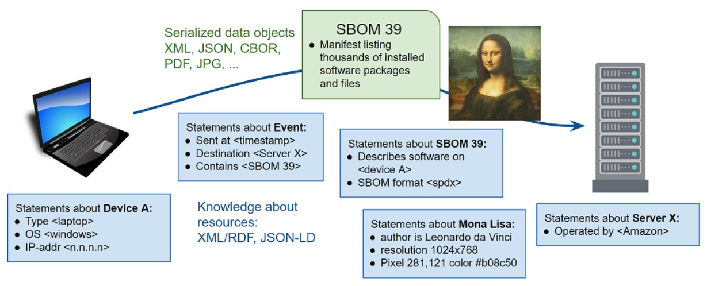


Resources can be physical or digital entities. Both can be
subjects of knowledge model statements, but only digital
resources can be modeled as information instances and serialized
for transmission and storage. The RDF primer contains the
following example statements about resources:

 - \<Bob> \<is a> \<person>.
 - \<Bob> \<is a friend of> \<Alice>.
 - \<Bob> \<is born on> \<the 4th of July 1990>.
 - \<Bob> \<is interested in> \<the Mona Lisa>.

From context we can infer that \<the Mona Lisa>, like \<Bob> and
\<Alice>, is intended to be a physical resource.

### Extreme Example
The physical painting can never be serialized losslessly, because
even a multi-band 3D camera that captures near-infrared images of
pencil sketches beneath the paint and elevation contours of the
brush strokes still does not capture, for example, the chemical
and physical properties of the canvas, pencils, washes, pigments,
binders, or other materials used in the painting. But though
physical entities can never be modeled completely as data, camera
images of them can be. A 1920x1080 image contains 2 million
pixels that could be serialized in the lossless PNG format, or as
2 million XML/RDF statements of the form \<mona lisa pixel
192,13> \<has color> \<#32b82f>. The raw image data can be
serialized as RDF and deserialized back to raw without loss, but
is it useful to do so? RDF is useful for statements like the
painting was created by da Vinci in 1503-1506, is housed in the
Louvre, depicts a smiling woman, and has cedar trees in the
background.  But if an application needs the image, PNG
serialization is an appropriate tool for the job, RDF is not.

### Practical Example
JADN defines specific digital resources that can be stored,
communicated, and referenced by an RDF graph.  If Bob is a
physical \<person> and \<person> is a Class, an information model
specifies selected details about Person entities in terms of
their format-independent information content:

```
People = ArrayOf(Person)

Person = Record
1 name       String
2 id         Key(PersonId)
3 dob        Integer /date-adhoc
4 weight     Weight optional
5 hair_color Color optional
6 eye_color  Color optional

Color = Enumerated
1 red
2 green
3 blue
4 brown
5 black
6 white

Weight = Integer 		// unit = grams

PersonId = String{pattern="..."}
```

This defines a set of properties of the Person datatype and the
collection characteristics of those properties: "Record" means
that the collection is both ordered and unique, which in turn
means that the properties could be serialized in JSON as either
maps or arrays. Formats (in this case the hypothetical
/date-adhoc) indicate that the "date of birth" property is the
integer number of [seconds since the
epoch](https://www.epochconverter.com/) and can be serialized
using the folksy string format from the RDF example. Defining
times and durations as integers in the information model allows
date strings of various text representations to be compared and
ordered. The Color vocabulary could contain the 140 [web-safe
color names](https://www.w3schools.com/colors/colors_names.asp),
or a defined set of [fashion
colors](https://www.latest-hairstyles.com/color/chart.html) such
as "medium golden blonde". Enumerations allow Color strings to be
both validated for semantic meaningfulness and serialized as 8-
or 16-bit values.

### Measuring Information
If a data instance can be losslessly converted among
serializations A, B, and C, then by definition the instance
conveys no more information than the smallest of its
serializations.

JSON verbose serialization of \<People>:
```
[{
  "weight": 79546,
  "dob": "the 4th of July 1990",
  "id": "K193-3498-234",
  "name": "Bob"
}, {
  "name": "Alice",
  "dob": "the 27th of June 1982",
  "id": "B239-5921-348"
}]
```

JSON compact serialization of \<People>:
```
[
  ["Bob", "K193-3498-234", "the 4th of July 1990", 79546],
  ["Alice", "B239-5921-348", "the 27th of June 1982"]
]
```
JSON concise serialization of \<People>:
```
[
  ["Bob", "K193-3498-234", 647049600, 79546],
  ["Alice", "B239-5921-348", 393984000]
]
```

CBOR serialization of \<People> ([converted](http://cbor.me/)
from concise JSON):

```
56 Bytes:
82                         # array(2)
84                         # array(4)
63                         # text(3)
426F62                     # "Bob"
6D                         # text(13)
4B3139332D333439382D323334 # "K193-3498-234"
1A 26913180                # unsigned(647049600)
1A 000136BA                # unsigned(79546)
83                         # array(3)
65                         # text(5)
416C696365                 # "Alice"
6D                         # text(13)
423233392D353932312D333438 # "B239-5921-348"
1A 177BB800                # unsigned(393984000)
```

This illustrates that regardless of serialization, the properties
of Bob and Alice convey less than 56 bytes of information, or on
average 28 bytes per person. An RDF/XML serialization could be
lossless but would not supply any additional information.
Information instances can be stored in a database, transmitted as
XML, JSON, CBOR, or other formats, referenced by RDF graphs and
included in other structured data. As with the PNG example, this
suggests that information can be serialized in any suitable
format, with RDF statements generated from it dynamically if
needed to satisfy queries. Although this Person example does not
include Bob's friends or interests, relationships can be defined
within the information model or specified independently with RDF.
[JADN section
5.3](https://docs.oasis-open.org/openc2/jadn/v1.0/cs01/jadn-v1.0-cs01.html#53-entity-relationship-diagrams)
includes a slightly larger information model example with three
types and four container and reference relationships among them.


## D.5 Why JADN and not OWL?

Capture from Google Doc at https://docs.google.com/document/d/1gY8ZaQJmJTpx8468Conchc2XVzTKE8x0WFSQT1qtB8o/edit#heading=h.ru8h2khtb5aw

The [[OWL Primer](#owl-primer)] describes OWL as follows:

> The W3C OWL 2 Web Ontology Language (OWL) is a Semantic Web
> language designed to represent rich and complex knowledge about
> things, groups of things, and relations between things. OWL is
> a computational logic-based language such that knowledge
> expressed in OWL can be reasoned with by computer programs
> either to verify the consistency of that knowledge or to make
> implicit knowledge explicit.

Ontologies represent "knowledge about things", whereas IMs
represent digital "things" themselves. As discussed in the body
of this CN, an IM defines the essential content of entities used
in computing independently of how those entities are serialized
for communication or storage.

OWL has "object properties" and "data properties". Object
properties are relationships between two entities and data
properties are relations between an entity and a simple type.
There is a rough correspondence between OWL terminology and
concepts from Entity-Relationship modeling, Object Oriented
Programming, and Information Modeling.

An information model models data, and the only entities in an
information model are datatypes, where datatypes are either
simple (a single value like string or integer) or structured (a
collection of values like list or map). Translating an ontology's
objects or classes into an information model's datatypes is often
straightforward, but when there are alternative ways of
representing the same objects as datatypes, an information model
captures design decisions that are left unspecified in the
ontology.

Some primary distinctions between knowledge and information
models are *directionality*, *multiplicity*, *referenceability*,
and *individuality*.

### Directionality:
Although it may appear otherwise, an ontology is an undirected
graph. Classes are connected by associations, and class
associations are symmetric. If "car" and "part" are classes and a
car is a composition of parts, then parts are components of car.
If rose is a specialization of flower, then flower is a
generalization of rose. If A is a parent of B, then B is a child
of A. Arrows in an ontology diagram indicate which association
term applies in the indicated direction, but the direction and
term can be reversed together without changing the semantics of
the graph. In contrast, an information model is a directed graph
where direction determines syntax, and it has only two
association types: contain and reference.

As an example, if a City datatype with name, elevation, and
location properties contains a Coordinate datatype with latitude
and longitude properties, one could say that Coordinate is
"contained by" City without changing the  model. The association
direction is always container to contained, or referencing to
referenced. A City instance with this graph direction is
serialized as:

```
{ 'name': 'Hamilton',
  'elevation': 20,
  'location': { 'latitude': 32.2912, 'longitude': -64.7864 } }
```

Reversing the direction changes the model. If Coordinate were the
container it would have place, latitude, and longitude
properties, while City would have just name and elevation:

```
{ 'place': { 'name': 'Hamilton', 'elevation': 20 },
  'latitude': 32.2912,
  'longitude': -64.7864 }
```

### Multiplicity:
OWL defines multiplicity as an attribute of associations.
Collections (associations with a maximum cardinality greater than
one) also have collection attributes ordered and unique, about
which OWL says:

 - By default, all associations are sets; that is, the objects in
   them are unordered and repetitions are disallowed.
 - The {ordered, non-unique} attribute is placed next to the
   association ends that are ordered and in which repetitions are
   allowed. Such associations have the semantics of lists.

In an information model, collection attributes are intrinsic to
the datatype itself and don't depend on associations with other
datatypes.  Just as a string type always has a string value, a
list type always is an ordered, non-unique collection of values.
In an information model both "object properties'' and "data
properties" are datatypes, and a collection datatype has fixed
collection attributes regardless of where it is used.

For whatever reason, {ordered, non-unique} almost never appears in
ontologies.  In contrast, lists are a fundamental variable type
in computing and a fundamental data type in data interchange.
List elements have an ordinal position and can be referenced by
position. Collections that are {ordered, unique} have elements
that can be referenced by either position or name, used when
modeling data that can be structured as tables.

The datatype names commonly applied to collection attributes are:

| **collection attributes** |    **datatype**     |
|:-------------------------:|:-------------------:|
|    ordered, non-unique    |   sequence / list   |
|     unordered, unique     |      set, map       |
|      ordered, unique      | ordered set, record |
|   unordered, non-unique   |         bag         |


An information model specifies collection attributes that are not
explicit in an ontology in order to ensure equivalence across
syntaxes.

Continuing the City example, Coordinate was assumed to
be the default map type. But an information model would generally
make it a list type, resulting in more compact serialized
instances. All properties of type Coordinate would be serialized
as lists without having to individually designate every
association as {ordered, nonunique}:

```
{ 'name': 'Hamilton',
  'elevation': 20,
  'location': [32.2912, -64.7864] }
```

Defining both City and Coordinate as record types (values are
{ordered, unique}) allows them to be serialized either with
property names or as table rows with "name", "elevation", and
"location" columns:

```
[ 'Hamilton', 20, [32.2912, -64.7864] ]
```

The record datatype specifies data that can be losslessly
converted between map and table serializations (an
object-relational mapping - ORM), unlike an ontology's default
unordered properties which are two-column sets of key:value
pairs.

### Referenceability:
Ontologies treat all objects as referenceable graph nodes, which
requires every object to be assigned a primary key / unique
identifier. Information models represent data structures using
both referenceable and non-referenceable graph nodes. Containers
are used by default to define serialization. References (foreign
keys) are used when necessary to avoid data duplication and
recursive structures.

### Individuality:
All datatypes are distinguished only by their value, but some
datatypes may be individually identified by having a primary key
as part of their value.  The terms used for non-individual types
vary, but to avoid overloaded terms such as "class type" or "type
type", types can be classified as either individual or fungible.
People and bank accounts are examples of individual datatypes.
Measurements, observations, mass-produced parts, currency, and IP
addresses are examples of fungible datatypes. Coins are fungible
unless grouped by mint; bills are fungible unless an application
such as fraud detection requires identification by serial number.

These characteristics result in design guidelines for
constructing an information graph from an ontology graph:

 1. Fungible nodes may have more than one parent.
 2. Each individual node should have exactly one parent. A node
    with no parent has nowhere for its instances to be
    serialized, so any references will be dead links. An
    individual node with more than one parent needs a mechanism
    to ensure that ids are unique and a mechanism to dereference
    an id to the correct parent.
 3. The container associations in an information model must form
    a set of directed acyclic graphs.  Any container cycles must
    be broken by converting a container association to a
    reference, which in turn may require converting an otherwise
    fungible contained node to a referenceable individual node.

------

# Appendix E. Example Information Model Source

## E.1 Music Library

### E.1.1 Music Library JADN

```
{
  "info": {
    "title": "Music Library",
    "package": "http://fake-audio.org/music-lib",
    "version": "1.1",
    "description": "This information model defines a library of audio tracks, organized by album, with associated metadata regarding each track. It is modeled on the types of library data maintained by common websites and music file tag editors.",
    "license": "CC0-1.0",
    "roots": ["Library"]
  },
  "types": [
    ["Library", "MapOf", ["+Barcode", "*Album", "{1"], "Top level of the library is a map of CDs by barcode", []],
    ["Barcode", "String", ["%^\\d{12}$"], "A UPC-A barcode is 12 digits", []],
    ["Album", "Record", [], "model for the album", [
        [1, "album_artist", "Artist", [], "primary artist associated with this album"],
        [2, "album_title", "String", [], "publisher's title for this album"],
        [3, "pub_data", "Publication-Data", [], "metadata about the album's publication"],
        [4, "tracks", "Track", ["]0"], "individual track descriptions and content"],
        [5, "total_tracks", "Integer", ["{1"], "total track count"],
        [6, "cover_art", "Image", ["[0"], "cover art image for this album"]
      ]],
    ["Publication-Data", "Record", [], "who and when of publication", [
        [1, "publisher", "String", [], "record label that released this album"],
        [2, "release_date", "String", ["/date"], "and when did they let this drop"]
      ]],
    ["Image", "Record", [], "pretty picture for the album or track", [
        [1, "image_format", "Image-Format", [], "what type of image file?"],
        [2, "image_content", "Binary", [], "the image data in the identified format"]
      ]],
    ["Image-Format", "Enumerated", [], "can only be one, but can extend list", [
        [1, "PNG", ""],
        [2, "JPG", ""],
        [3, "GIF", ""]
      ]],
    ["Artist", "Record", [], "interesting information about a performer", [
        [1, "artist_name", "String", [], "who is this person"],
        [2, "instruments", "Instrument", ["q", "]0"], "and what do they play"]
      ]],
    ["Instrument", "Enumerated", [], "collection of instruments (non-exhaustive)", [
        [1, "vocals", ""],
        [2, "guitar", ""],
        [3, "bass", ""],
        [4, "drums", ""],
        [5, "keyboards", ""],
        [6, "percussion", ""],
        [7, "brass", ""],
        [8, "woodwinds", ""],
        [9, "harmonica", ""]
      ]],
    ["Track", "Record", [], "for each track there's a file with the audio and a metadata record", [
        [1, "location", "File-Path", [], "path to the audio file location in local storage"],
        [2, "metadata", "Track-Info", [], "description of the track"]
      ]],
    ["Track-Info", "Record", [], "information about the individual audio tracks", [
        [1, "track_number", "Integer", ["[1"], "track sequence number"],
        [2, "title", "String", [], "track title"],
        [3, "length", "Integer", ["{1"], "length of track in seconds; anticipated user display is mm:ss; minimum length is 1 second"],
        [4, "audio_format", "Audio-Format", [], "format of the digital audio"],
        [5, "featured_artist", "Artist", ["q", "[0", "]0"], "notable guest performers"],
        [6, "track_art", "Image", ["[0"], "each track can have optionally have individual artwork"],
        [7, "genre", "Genre", [], ""]
      ]],
    ["Audio-Format", "Enumerated", [], "can only be one, but can extend list", [
        [1, "MP3", ""],
        [2, "OGG", ""],
        [3, "FLAC", ""],
        [4, "MP4", ""],
        [5, "AAC", ""],
        [6, "WMA", ""],
        [7, "WAV", ""]
      ]],
    ["Genre", "Enumerated", [], "Enumeration of common genres", [
        [1, "rock", ""],
        [2, "jazz", ""],
        [3, "hip_hop", ""],
        [4, "electronic", ""],
        [5, "folk_country_world", ""],
        [6, "classical", ""],
        [7, "spoken_word", ""]
      ]],
    ["File-Path", "String", [], "local storage location of file with directory path from root, filename, and extension"]
  ]
}
```

### E.1.2 Music Library JIDL

```
       title: "Music Library"
     package: "http://fake-audio.org/music-lib"
     version: "1.1"
 description: "This information model defines a library of audio tracks, organized by album, 
               with associated metadata regarding each track. It is modeled on the types of 
               library data maintained by common websites and music file tag editors."
     license: "CC0-1.0"
     roots: ["Library"]

Library = MapOf(Barcode, Album){1..*}  // Top level of the library is a map of CDs by barcode

Barcode = String{pattern="^\d{12}$"}   // A UPC-A barcode is 12 digits

Album = Record                         // model for the album
   1 album_artist     Artist           // primary artist associated with this album
   2 album_title      String           // publisher's title for this album
   3 pub_data         Publication-Data // metadata about the album's publication
   4 tracks           Track [1..*]     // individual track descriptions and content
   5 total_tracks     Integer{1..*}    // total track count
   6 cover_art        Image optional   // cover art image for this album

Publication-Data = Record              // who and when of publication
   1 publisher        String           // record label that released this album
   2 release_date     String /date     // and when did they let this drop

Image = Record                         // pretty picture for the album or track
   1 image_format     Image-Format     // what type of image file?
   2 image_content    Binary           // the image data in the identified format

Image-Format = Enumerated              // can only be one, but can extend list
   1 PNG
   2 JPG
   3 GIF

Artist = Record                        // interesting information about a performer
   1 artist_name      String           // who is this person
   2 instruments      Instrument unique [1..*]  // and what do they play

Instrument = Enumerated                // collection of instruments (non-exhaustive)
   1 vocals
   2 guitar
   3 bass
   4 drums
   5 keyboards
   6 percussion
   7 brass
   8 woodwinds
   9 harmonica

Track = Record                             // for each track there's a file with the audio and a metadata record
   1 location         File-Path            // path to the audio file location in local storage
   2 metadata         Track-Info           // description of the track

Track-Info = Record                        // information about the individual audio tracks
   1 track_number     Integer              // track sequence number
   2 title            String               // track title
   3 length           Integer{1..*}        // length of track in seconds; anticipated user display is mm:ss; 
                                           // minimum length is 1 second
   4 audio_format     Audio-Format         // format of the digital audio
   5 featured_artist  Artist unique [0..*] // notable guest performers
   6 track_art        Image optional       // each track can have optionally have individual artwork
   7 genre            Genre

Audio-Format = Enumerated                  // can only be one, but can extend list
   1 MP3
   2 OGG
   3 FLAC
   4 MP4
   5 AAC
   6 WMA
   7 WAV

Genre = Enumerated                         // Enumeration of common genres
   1 rock
   2 jazz
   3 hip_hop
   4 electronic
   5 folk_country_world
   6 classical
   7 spoken_word

File-Path = String     // local storage location of file with directory path from root, filename, and extension
```

### E.1.3 Music Library Tables

Information Header

```
         title: "Music Library"
       package: "http://fake-audio.org/music-lib"
       version: "1.1"
   description: "This information model defines a library of audio tracks, 
                 organized by album, with associated metadata regarding each 
                 track. It is modeled on the types of library data maintained 
                 by common websites and music file tag editors."
       license: "CC0-1.0"
       roots: ["Library"]
```

| Type Name   | Type Definition             | Description                                         |
|-------------|-----------------------------|-----------------------------------------------------|
| **Library** | MapOf(Barcode, Album){1..*} | Top level of the library is a map of CDs by barcode |

**********

| Type Name   | Type Definition            | Description                  |
|-------------|----------------------------|------------------------------|
| **Barcode** | String{pattern="^\d{12}$"} | A UPC-A barcode is 12 digits |

**********

model for the album

**Type: Album (Record)**

| ID | Name             | Type             | \#    | Description                               |
|----|------------------|------------------|-------|-------------------------------------------|
| 1  | **album_artist** | Artist           | 1     | primary artist associated with this album |
| 2  | **album_title**  | String           | 1     | publisher's title for this album          |
| 3  | **pub_data**     | Publication-Data | 1     | metadata about the album's publication    |
| 4  | **tracks**       | Track            | 1..\* | individual track descriptions and content |
| 5  | **total_tracks** | Integer{1..\*}   | 1     | total track count                         |
| 6  | **cover_art**    | Image            | 0..1  | cover art image for this album            |

**********

who and when of publication

**Type: Publication-Data (Record)**

| ID | Name             | Type         | \# | Description                           |
|----|------------------|--------------|----|---------------------------------------|
| 1  | **publisher**    | String       | 1  | record label that released this album |
| 2  | **release_date** | String /date | 1  | and when did they let this drop       |

**********

pretty picture for the album or track

**Type: Image (Record)**

| ID | Name              | Type         | \# | Description                             |
|----|-------------------|--------------|----|-----------------------------------------|
| 1  | **image_format**  | Image-Format | 1  | what type of image file?                |
| 2  | **image_content** | Binary       | 1  | the image data in the identified format |

**********

can only be one, but can extend list

**Type: Image-Format (Enumerated)**

| ID | Item    | Description |
|----|---------|-------------|
| 1  | **PNG** |             |
| 2  | **JPG** |             |
| 3  | **GIF** |             |

**********

interesting information about a performer

**Type: Artist (Record)**

| ID | Name            | Type              | \#    | Description           |
|----|-----------------|-------------------|-------|-----------------------|
| 1  | **artist_name** | String            | 1     | who is this person    |
| 2  | **instruments** | Instrument unique | 1..\* | and what do they play |

**********

collection of instruments (non-exhaustive)

**Type: Instrument (Enumerated)**

| ID | Item           | Description |
|----|----------------|-------------|
| 1  | **vocals**     |             |
| 2  | **guitar**     |             |
| 3  | **bass**       |             |
| 4  | **drums**      |             |
| 5  | **keyboards**  |             |
| 6  | **percussion** |             |
| 7  | **brass**      |             |
| 8  | **woodwinds**  |             |
| 9  | **harmonica**  |             |

**********

for each track there's a file with the audio and a metadata record

**Type: Track (Record)**

| ID | Name         | Type       | \# | Description                                      |
|----|--------------|------------|----|--------------------------------------------------|
| 1  | **location** | File-Path  | 1  | path to the audio file location in local storage |
| 2  | **metadata** | Track-Info | 1  | description of the track                         |

**********

information about the individual audio tracks

**Type: Track-Info (Record)**

| ID | Name                | Type           | \#    | Description                                                                               |
|----|---------------------|----------------|-------|-------------------------------------------------------------------------------------------|
| 1  | **track_number**    | Integer        | 1     | track sequence number                                                                     |
| 2  | **title**           | String         | 1     | track title                                                                               |
| 3  | **length**          | Integer{1..\*} | 1     | length of track in seconds; anticipated user display is mm:ss; minimum length is 1 second |
| 4  | **audio_format**    | Audio-Format   | 1     | format of the digital audio                                                               |
| 5  | **featured_artist** | Artist unique  | 0..\* | notable guest performers                                                                  |
| 6  | **track_art**       | Image          | 0..1  | each track can have optionally have individual artwork                                    |
| 7  | **genre**           | Genre          | 1     |                                                                                           |

**********

| Type Name     | Type Definition | Description                                                                           |
|---------------|-----------------|---------------------------------------------------------------------------------------|
| **File-Path** | String          | local storage location of file with directory path from root, filename, and extension |

**********

can only be one, but can extend list

**Type: Audio-Format (Enumerated)**

| ID | Item     | Description |
|----|----------|-------------|
| 1  | **MP3**  |             |
| 2  | **OGG**  |             |
| 3  | **FLAC** |             |
| 4  | **MP4**  |             |
| 5  | **AAC**  |             |
| 6  | **WMA**  |             |
| 7  | **WAV**  |             |

**********

Enumeration of common genres

**Type: Genre (Enumerated)**

| ID | Item                   | Description |
|----|------------------------|-------------|
| 1  | **rock**               |             |
| 2  | **jazz**               |             |
| 3  | **hip_hop**            |             |
| 4  | **electronic**         |             |
| 5  | **folk_country_world** |             |
| 6  | **classical**          |             |
| 7  | **spoken_word**        |             |

## E.2 Inheritance Example JIDL

```
       title: "Inheritance Example"
     package: "http://inheritance/v2"
 description: "Example illustrating the application of JADN v2 inheritance features. Very loosely based on CityGML concepts."
     roots: ["Location"]

Coordinate = Array                                      // A single geographic point (latitude / longitude)
   1  Number=[-90.0, 90.0]               // latitude::
   2  Number=[-180.0, 180.0]             // longitude::

PolUnit = String                                        // the name of the political area where the feature exists (city / county / state level, as appropriate)

Location = Record abstract
   1 geoCenter        Coordinate                        // geographic center of the feature of interest at the location
   2 politicalUnit    PolUnit optional                  // the name of the political area where the location exists

Endpoint = Record restricts(Location)                   // politicalUnit is required for an endpoint
   2 politicalUnit    PolUnit                           // the name of the political area where the endpoint exists

Endpoints = ArrayOf(Endpoint){2..2} unique              // center of start/end points of a linear feature, in lat/long

Coordinates = ArrayOf(Coordinate)                       // A list of geographic points

OpenSpace = Record extends(Location)                    // a defined area of open space
   3 boundary         Coordinates                       // an array of lat/long points defining the line segments around the boundary of an OpenSpace, equivalent to the gml:LinearRing; the first and last Coordinates in the array MUST match

Road = Record extends(Location) abstract                // essential information about any road
   3 endpoints        Endpoints                         // center of start/end points of a road, in lat/long + political unit
   4 waypoints        Coordinates                       // list of center points (lat/long) of a road that defines its route; curvature is approximated as straight line segments between waypoints, enabling arbitrary precision about the route
   5 width            Number{1.0..*}                    // Width of the road in meters. MUST be >0
   6 name             String                            // official (or commonly used) name of the road
   7 maintainedBy     Maintainer                        // what level of government is responsible for maintenance

LocalRoad = Record extends(Road)                        // a local, unnumbered road
   8 surfaceType      Surface                           // Choice identifying the type of road surface

NumberedRoad = Record extends(Road)                     // A road with an identifying number (e.g., MD32, US1)
   8 routeNumber      RouteNumber                       // State or U.S. identifying number of the road

Interstate = Record  extends(Road)                      // A road in the Interstate highway system
   8 interstateNumber Integer{1..999}                   // Interstate number of the road

RouteNumber = Array
   1  String{pattern="[A-Z]{2}"}        // owningEntity:: "US" or 2-character State portion of road number
   2  Integer{1..1000}                  // routeNum:: numeric portion of road identifier

Surface = Choice                                        // (oneOf) possible road surfaces
   1 dirt             String
   2 gravel           String
   3 macadam          String
   4 concrete         String
   5 asphalt          String

Maintainer = Enumerated                                 // level of government responsible for maintaining a road
   1 local             // town or city
   2 county
   3 state
   4 federal

BridgePurpose = Enumerated
   1 vehicular
   2 pedestrian
   3 railroad

Construction = Record extends(Location) abstract        // Bridge type from location to constructed types, no unique fields

Bridge = Record extends(Construction)
   3 endpoints        Endpoints                         // center of start and end points of a bridge, in lat/long plus political unit
   4 waypoints        Coordinates                       // list of center points (lat/long) of a bridge that defines its route; curvature is approximated as straight line segments between waypoints, enabling arbitrary precision about the route
   5 width            Number                            // width of the bridge in meters, must be >0
   6 maxHeight        Number                            // maximum height of the bridge in meters
   7 name             String                            // official (or commonly used) name of the bridge
   8 purpose          BridgePurpose                     // purpose of this bridge

Tunnel = Record extends(Construction)
   3 endpoints        Endpoints                         // center of start and end points of a tunnel, in lat/long plus political unit
   4 waypoints        Coordinates                       // list of center points (lat/long) of a tunnel that defines its route; curvature is approximated as straight line segments between waypoints, enabling arbitrary precision about the route
   5 width            Number                            // width of the tunnel in meters, must be >0
   6 height           Number                            // height of a tunnel from road surface to ceiling, in meters
   7 depth            Number                            // lowest elevation of a tunnel's road surface, in meters
   8 name             String                            // official (or commonly used) name of the tunnel
   9 purpose          TunnelPurpose                     // purpose of this tunnel

Building = Record extends(Construction)
   3 address          Address
   4 perimeter        Coordinates                       // an array of lat/long points defining the line segments around the perimeter of a building, equivalent to the gml:LinearRing; the first and last Coordinates in the array MUST match
   5 maxHeight        Number                            // maximum height of the building in meters
   6 function         BuildingFunction

Address = Map                                           // A street / postal address associated with a building
   1 street           String
   2 apartment        String optional
   3 suite            String optional
   4 county           String optional
   5 city             String
   6 state            String{pattern="[A-Z]{2}"}
   7 zipCode          String{pattern="\d{5}(\-\d{4}){0,1}"} // zip+4 format implies a U.S. postal code

TunnelPurpose = Enumerated
   1 vehicular
   2 pedestrian
   3 railroad
   4 water

BuildingFunction = Enumerated
   1 Single-Family Dwelling
   2 Multi-Family Dwelling
   3 Commercial-Office
   4 Commercial-Retail
   5 Medical
   6 Government

```

------

# Appendix F. Notices

Copyright &copy; OASIS Open 2025. All Rights Reserved.

All capitalized terms in the following text have the meanings assigned to them in the OASIS Intellectual Property Rights Policy (the "OASIS IPR Policy"). The full [Policy](https://www.oasis-open.org/policies-guidelines/ipr/) may be found at the OASIS website.

This document and translations of it may be copied and furnished to others, and derivative works that comment on or otherwise explain it or assist in its implementation may be prepared, copied, published, and distributed, in whole or in part, without restriction of any kind, provided that the above copyright notice and this section are included on all such copies and derivative works. However, this document itself may not be modified in any way, including by removing the copyright notice or references to OASIS, except as needed for the purpose of developing any document or deliverable produced by an OASIS Technical Committee (in which case the rules applicable to copyrights, as set forth in the OASIS IPR Policy, must be followed) or as required to translate it into languages other than English.

The limited permissions granted above are perpetual and will not be revoked by OASIS or its successors or assigns.

This document and the information contained herein is provided on an "AS IS" basis and OASIS DISCLAIMS ALL WARRANTIES, EXPRESS OR IMPLIED, INCLUDING BUT NOT LIMITED TO ANY WARRANTY THAT THE USE OF THE INFORMATION HEREIN WILL NOT INFRINGE ANY OWNERSHIP RIGHTS OR ANY IMPLIED WARRANTIES OF MERCHANTABILITY OR FITNESS FOR A PARTICULAR PURPOSE.

The name "OASIS" is a trademark of [OASIS](https://www.oasis-open.org/), the owner and developer of this specification, and should be used only to refer to the organization and its official outputs. OASIS welcomes reference to, and implementation and use of, specifications, while reserving the right to enforce its marks against misleading uses. Please see https://www.oasis-open.org/policies-guidelines/trademark/ for above guidance.

